import Guide from '@/components/Guide.astro';
import Knowledge from '@/components/Knowledge.astro';
import Example from '@/components/Example.astro';
import Analysis from '@/components/Analysis.astro';
import Solution from '@/components/Solution.astro';
import Variant from '@/components/Variant.astro';
import Note from '@/components/Note.astro';
import Block from '@/components/Block.astro';
import Method from '@/components/Method.astro';
import Exercise from '@/components/Exercise.astro';

从1911年昂内斯(Onnes)首先发现超导现象,到1987年物理学家发现高温超导材料并在世界上激起“超导热”,超导电现象的研究前后经历了70多年的时间.如今超导物理学已成为凝聚态物理学的一个重要分支.本节将简要介绍超导的基本特性、超导体的微观机制、超导材料的分类以及超导理论的一些重要动向和应用.

## 17.3.1 超导的基本特性

### 1. 零电阻效应

超导电性是荷兰物理学家昂内斯于1911年在实验中发现的.他在测量低温下纯水银的电阻时发现,水银的电阻并不像预料的那样随着温度的降低而连续减小,而是在4.15 K时突然全部消失.1913年,他将原来的实验装置加以改进和简化后再对锡和铅进行实验时,也发现了类似的现象.从此以后,“超导电性”一词就被用来描述物质的这种新状态——超导态.
所谓超导电性,是指当某些金属、合金及化合物的温度低于某一值时,电阻突然为零的现象.当物质具有超导电性时,我们把这种状态称为超导态,而把在某一温度下能呈现出超导态的物质称为超导体.当超导体处在某一温度时,它的电阻突然消失,这个温度即称为该超导体的临界温度,用 $T_{c}$ 表示.
需要说明的是,只有在稳恒电流的情况下才有零电阻效应.或者说,超导体在其临界温度以下也只是对稳恒电流没有电阻.
菲莱(J. File) 和米尔斯(R. G. Mills) 利用精确核磁共振方法测量超导电流产生的磁场来研究螺线管内超导电流的衰变, 他们的结论是超导电流的衰减时间不低于 10 万年.
昂内斯由于液化了最后一种惰性气体氦和发现了超导电性获得1913年诺贝尔物理学奖.

### 2. 迈斯纳效应(完全抗磁性)

发现超导现象以后的22年间，人们对于超导体的认识仅限于它的零电阻特性，而对于它的磁特性并没有真正认识。1933年，迈斯纳（W. Meissner）等人将铅和锡样品放入外磁场中，对样品处于正常态（有电阻的状态）和超导态时的磁场分布进行细致观察。他们发现，当样品处于正常态时，样品内有磁通分布；当样品冷却到临界温度 $T_{c}$ 以下而处于超导态时，原来进入样品内的磁感线立即被完全排斥到样品外。这就是说，超导体处于超导态时，不管有无外磁场存在，超导体内的磁通量总是等于零的，即 $B \equiv 0$ ，在外磁场中，处于超导态的超导体内磁感应强度总是为零的特性称为超导体的完全抗磁性。这种现象称为迈斯纳效应。
完全抗磁性实际上是外磁场 $B_{0}$ 与外磁场在超导体中激起的感生电流所产生的附加磁场 $B'$ 在超导体内共同叠加的结果.
当把处于超导态的超导体放进外磁场时，由于电磁感应，在超导体的表面层就会激发出感生电流（这是一种永久性的超导电流）。感生电流在超导体内激发的附加的磁感应强度 $B'$ ，在超导体内处处与外磁场的磁感应强度 $B_0$ 等值反向，相互抵消，因而使总的磁感应强度 $B = B_0 + B' = 0$ 。即 $B' = -B_0$ ，但 $B_0$ 和 $B'$ 本身均不为零。其磁感线的分布示意图如图17.22中带箭头的实线所示，图17.22中带箭头的虚线表示感生电流。由图17.22可以看出，当一个超导体由正常态转为超导态时，就会把样品内的磁感线立即完全地排斥到样品外。①
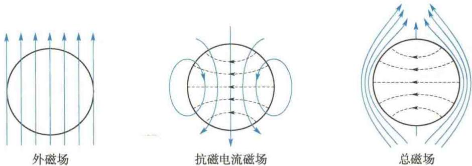  
图 17.22 处于超导态的超导体在外磁场中时磁感线的分布示意图
零电阻特性和完全抗磁性，是超导体处于超导态时的两个最基本的特征.

### 3. 临界磁场和临界电流

昂内斯发现超导现象以后，1914年又通过实验发现，超导态能被足够强的磁场所破坏。实验表明：当样品处于超导态时，若磁场强度（可以是外加的，也可以是超导电流自己产生的，也可以是二者之和）高于某一临界值 $H_{c}$ ，则样品电阻便突然出现，即超导态受到破坏。 $H_{c}$ 即称为超导体的临界磁场强度。实验还表明，对于给定的超导物质， $H_{c}$ 是温度的函数，它可近似地表示为
$$
H _ {\mathrm{c}} = H _ {\mathrm{c0}} \left[ 1 - \left(\frac {T}{T _ {\mathrm{c}}}\right) ^ {2} \right]\tag{17.3}
$$
式中， $H_{c0}$ 为 T = 0 K 时超导体的临界磁场强度.
受临界磁场强度所限，超导体所能承载的电流也受到限制，这个限制电流即为临界电流 $I_{c}$ ，相应的电流密度为临界电流密度 $j_{c}$ 。由于临界磁场强度是外加场和超导电流的磁场强度叠加的值，故 $I_{c}$ 的值是外加场的函数。
概括地说，超导材料只有满足 $T < T_{\mathrm{c}}, H < H_{\mathrm{c}}, I < I_{\mathrm{c}}$ 时才能处于超导态，其中任何一项不能满足，其超导态就会受到破坏.

### 4. 同位素效应

1950 年, C. A. 雷诺兹 (C. A. Reynolds) 等人和麦克斯韦分别独立发现超导临界温度 $T_{c}$ 与元素的同位素质量 M 有关, 即
$$
M ^ {a} T _ {\mathrm{c}} = \text { 常量 } \quad (\alpha = 0. 5 0 \pm 0. 0 3)\tag{17.4}
$$
这就是同位素效应. 同位素效应说明超导不仅与超导体的电子状态有关, 而且与金属的离子晶格有关.

### 5. 能隙

理论研究表明,超导体中电子的能量存在类似半导体禁带的情况,只不过这个禁带非常窄,只有 $10^{-4}$ eV 的量级,吸收一个红外光子即可跃迁通过这一能量间隙,因此这个禁带又称为能隙,常用符号 $\Delta$ 表示.
超导体处于超导态时,除了上述基本特性外,还有磁通量子化、约瑟夫森效应等一些奇特性质,这里不再一一介绍,有些性质在介绍超导应用时一并说明.

## 17.3.2 超导体的微观机制

对于超导体所具有的这些超导特性,从20世纪30年代起,物理学家们就陆续提出了不少唯象的理论.这些理论可以帮助人们理解零电阻效应和迈斯纳效应,但不能说明超导电性的起源问题.这个谜底直到20世纪50年代才由物理学家揭开.

### 1. 金属导体电阻的电子理论

早期的超导体都是在金属及其合金中发现的. 当它们由正常态转变为超导态时, 电阻一下子就消失了, 那么它们的微观结构到底发生了什么变化呢? 为此, 我们简略地介绍一下金属导体电阻的电子理论.
按照量子力学的观点,电子的行为要由满足薛定谔方程的电子波来描述.理论证明,在一个严格的周期性势场中,电子波是没有散射的,电子也不与晶格交换能量,因此也就没有电阻.而由于缺陷和热振动的存在,金属中原子实所形成的势场不具备严格的周期性.电子波在非严格周期性势场中传播时会发生散射,散射的结果使自由电子的动量发生变化,即使得电子在电流方向上的
加速运动受到阻碍, 这就是电阻. 由于散射的原因有缺陷
和热振动两个方面，因而金属中的电阻也可分成两部分，即杂质电阻 $\rho_{\mathrm{i}}$ 和热振动电阻 $\rho_{1}$ 。杂质电阻与杂质浓度有关而与温度无关。热振动电阻与温度有关。理论研究表明 $\rho_{1} \propto T$ ，即非超导物质的电阻随温度下降的曲线是平缓而光滑的。如上所述，一个排列得非常整齐，没有杂质的理想离子晶体，只有在晶格没有热振动时（ $T = 0\mathrm{K}$ ）才没有电阻。而超导体在临界温度 $T_{\mathrm{c}}$ 以上，即处于正常态时，它的电阻随温度下降的曲线也是平缓而光滑的。但是达到临界温度时，其电阻突然消失，如图17.23所示。显然，处于超导态的物质，其电子的行为是有异于这种自由无序化电子波的。
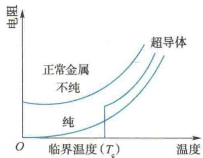  
图17.23 超导体的电阻  
在达到临界温度时突然消失

### 2. 弗罗利希的电-声作用

由于超导体从正常态向超导态的转变是一种突变,因此人们根据金属导体电阻的电子理论,认为这种转变应是电子态的转变,即应该是电子由自由态转变为束缚态,由无序化转变为有序化.但是这种转变是通过什么样的物理机制实现的呢?1950年,弗罗利希(Frohlich)提出的电-声作用的图像对上述问题作出了初步回答.
弗罗利希认为，金属中的共有化价电子在离子实组成的晶格间运动时，电子密度是有起伏的，即电子的密度在局部范围内有大有小。如果在某时刻，电子在某处，如 $A$ 点处比较集中，这时高密度的电子便会对 $A$ 点附近的离子晶格产生较大的吸引力，而使 $A$ 点处的离子实离开自己的平衡位置而产生振动，该振动在局部区域内的传播即为晶格波（简称格波）。格波的能量，按量子力学的理论是量子化的，其每一份能量为 $h\nu, \nu$ 为格波的频率。格波波场能量的能量子 $h\nu$ 即称为声子（因为格波是机械波，故名为声子，就如同光波的能量子称为光子一样）。另外，格波的波场区域内，在沿着高密度电子流运动的轨迹方向上晶格会发生畸变（极化），即在局部区域内形成正离子高浓度区域，如图17.24所示。
当第一个电子由上述的格波波场区域出来而该波场还没有消退时,第二个电子刚好进入该格波区域.由于格波区域内是正离子高浓度区,因此第二个电子就会受到较大的吸引而沿着晶格离子极化的方向去追随第一个电子运动.现在假如忽略晶格离子的极化,而把注意力集中到这一对电子上,就会看到这一对电子间存在着一种有效吸引.
对上述这种图像,通常用下面的物理术语来描述.根据量子场理论:两个微观粒子之间的作用都是通过交换这种或那种场量子来实现的.例如,电子间的静电作用就是通过交换光子来实现的.按上述思路,我们把上述电子间的有效吸引描述成,这一对电子是通过交换声子而吸引的.如图17.25所示,动量为 $p_{1}$ 的电子在格波波场区域内释放出一个声子而被第二个电子所吸收.设声子的动量为q,则作用后第一个电子的动量变为 $p_{1}-q$ ,第二个电子的动量为 $p_{2}+q$ ,这两个电子通过交换声子便产生了吸引作用,这种作用即为电-声作用.
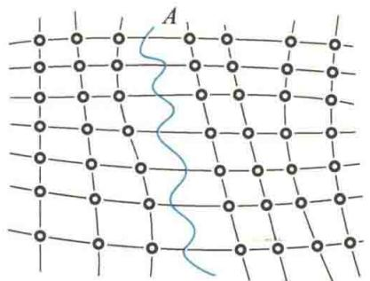  
图 17.24 晶格由电子密度起伏引起的  
振动而产生的格波和极化径迹
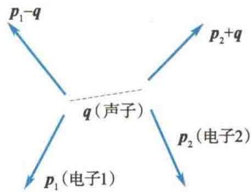  
图 17.25 电子-声子作用

### 3. BCS 理论

对超导电微观理论最有成效的探索是物理学家巴丁（Bardeen）、库珀（Cooper）和施里弗（Schrieffer）在1957年作出的，该理论称为BCS理论.
在弗罗利希的电-声作用的基础上，1956年，库珀用量子场论的理论证明了，只要两个电子之间存在净的吸引作用，不论多么微弱，结果总能形成电子对束缚态。形成束缚态的一对电子就称为库珀电子对，简称库珀对。即处于超导态的价电子，不再是单独地、一个个地处于自由态，而是配成一对对的束缚态。
在库珀对的基础上,施里弗提出了超导体超导基态波函数,并证明了由于电子配成库珀对,整个导体处于更为有序化的状态,因此它的能量更低.处于束缚态的库珀对电子的能量与处于正常态的两个自由电子的能量的差值,就是超导体中的能隙.反之,这个能隙也可称为库珀对的结合能,即拆散一个库珀对所需的能量.
计算表明,库珀对的结合能量是非常微弱的(约 $10^{-4}$ eV),这就意味着这个电子对中的两个电子相隔较远,相隔距离约为 $10^{-4}$ cm,但这却是晶格间距的一万倍左右.也就是说,每一个束缚电子对所在的区域包含上百万对别的电子对,它们是彼此交叠的.根据泡利不相容原理,不能有相同量子态的两个电子占据同一能态.与此限制相适应,这些相互交叠的库珀对电子的动量就只能统一到每个电子对的总动量为零,每个电子对的自旋角动量也必须为零,即要求每对库珀对的电子的动量大小相等,方向相反,且自旋方向相反.至于对与对之间,每个电子的动量可以各不相同.也就是说,在超导态中,电子的有序化是指它们动量的有序化,而不是指它们位置的有序化.
简言之, BCS 理论的核心是: 在超导态中, 电子通过电-声作用结成束缚态的库珀对, 而泡利不相容原理则使所有的库珀对电子有序化为群体电子的动量和角动量为零.
当超导体处于超导态时,所有价电子都是以库珀对作为整体与晶格作用的.即它的一个电子与晶格作用而得到动量 $p'$ 时,另一个电子必同时失去动量 $p'$ ,使总动量仍然保持不变.也就是说,库珀对作为整体不与晶体交换动量,也不交换能量,能自由地通过晶格.当有外加电场并形成传导电流后,库珀对的动量沿着电流方向增加而形成定向流动,但所有电子对携带的动量还是相同的,若此时去掉外场,便没有电子对的加速运动了.这时库珀对虽然也受到晶格的散射,但在 $T_c$ 以下,这个散射提供的能量还不足以把库珀对分解,故库珀对电子在散射前后总动量仍然保持不变,即电流的流动不发生变化,因此没有电阻.但在临界温度 $T_c$ 以上,这种散射就使库珀对被拆散.这时单个自由电子的散射将使它的动量发生变化而出现电阻.
BCS 理论不仅成功地解释了零电阻效应,还成功地解释了迈斯纳效应、超导态比热、临界磁场等实验结果.巴丁等人因此获得 1972 年诺贝尔物理学奖.

## 17.3.3 超导材料的分类

人们按照超导体在临界磁场强度 $H_{c}$ 时将磁通排斥在超导体外的方式不同，把超导材料分为两类.

### 1. 第Ⅰ类超导材料

当磁场强度小于临界磁场强度 $H_{\mathrm{c}}$ 时，磁场被排斥在超导体之外，而只要磁场强度高于 $H_{\mathrm{c}}$ ，磁场就完全透入超导体中，材料也恢复到正常态.即这类超导材料由超导态向正常态的转变没有任何中间态，只要出现 $T > T_{\mathrm{c}},H > H_{\mathrm{c}},j > j_{\mathrm{c}}$ 中的任何一种情况，就立即恢复到正常态，即只有处于图17.26中的曲面内时才是超导态，此曲面就是临界面.
属于第 I 类超导材料的是除铌(Nb)、钒(V)、锝(Tc)以外的纯超导元素. 如铱(Ir, $T_{c}=0.14\ K$ )、镉(Cd, $T_{c}=0.56\ K$ )、锌(Zn, $T_{c}=0.85\ K$ )、汞(Hg, $T_{c}=4.15\ K$ )、铅(Pb, $T_{c}=7.2\ K$ )……这类超导材料的 $T_{c}$ 和 $H_{c}$ 一般都很低. 由于低温难以获得, 故这类超导材料的应用前景有限.

### 2. 第Ⅱ类超导材料

这类超导材料存在两个临界磁场强度，即下临界磁场强度 $H_{\mathrm{c1}}$ 和上临界磁场强度 $H_{\mathrm{c2}}$ 。当材料处于下临界磁场强度 $H_{\mathrm{c1}}$ 时是完全超导态。当磁场强度超过 $H_{\mathrm{c1}}$ 但仍在 $H_{\mathrm{c2}}$ 以下，即 $H_{\mathrm{c1}} < H < H_{\mathrm{c2}}$ 时，处于混合态，这时材料的大部分处于超导态，而部分处于正常态，即从 $H_{\mathrm{c1}}$ 开始，磁场就部分地透入超导体中，而且随着磁场强度的增大，透入的磁场也随之增强，当磁场强度达到上临界磁场强度 $H_{\mathrm{c2}}$ 时，磁场完全地透入材料中，材料完全恢复到有电阻的正常态，如图17.27所示。
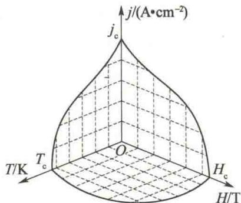  
图17.26 分开第I类材料的
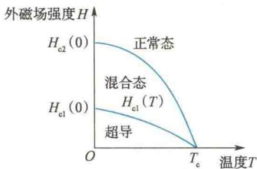  
正常态和超导态的曲面  
图17.27 第Ⅱ类超导体处于  
混合态时的磁通透入
值得注意的是,第Ⅱ类超导材料在其处于混合态时,虽然完全抗磁性开始部分地受到破坏,但零电阻效应依然保持.在磁场透入的部分,电流与磁场之间存在相互作用,这种作用在材料中会引起电阻效应并会局部升温,使得磁通透入的范围更大,进而使局部升温范围扩大而导致超过临界温度.对于这种情况,在具体运用时可以通过技术处理而防止.
属于第Ⅱ类超导材料的有铌、钒、锝及其合金、化合物等.第Ⅱ类超导材料，尤其是化合物的超导材料，其临界温度相对较高，故在技术上有重要应用的主要是第Ⅱ类超导材料.

### 3. 高温超导材料

超导最惹人注目的特点,就是在临界温度以下的零电阻效应.然而,1986年以前,人们发现的超导材料几乎都只能在液氦温区工作,而氦气的稀少、制备液氦的复杂技术和成本之高昂都大大地限制了超导体的研究和应用.
1986年1月，IBM公司（国际商业机器公司）瑞士苏黎世研究所的物理学家穆勒(K.A.Müller)和贝德诺尔茨(J.G.Bednorz)意外地发现镧、钡、铜三元氧化物在35 K时出现了超导性，后经反复实验,都被证实,他们在1980年4月才公开发表这一结果.同年12月,日本东京大学的田中昭二等人和美国波士顿大学的朱经武等人宣布重复了穆勒等人的实验,这一事件引起了世界各国的重视.世界各地的科学家纷纷对这种氧化物超导体进行了一系列研究,其中也有我国物理学家的出色工作.1986年12月,中国科学院物理研究所的赵忠贤等人通过实验得出锶、镧、铜氧化物的临界温度为48.6 K;1987年2月,他们又通过实验得出钡、钆、铜氧化物的临界温度为92.8 K(20世纪90年代的最新报道是,Hg系列氧化物超导体,其超导临界温度达133.8 K).从1986年12月开始,差不多每天都有这方面的新报道,全世界掀起了“超导热”.新的超导材料之所以鼓舞人心,是因为它们能在液氮温区工作.氮的沸点是77 K,获得液氮要比获得液氦容易得多,且氮是空气的主要成分,资源丰富.因此超导材料的临界温度提高到液氮范围,这是一个重大的突破,给超导材料的实际应用带来了非常广阔的前景.
由于穆勒和贝德诺尔茨在高温超导材料中的关键性突破,为高温超导材料的研究开辟了新的道路,他们获得了1987年诺贝尔物理学奖.

## 17.3.4 超导理论新动向

1986年，高温超导材料的发现，不仅改变了超导应用的前景，同时对超导理论的研究也起了推进作用。过去，超导材料主要是金属和合金，而现在主要是多元金属氧化物。人们普遍关心的是，对于新的超导材料，以金属超导材料为对象的BCS理论是否依然有效？对于新发现的一些材料，实验证明，电子在超导体中配成库珀对这一点仍然是必要的，而对形成库珀对的机制则有不同的看法。1987年安德森(D.W.Anderson)提出的共振理论认为，新的超导体存在母体和掺杂两部分。例如，在La-Ba-Cu-O中， $\mathrm{La_2CuO_4}$ 是母体，本身是绝缘体，电子在晶格附近配成自旋相反的共价键，通过掺杂的驱动，这种共价电子就共振转变为超流的库珀对而形成超导。鲁瓦尔兹(J.Ruvalds)则提出固体中电子气的密度发生起伏，以波的形式传递而形成所谓电荷密度波，而它的量子称为等离子激元，它起了BCS理论中声子的作用。这两种理论都是全电子理论，即形成电子对与晶格无直接关系。
还有一种理论认为由“激子机制”形成电子对. 这种理论认为金属(如 Ba)与半导体(如 $CuO_{2}$ ) 是以一层层形式的结构而存在的, 称为 M-S-M 结构. M(金属)中的电子排斥 S(半导体)中的电子而形成空穴, 空穴又与 M 中的电子形成电子-空穴对, 这种电子-空穴对称为激子. 在两边的 M 中两个电子通过激子而配成电子对.
目前这些理论都不成熟,超导理论工作者都在注意实验将会得到什么有意义的结果,并以此来指引理论工作的方向.

## 17.3.5 超导电性在工业中的应用

### 1. 超导磁体

无论是现代的科学研究还是现代工业,都需要研制出大尺度、强磁场、低消耗的磁体.但现有材料制成的磁体却不能完全满足上述要求.
用铁磁材料制成的永久磁体,其两极附近的磁场只能达到7 000～8 000 Gs;电磁铁,由于铁芯磁饱和效应的限制,也只能产生25 000 Gs的磁场;用通以大电流的铜线圈,它产生的磁场虽然可以高达100 kGs,但耗电功率达1 600 kW,且每分钟须耗用4.5 t的水来冷却,此外,体积庞大也是它的一个缺点,一个能产生50 kGs的磁场的铜线圈重达20 t.
将超导线圈制成磁体能做到大尺度、强磁场、低消耗。例如，可以产生几万高斯的磁场的超导磁体耗电功率只有几百瓦（主要用于维持超导材料需要的低温），其重也只有几百千克，而且还无须耗用大量的冷却水。目前，世界上已制成的超导磁体产生的磁场已高达170 kGs，现在正在研制200～300 kGs的超导磁体。此外，超导磁体所产生的磁场，在持久工作的时间稳定性、大空间范围内的均匀性和磁场梯度等方面都要比普通磁体强得多.
超导磁体已被应用于高能物理、磁悬浮列车和医用核磁共振成像设备中，用超导磁体制成的耗电功率已达2400 W的单极电动机早在20世纪60年代就已经问世（其主要应用在需要连续运转但转速变化较大的地方，如轧钢机、船舶驱动和发电站的辅助电动机等）。另外，能在大尺度范围内产生强磁场的超导磁体，在未来新能源磁流体发电机中及受控核聚变中用于约束等离子体必将发挥重要作用。有人还设想过，将超导磁体运用于交流发电机上，这样可以提高单机容量。由于高温超导材料的突破，可以预见，未来高温超导磁体的应用将会更加广泛。

### 2. 超导电缆

电能在零电阻输送时是完全没有损耗的，这无疑是用超导电缆进行电力输送的最充分的理由。在液氦低温区（4.2 K）已有实验性电缆。结论是将该电缆用于超高压特大容量的电力传输，在技术上是完全可行的。目前，困难大体上集中在以下几个方面：在经济上，比较低的运转费用必须要抵得过昂贵的投资；在技术方面，低温电缆所要求的绝缘介质在低温下的强度还有待解决；在传输线、制冷站或电缆中出现故障时，提供相应的保护以保证电流的供应不间断也有问题；超导电缆低温屏蔽上如出现故障也不能很快地修复等。然而，由于对电能需求的迅速增长，高温超导材料临界温度的提高，超导电缆在传输电力时的无能量损耗，这些巨大的优势正在吸引越来越多的人去开发超导电缆，故可以相信，超导电缆的实际应用指日可待。

### 3. 超导储能

将一个超导体圆环置于磁场中，降温至圆环材料的临界温度以下，撤去磁场，由于电磁感应，圆环中便有感生电流产生。只要温度保持在临界温度以下，电流便会持续下去。已有的实验表明，这种电流的衰减时间不低于十万年。显然，这是一种理想的储能装置，称为超导储能。
超导储能的优点很多，主要是功率大、重量轻、体积小、损耗小、反应快等，因此应用很广。如大功率激光器，必须在瞬时提供数千乃至上万焦耳的能量，这就可由超导储能装置来实现。超导储能还可用于电网。当大电网中负荷小时，把多余的电能储存起来，负荷大时，又把电能送回电网，这样就可以避免用电高峰和低谷时的供求矛盾。

## 17.3.6 约瑟夫森效应及其应用

如果将两块处于超导态的超导体以不同的方式接触以组成各种不同形式的“超导结”，将会出现哪些奇特的现象呢？不但有人这样想过，而且还有人这样做过，这就引发了贾埃弗单电子隧道效应和约瑟夫森的库珀对隧道效应（约瑟夫森效应）的发现。后来，人们对约瑟夫森效应进行了深入研究并已将其发展为超导电子学。

### 1. 单电子隧道效应

20世纪60年代初，贾埃弗将正常态金属膜(N)、超导体(S)、薄氧化物绝缘层(I)组成不同的超导结：N-I-N结、N-I-S结和S-I-S结，并做了一些有趣的实验（见图17.28）。根据接触电势差理论可知，那一层薄的绝缘层对于电子来说就是一个势垒。根据量子力学理论，具有波粒二象性的微观粒子，即使在其动能 $E_0$ 小于势垒高度时，仍有一定的概率从势垒的一侧贯穿至另一侧，这就是所谓的量子隧道效应。贾埃弗在上述超导结中发现了单电子超导效应。实验观测到，当外加电压 $V > 0$ 时，单电子隧道效应产生的隧道电流 $I$ 和外加电压 $V$ 之间的 $I - V$ 曲线，N-I-N结与N-I-S结和S-I-S结之间有显著的不同。N-I-N结的 $I - V$ 曲线如图17.28(a）所示，是呈直线的，而N-I-S结和S-I-S结的 $I - V$ 曲线不再呈直线，而是在超导能隙电压 $\Delta /e$ 处或 $(\Delta_{1} + \Delta_{2}) / e$ 处（式中 $\Delta$ 表示超导能隙），隧道电流突然增加，如图17.28(b）和(c）所示。贾埃弗单电子隧道效应直接观测了超导能隙，证明了BCS理论的正确性，并可为超导理论的新发展——强耦合理论——提供实验依据。
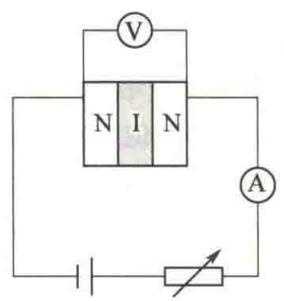
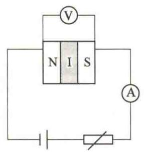
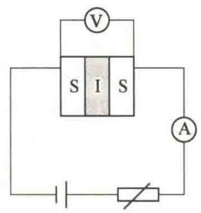
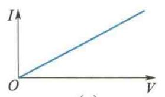  
(a)
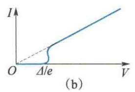  
图 17.28 单电子隧道效应
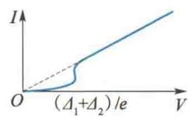  
(c)

### 2. 约瑟夫森效应

既然实验中已指出超导结中有单电子隧道效应存在,那么库珀对电子作为整体能否穿过绝缘层的势垒而发生隧道效应呢?1962年,正在英国剑桥大学攻读物理博士学位的研究生、年仅22岁的约瑟夫森在其导师安德森的指导下研究了这个问题.约瑟夫森运用BCS理论研究了超导能隙的性质,计算了S-I-S结(后人称为约瑟夫森结)的隧道效应.他从理论上预言,当隧道结的势垒层(I)足够薄(1 nm左右)时,库珀对也能穿过势垒层,并且具有如下一些性质.
（1）直流约瑟夫森效应.根据BCS理论，总动量大小为 $p$ 的库珀对也可以用德布罗意波长为 $h / p$ 的一个波函数来表示.当存在超导电流时，每个库珀对的总动量大小 $p$ 都是相同的，即所有电子对的德布罗意波长相同；又由于这些库珀对电子是大范围内彼此交叠的，即大量的电子对的波函数在空间内是相互交叠的，因此各电子对的波函数的相位也必须相同.计算表明，至少在人体尺度的超导体内，库珀对电子的波函数的相位都能保持相同.
对于如图17.28(c)所示的S-I-S结中的这两块超导体，电子对的相位在每一块的内部是相同的，但是在这两块超导体之间，它们的相位则是不同的。若在约瑟夫森结的外侧加上一直流电压，当电压小于 $2\Delta / e$ 时，几乎没有电流，但当电压达到 $2\Delta / e$ 时，电流突然上升，但这时电压不变，即结电压(S-I-S结两端的电压）为零，这也就是零电阻效应，此时的电流就是超导隧道电流，其 $I - V$ 曲线如图17.29所示。当电流超过最大约瑟夫森电流 $I_{\mathrm{J}}$ 时，曲线 $bc$ 部分就显示出正常态的电流电压关系。
结电压为零时的超导电流满足如下关系：
$$
I = I _ {\mathrm{J}} \sin \varphi\tag{17.5}
$$
式中， $I_{1}$ 为最大约瑟夫森电流； $\varphi = \varphi_{2} - \varphi_{1}$ ，是绝缘层两侧库珀对波函数的相位差。可以证明，在结电压为零时， $\varphi$ 为常数，即此时是一个恒定的无阻超导电流。
进一步的研究发现,最大约瑟夫森电流 $I_{J}$ 对外磁场很敏感.若当结电压为零时,在平行于结的平面上加上外磁场, $I_{J}$ 就会减少,而且出现周期性的变化.如图17.30所示,当通过结面的磁通为磁通量子① $\Phi_{0}=\frac{h}{2e}$ 的整数倍时, $I_{J}$ 就降为零. $I_{J}$ 与磁通 $\Phi$ 的关系曲线与光的单缝衍射时光强分布曲线非常相似.
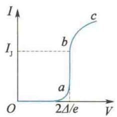  
图 17.29 S-I-S 结的 I-V 曲线
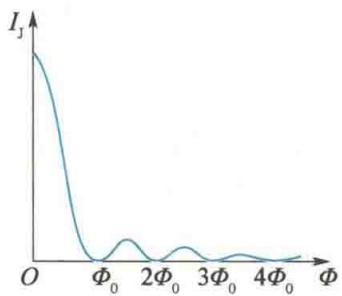  
图17.30 $I_{\mathrm{J}}$ 与 $\Phi$ 的关系曲线
以上现象即为直流约瑟夫森效应.
(2) 交流约瑟夫森效应. 当外加电压继续增大, 使隧道电流超过最大约瑟夫森电流 $I_{\mathrm{J}}$ 时, 即当结电压 $V \neq 0$ 时, 约瑟夫森指出, 这时超导结两侧的超导体内电子对的量子态波函数的相位差对时间的变化率为
$$
\frac {\mathrm{d} \varphi}{\mathrm{d} t} = \left(\frac {2 e}{\hbar}\right) V\tag{17.6}
$$
积分可得 $\varphi = \frac{2e}{\hbar} V_{0} t + \varphi_{0}$ ，这时通过约瑟夫森结的电流为
$$
I = I _ {c} \sin \left(\frac {2 e}{\hbar} V _ {0} t + \varphi_ {0}\right)\tag{17.7}
$$
这说明，当结电压不为零时，会出现一个基频为 $\nu_{0} = \frac{2e}{h} V_{0}$ 的交变电流。计算表明 $\frac{2e}{h} = 483.6\mathrm{MHz} / \mu \mathrm{V}$ ，即每微伏电压对应的交变电流频率为 $483.6\mathrm{MHz}$ 。这种高频的正弦电流将会产生电磁辐射，辐射的频段在微波至红外部分（ $5\sim 10\times 10^{12}\mathrm{Hz}$ ）。这是库珀对从结电压处获得能量，又以辐射形式发射出去的结果。这就是交流约瑟夫森效应。
如果在 S-I-S 结外侧的外加直流电压的基础上再外加一个交变电压（例如用微波照射 S-I-S 结），同时又改变结上的直流电压，则在某些特定的电压值处，电流会突然增大，在 I-V 曲线上出现了“台阶”。由于这种现象是夏皮洛（S.Shapiro）在 1963 年做交流约瑟夫森效应的逆效应实验时发现的，故这种电压“台阶”又称夏皮洛台阶，如图 17.31 所示。实验发现这一系列电压值为
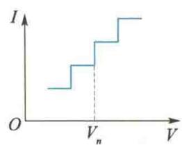  
图 17.31 夏皮洛台阶
$$
V _ {n} = n \frac {h}{2 e} \nu \qquad (n = 0, 1, 2, \dots)
$$
式中， $\nu$ 是辐照的微波频率。这说明相邻台阶间的电压间隔是 $\frac{h}{2e}\nu$ 。显然，当辐照的微波频率一定时，电压值是量子化的，这就为电压的自然标准提供了实验基础。
由于约瑟夫森所做出的贡献,他和贾埃弗一起获得了1973年诺贝尔物理学奖.

### 3. 约瑟夫森效应的主要应用

### 1) 超导量子干涉器件

超导量子干涉器件简称 SQUID(superconducting quantum interference device). 如图 17.32 所示, 把两个约瑟夫森结并联起来即成为一个 SQUID. 超导电流从 P 点处通过 a 结和 b 结到达 Q 点处. 若用波函数来描述库珀对的量子态, 则经过 a 结和 b 结后, 它们的波函数的相位改变是不同的, 因此波函数到达 Q 点处因产生相位差而干涉, 这与光通过双缝而干涉的情况相似, 不过这里是描述库珀对的量子态波函数的干涉而已.
如果把 SQUID 放在外磁场中, 则理论证明, 当通过回路中的磁通量是磁通量子 $\Phi_{0}$ 的整数倍时, 通过 SQUID 的电流出现极大值. 即
$$
I _ {\mathrm{m}} = 2 I _ {\mathrm{J}} \mid \cos (\pi \Phi_ {\mathrm{c}} / \Phi_ {0}) \mid
$$
式中， $I_{J}$ 是单结的最大约瑟夫森电流， $\Phi_{c}$ 为外场穿过回路的磁通量， $\Phi_{0}$ 为磁通量子。 $I_{m}$ 与 $\Phi_{c}$ 的关系如图 17.33 所示。在具体运用时，根据偏置电流的不同，SQUID 又可分为直流 (DC) 和射频 (RF) 两类。
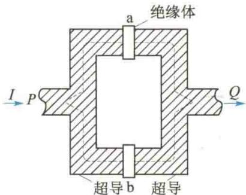  
图17.32 SQUID原理
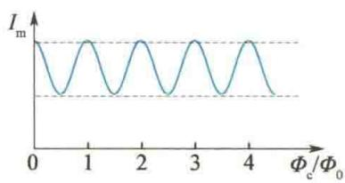  
图17.33 $I_{\mathrm{m}}$ 与 $\Phi_{\mathrm{c}}$ 的关系
目前应用较广的是以 DC SQUID 为磁传感元件制成的超导磁强计. 由于用的是干涉原理, 因此其灵敏度特别高, 可测出 $10^{-11}$ Gs 的弱磁. 超导磁强计作为探测微弱磁场的精密仪器, 已被广泛应用于科学技术和生产实践各个领域, 如探矿、地震预报、生物磁场探测等.

### 2) 电压标准

1893 年开始, 国际上采用硫酸镉电池组作为标准电池并置于恒温、恒湿、防震实验室内. 由于物理化学因素的变化, 电压值不断变化, 为消除各国电压标准的差异, 规定每隔 3 年到法国巴黎的国际计量局进行一次直接比对. 这样不仅麻烦, 而且精确度不能满足科技发展的需要.
根据约瑟夫森结受微波辐照时 I-V 曲线上会出现夏皮洛台阶，电压值为
$$
V _ {n} = n \frac {h}{2 e} \nu
$$
频率测量精度可达 $10^{-10}$ Hz，而 $\frac{h}{2e}$ 为常量，监测精度可达 $10^{-8}$ V. 故国际计量局决定，从 1976 年起改用约瑟夫森效应方法建立电压标准. 这样不仅精度高，而且与测量地点、环境无关，保存、比较都方便.

## 3）超导计算机器件

计算机最基本的元件是开关元件. 用一磁场可使约瑟夫森结从零压状态变为有压状态, 约瑟夫森结的这一特性使其可作为计算机的开关元件, 它的开关时间为几皮秒 $(10^{-12} \mathrm{~s})$ , 比半导体的开关速度快 1000 倍, 而功耗仅为半导体元件的千分之一. 因此, 超导计算机器件的特点是速度快、功耗低, 不存在散热问题.
此外，利用超导隧道效应制备的敏感元件，其能量分辨可以接近量子力学测不准关系所限定的量级，这是其他器件所不能达到的。

