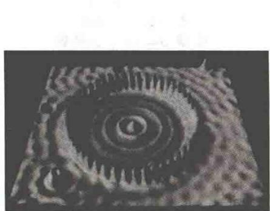
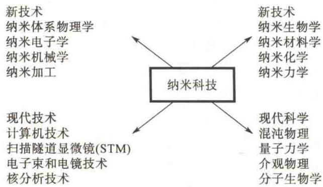
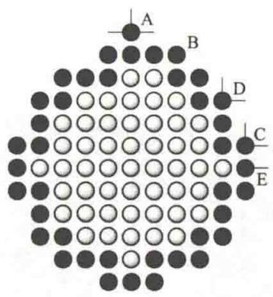
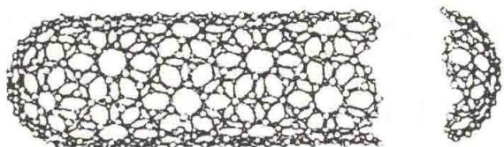
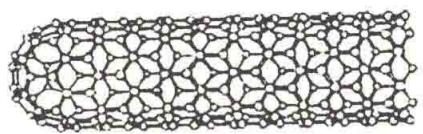
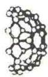
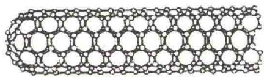
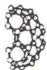
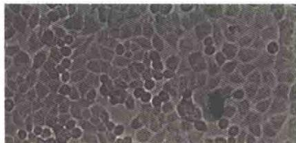

import Guide from '@/components/Guide.astro';
import Knowledge from '@/components/Knowledge.astro';
import Example from '@/components/Example.astro';
import Analysis from '@/components/Analysis.astro';
import Solution from '@/components/Solution.astro';
import Variant from '@/components/Variant.astro';
import Note from '@/components/Note.astro';
import Block from '@/components/Block.astro';
import Method from '@/components/Method.astro';
import Exercise from '@/components/Exercise.astro';

1965年诺贝尔物理学奖获得者、物理学家费曼(R. P. Feynman)教授曾发问：“如果有一天人类能够按照自己的意志安排一个个原子和分子，将会产生什么样的奇迹呢？”今天，这个美好的愿望已经变成现实。20世纪90年代初，随着人们对凝聚态物理的深入研究，一门崭新的科学技术——纳米科技(nano-science and technology)诞生了。1 nm(纳米)即10 Å(埃)，纳米科技是在0.1～100 nm范围内研究与应用原子、分子现象的科学技术。1989年，美国IBM公司的研究人员用液氮温度的扫描隧道显微镜装置，一次移动一个原子，用35个Xe原子在Ni(110)面上拼缀出“IBM”三个字母，并用扫描隧道显微镜扫描一遍，使字母清晰地显示在屏幕上。这是人类首次成功地按自己的意愿安排和操纵原子，科学家们称它为原子尺度上的“艺术杰作”，从而也宣告了纳米科技的诞生。如图 17.34 所示, 人们用扫描隧道显微镜的针尖在铜表面搬运和操纵 48 个铁原子, 使它们排成圆形. 圆形内的电子相互干涉, 形成干涉波.

在基础领域,纳米科技主要与介观物理、量子力学和混沌物理等有关,尤其是介观物理.而在工程技术领域,纳米科技则要用到计算机、微电子和扫描隧道显微镜等技术.纳米科技的发展又促使了一系列新技术和学科的诞生,如纳米材料学、纳米电子学、纳米生物学和纳米机械学等.与纳米科技相关的技术和学科如图17.35所示.

  

图17.34 搬运和操纵铁原子的效果

  

图 17.35 与纳米科技相关的技术和学科

## 17.4.1 纳米材料学

众所周知，材料是人类赖以生存和发展的物质基础。随着人类社会的进步，人们对材料也在不断地提出新的要求。以往对材料微结构的要求是注重无位错、无缺陷、具有长程有序的完美的晶体，后来又发展到追求具有优异性能、但不存在长程有序的非晶体。纳米材料是线度为纳米量级的超微颗粒材料，其颗粒大小范围为 $0.1 \sim 100 \mathrm{~nm}$ （约为原子半径的10倍）。现在，广义地说，纳米材料是指在三维空间中至少有一维处于纳米尺度范围的材料。如果按维数，纳米材料的基本单元可以分为三类：①零维，指空间三维尺度均在纳米尺度，如纳米尺度颗粒、原子团簇等；②一维，指在三维空间中有两维处于纳米尺度，如纳米丝、纳米棒、纳米管等；③二维，指在三维空间中有一维在纳米尺度，如超薄膜、多层膜、超晶格等。因为这些单元往往具有量子性质，所以对零维、一维和二维的基本单元分别又有量子点、量子线和量子阱之称。纳米材料大部分都是人工制备的，属于人工材料。但是自然界中早就存在纳米微粒和纳米固体。例如，天体的陨石碎片，人体和兽类的牙齿都是由纳米微粒构成的。此外，浩瀚的海洋就是一个庞大的超微粒聚集场所。通过对这些纳米粒子的研究，人们可以了解海洋、生命的起源，以及获取开发海洋资源的信息。最近，科学家们发现，海龟的头部有磁性的纳米微粒，它们靠这种微粒完成几万千米的长途迁移而不会迷失方向；蜜蜂的体内也存在磁性的纳米粒子，这种磁性的纳米粒子具有“罗盘”的作用，可以为蜜蜂的活动导航；等等。

人工制备纳米材料是将这种颗粒在一定条件下加压制成固体材料，或用沉积的方法制成薄膜，它包括纳米金属、纳米陶瓷、纳米高分子材料和纳米复合材料等。纳米颗粒内包含的原子一般为 $10^{2} \sim 10^{4}$ 个，其中有 $50\%$ 以上为界面原子。这样的系统既非典型的微观系统，也非典型的宏观系统，而是典型的介观系统。有时多一个或少一个原子就能导致纳米微粒性能急剧变化。这种材料的结构既不同于长程有序的晶体，也不同于长程无序、短程有序的非晶态玻璃，而表现为既无长程有序又无短程有序的新的物质状态，并由此使材料具备一般的晶体和非晶体材料都不具备的奇特性能，硬度、强度、韧性、导电性和磁性等都非常优异。这些奇特性能主要产生于超微颗粒的小尺寸效应、表面效应和量子效应。

  

电子显微镜

### 1. 纳米颗粒的奇特效应

### 1) 小尺寸效应

当固体颗粒的尺寸逐步减小,小到一定的临界尺寸时,会出现一些奇特效应.在颗粒尺寸达到或小于电子的德布罗意波长以及超导体的相干长度(约 $10^{2}$ nm)时,晶体中的周期性边界条件不复存在,此时其声、光、电、磁、热力学性质均呈现小尺寸效应.如当颗粒尺寸小于可见光波波长时,对光的反射率低于1%,于是颗粒将失去原有的色彩而呈黑色;用纳米颗粒压制的陶瓷材料具有良好的韧性;磁性颗粒会出现磁性丧失;超导相会向非超导相转变且结构不稳定等.

### 2) 表面效应

球形颗粒的表面积与直径的平方成正比,其体积与直径的立方成正比,故表面积与体积之比与直径成反比,颗粒直径越小,其比值越大.例如,一个边长为1 m的立方体,其表面积为 $6\ m^{2}$ ,若将此立方体切割成边长为1 mm的立方体,再按原样堆砌成边长为1 m的立方体,体积没变,但其小立方体表面积之和为 $6\ 000\ m^{2}$ ,是原来的1 000倍.由于表面积增大,表面原子数占总原子数的比例也将会显著增加(见表17.2),其表面活性也将大大增强,所以超微粉末很容易引起燃烧和爆炸.这是因为表面原子近邻配位不完全,因而本身极不稳定,一遇到其他原子便极易与之结合.图17.36为一简立方结构晶粒的二维平面图.图17.36中的实心圆代表位于表面的原子,空心圆代表内部原子,位于表面的原子

  

图17.36 简立方结构晶粒的二维平面图

近邻配位不完全. 图 17.36 中 E 原子缺少一个近邻的原子, C、D 原子均缺少两个近邻的原子, A 原子则缺少三个近邻的原子, A 原子因为受到其他原子的束缚少, 所以极不稳定, 很容易跑到附近的空位上, 与其他原子结合形成较稳定的结构. 这种表面原子的活性不但会引起表面原子的输运和构型的变化, 同时也会引起表面电子自旋构象和电子能级的变化.

表 17.2 纳米微粒尺寸(粒径)与表面原子数的关系

<table><tr><td>纳米微粒粒径 /nm</td><td>总原子数</td><td>表面原子所占比例 /%</td></tr><tr><td>10</td><td> $3 \times 10^{4}$ </td><td>20</td></tr><tr><td>4</td><td> $4 \times 10^{3}$ </td><td>40</td></tr><tr><td>2</td><td> $2.5 \times 10^{2}$ </td><td>80</td></tr><tr><td>1</td><td>30</td><td>99</td></tr></table>

### 3) 量子效应

量子力学成功地揭示了原子的能级结构. 无数个原子结合成固体时, 由于原子间的相互作用, 单独原子的价电子能级合并成能带. 能带理论阐明了宏观导体、半导体和绝缘体之间的区别. 对介于原子、分子与大块固体之间的超微颗粒而言, 大块材料中连续的能带又变窄, 逐渐还原分裂为分立的能级. 能级间距随颗粒尺寸的减小而增大. 当温度较低时, 原子、分子的热运动能量以及电场能或磁场能比平均的能级间距还小时, 就会呈现一系列与宏观物体截然不同的反常特性, 这就是量子效应. 例如, 在低温条件下, 导电的金属在超微颗粒时可以变成绝缘体, 比热会出现反常变化, 光谱线会向短波方向移动等.

此外，纳米微粒还具有宏观隧道效应。隧道效应原指微观粒子具有贯穿势垒（势垒高度可大于粒子的平均能量）的能力。纳米材料的一些宏观量（如磁化强度）亦具有隧道效应，但这属于宏观的量子隧道效应范畴。

### 2. 纳米材料

### 1) 原子团簇

原子团簇是由多个原子组成的小粒子,它们比无机分子大,但比具有平移对称性的块体材料小,它们的原子结构(键长、键角和对称性等)和电子结构不同于分子,也不同于块体.描述原子团簇特性的学科是近年来才发展起来的,称为原子团簇物理.原子团簇的尺寸一般小于20 nm,包含几个到 $10^{5}$ 个原子.原子团簇具有很多独特性质:①具有较大的表面体积比而呈现出表面或界面效应;②幻数效应;③原子团簇尺寸小于临界值时的“库仑爆炸”;④原子团簇逸出功具有振荡行为等.目前研究原子团簇的结构与特性主要有两方面的工作,一方面是理论计算原子团簇的原子结构、键长、键角和排列能量最小的可能存在结构;另一方面是通过实验研究原子团簇的结构与特性,制备原子团簇,并设法保持其原有特性压制成块,进而开展相关应用研究.

## 2）纳米颗粒

纳米颗粒是指颗粒尺寸为纳米量级的超微颗粒，它的尺度大于原子团簇，小于通常的微粉，一般为 $1\sim 100\mathrm{nm}$ .这样小的物体只能用高倍电子显微镜观察.为此，日本名古屋大学上田良二教授给纳米颗粒下了一个定义：用电子显微镜才能看到的微粒称为纳米颗粒.纳米颗粒与原子团簇不同，它们一般不具有幻数效应，但具有量子效应，如体积效应、表面效应和分形聚集特性等.纳米颗粒的应用前景广泛，其除了具有光、电、磁、敏感和催化特性外，还可由 $5\sim 50~\mathrm{nm}$ 的纳米颗粒在高真空下原位压制纳米材料，或制作纳米颗粒涂层，或根据纳米颗粒的特性设计紫外反射涂层、红外吸收涂层、微波隐身涂层，以及其他的纳米功能薄膜.

### 3) 碳纳米管

1991年，饭岛澄男通过高清晰度电子传输显微镜的电极放电，发现了一种新型的针状碳分子——碳纳米管。碳纳米管是圆柱状分子，石墨是一种层状六角结构，每一层在二维平面内铺开，但其边缘是不稳定的，这正像一张薄纸，其边缘会翘起，从而形成一种更稳定的卷筒结构，即碳纳米管。如果是单层石墨卷起来，则为单壁碳纳米管；如果是多层，则为多壁碳纳米管。不同类型的碳纳米管如图17.37所示。碳纳米管的直径可小至 $1\mathrm{nm}$ ，长可达数毫米。由于碳纳米管的长度远大于直径，而且其直径尺寸小至纳米量级，因此物理上可以认为碳纳米管是一维或准一维体系。下面的分析会更清晰地说明这一点。

(a) 锯齿型碳纳米管  

  

(b) 扶手椅型碳纳米管  

(c) 螺旋角在 $0^{\circ} \sim 30^{\circ}$ 之间的一般碳纳米管  

图 17.37 不同类型的碳纳米管

碳纳米管在很多方面都有十分有趣的性质:它的重量很轻,却有很高的弹性模量;当对它的侧向施加压力时,碳纳米管并不会直接折断,而是像吸管一样弯曲;压力消失时,纳米碳管就又重新变直.碳纳米管有相当大的表面,所以有毛细现象,可以做催化剂.在导电性方面,碳纳米管可以分为三类,即金属型、窄能隙半导体型、宽能隙半导体型.碳纳米管的导电性与其直径和螺旋性有关.具有锯齿型结构的碳纳米管,沿轴线方向的碳原子键呈反式聚乙炔结构,其导电性与金属类似;呈顺式聚乙炔结构的碳纳米管则为宽能隙半导体型;具有螺旋形结构的碳纳米管,其导电性介于金属与半导体之间.

## 4）纳米固体

以纳米微粒为基本单元，适当排列可形成一维量子线、二维量子面和三维纳米固体。纳米固体材料是将超微颗粒在高压力下压制成型，或再经一定热处理工序后生成的致密型固体材料。这种材料有着巨大的颗粒间界面，从而具有高韧性。如对纳米陶瓷器件进行表面热处理，可使材料内部保持韧性，但表面却显示出高硬度、高耐磨性与抗腐蚀性。由原子团簇堆压成的纳米金属材料具有很大的强度和稳定性，以及很强的导电能力，这类材料存在着大量晶界，呈现出特殊的机械、电磁、光和化学性质。经发现，由纳米硅晶粒和晶界组成固体材料，其晶粒和边界几乎各占体积的一半，具有比本征硅晶体高的电导率和载流子迁移率，电导率的温度系数很小，这些特性正在进一步研究中。

### 5) 纳米薄膜与纳米涂层

纳米薄膜是将某种颗粒嵌于不同材料的薄膜中所生成的复合薄膜。它具有纳米结构的特殊性质，目前可以分为两类：①含有纳米颗粒、原子团簇的薄膜——基质薄膜；②纳米尺寸厚度的薄膜，其厚度接近电子自由程和德拜长度，可以利用其显著的量子特性和统计特性组装成新型功能器件。例如，嵌有原子团的功能薄膜相当于大原子——超原子，它使原子膜材料具有三维特征，该薄膜会在基质中呈现出调制掺杂效应。而纳米厚度的信息存储薄膜具有超高密度功能，这类集成器件具有惊人的信息处理能力；纳米磁性多层膜具有典型的周期性调制结构，导致磁性材料的饱和磁化强度的减小或增强。对这些问题的研究都具有重要的理论和实用价值。

### 3. 纳米材料的应用

### 1) 在微电子器件方面的应用

当电子器件进入纳米尺寸时,量子效应十分明显,因此,纳米材料应用在电子器件上会获得普通材料所不能达到的效果.目前,对于纳米硅材料的研究和应用正逐步走向深入,例如,已有人尝试用纳米硅材料制作单电子隧穿晶体管,也有人尝试制作纳米硅基超晶格.

## 2）在磁记录方面的应用

纳米磁性材料的发展也十分迅速, 纳米尺寸的多层膜除了可应用在微电子器件方面, 还在磁记录、磁光存储等方面具有优势, 它为实现记录材料高性能化和记录高密度化创造了条件. 例如, 每 $1 \mathrm{~cm}^{2}$ 需要记录 1000 万条以上的信息, 这就要求每条信息记录在几微米, 甚至更小的线度内. 纳米微粒能为这种高密度记录提供有利条件. 磁性纳米微粒由于尺寸小, 具有单磁畴结构, 矫顽力很高, 用它制成磁记录材料可以提高信噪比, 改善图像质量. 例如, 人们已制成纳米级微粉录像带, 它具有图像清晰、信噪比高、失真十分小的优点.

### 3) 在传感器上的应用

由于纳米微粒材料具有巨大的表面和界面，对外界环境如温度、光、湿度等十分敏感，外界环境的改变会迅速引起表面或界面离子价态和电子输运的变化，响应速度快，灵敏度高。此外，纳米陶瓷材料用于传感器也具有巨大潜力。例如，利用纳米铌酸锂 $\left(\mathrm{LiNbO}_{3}\right)$ 、钛酸锂 $\left(\mathrm{LiTiO}_{3}\right)$ 、锆钛酸铅(PZT)和钛酸锶 $\left(\mathrm{SrTiO}_{3}\right)$ 的热电效应，可制成红外检测传感器。

### 4) 在催化方面的应用

直接利用铂黑、银、三氧化二铝、三氧化二铁等纳米微粒在高分子反应中作为催化剂可以大大提高反应效率，较好地控制反应速度和温度。在固体火箭燃料中掺杂铝的纳米颗粒，可提高燃烧效率。

## 17.4.2 纳米科技的其他几个主要研究领域

### 1. 纳米电子学

在电子器件中，半导体纳米材料和磁性纳米材料的应用是一个新的领域，研究纳米尺寸的分子电子器件已成为一个专门的应用研究学科——纳米电子学。在纳米尺度上，电子的波动性十分明显，量子效应将占主导地位，所以纳米电子学必须采用量子力学来处理电子器件问题。这不仅会引起电子器件技术上的革命，而且会给理论和实验提出新的课题。

### 2. 纳米生物学

纳米生物学是在纳米尺度上研究生命物质的学科,目前涉及的内容大体有以下几点.

（1）利用 STM 在纳米尺度上了解生物大分子的精细结构及其结构与功能的联系，这是整个现代生物学发展的基础.

(2) 在纳米尺度上获取并分析细胞的生命信息.

（3）研制纳米机器人（见图17.38），使其能够直接进入人体，疏通血栓，清除血脂沉积物。这在医学上是具有十分诱人前景的新事物，已成为21世纪科学研究中的一个热点。

  

图 17.38 纳米机器人

### 3. 纳米工程、机械学

纳米工程技术是指纳米级加工与装配，甚至操纵单个原子的技术。1987年，美国加利福尼亚大学伯克利分校用半导体微加工技术制成了直径只有零点几毫米的齿轮，开创了微型机械研究的先河。法国生物微孔公司已在薄膜材料上打出了孔径只有几纳米的微孔。

总之，纳米科技是未来科技的一个重要发展方向。我国将纳米技术研究列入了国家的“攀登计划”、“863计划”和“火炬计划”。1999年，中国科学院化学研究所的科技人员利用纳米加工技术在石墨表面通过搬迁碳原子绘制出了一张世界上最小的中国地图——纳米中国地图。同时我国已有了微直升机、微马达、微泵、微喷器、微传感器等一系列微机电系统元件问世，这些袖珍的纳米工具，标志着我国对纳米技术的掌握已跻身世界前列。

专家预言,未来的技术革命将与纳米技术密切相关.我们期待着纳米技术带给人类更方便、更美好的新生活并为此而努力.
