import Guide from '@/components/Guide.astro';
import Knowledge from '@/components/Knowledge.astro';
import Example from '@/components/Example.astro';
import Analysis from '@/components/Analysis.astro';
import Solution from '@/components/Solution.astro';
import Variant from '@/components/Variant.astro';
import Note from '@/components/Note.astro';
import Block from '@/components/Block.astro';
import Method from '@/components/Method.astro';
import Exercise from '@/components/Exercise.astro';

物质存在的方式有几种？绝大部分人知道有气态、液态和固态，乐于接受新知识的人还从时下流行的等离子体彩电中得知有等离子体态。但很少有人知道，还有用物理学家玻色和爱因斯坦的名字命名的“第五态”——玻色-爱因斯坦凝聚态（Bose-Einstein condensate, BEC）。

玻色-爱因斯坦凝聚态的起源可追溯到1924年.当时，年轻的物理学家玻色寄给爱因斯坦一篇论文，提出了一种关于原子的新统计理论，它与传统的统计理论仅在一条基本假定上有所不同.众所周知，粒子按其在高密度或低温度时的集体行为不同可以分成两大类：一类是费米子，得名于物理学家费米；另一类是玻色子，得名于物理学家玻色.量子力学认为，自然界的粒子不是玻色子，就是费米子.这两类粒子特性的区别，在极低温时表现得最为明显：玻色子全部聚集在同一量子态上，费米子则与之相反，各自占据着不同的量子态.区分这两类粒子的重要特征是自旋.量子力学有一个重要结论，即自旋是量子化的.这就是说，自旋只能取约化普朗克常量的整数倍（玻色子，如光子、胶子、W及Z玻色子、希格斯粒子、π介子或由偶数个核子组成的原子核和碱金属原子等都可称作玻色子）或半整数倍（费米子，如电子、质子等).费米子和玻色子遵循完全不同的统计规律.前者遵循费米-狄拉克统计，其中一个显著的特点是1925年科学家泡利发现的泡利不相容原理，即在一个费米子系统中，绝不可能存在两个或两个以上的电荷、动量和自旋等方面完全相同的费米子.

这就像电影院里的座位,每个座位只能容纳一个人.而玻色子则完全不同,一个量子态可以容纳无穷多个玻色子.因此,也只有玻色子才可能出现有多个粒子聚集体在同一量子态的玻色-爱因斯坦凝聚现象.在玻色-爱因斯坦凝聚态的研究历史中,具有里程碑性质的进展发生在1995年,美国科罗拉多大学博尔德分校的实验天体物理联合研究所(JILA)的维曼(C.Wieman)和康奈尔(E.Cornell)在铷原子气体中首次成功观察到玻色-爱因斯坦凝聚现象;同年,麻省理工学院(MIT)的克特勒(W.Ketterle)也在钠原子气中实现了玻色-爱因斯坦凝聚.他们因此获得2001年诺贝尔物理学奖.

## 17.5.1 玻色-爱因斯坦凝聚的统计原理

设体积为 $V$ 的容器中存在由 $N$ 个玻色子组成的理想气体，理想玻色气体处于统计平衡时，服从玻色-爱因斯坦统计.若以 $n(\varepsilon_{i})$ 代表平衡状态时处于 $\varepsilon_{i}$ 能态的某一量子态的平均粒子数，则 $n(\varepsilon_{i})$ 可以表示为

$$

n (\varepsilon_ {i}) = \frac {1}{\mathrm{e} ^ {(\varepsilon_ {i} - \mu) / k T} - 1}\tag{17.8}

$$

式中， $\mu$ 为粒子的化学势， $k$ 为玻尔兹曼常量。系统的总粒子数与总能量数可分别表示为

$$

N = \sum_ {i} n (\varepsilon_ {i}) = \sum_ {i} \frac {1}{\mathrm{e} ^ {(\varepsilon_ {i} - \mu) / k T} - 1}\tag{17.9}

$$

$$

E = \sum_ {i} \varepsilon_ {i} n (\varepsilon_ {i}) = \sum_ {i} \frac {\varepsilon_ {i}}{\mathrm{e} ^ {(\varepsilon_ {i} - \mu) / k T} - 1}\tag{17.10}

$$

令 $N_{0}$ 与 $N'$ 分别表示处于最低能级和较高能级的粒子数，则总粒子数可表示为

$$

N = N _ {0} + N ^ {\prime}\tag{17.11}

$$

$$

N _ {0} = \frac {1}{\mathrm{e} ^ {- \mu / k T} - 1}\tag{17.12}

$$

$$

N ^ {\prime} = \sum_ {i \neq 0} \frac {1}{\mathrm{e} ^ {(\varepsilon_ {i} - \mu) / k T} - 1}\tag{17.13}

$$

对于 $N'$ 的计算, 可以用积分近似代替求和, 能量在 $\varepsilon \rightarrow \varepsilon + d\varepsilon$ 之间的状态数为

$$

D (\varepsilon) \mathrm{d} \varepsilon = S \cdot 2 \pi V \left(\frac {2 m}{\hbar^ {2}}\right) ^ {3 / 2} \varepsilon^ {1 / 2} \mathrm{d} \varepsilon\tag{17.14}

$$

式中， $S$ 表示粒子的一个空间状态对应不同的自旋态的数目.因此

$$

\begin{array}{r l} N ^ {\prime} & = \int \frac {1}{\mathrm{e} ^ {(\varepsilon - \mu) / k T} - 1} D (\varepsilon) \mathrm{d} \varepsilon \\ & = S V \left(\frac {2 \pi m k T}{\hbar^ {2}}\right) ^ {3 / 2} F _ {3 / 2} (\alpha) \leqslant 2. 6 1 2 S V \left(\frac {2 \pi m k T}{\hbar^ {2}}\right) ^ {3 / 2} \end{array}\tag{17.15}

$$

从式(17.15)可知，在温度 T 时， $N'$ 存在一个上限 $N_{m}'$ ，该上限随着温度的下降而下降。因此，对于一定的粒子数密度 n = N/V，存在一个临界温度 $T_{c}$ ，它满足

$$

\frac {N _ {\mathrm{m}} ^ {\prime}}{V} = 2. 6 1 2 S \left(\frac {2 \pi m k T _ {\mathrm{c}}}{\hbar^ {2}}\right) ^ {3 / 2}\tag{17.16}

$$

当 $T < T_{\mathrm{c}}$ 时， $N' < N$ ，其他的 $N - N'$ 个粒子都进入最低能级 $\varepsilon_0$ ，此时可推得

$$

N ^ {\prime} = N \left(\frac {T}{T _ {c}}\right) ^ {3 / 2}\tag{17.17}

$$

$$

N _ {0} = N \left[ 1 - \left(\frac {T}{T _ {\mathrm{c}}}\right) ^ {3 / 2} \right]\tag{17.18}

$$

当系统的温度低于临界温度 $T_{c}$ 时， $N_{0}$ 与 N 在数量上是可以比拟的。如果 T = 0，则 $N_{0} = N$ ，这时全部粒子都转移到最低能级，这就是所谓的玻色-爱因斯坦凝聚。

当 $S = 1, T < T_{\mathrm{c}}$ 时，由式(17.11)、式(17.15)有

$$

\lambda > \sqrt [ 3 ]{2 . 6 1 2 / n}\tag{17.19}

$$

式中，粒子数密度 $n = N / V, \lambda = \hbar / \sqrt{2\pi mkT}$ . 由式(17.19)可得，形成BEC的条件是粒子的德布罗意波长超过粒子间距.BEC的临界温度 $T_{\mathrm{c}}$ 和临界粒子数密度 $(N / V)$ 分别为

$$

T _ {\mathrm{c}} = \frac {2 \pi \hbar^ {2}}{k m} \left(\frac {N}{2 . 6 1 2 V}\right) ^ {2 / 3}\tag{17.20}

$$

$$

\left(\frac {N}{V}\right) _ {\mathrm{c}} = 2. 6 1 2 \left(\frac {m k T}{2 \pi \hbar^ {2}}\right) ^ {3 / 2}\tag{17.21}

$$

利用临界参量表示 BEC 形成的条件为

$$

T <   T _ {\mathrm{c}}\tag{17.22}

$$

$$

\frac {N}{V} > \left(\frac {N}{V}\right) _ {\mathrm{c}}\tag{17.23}

$$

由此可知,可以从两个途径实现 BEC:一是降低原子气团的温度,使其低于给定密度下的临界温度 $T_{c}$ ;二是提高原子气团的密度,使其超过给定温度下的原子气团的密度.

## 17.5.2 玻色-爱因斯坦凝聚态的相关实验

根据上述理论,由于在弱相互作用的凝聚体系中,相互作用在理论上较易处理,理论和实验也可以细致地比较,物理学家们希望能够在气态的原子中实现 BEC. 而在气态的碱金属原子中实现 BEC 有三个有利条件:其一,碱金属原子的能级跃迁可以用现有的激光激发,因此适用于激光方法;其二,碱金属原子的内部能级结构适合冷却到极低的温度;其三,碱金属原子间的弹性散射截面比氢原子高三个数量级,而由非弹性碰撞导致的弛豫率只比氢原子稍差,碱金属原子的弹性碰撞与非弹性碰撞的比率要高得多,因此可以更快地冷却,而在弛豫现象大量发生前达到低得多的温度. 另外,碱金属原子的磁场捕获和冷却技术已经成熟,而且其实验装置比冷却氢原子的装置简单得多.

随着实验物理技术,尤其是激光冷却和束缚中性原子技术的发展,1995年,原子气体的BEC首先由美国科罗拉多大学博尔德分校的实验天体物理联合研究所的维曼和康奈尔在磁势阱中得以实现,如图17.39所示.具体的实验工作过程如下.首先,铷( $^{87}$ Rb)原子被激光冷却(laser cooling),然后被束缚在磁势阱中通过强力蒸发被进一步冷却,这就是蒸发冷却(evaporation cooling).此过程的主要作用是将那些能量超过平均值的原子“逐出”磁势阱,留下的原子就达到了更低的温度.这种方法是以牺牲磁势阱中的原子数来达到nK级的低温.当温度降到170 nK时,粒子的密度达到 $2.5 \times 10^{12} \text{ cm}^{-3}$ ,凝聚团发生,约2 000个原子被挤压到一个很小的空间里,成为一个“超原子”,并能持续超过15 s.这个凝聚体的行为表现如单个实体.在170 nK的温度以下时,观察到BEC开始形成,继续冷却可以得到很纯的BEC.实验天体物理联合研究所的科学家们首次制取的玻色-爱因斯坦凝聚体是一个非常小的铷原子球,直径约为20 μm,它被正常的铷原子所环绕.它有以下三个非常显著的特征:①在一个很宽的热速度分布上出现了一个尖峰,它的位置在零速度处;②处在低速峰上的粒子在温度下降到一定程度时发生急剧增加的现象;③这个峰表现出非热的、各向异性的速度分布(见图17.40).科学家们在实验上的成功取决于其中一个关键的结构,他们采用了一个新构型的磁势阱,这是一个大的球四极矩场和一个小的、以75 kHz旋转的均匀横向场的叠加,这样一来就可以起到抵消样品中粒子数损失的作用.

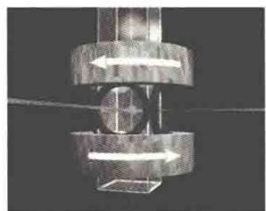  

图 17.39 玻色-爱因斯坦凝聚磁光势阱的装置示意图

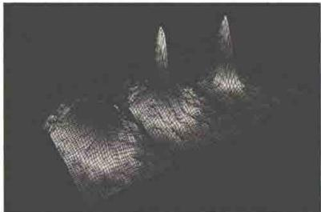  

图 17.40 玻色-爱因斯坦凝聚实验中用吸收成像法测得的铷原子的速度分布图

(注:6束直径为1.5 cm的激光相交于气室中心,气室外沿z轴方向有2个线圈,线圈中通有方向相反的电流产生大小与坐标位置相关的非均匀磁场.)

（注：最左边的对应于凝聚体形成前，原子为均匀球对称分布；中间的是凝聚体形成以后，中心突出部分为 BEC，由于磁阱的不对称性，BEC 成压扁状，其边缘为对称分布的热原子；最右边的是进一步蒸发冷却后留下的纯粹的凝聚体的图，边缘几乎没有热原子。）

美国麻省理工学院的克特勒等人用钠 $^{23}$ Na）原子在实验上也实现了 BEC，如图 17.41、图 17.42 所示。他们认为，实现 BEC 的困难之一就是造成原子损失的热振荡（vibration）。为了减少这种效应，他们消除了造成振荡的真空泵，并采取措施以防空气扰动而对激光束产生影响。他们采用了使原子尽快冷却的方法来减少这种效应。这种快速冷却的方法是该实验的一个很明显的特色，能在 7 s 内使相空间的密度增大 6 个数量级。这种快速冷却的能力对以后研究凝聚具有十分重要的意义。克特勒等人所进行的实验的另一个独特点是采用了一种形状类似于苜蓿叶的磁线圈。这种形状的线圈所产生的势阱使之限制原子的能力更强，在凝聚态中包含更多的原子（ $1.5 \times 10^{5}$ 个原子），从而粒子的数密度超过 $10^{14}$ cm $^{-3}$ ，如此高密度的样品为研究超冷稠密物质中输运过程性质提供了可能性。

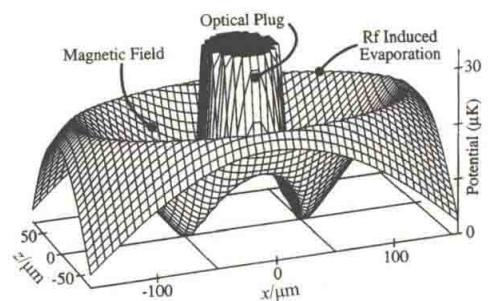  

图 17.41 对应于磁光势阱和蒸发冷却的绝热势(磁势阱的对称轴是 z 轴)

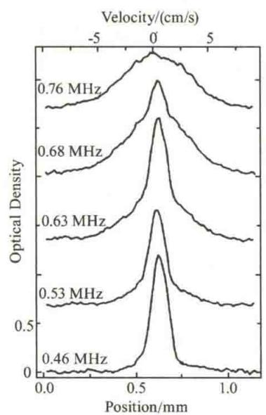  

图 17.42 在钠原子玻色-爱因斯坦凝聚实验中测得的（由上到下）随频率逐渐下降的沿 z 轴方向的密度函数分布图

(注:从图中可以看出,当频率低于0.76 MHz时,开始出现BEC现象;当频率达到0.46 MHz时,几乎为纯BEC.)

美国莱斯大学的休利特(R. G. Hulet)等人在具有负散射长度 $(a < 0)$ 的锂 $\left(^{7}\mathrm{Li}\right)$ 原子气体中也观察到了玻色-爱因斯坦凝聚现象.他们的样品所达到的相空间密度比理想玻色气体产生BEC的临界相密度大了10倍.众所周知，正的散射长度 $a$ 对应于原子波函数的相互排斥，当距离较大时，它就像是半径为 $a$ 的硬球散射.而负的散射长度对应于原子波函数的相互吸引.过去的理论曾经预言：在无外力作用下的均匀系统中，如果散射长度 $a > 0$ ，玻色-爱因斯坦凝聚将是稳定的；而当 $a < 0$ 时，将有负压力，这意味着系统将会塌陷.休利特等人的成功向理论工作者提出了挑战.

随着上述科学家们在实现玻色-爱因斯坦凝聚方面取得突破，这个领域经历了爆发性的发展。目前，世界上已有多个研究组在稀薄原子气中实现了玻色-爱因斯坦凝聚。中国科学院上海光学精密机械所的王育竹院士领导的原子光学研究组，自1999年3月承担国家自然科学基金重点课题“玻色-爱因斯坦凝聚研究”以来，经过3年的艰辛努力，于2002年3月19日，在铷原子云中观察到了玻色-爱因斯坦凝聚现象。这是我国第一个实现玻色-爱因斯坦凝聚的实验。他们在磁阱中对铷原子云进行蒸发冷却的过程中，突然观察到原子云对探测光束的衍射现象，这个结果与休利特观察到的现象一致。

  

非线性光学

简介

自20世纪60年代以来，激光的实现使线性光学的研究领域伸展到非线性光学领域，从而引发非线性光学的诞生。随着玻色-爱因斯坦凝聚实验的成功，人们认为BEC的实现将使原子光学的研究领域进入非线性区，将会形成非线性原子光学。这主要是因为玻色-爱因斯坦凝聚体具有很多奇特的性质。像激光那样，凝聚体具有相干性。克特勒的研究小组把凝聚体一分为二，然后关闭囚禁它们的势阱，让两者自由扩展，在它们交叠的区域观测到了清晰的干涉条纹，如图17.43所示。

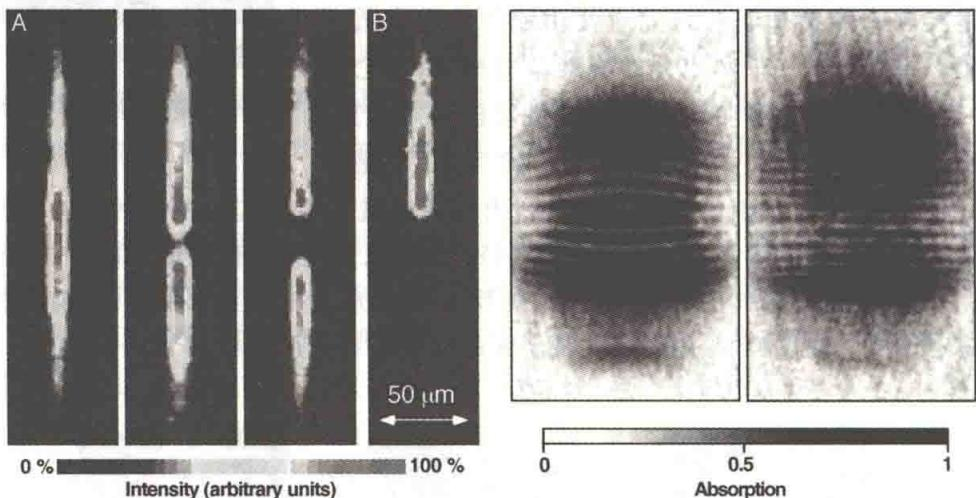  

图17.43 两个BEC物质波的相干干涉

凝聚体的其他很多非线性性质也都开始得到研究. 哈科维奇(L. Khaykovich)等人通过图17.44所示的实验装置观察到亮孤子, 具体的实验过程是: 首先将 $4 \times 10^{8}$ 个 $^{7}Li$ 原子装置在一个磁光阱中, 然后通过改变磁光阱的径向和轴向角频率, 逐渐把磁势阱调节成光势阱, 最后通过减少光势阱的深度, 在一交叉的双极势阱加压蒸发 $^{7}Li$ 的玻色-爱因斯坦凝聚体, 从而观察到 $^{7}Li$ 的玻色-爱因斯坦凝聚体中的亮孤子, 如图17.45所示. 康奈尔的研究小组首先对相位相同的凝聚体(基态)的中间利用激光进行调制, 使上、下两部分的凝聚体具有 $\pi$ 的相

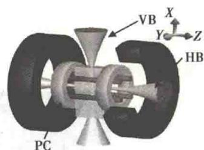  

图17.44 观察到亮孤子的实验装置

位差；然后让它们自由扩散，在实验中适当控制孤子的角方位，就可以比较清楚地观察到暗孤子，如图17.46所示。克特勒的研究小组在实现 $^{23}$ Na原子的玻色-爱因斯坦凝聚体的实验装置中逐渐蒸发冷却凝聚体到临界温度以下，然后通过调节磁光势阱的径向和轴向频率控制凝聚体的集体激发，就可以观察到凝聚体的集体激发现象，如图17.47所示。随着凝聚体中集体激发、暗亮孤子的成功观察,物理学家还成功地观察到其中的涡旋态的形成.囚禁的玻色-爱因斯坦凝聚体中观察到量子涡旋晶格证实了玻色-爱因斯坦凝聚体存在超流现象.有三个小组利用两种不同的方法成功地观察了玻色-爱因斯坦凝聚体中的量子涡旋.一是实验天体物理联合研究所使用强度分布合适的光束去烙印(imprint)一个两成分的凝聚体的相位,让它们相干后产生涡旋现象,这种方法称为相位烙印技术,他们在实验中观察到的现象是单一涡旋,如图17.48所示.二是

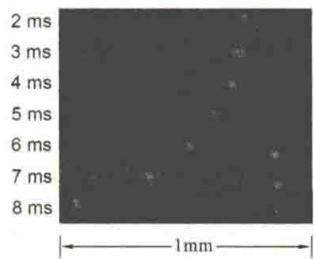

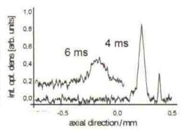

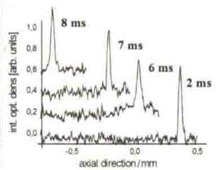  

图17.45 观察到的亮孤子

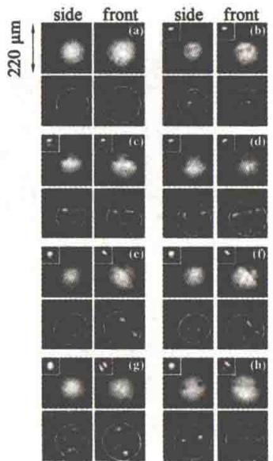  

图17.46 观察到的暗孤子

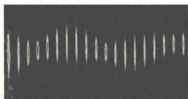  

图 17.47 玻色-爱因斯坦凝聚体的集体激发现象

巴黎高等师范学院和麻省理工学院两个小组利用与液体氦的超流实验相似的方法旋转盛有凝聚体的桶，观察到凝聚体中的量子涡旋（见图17.49），以及二元玻色-爱因斯坦凝聚体的行为等。克特勒的研究小组研究了凝聚体中的声波传播、物质波与激光场的相互作用、自旋畴结构及量子隧穿，在凝聚体中形成了旋涡阵列，他们还实现了无破坏测量以及用磁场调节原子与原子之间的相

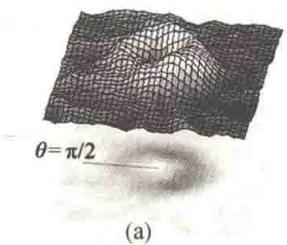

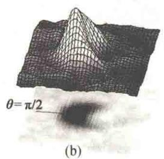

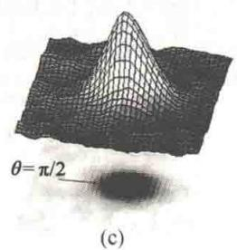  

图17.48 单一涡旋

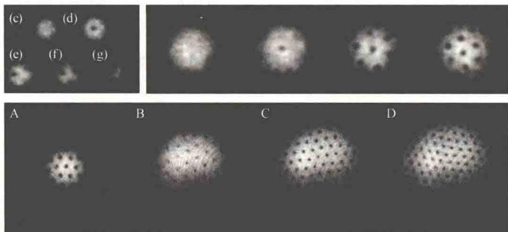  

图 17.49 凝聚体中的量子涡旋

互作用,为进一步研究玻色-爱因斯坦凝聚体的性质奠定了基础.美国国家标准局的菲利普斯研究组在凝聚体中实现了类似于非线性光学中的四波混频(见图17.50).哈佛大学的两个研究小组用玻色-爱因斯坦凝聚体使光的速度降为零,这引起了公众的极大兴趣.如何像激光器输出相干光子那样输出相干原子(原子激光)也是目前实验想要实现的目标.

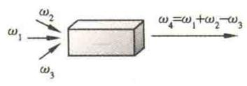  

(a)

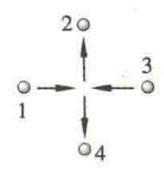  

(b)  

图17.50 四波混频

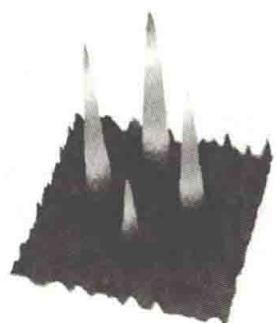  

(c)

## 17.5.3 玻色-爱因斯坦凝聚态的应用前景

玻色-爱因斯坦凝聚实验有着十分重要的科学意义和潜在的应用价值. 它产生了一种新物态，并且是用一个相干波函数描述的物态，为实验物理学家提供了一种独一无二的新介质. 利用物质波的相干性可以开拓很多新的研究领域. 如原子激光的产生和放大研究；类比于非线性光学，非线性原子光学的研究；利用费希巴赫共振改变原子间相互作用的符号，从而导致超新星的 BEC 爆炸. 它在应用技术方面已提出了很多新的设想和建议：研制高准确度和稳定度的原子钟和精密原子干涉仪；改善精密测量的准确度，如原子物理常数的测量和微重力的测量；利用 BEC 的相干性进行微结构的刻蚀等.

玻色-爱因斯坦凝聚体的研究也可以延伸到其他领域。例如，利用磁场调控原子之间的相互作用，可以在玻色-爱因斯坦凝聚体中产生类似于超新星爆发的相现象，由于费米子的特性，即使在零温度仍有压力存在，因此可将类似于实现玻色-爱因斯坦凝聚的技术用于费米气体，在实验中模拟白矮星的内部压力，理论上也提出了用玻色-爱因斯坦凝聚体来模拟黑洞的设想。玻色-爱因斯坦凝聚体所具有的奇特性质，使它不仅对基础研究有重要意义，而且在量子信息科学研究中也意义重大，如光速减慢与光信息存储、量子信息传递和量子逻辑操作等。此外，它在芯片技术、精密测量和纳米技术等领域都让人看到了非常美好的应用前景。凝聚体中的原子几乎不动，可以用来设计精确度更高的原子钟，应用于太空航行和精确定位等。凝聚体具有很好的相干性，可以用于研制高精度的原子干涉仪，测量各种势场，测量重力场加速度和加速度的变化等。原子激光也可能用于集成电路的制造。凝聚体还被建议用于量子信息的处理，为量子计算机的研究提供另外一种选择。随着对玻色-爱因斯坦凝聚领域研究的深入，玻色-爱因斯坦凝聚极有可能会像激光的发现那样，给人类带来另外一次技术革命。
