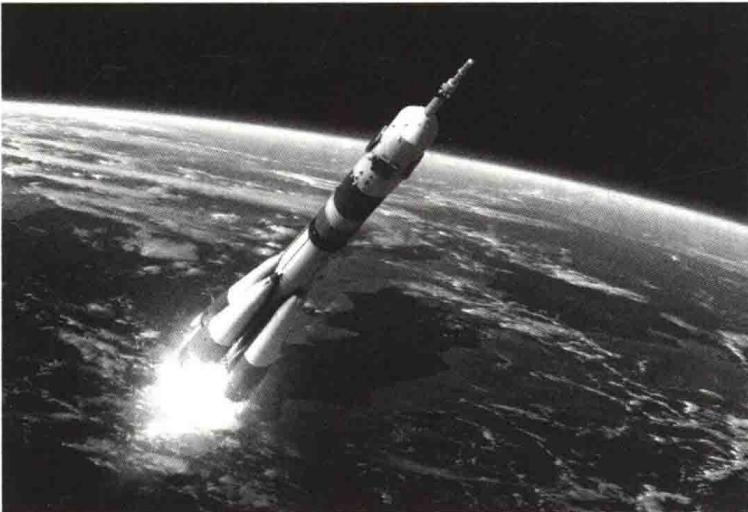
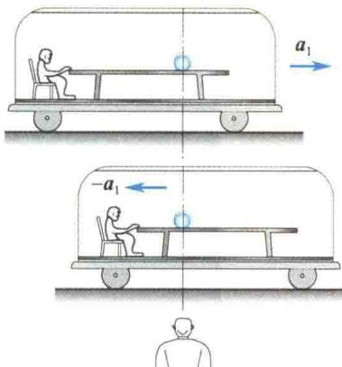
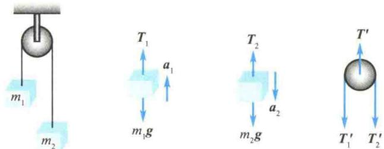
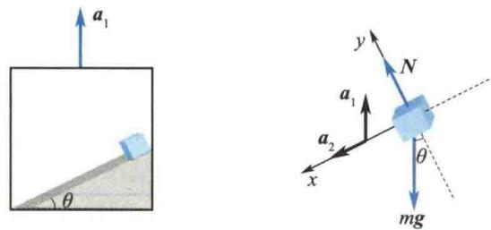
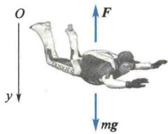
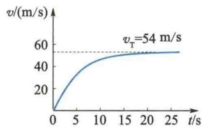

import Guide from '@/components/Guide.astro';
import Knowledge from '@/components/Knowledge.astro';
import Example from '@/components/Example.astro';
import Analysis from '@/components/Analysis.astro';
import Solution from '@/components/Solution.astro';
import Variant from '@/components/Variant.astro';
import Note from '@/components/Note.astro';
import Block from '@/components/Block.astro';
import Method from '@/components/Method.astro';
import Exercise from '@/components/Exercise.astro';

## 第2章 质点动力学

  

本章提要

运动是物质的固有属性,但物质如何运动,既与其自身的内在因素有关,又与物质间的相互作用有关.在力学中将物体间的相互作用称为力.研究物体在力的作用下的运动规律的学科称为动力学.

动力学问题中既有以牛顿运动定律为代表所描述的力的瞬时效应,又有通过动量守恒定律、机械能守恒定律、角动量守恒定律等所描述的力在时空过程中的积累效应.而反映力在时空过程中积累效应的这些守恒定律又是与时空的某种对称性具有紧密联系的.

以牛顿运动定律为基础的经典力学历经了3个多世纪的检验，在低速、宏观领域是成立的。但是人们发现，在高速微观领域，经典力学不再成立，物质的运动需要用更高级的理论（相对论与量子力学）来描述。经典力学是机械制造、土木建筑、交通运输乃至航天技术等领域中不可或缺的理论基础。

## 2.1.1 牛顿第一定律 惯性参考系

  

牛顿

设想有一宇宙飞船远离所有星体,它的运动便不会受到其他物体的影响.这种不受其他物体作用或离其他物体都足够远的质点,称为孤立质点.

牛顿第一定律指出:一孤立质点将永远保持其原来静止或匀速直线运动状态.物体的这种运动状态通常称为惯性运动,而物体保持原有运动状态的特性称为惯性.任何物体在任何状态下都具有惯性,惯性是物体的固有属性.牛顿第一定律又称为惯性定律.

实验表明,一孤立质点并不是在任何参考系中都能保持加速度为零的静止或匀速直线运动状态.例如,在一个做加速运动的车厢内去观察水平方向上可视为孤立质点的小球的运动状态,则小球相对于车厢参考系就有加速度,而相对于地面参考系,其加速度为零,如图2.1所示.

如何从运动的车里跳下来？

上述现象表明惯性定律只能在某些特殊的参考系中成立. 通常把孤立质点相对于它静止或做匀速直线运动的参考系称为惯性参考系, 简称惯性系. 上例中的地面就是惯性系, 而加速运动的车厢不是惯性系.

  

图2.1 在加速运动的车厢内惯性定律不成立

那么,哪些参考系是惯性系呢?严格地讲,要根据大量的观察和实验结果来判断.

例如，在研究天体的运动时，常把某些不受其他星体作用的孤立星体（或星体群）作为惯性系。但完全不受其他星体作用的孤立星体（或星体群）是不存在的。所以，以孤立星体（或星体群）作为惯性系也只能是近似的。

地球是最常用的惯性系.但精确观察表明,地球不是严格的惯性系.离地球最近的恒星是太阳,两者相距 $1.5\times10^{11}$ m.太阳的存在,使地球具有 $5.9\times10^{-3}$ m/s $^{2}$ 的公转加速度;地球的自转加速度更大,为 $3.4\times10^{-2}$ m/s $^{2}$ .但对大多数精度要求不太高的实验,上述效应可以忽略,地球可以作为近似程度很好的惯性系.

太阳参考系通常是指以太阳为坐标原点，以太阳与其他恒星的连线为坐标轴的参考系。这是一个精确度很好的惯性系。但进一步的研究表明，由于太阳受整个银河系分布质量的作用，它与整个银河系的其他星体一起绕银河系中心旋转，加速度为 $10^{-10}\ m/s^{2}$ 。

可以证明(见 4.1 节)，凡相对于某惯性系静止或做匀速直线运动的其他参考系都是惯性系.

## 2.1.2 牛顿第二定律 惯性质量 引力质量

牛顿第二定律指出: 物体受到外力作用时, 它所获得的加速度 a 的大小与合外力的大小成正比, 与物体的质量成反比; 加速度 a 的方向与合外力 F 的方向相同.

牛顿第二定律的数学形式为

  

牛顿第二定律的理解

$$

\boldsymbol {F} = k m \boldsymbol {a}\tag{2.1}

$$

比例系数 k 与单位制有关. 在国际单位制中 k = 1.

牛顿第一定律只是说明任何物体都具有惯性,但没有给予惯性的量度.牛顿第二定律指出,同一个外力作用在不同的物体上,质量大的物体获得的加速度小,质量小的物体获得的加速度大.这意味着对于质量大的物体,要改变其运动状态比较困难;对于质量小的物体,要改变其运动状态比较容易.因此,质量就是物体惯性大小的量度.牛顿第二定律中的质量也常称为惯性质量.

任何两个物体之间都存在着万有引力作用,万有引力定律的数学形式为

$$

\pmb {F} = - G \frac {m _ {1} m _ {2}}{r ^ {2}} \pmb {r} _ {0}\tag{2.2}

$$

确定论系统中的随机行为

式中， $G = 6.67 \times 10^{-11} \, N \cdot m^{2}/kg^{2}$ ，称为引力常量；r 为两物体间的距离； $r_{0}$ 为由施力物体指向受力物体的单位矢量； $m_{1}$ 、 $m_{2}$ 称为引力质量。

牛顿等许多人做过实验,都证明引力质量等于惯性质量.所以今后在经典力学的讨论中不再区分引力质量和惯性质量.惯性质量与引力质量等价是广义相对论的基本出发点之一.

## 2.1.3 牛顿第三定律

牛顿第三定律: 当物体 A 以力 $F_{1}$ 作用在物体 B 上时, 物体 B 也必定同时以力 $F_{2}$ 作用在物体 A 上, $F_{1}$ 和 $F_{2}$ 大小相等, 方向相反, 且力的作用线在同一直线上. 即

$$

\pmb {F} _ {1} = - \pmb {F} _ {2}\tag{2.3}

$$

对于牛顿第三定律,必须注意如下几点.

（1）作用力与反作用力总是成对出现，且作用力与反作用力之间的关系是一一对应的.

(2) 作用力与反作用力分别作用在两个物体上, 因此它们绝对不是一对平衡力.

（3）作用力与反作用力一定属于同一性质的力。如果作用力是万有引力，反作用力也一定是万有引力；如果作用力是摩擦力，反作用力也一定是摩擦力；如果作用力是弹性力，反作用力也一定是弹性力。

## 2.1.4 牛顿运动定律的应用

牛顿第二定律描述的是力和加速度之间的瞬时关系. 它表明只要物体所受合外力不为零, 物体就有相应的加速度, 力改变时相应的加速度也随之改变, 物体所受合外力为恒量时物体的加速度是常数.

牛顿第二定律 $F = ma = m \frac{d^{2} r}{dt^{2}}$ 是矢量式. 在具体运算时, 一般要先选定合适的坐标系, 然后将牛顿第二定律写成该坐标系下的分量式. 例如, 在直角坐标系中它的

  

是否能逆风

行舟？

分量式为

$$

\left\{ \begin{array}{l} F _ {x} = m a _ {x} = m \frac {\mathrm{d} v _ {x}}{\mathrm{d} t} = m \frac {\mathrm{d} ^ {2} x}{\mathrm{d} t ^ {2}} \\ F _ {y} = m a _ {y} = m \frac {\mathrm{d} v _ {y}}{\mathrm{d} t} = m \frac {\mathrm{d} ^ {2} y}{\mathrm{d} t ^ {2}} \\ F _ {z} = m a _ {z} = m \frac {\mathrm{d} v _ {z}}{\mathrm{d} t} = m \frac {\mathrm{d} ^ {2} z}{\mathrm{d} t ^ {2}} \end{array} \right.\tag{2.4}

$$

在研究曲线运动时,也可以用自然坐标系中的分量式:

$$

\left\{ \begin{array}{l} F _ {\tau} = m a _ {\tau} = m \frac {\mathrm{d} v}{\mathrm{d} t} \\ F _ {\mathrm{n}} = m a _ {\mathrm{n}} = m \frac {v ^ {2}}{\rho} \end{array} \right.\tag{2.5}

$$

式中， $F_{\tau}$ 、 $F_{n}$ 分别代表切向分力和法向分力的大小.

牛顿第二定律概括了力的叠加原理. 如果有几个力同时作用在一个物体上, 则这些力的合力所产生的加速度等于这些分力单独作用在该物体上所产生的加速度的矢量和.

<Note>
牛顿运动定律只适用于质点模型, 只在惯性系中成立. 可以证明, 牛顿运动定律、动量定理、动量守恒定律、动能定理、功能原理、机械能守恒定律、角动量定理和角动量守恒定律等都只在惯性系中成立, 并且牛顿运动定律只在低速 (不考虑相对论效应时)、宏观 (不考虑量子效应时) 的情况下适用.
</Note>

<Example title="例 2.1">
一细绳跨过一轴承光滑的定滑轮，绳的两端分别悬有质量为 $m_{1}$ 和 $m_{2}$ 的物体 $(m_{1} < m_{2})$ ，如图2.2所示.设定滑轮和绳的质量可忽略不计，绳不能伸长，试求物体的加速度及连接定滑轮的杆中的张力.

  

图2.2 例2.1图

<Solution title="解">
分别以物体 $m_{1}$ 、物体 $m_{2}$ 、定滑轮为研究对象，其受力如图 2.2 所示.

对物体 $m_{1}$ ，它在绳子拉力 $T_{1}$ 及重力 $m_{1}g$ 的作用下以加速度 $a_{1}$ 向上运动，取向上为正方向，则有

$$

T _ {1} - m _ {1} g = m _ {1} a _ {1}\tag{①}

$$

对物体 $m_{2}$ ，它在绳子拉力 $T_{2}$ 及重力 $m_{2}g$ 的作用下以加速度 $a_{2}$ 向下运动，取向下为正方向，则有

$$

m _ {2} g - T _ {2} = m _ {2} a _ {2}\tag{②}

$$

由于定滑轮轴承光滑,定滑轮和绳的质量可以略去,所以绳上各部分的张力都相等;又因为绳不能伸长，所以 $m_{1}$ 和 $m_{2}$ 的加速度大小相等.即有

$$

T _ {1} = T _ {2} = T, \quad a _ {1} = a _ {2} = a

$$

联立 ① 和 ② 两式, 解得

$$

a = \frac {m _ {2} - m _ {1}}{m _ {1} + m _ {2}} g, T = \frac {2 m _ {1} m _ {2}}{m _ {1} + m _ {2}} g

$$

由牛顿第三定律知： $T_{1}^{\prime}=T_{1}=T,\quad T_{2}^{\prime}=T_{2}=T$ ，又考虑到定滑轮质量不计，所以

容易证明

$$

\begin{array}{r l} & T ^ {\prime} = 2 T = \frac {4 m _ {1} m _ {2}}{m _ {1} + m _ {2}} g \\ & T ^ {\prime} <   (m _ {1} + m _ {2}) g \end{array}

$$

升降机内有一光滑斜面，固定在底板上，斜面倾角为 $\theta$ 。当升降机以加速度 $a_{1}$ 竖直上升时，质量为 m 的物体从斜面顶端沿斜面开始下滑，如图 2.3 所示。已知斜面长为 l，求物体对斜面的压力，以及物体从斜面顶端滑到底部所需的时间。

  

图2.3 例2.2图

以物体为研究对象. 其受到斜面的正压力 N 和重力 mg 的作用. 以地面为参考系, 设物体相对于斜面的加速度为 $a_{2}$ , 方向沿斜面向下, 则物体相对于地面的加速度为

$$

\boldsymbol {a} = \boldsymbol {a} _ {1} + \boldsymbol {a} _ {2}

$$

设 x 轴正方向沿斜面向下，y 轴正方向垂直于斜面向上，则对物体应用牛顿运动定律，列方程如下：

x 轴方向 $mg \sin \theta = m(a_{2} - a_{1} \sin \theta)$

$y$ 轴方向 $N - mg\cos \theta = ma_{1}\cos \theta$

解这两个方程，得 $a_2 = (g + a_1)\sin \theta$

由牛顿第三定律可知,物体对斜面的压力 $N'$ 与斜面对物体的正压力 N 大小相等,方向相反,即物体对斜面的压力的大小为

$$

N = m (g + a _ {1}) \cos \theta

$$

$$

N ^ {\prime} = m (g + a _ {1}) \cos \theta

$$

方向垂直于斜面向下.

因为物体相对于斜面以加速度

$$

a _ {2} = (g + a _ {1}) \sin \theta

$$

沿斜面向下做匀变速直线运动,所以

$$

l = \frac {1}{2} a _ {2} t ^ {2} = \frac {1}{2} (g + a _ {1}) t ^ {2} \sin \theta

$$

$$

t = \sqrt {\frac {2 l}{(g + a _ {1}) \sin \theta}}

$$
</Solution>
</Example>

<Example title="例 2.3">
在跳伞运动员张伞前的俯冲阶段，由于受到随速度增加而增大的空气阻力，其速度不会像自由落体那样增大。当空气阻力增大到与重力相等时，跳伞运动员就达到其下落的最大速度，称为终极速度。一般在跳离飞机大约 $10\mathrm{s}$ ，下落 $300\sim 400\mathrm{m}$ 时，就会达到此速度（约 $50~\mathrm{m / s}$ ）。设跳伞运动员下落过程中受到的空气阻力为 $F = kv^{2}(k$ 为常量），如图2.4(a)所示。试求跳伞运动员在任意时刻的下落速度。

  

(a)

  

图2.4 例2.3图  

(b)

<Solution title="解">
跳伞运动员的运动方程为

$$

m g - k v ^ {2} = m \frac {\mathrm{d} v}{\mathrm{d} t}

$$

改写运动方程为 $v_{\mathrm{T}}^{2} - v^{2} = \frac{mdv}{kdt}$

$$

v _ {\mathrm{T}} = \sqrt {\frac {m g}{k}}

$$

显然，在 $kv^{2} = mg$ 的条件下对应的速度即为终极速度，并用 $v_{T}$ 表示：

分离变量得

$$

\frac {\mathrm{d} v}{v _ {\mathrm{T}} ^ {2} - v ^ {2}} = \frac {k}{m} \mathrm{d} t

$$

因为 t=0 时, v=0; 并设 t 时刻, 速度为 v, 对上式两边取定积分, 有

$$

\int_ {0} ^ {v} \frac {\mathrm{d} v}{v _ {\mathrm{T}} ^ {2} - v ^ {2}} = \frac {k}{m} \int_ {0} ^ {t} \mathrm{d} t = \frac {g}{v _ {\mathrm{T}} ^ {2}} \int_ {0} ^ {t} \mathrm{d} t

$$

由基本积分公式得

当 $t \gg \frac{v_{\mathrm{T}}}{2g}$ 时， $v \to v_{\mathrm{T}}$

$$

\frac {1}{2 v _ {\mathrm{T}}} \ln \left(\frac {v _ {\mathrm{T}} + v}{v _ {\mathrm{T}} - v}\right) = \frac {g}{v _ {\mathrm{T}} ^ {2}} t

$$

设跳伞运动员的质量 $m = 70 \, kg$ ，测得终极速度 $v_{T} = 54 \, m/s$ ，则可推算出

$$

v = \frac {1 - \mathrm{e} ^ {\frac {- 2 g t}{v _ {\mathrm{T}}}}}{1 + \mathrm{e} ^ {\frac {- 2 g t}{v _ {\mathrm{T}}}}} v _ {\mathrm{T}}

$$

解得

$$

k = \frac {m g}{v _ {\mathrm{T}} ^ {2}} = 0. 2 4 \mathrm{N} \cdot \mathrm{s} ^ {2} / \mathrm{m} ^ {2}

$$

以此 $v_{T}$ 值代入 v 的表达式, 可得到如图2.4(b)所示的 v-t 函数曲线.
</Solution>
</Example>

## 2.1.5 国际单位制和量纲

各国使用的单位制种类繁多,这给国际科学技术交流带来很大不便.为此在第十四届国际计量大会上选择了7个物理量作为基本量,规定其相应单位为基本单位,在此基础上建立了国际单位制.我国国务院在1984年把国际单位制的单位定为法定计量单位.

国际单位制的7个基本量为长度、质量、时间、电流、热力学温度、物质的量和发光强度，其相应的单位见书后附录Ⅲ.

有了基本单位，通过物理量的定义或物理定律就可导出其他物理量的单位。从基本量导出的量称为导出量，相应的单位称为导出单位。例如，在国际单位制中，速度的单位是 $\mathrm{m / s}$ ，力的单位是N，用基本单位表示为 $\mathrm{kg} \cdot \mathrm{m} / \mathrm{s}^2$ 。因为导出量是由基本量导出的，所以导出量可用基本量的某种组合（乘、除、幂等）表示。这种由基本量的组合来表示物理量的式子称为物理量的量纲式。如果用L、M和T分别表示长度、质量和时间，则力学中其他物理量的量纲式可表示为

$$

[ Q ] = \mathrm{L} ^ {p} \mathrm{M} ^ {q} \mathrm{T} ^ {r}

$$

例如，在国际单位制中力的量纲式为

$$

[ F ] = \mathrm{LMT} ^ {- 2}

$$

量纲式和量纲在物理学中很有用处. 只有量纲式相同的量才能相加、相减或用等式相连, 这一法则称为量纲法则. 所以, 可以用量纲法则进行单位换算, 检验新建方程, 或检验公式的正确性和完整性, 还可为探索复杂的物理规律提供线索. 量纲分析法在科学研究中具有重要作用.

在物理学中,除采用国际单位制外,基于不同需要,还常用一些其他单位.如长度在原子线度和光波中常用纳米(nm)作单位:

$$

1 \mathrm{nm} = 1 0 ^ {- 9} \mathrm{m}

$$

原子核线度常用飞米（fm）作单位：

$$

1 \mathrm{fm} = 1 0 ^ {- 1 5} \mathrm{m}

$$

在天体物理学中,常用天文单位(AU)和光年(1.y.)作长度单位.一天文单位定义为地球和太阳的平均距离,光年是光在一年时间内通过的距离,即

$$

\begin{array}{r l} & 1 \mathrm{AU} = 1. 4 9 6 \times 1 0 ^ {1 1} \mathrm{m} \\ & 1 \mathrm{l.y.} = 9. 4 6 \times 1 0 ^ {1 5} \mathrm{m} \end{array}

$$

