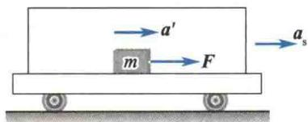
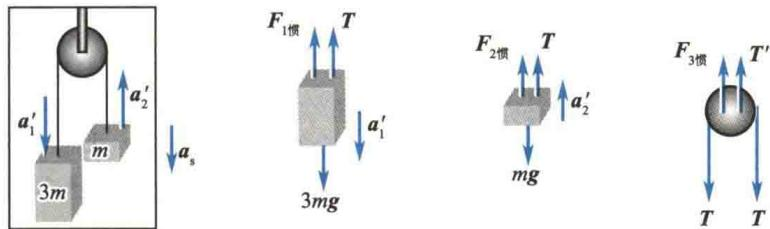
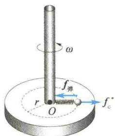
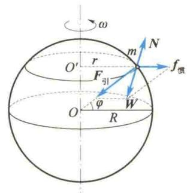
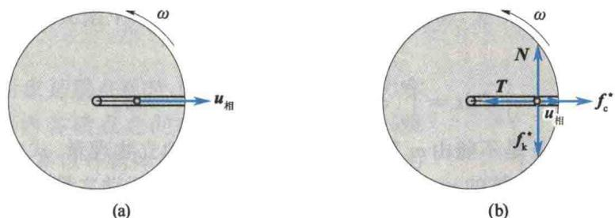

import QRCodeVideo from '@/components/QRCodeVideo.astro';

import Guide from '@/components/Guide.astro';
import Knowledge from '@/components/Knowledge.astro';
import Example from '@/components/Example.astro';
import Analysis from '@/components/Analysis.astro';
import Solution from '@/components/Solution.astro';
import Variant from '@/components/Variant.astro';
import Note from '@/components/Note.astro';
import Block from '@/components/Block.astro';
import Method from '@/components/Method.astro';
import Exercise from '@/components/Exercise.astro';

凡相对于惯性系有加速度的参考系都称为非惯性系. 如前所述, 牛顿运动定律在非惯性系中不成立. 可是, 在实际问题中, 人们常常需要在非惯性系中处理力学问题. 下面的讨论将表明, 为了能在非惯性系中沿用牛顿运动定律的形式, 需要引入惯性力的概念.

### 1. 在变速直线运动参考系中的惯性力

如图2.5所示，有一相对地面以加速度 $a_{s}$ 做直线运动的车厢，车厢地板上有一质量为m的物体，其所受合外力为F，相对于车厢以加速度 $a^{\prime}$ 运动。因为车厢有加速度 $a_{s}$ ，所以是非惯性系，故在车厢参考系中牛顿运动定律不成立，即
$$
\mathbf {F} \neq m \mathbf {a} ^ {\prime}
$$
  
图2.5 惯性力的引入
若以地面为参考系,则牛顿运动定律成立,应有
$$
\pmb {F} = m \pmb {a} _ {\mathrm{地}} = m (\pmb {a} _ {\mathrm{s}} + \pmb {a} ^ {\prime}) = m \pmb {a} _ {\mathrm{s}} + m \pmb {a} ^ {\prime}
$$
如果将 $ma_{s}$ 移至等式左边，令
$$
\pmb {F} _ {\mathrm{惯}} = - m \pmb {a} _ {\mathrm{s}}\tag{2.6}
$$
并称 $F_{惯}$ 为惯性力, 则上式可写为
$$
\pmb {F} + \pmb {F} _ {\mathrm{惯}} = m \pmb {a} ^ {\prime}\tag{2.7}
$$
中国物理学家
式(2.7)表明,若仍要在非惯性系中沿用牛顿运动定律的形式,则在受力分析时,除了应考虑物体间的相互作用力外,还必须加上惯性力的作用.
<QRCodeVideo title="钱伟长" url="https://api.guangyiedu.com/v3/resource/resource/r/NewQrCode-9YKi5HgUTt3zYG3w5iVl" />
而式(2.6)说明,惯性力的方向与牵连运动参考系(这里即车厢)相对于惯性系(地面)的加速度 $a_{s}$ 的方向相反,其大小等于研究对象的质量m与 $a_{s}$ 的乘积.
钱伟长

<Note>
惯性力不是物体间的相互作用,故惯性力无施力物体,无反作用力.惯性力仅是参考系非惯性运动的表现,其具体形式与非惯性运动的形式有关.
一个电梯具有 g/3 且方向向下的加速度, 电梯内装有一定滑轮, 其质量和摩擦均不计, 一轻且不可伸长的细绳跨过定滑轮两边, 分别与质量为 3m 和 m 的两物体相连, 如图 2.6 所示. (1) 计算质量为 3m 的物体相对于电梯的加速度; (2) 计算连接杆对定滑轮的作用力; (3) 一个完全隔离在电梯中的观察者如何借助弹簧秤测出的力来测量电梯相对于地面的加速度?
  
图2.6 例2.4图
</Note>

<Solution title="解">
分别以质量为 3m、m 的两物体和定滑轮为研究对象，受力分析如图 2.6 所示，并设两物体对电梯的加速度分别为 $a_{1}^{\prime}$ 、 $a_{2}^{\prime}$ .
（1）分别对两物体运用非惯性系中的牛顿运动定律，得
$$
\left\{ \begin{array}{l l} 3 m g - T - F _ {1 \text {   惯   }} = 3 m a _ {1} ^ {\prime} \\ F _ {2 \text {   惯   }} + T - m g = m a _ {2} ^ {\prime} \end{array} \right.
$$
式中， $F_{1惯} = 3m \frac{g}{3} = mg, F_{2惯} = \frac{1}{3}mg, a_{1}^{\prime} = a_{2}^{\prime}.$ 解得
$$
a _ {1} ^ {\prime} = a _ {2} ^ {\prime} = g / 3, \quad T = m g
$$
即质量为 3m 的物体相对于电梯以 g/3 的加速度向下运动.
(2) 因为定滑轮质量不计, 所以 $F_{3惯} = 0$ . 故连杆对定滑轮的作用力为
$$
T ^ {\prime} = 2 T = 2 m g
$$
(3) 完全被隔离于电梯里的观察者观察到的两物体的加速度只能是相对于电梯的, 弹簧秤测出的力并没有包括惯性力的效果, 若其测出的力为 T, 则由
<table><tr><td>得</td><td> $F_{2\text{惯}} + T - mg = ma_{2}^{\prime}$  $F_{2\text{惯}} = m(a_{2}^{\prime} + g) - T$ </td><td>故电梯相对于地面的加速度为 $a_{s} = \frac{F_{2\text{惯}}}{m} = (a_{2}^{\prime} + g) - \frac{T}{m} = \frac{4}{3}g - \frac{T}{m}$ </td></tr></table>
</Solution>

### 2. 在匀角速转动的非惯性系中的惯性力——惯性离心力 $f_{c}^{*}$

如图 2.7 所示, 在光滑水平圆盘上, 用一轻弹簧拴一小球, 圆盘以角速度 $\omega$ 匀速转动, 弹簧被拉伸后相对圆盘静止.
地面上的观察者认为:小球受到指向轴心的弹簧拉力的作用,所以随圆盘一起做圆周运动,符合牛顿运动定律.
圆盘上的观察者认为: 小球受到指向轴心的弹簧拉力的作用而仍处于静止状态, 不符合牛顿运动定律. 圆盘上的观察者若仍要用牛顿运动定律解释这一现象, 就必须引入一个惯性力——惯性离心力 $f_{c}^{*}$ , 即
$$
f _ {\mathrm{c}} ^ {*} = - m \boldsymbol {a} _ {\mathrm{s}} = m \omega^ {2} \boldsymbol {r}\tag{2.8}
$$
值得注意的是,有些读者常把惯性离心力误认为向心力的反作用力,这是完全错误的:其一,惯性离心力不是物体间的相互作用力,故谈不上有反作用力;其二,惯性离心力作用在小球上,作为向心力的弹簧拉力也作用在小球上,从圆盘上的观察者的角度来看,这是一对“平衡”力.
惯性离心力也是日常生活中常见的力.例如，物体的重量随纬度的变化而变化，就是由与地球自转相关的惯性离心力引起的.如图2.8所示，一质量为 $m$ 的物体静止在纬度为 $\varphi$ 处，其重力等于地球引力与自转效应的惯性离心力的合力，即
可以证明
$$
\begin{array}{r} {W = F _ {\mathrm{引}} + f _ {\mathrm{惯}}} \\ {W \approx F _ {\mathrm{引}} - m \omega^ {2} R \cos^ {2} \varphi} \end{array}
$$
但由于地球自转角速度很小 $\left(\omega = \frac{2\pi}{24\times 3600}\mathrm{rad / s}\approx 7.3\times 10^{-5}\mathrm{rad / s}\right)$ ，故除精密计算外，通常把 $F_{\text{引}}$ 视为物体的重力.
  
图 2.7 转动参考系中的惯性离心力
  
图2.8 重力与纬度的关系

### 3. 科里奥利力 $f_{\mathrm{k}}^{*}$

设想有一圆盘绕铅直轴以角速度 $\omega$ 转动. 盘心有一光滑小孔, 沿半径方向有一光滑小槽. 槽中有一小球被穿过小孔的细线控制, 使其只能沿槽做匀速运动, 假定小球沿槽以速度 $u_{相}$ 向外运动, 如图 2.9(a) 所示.
现以圆盘为参考系. 圆盘上的观察者认为小球仅有径向匀速运动, 即小球处于平衡态. 因此, 由图 2.9(b) 可以看出, 小球在径向受细绳的张力 T 与惯性离心力 $f_{c}^{*}$ 的作用而平衡, 而在横向上必须有与槽的侧向推力 N 相平衡的力 $f_{k}^{*}$ 存在, 才能实现小球在圆盘参考系中的平衡状态.
  
图2.9 科里奥利力的引入
显然，与 N 相平衡的 $f_{k}^{*}$ 不属于相互作用的范畴（无施力者），而应属于惯性力的范畴。通常将这种既与牵连运动 ( $\omega$ ) 有关，又与物体对牵连运动参考系（圆盘）的相对运动 ( $u_{相}$ ) 有关的惯性力称为科里奥利力，记作 $f_{k}^{*}$ 。
可以证明,若质量为 m 的物体相对于转动角速度为 $\omega$ 的参考系具有运动速度 $u_{相}$ ,则科里奥利力为
$$
f _ {\mathrm{k}} ^ {*} = 2 m \pmb {u} _ {\mathrm{相}} \times \pmb {\omega}\tag{2.9}
$$
严格地讲,地球是一个做匀角速转动的参考系,因此凡在地球上运动的物体都会受到科里奥利力的影响,只是由于地球自转的角速度 $\omega$ 很小,所以往往不易被人们觉察,但在许多自然现象中仍留下了科里奥利力存在的痕迹.例如,北京天文馆内的傅科摆(摆长为10 m)的摆平面每隔37 h 15 min 转动一周;北半球南北向的河流,人面对下游方向观察时,发现右侧河岸被冲刷得厉害些;还有,南、北半球各自有着自己的“信风”……这些都可以用科里奥利力的影响来加以解释.
<QRCodeVideo title="自然界的科里奥利效应" url="https://api.guangyiedu.com/v3/resource/resource/r/NewQrCode-bYSTkaB560H4Na0Hhpvs" />  
自然界中的
科里奥利效应
