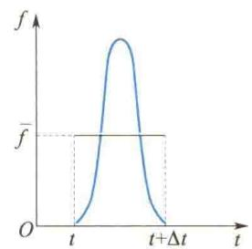
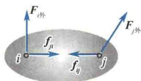
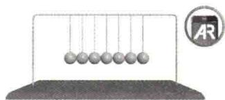
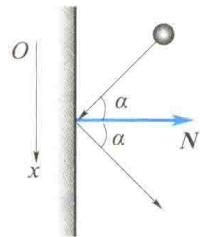
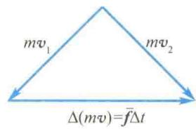
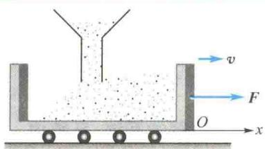
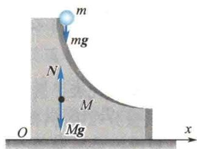
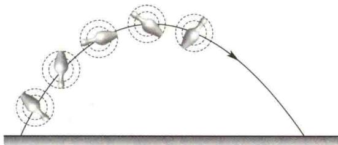
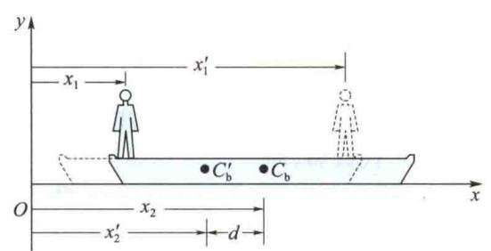

import QRCodeVideo from '@/components/QRCodeVideo.astro';

import Guide from '@/components/Guide.astro';
import Knowledge from '@/components/Knowledge.astro';
import Example from '@/components/Example.astro';
import Analysis from '@/components/Analysis.astro';
import Solution from '@/components/Solution.astro';
import Variant from '@/components/Variant.astro';
import Note from '@/components/Note.astro';
import Block from '@/components/Block.astro';
import Method from '@/components/Method.astro';
import Exercise from '@/components/Exercise.astro';

从本节开始,我们将从力的时间和空间积累效应出发,根据牛顿运动定律,导出动量定理、动能定理这两个运动定理,并进一步讨论动量守恒定律、能量守恒定律.在求解质点力学问题时,在一定条件下运用上述运动定理和守恒定律,往往比直接运用牛顿运动定律更为方便.

## 2.3.1 质点的动量定理

牛顿在研究碰撞过程中所建立起来的牛顿第二定律并不是大家熟知的 $F = ma$ 这种形式. 他所选择的是
$$
\boldsymbol {F} = \frac {\mathrm{d}}{\mathrm{d} t} (m \boldsymbol {v})\tag{2.10}
$$
只是因为在经典力学中,质量 m 是一个常数, F = ma 在形式上与式(2.10)等价.由近代物理知识可知,惯性质量与物体的运动状态有关,不能看成常数.这就是说,从近代物理观点来看,式(2.10)具有更广泛的适应性.
但是，牛顿在写式(2.10)时并没有意识到 $m$ 不是常数，他采用式(2.10)，是因为他认为“ $mv$ ”是一个独立的物理量。也就是说， $mv$ 是由质量和速度联合确定的，而不能是由 $m$ 和 $\pmb{v}$ 分开而确定的物理量。如果引入 $p = mv$ ，那么式(2.10)可写成
$$
\boldsymbol {F} = \frac {\mathrm{d} \boldsymbol {p}}{\mathrm{d} t}\tag{2.11}
$$
将式(2.11)分离变量得
$$
\mathbf {F} \mathrm{d} t = \mathrm{d} \mathbf {p} = \mathrm{d} (m \mathbf {v})
$$
两边积分得
$$
\int_ {0} ^ {t} \pmb {F} \mathrm{d} t = \int_ {p _ {0}} ^ {p} \mathrm{d} p = p - p _ {0} = m \pmb {\mathscr {v}} - m \pmb {\mathscr {v}} _ {0}\tag{2.12}
$$
可见,物理量 p = m v 是不能由 m 和 v 的分离值取代的独立物理量.式(2.12)表明力对时间的积累效应使物体的 m v 发生了变化.牛顿称 m v 为“运动之量”,通常简称动量.
动量是一个矢量,它的方向与物体的运动方向一致;动量也是一个相对量,与参考系的选择有关.在国际单位制中,动量的单位为 $kg \cdot m/s$ .
若将式(2.12)中力对时间的积分 $\int_{t_{0}}^{t}Fdt$ 称为力的冲量，并且用I记之，即 $I=\int_{t_{0}}^{t}Fdt$ ，则式(2.12)又可写成
$$
\boldsymbol {I} = \boldsymbol {p} - \boldsymbol {p} _ {0}\tag{2.13}
$$
<QRCodeVideo title="冲量与动量定理" url="https://api.guangyiedu.com/v3/resource/resource/r/NewQrCode-qxoAxS1xS3IwlWrfEEIw" />  
它表明作用于物体上的合外力的冲量等于物体动量的增量, 这就是质点的动量定理. 式(2.11) 就是动量定理的微分形式.
由式(2.12)知,要使物体的动量发生变化,作用于物体上的力和相互作用持续的时间是两个同样重要的因素.因此,在实践中,当物体动量的变化量给定时,常常用延长作用时间(或缩短作用时间)来减小(或增大)力.
冲量是矢量. 在恒力作用的情况下, 冲量的方向与恒力的方向相同. 在变力作用的情况下, $\Delta t$ 时间内的冲量是各个瞬时冲量 $F \mathrm{~d} t$ 的矢量和, 即这时的冲量是由 $\int_{t_0}^{t} F \mathrm{~d} t$ 决定的. 但无论过程多么复杂, $\Delta t$ 时间内的冲量总是等于这段时间内质点动量的增量.
动量定理在处理冲击和碰撞等问题时特别有用. 将两个物体在碰撞的极短时间内相互作用的力称为冲力. 由于在冲击和碰撞这类问题中, 冲力作用时间极短, 其值变化迅速, 所以较难准确测量冲力的瞬时值 (图 2.10 所示为冲力瞬变示意图). 但是两个物体在碰撞前后的动量和作用持续的时间都较容易测定. 这样就可根据动量定理求出冲力的平均值, 然后根据实际需要来估算冲力. 在实际问题中, 如果作用时间极短, 两物体内部的冲力远大于外部有限大小的主动冲力 (如重力), 则有限大小的主动冲力往往可以忽略而使对问题的分析得到简化.
<figure class="vp-figure">
  
  <figcaption>图 2.10 冲力瞬变示意图</figcaption>
</figure>
动量定理在直角坐标系中的坐标分量式为
$$
\left\{ \begin{array}{l} \int_ {t _ {1}} ^ {t _ {2}} F _ {x} \mathrm{d} t = m v _ {2 x} - m v _ {1 x} \\ \int_ {t _ {1}} ^ {t _ {2}} F _ {y} \mathrm{d} t = m v _ {2 y} - m v _ {1 y} \\ \int_ {t _ {1}} ^ {t _ {2}} F _ {z} \mathrm{d} t = m v _ {2 z} - m v _ {1 z} \end{array} \right.\tag{2.14}
$$

## 2.3.2 质点系的动量定理

研究对象如果是多个质点,则称为质点系.一个不能抽象为质点的物体也可认为是由多个(直至无限个)质点组成的.从这种意义上讲,力学又可分为质点力学和质点系力学.
当研究对象是质点系时,其受力就可分为内力和外力.质点系内各质点之间的作用力称为内力(见图2.11),质点系以外物体对质点系内质点的作用力称为外力.由牛顿第三定律可知,质点系内质点间相互作用的内力是成对出现的,且每对内力都沿两个质点连线的方向.这些就是研究质点系力学的基本观点.
<figure class="vp-figure">
  
  <figcaption>图2.11 内力示意图</figcaption>
</figure>
设质点系是由相互作用的 n 个质点组成的, 现考
察第 i 个质点的受力情况. 首先考察质点 i 所受内力的矢量和. 设质点系内第 j 个质点对质点 i 的作用力为 $f_{ji}$ ，则质点 i 所受内力为
$$
\sum_ {j = 1, j \neq i} ^ {n} f _ {j i}
$$
科研成果介绍
(2.15)
设质点 i 受到的外力为 $F_{i外}$ ，则质点 i 受到的合力为 $F_{i外} + \sum_{j=1, j \neq i}^{n} f_{ji}$ 。对质点 i 应用动量定理有
<QRCodeVideo title="中国空间站" url="https://api.guangyiedu.com/v3/resource/resource/r/NewQrCode-GtCzB3Yk7vg2z1M7REks" />  
$$
\int_ {t _ {1}} ^ {t _ {2}} \left(\pmb {F} _ {i \mathrm{外}} + \sum_ {j = 1, j \neq i} ^ {n} \pmb {f} _ {j i}\right) \mathrm{d} t = m _ {i} \pmb {\mathscr {v}} _ {i 2} - m _ {i} \pmb {\mathscr {v}} _ {i 1}\tag{2.16}
$$
对 i 求和, 并认为所有质点相互作用的时间 dt 都相同, 于是得
$$
\int_ {t _ {1}} ^ {t _ {2}} \big (\sum_ {i = 1} ^ {n} \pmb {F} _ {i \mathrm{外}} \big) \mathrm{d} t + \int_ {t _ {1}} ^ {t _ {2}} \big (\sum_ {i = 1} ^ {n} \sum_ {j = 1, j \neq i} ^ {n} \pmb {f} _ {j i} \big) \mathrm{d} t = \sum_ {i = 1} ^ {n} m _ {i}   \pmb {\mathscr {v}} _ {i 2} - \sum_ {i = 1} ^ {n} m _ {i}   \pmb {\mathscr {v}} _ {i 1}
$$
由于内力总是成对出现,且每对内力都等值反向,因此所有内力的矢量和为
于是有
$$
\begin{array}{r l} & {\sum_ {i = 1} ^ {n} \sum_ {j = 1, j \neq i} ^ {n} f _ {j i} = \mathbf {0}} \\ & {\int_ {t _ {1}} ^ {t _ {2}} \left(\sum_ {i = 1} ^ {n} F _ {i \text {外}}\right) \mathrm{d} t = \sum_ {i = 1} ^ {n} m _ {i}   \pmb {\upsilon} _ {i 2} - \sum_ {i = 1} ^ {n} m _ {i}   \pmb {\upsilon} _ {i 1}} \end{array}\tag{2.17}
$$
这就是质点系动量定理的数学表达式. 即质点系总动量的增量等于作用于该系统的合外力的冲量. 这个结论说明内力对质点系的总动量无贡献. 但由式(2.16)知, 在质点系内部动量的传递和交换中, 起作用的是内力.

## 2.3.3 质点系的动量守恒定律

由式(2.17)知,若 $\sum_{i=1}^{n}F_{i外}=0$ ,则有

$$
\begin{array}{r l} & \sum_ {i = 1} ^ {n} m _ {i} \pmb {\mathscr {v}} _ {i 2} - \sum_ {i = 1} ^ {n} m _ {i} \pmb {\mathscr {v}} _ {i 1} = \mathbf {0} \\ & \sum_ {i = 1} ^ {n} m _ {i} \pmb {\mathscr {v}} _ {i 2} = \sum_ {i = 1} ^ {n} m _ {i} \pmb {\mathscr {v}} _ {i 1} \end{array}\tag{2.18}
$$
或
动量守恒定律
这就是说,一个孤立的力学系统(系统不受外力作用)或合外力为零的系统,系统内各质点间动量可以交换,但系统的总动量保持不变.这就是动量守恒定律.
科研成果介绍
<QRCodeVideo title="长征系列火箭" url="https://api.guangyiedu.com/v3/resource/resource/r/NewQrCode-8i7OramYFMR4OmyT9nA0" />  
动量守恒式(2.18)是矢量式.因此,当 $\sum_{i=1}^{n}F_{i外}=0$ 时,质点系在任何一个方向上(沿任何一个坐标方向)都满足动量守恒的条件.如果质点系所受合外力的矢量和不为零,但合外力在某一方向上的分量为零,则质点系在该方向上的动量也满足守恒定律.在实际问题中,若能判断出内力远大于有限主动外力(如重力),也可忽略有限主动外力而应用动量守恒定律.
<QRCodeVideo title="动量守恒定律的应用" url="https://api.guangyiedu.com/v3/resource/resource/r/NewQrCode-oWsdnt6RJoVOhMaEvd34" />  
由于动量是相对量,所以运用动量守恒定律时,必须将各质点的动量统一到同一惯性系中.
需要说明的是,虽然在讨论动量守恒定律的过程中,是从牛顿第二定律出发,并运用了牛顿第三定律 $\left(\sum_{i=1}^{n}\sum_{j=1,j\neq i}^{n}f_{ji}=0\right)$ ,但不能认为动量守恒定律只是牛顿运动定律的推论.相反,动量守恒定律是比牛顿运动定律更为普遍的规律.在某些过程中,特别是微观领域中,牛顿运动定律不成立,但动量守恒定律依然成立.

<Example title="例 2.5">
一弹性球，质量 $m = 0.20 \, kg$ ，以速度 $v = 5 \, m/s$ 与墙碰撞后弹回。设弹回时球的速度大小不变，碰撞前后球的运动方向和墙的法线的夹角都是 $\alpha$ （见图 2.12），设球和墙碰撞的时间 $\Delta t = 0.05 \, s, \alpha = 60^{\circ}$ ，求在碰撞时间内，球和墙的平均相互作用力。

<figure class="vp-figure">
  
  <figcaption>图2.12 例2.5图</figcaption>
</figure>

<Solution title="解">
以球为研究对象. 设墙对球的平均作用力为 $\overline{f}$ , 球在碰撞前后的速度分别为 $\pmb{v}_1$ 和 $\pmb{v}_2$ , 由动量定理可得
$$
\overline {{{f}}} \Delta t = m \pmb {v} _ {2} - m \pmb {v} _ {1} = m \Delta \pmb {v}
$$
将冲量和动量分别沿 $x$ 轴和 $\mathbf{N}$ 两个方向分解得
$$
\overline {{{f}}} _ {x} \Delta t = m v \sin \alpha - m v \sin \alpha = 0
$$
解得
$$
\bar {f} _ {N} \Delta t = m v \cos \alpha - (- m v \cos \alpha) = 2 m v \cos \alpha
$$
$$
f _ {x} = 0
$$
$$
\overline {{f}} _ {N} = \frac {2 m v \cos \alpha}{\Delta t} = \frac {2 \times 0 . 2 \times 5 \times 0 . 5}{0 . 0 5} N = 2 0 N
$$
由牛顿第三定律可知，球对墙的平均作用力和 $\bar{f}_{N}$ 方向相反而等值，即垂直于墙面向里.
</Solution>
</Example>

<Example title="例 2.6">
如图2.13所示，一辆装矿砂的车厢以 $v=4\ m/s$ 的速率从漏斗下通过，矿砂从漏斗落入车厢。车厢内矿砂质量的增加率为 $k=200\ kg/s$ ，如欲使车厢速率保持不变，必须对车厢施加多大的牵引力？（忽略车厢与地面的摩擦。）
<figure class="vp-figure">
  
  <figcaption>图2.13 例2.6图</figcaption>
</figure>

<Solution title="解">
设 t 时刻已落入车厢的矿砂质量为 m，经过时间 dt 后又有质量为 dm = k dt 的矿砂落入车厢。取质量为 m 和 dm 的矿砂为研究对象，则沿 x 轴方向由动量定理有
$$
\begin{array}{r l} F \mathrm{d} t & = (m + \mathrm{d} m) v - (m v + \mathrm{d} m \cdot 0) \\ & = v \mathrm{d} m = v k \mathrm{d} t \end{array}
$$
$$
F = k v = 2 0 0 \times 4 \mathrm{N} = 8 \times 1 0 ^ {2} \mathrm{N}
$$
</Solution>
</Example>

<Example title="例 2.7">
如图2.14所示，一质量为 $m$ 的小球在质量为 $M$ 的1/4圆弧形滑槽中从静止滑下.设圆弧形滑槽的半径为 $R$ ，如所有摩擦都可忽略，求当小球 $m$ 滑到槽底时，滑槽在水平方向上移动的距离.

<Solution title="解">
以小球和滑槽为研究系统, 其在水平方向上不受外力作用(图 2.14 中所画是小球和滑槽所受的竖直方向上的外力), 故在水平方向上动量守恒. 设在下滑过程中, 小球相对于滑槽的滑动速度为 v, 滑槽对地的速度为 V, 以水平向右为 x 轴正方向, 则在水平方向上有
$$
m (v _ {x} - V) - M V = 0
$$
解得
$$
v _ {x} = \frac {M + m}{m} V
$$
设小球在滑槽上运动的时间为 t，而小球相对于滑槽在水平方向上移动的距离为 R，故有
$$
R = \int_ {0} ^ {t} v _ {x} \mathrm{d} t = \frac {M + m}{m} \int_ {0} ^ {t} V \mathrm{d} t
$$
于是滑槽在水平方向上移动的距离为
$$
s = \int_ {0} ^ {t} V \mathrm{d} t = \frac {m}{M + m} R
$$
<figure class="vp-figure">
  
  <figcaption>图2.14 例2.7图</figcaption>
</figure>
</Solution>
</Example>

## 2.3.4 质心和质心运动定理

### 1. 问题的提出

一个质点系内各个质点由于内力和外力的作用, 它们的运动情况可能很复杂. 但此质点系有一个特殊的点, 即质心, 它的运动情况一般较简单, 只由质点系所受的合外力决定. 例如, 一颗手榴弹可以看作一个质点系, 投掷手榴弹时, 将看到它一面翻转, 一面前进, 其中各点的运动情况相当复杂, 但由于它受的外力只有重力 (忽略空气阻力的作用), 它的质心在空中的运动和一个质点被抛出后的运动一样, 其轨迹是一条抛物线 (见图 2.15). 又如, 高台跳水运动员离开跳台后, 其身体可以做各种优美的翻滚伸缩动作, 但是其质心却只能沿着一条抛物线运动.
<figure class="vp-figure">
  
  <figcaption>图 2.15 手榴弹质心的运动轨迹</figcaption>
</figure>
下面对质心的位置进行分析.
由式(2.17)可写出质点系动量定理的微分式为
$$
\left(\sum_ {i = 1} ^ {n} \pmb {F} _ {i \text {外}}\right) \mathrm{d} t = \mathrm{d} \left(\sum_ {i = 1} ^ {n} m _ {i}   \pmb {v} _ {i}\right) = \mathrm{d} \left(\sum_ {i = 1} ^ {n} m _ {i}   \frac {\mathrm{d} \pmb {r} _ {i}}{\mathrm{d} t}\right)
$$
或
$$
\sum_ {i = 1} ^ {n} \pmb {F} _ {i \text {外}} = \frac {\mathrm{d}}{\mathrm{d} t} \bigg (\sum_ {i = 1} ^ {n} m _ {i} \frac {\mathrm{d} \pmb {r} _ {i}}{\mathrm{d} t} \bigg) = \frac {\mathrm{d} ^ {2}}{\mathrm{d} t ^ {2}} \big (\sum_ {i = 1} ^ {n} m _ {i} \pmb {r} _ {i} \big)
$$
令
$$
m \mathbf {r} _ {\mathrm{c}} = \sum_ {i = 1} ^ {n} m _ {i} \mathbf {r} _ {i}\tag{2.19}
$$
式中， $m$ 为质点系的全部质量.于是有
$$
\sum_ {i = 1} ^ {n} \pmb {F} _ {i \text {外}} = \frac {\mathrm{d} ^ {2}}{\mathrm{d} t ^ {2}} \big (\sum_ {i = 1} ^ {n} m _ {i} \pmb {r} _ {i} \big) = \frac {\mathrm{d} ^ {2}}{\mathrm{d} t ^ {2}} (m \pmb {r} _ {\mathrm{c}}) = m \frac {\mathrm{d} ^ {2} \pmb {r} _ {\mathrm{c}}}{\mathrm{d} t ^ {2}} = m \pmb {a} _ {\mathrm{c}}\tag{2.20}
$$
式(2.20)说明,质点系中有一个特殊点,这个特殊点对其惯性系的位矢 $r_{c}$ 可由式(2.19)确定,即
$$
\boldsymbol {r} _ {\mathrm{c}} = \frac {1}{m} \sum_ {i = 1} ^ {n} m _ {i} \boldsymbol {r} _ {i}\tag{2.21}
$$
该点的运动代表了质点系整体的平动特征. 为此把与 $r_c$ 的端点所对应的点叫作质点系的质量分布中心, 简称质心. 式 (2.21) 即为质心位置的定义式.

### 2. 质心运动定理

式(2.20)即为质心运动定理的数学表达式.该式表明,不管质点系所受外力如何分布,质心的运动就像是把质点系的全部质量集中于质心,所有外力的矢量和也作用于质心时的一个质点的运动.
由式(2.20)可知,利用质心运动定理只能求出质心的加速度.另外,质心运动定理是由质点系动量定理的微分式导出的,因此,内力对质心的运动没有影响.式(2.20)还可表示为
$$
\sum_ {i = 1} ^ {n} \pmb {F} _ {i \mathrm{外}} = \frac {\mathrm{d} \pmb {p}}{\mathrm{d} t}
$$
式中，p 是质点系的总动量.

### 3. 质心的含义及其坐标计算

由式(2.21)可知,在直角坐标系内,当质量分布不连续时,有
$$
\left\{ \begin{array}{l} x _ {c} = \frac {1}{m} \sum_ {i = 1} ^ {n} m _ {i} x _ {i} \\ y _ {c} = \frac {1}{m} \sum_ {i = 1} ^ {n} m _ {i} y _ {i} \\ z _ {c} = \frac {1}{m} \sum_ {i = 1} ^ {n} m _ {i} z _ {i} \end{array} \right.\tag{2.22a}
$$
当质量分布连续时,有
$$
\left\{ \begin{array}{l} x _ {\mathrm{c}} = \int \frac {x \mathrm{d} m}{m} \\ y _ {\mathrm{c}} = \int \frac {y \mathrm{d} m}{m} \\ z _ {\mathrm{c}} = \int \frac {z \mathrm{d} m}{m} \end{array} \right.\tag{2.22b}
$$
计算表明,一个质量分布均匀且有规则几何形状的物体,其质心就在其几何中心.
我们知道,重心是重力的合力作用线通过的那一点.设有一个由几个质点所组成的质点系,每个质点所受重力大小为 $m_{i}g_{i}$ ,则仿照质心坐标的建立方法,可设重心坐标为
$$
X _ {\mathrm{c}} = \frac {\sum m _ {i} g _ {i} x _ {i}}{W}
$$
$$
\left\{Y _ {\mathrm{c}} = \frac {\sum m _ {i} g _ {i} y _ {i}}{W} \right.\tag{2.22c}
$$
$$
Z _ {\mathrm{c}} = \frac {\sum m _ {i} g _ {i} z _ {i}}{W}
$$
式中，W 为质点系所受总重力大小。这表明质心与重心是两个不同的概念。例如，脱离地球引力范围的飞船已不受重力作用，就没有重心可言，而其质心依然存在，且仍遵循质心运动定理。比较式(2.22a)和式(2.22c)可以看出，若质点系所在区域各质点的重力加速度 $g_{i}$ 都相同，即总重力 W = mg，则式(2.22c)可自行退回到式(2.22a)。这时系统的重心和质心就会重合为一点。也就是说，只有当物体的线度与它到地心的距离相比很小时，才可近似认为质点系内各质点所受重力的作用线相互平行。这时重力的合力作用线通过的那一点才与质心重合。

<Example title="例 2.8">
一质量 $m_{1}=50\ kg$ 的人站在一条质量 $m_{2}=200\ kg$ 、长度 l=4 m 的船的船头。开始时船静止，人由船头走到船尾。求当人到达船尾时船移动的距离（水的阻力忽略不计）。

<Solution title="解">
以船和人作为系统,该系统在水平方向上不受外力作用.因此,在水平方向上系统的质心速度不变.因为开始时系统的质心静止,所以在人走动过程中系统的质心始终静止,则质心的位置坐标不变.
$$
x _ {\mathrm{c}} = \frac {m _ {1} x _ {1} + m _ {2} x _ {2}}{m _ {1} + m _ {2}}\tag{\textcircled{1}}
$$
如图 2.16 所示, $C_{b}$ 点为人在船头时船的质心位置, $C_{b}^{\prime}$ 点为人在船尾时船的质心位置. 当人在船头时,系统的质心的位置坐标为
当人到达船尾时,系统的质心的位置坐标为
$$
x _ {\mathrm{c}} ^ {\prime} = \frac {m _ {1} x _ {1} ^ {\prime} + m _ {2} x _ {2} ^ {\prime}}{m _ {1} + m _ {2}}\tag{\textcircled{2}}
$$
即
$$
m _ {2} (x _ {2} - x _ {2} ^ {\prime}) = m _ {1} (x _ {1} ^ {\prime} - x _ {1})
$$
$$
m _ {1} x _ {1} + m _ {2} x _ {2} = m _ {1} x _ {1} ^ {\prime} + m _ {2} x _ {2} ^ {\prime}
$$
由图2.16可知
由于 $x_{\mathrm{c}} = x_{\mathrm{c}}^{\prime}$ ，故
$$
x _ {2} - x _ {2} ^ {\prime} = d\tag{\textcircled{3}}
$$
$$
x _ {1} ^ {\prime} - x _ {1} = l - d
$$
式 ①、式 ②、式 ③ 联立，解得
$$
d = 0. 8 \mathrm{m}
$$
<figure class="vp-figure">
  
  <figcaption>图2.16 例2.8图</figcaption>
</figure>
</Solution>
</Example>
