import Guide from '@/components/Guide.astro';
import Knowledge from '@/components/Knowledge.astro';
import Example from '@/components/Example.astro';
import Analysis from '@/components/Analysis.astro';
import Solution from '@/components/Solution.astro';
import Variant from '@/components/Variant.astro';
import Note from '@/components/Note.astro';
import Block from '@/components/Block.astro';
import Method from '@/components/Method.astro';
import Exercise from '@/components/Exercise.astro';

本节讨论力的空间积累效应,进而讨论功和能的关系.

## 2.4.1 功 功率

### 1. 功

在力学中,功的最基本的定义是恒力的功.如图2.17所示,一物体做直线运动,在恒力F的作用下物体发生位移 $\Delta r,F$ 与 $\Delta r$ 的夹角为 $\alpha$ ,则恒力F所做的功定义为:力在位移方向上的投影与该物体位移大小的乘积.一般用W表示功,则有
$$
W = F \mid \Delta r \mid \cos \alpha
$$
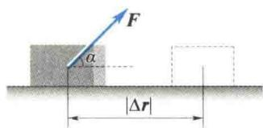
(2.23)
图2.17 恒力的功
按矢量内积的定义,式(2.23)可写为
$$
W = F \cdot \Delta r\tag{2.24}
$$
即恒力的功等于力与质点位移的内积(或称标量积).
功是标量, 它只有大小, 没有方向. 功的正负由 $\alpha$ 决定. 当 $\alpha > \frac{\pi}{2}$ 时, 功为负值, 此时说某力做负功, 或说克服某力做功; 当 $\alpha < \frac{\pi}{2}$ 时, 功为正值, 此时说某力做正功; 当 $\alpha = \frac{\pi}{2}$ 时, 功值为零, 此时说某力不做功, 如物体做曲线运动时法向力就不做功. 另外, 因为位移的值与参考系有关, 所以功值是一个相对量.
  
变力的功
如果物体受到变力作用或做曲线运动，上面所讨论的功的计算公式就不能直接套用。但如果将运动的轨迹曲线分割成许多个足够小的位移元 $\mathrm{d}r$ ，使得每段位移元 $\mathrm{d}r$ 中，作用在质点上的力 $F$ 都能看成恒力（见图2.18），则力 $F$ 在这段位移元上所做的元功为
$$
\mathrm{d} W = \boldsymbol {F} \cdot \mathrm{d} \boldsymbol {r}
$$
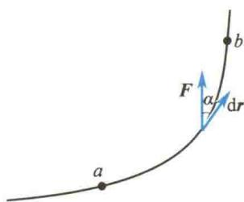  
图2.18 变力的功
力 F 在轨迹 ab 上所做的总功就等于各小段上元功的代数和, 即
$$
W = \int_ {a} ^ {b} \boldsymbol {F} \cdot \mathrm{d} \boldsymbol {r} = \int_ {a} ^ {b} F \cos \alpha | \mathrm{d} \boldsymbol {r} | = \int_ {a} ^ {b} F _ {\tau} \mathrm{d} s\tag{2.25}
$$
式中， $ds = |dr|$ ; $F_{\tau}$ 是力 F 在位移元 dr 方向上的投影， $F_{\tau} = F \cos \alpha$ . 式(2.25)是计算变力做功的一般公式. 在直角坐标系中，因为
$$
\begin{array}{l} \boldsymbol {F} = F _ {x} \boldsymbol {i} + F _ {y} \boldsymbol {j} + F _ {z} \boldsymbol {k} \\ \mathrm{d} \boldsymbol {r} = \mathrm{d} x \boldsymbol {i} + \mathrm{d} y \boldsymbol {j} + \mathrm{d} z \boldsymbol {k} \end{array}
$$
所以式 $(2.25)$ 可表示为
$$
\begin{array}{r l} W & = \int_ {a} ^ {b} (F _ {x} \mathrm{d} x + F _ {y} \mathrm{d} y + F _ {z} \mathrm{d} z) \\ & = \int_ {(x _ {0}, y _ {0}, z _ {0})} ^ {(x, y, z)} (F _ {x} \mathrm{d} x + F _ {y} \mathrm{d} y + F _ {z} \mathrm{d} z) \end{array}\tag{2.26}
$$
功也可以用图解法计算. 以路程 s 为横坐标, $F_{\tau}$ 为纵坐标, 根据 F 随路程变化而变化的关系所描绘的曲线称为示功图. 在图 2.19 中, 阴影部分的面积等于力 $F_{\tau i}$ 在$ds_{i}$ 上做的元功. 曲线与边界线所围的面积就是变力 F 在整个路程上所做的总功. 用示功图求功较为直接、方便, 所以工程上常采用此方法.
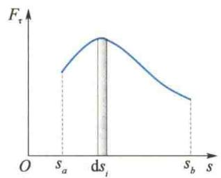  
图2.19 变力做功的示功图

### 2. 功率

力在单位时间内做的功称为功率. 设力 F 在 $\Delta t$ 时间内做的功为 $\Delta W$ ，则这段时间内力 F 的平均功率为
$$
\overline {{{P}}} = \frac {\Delta W}{\Delta t}
$$
当 $\Delta t \rightarrow 0$ 时，则某一时刻力 F 的瞬时功率为
$$
P = \lim _ {\Delta t \rightarrow 0} \frac {\Delta W}{\Delta t} = \frac {\mathrm{d} W}{\mathrm{d} t} = F \cdot v\tag{2.27}
$$
即瞬时功率等于力和速度的内积.
在国际单位制中,功的单位名称是焦耳,简称焦,符号是J;功率的单位名称是瓦特,简称瓦,符号是W.1 W = 1 J/s.

### 3.保守力的功

下面通过分析重力、万有引力、弹性力做功的特点，引入保守力的概念.

### 1) 重力的功

这里讨论的重力是指地面附近几百米高度范围内的重力,故可视为恒力.
设质量为 m 的质点在重力作用下由 A 点沿任意路径移到 B 点，如图 2.20(a) 所示，选取地面为坐标原点，z 轴垂直于地面，向上为正。重力只有 z 轴方向的分量，即 $F_{z} = -mg$ ，应用式(2.26)，有
$$
W = \int_ {z _ {0}} ^ {z} F _ {z} \mathrm{d} z = \int_ {z _ {0}} ^ {z} - m g \mathrm{d} z = - (m g z - m g z _ {0})\tag{2.28}
$$
式(2.28)表明,重力的功只由质点相对于地面的始末位置 $z_{0}$ 和z决定,而与所通过的路径无关.

### 2) 万有引力的功

考虑质量分别为 m 和 M 的两个质点，质点 m 相对于质点 M 的初位置为 $r_{A}$ ，末位置为 $r_{B}$ ，如图 2.20(b) 所示。质点 m 受到质点 M 的万有引力的矢量式为
$$
\pmb {F} = - G \frac {m M}{r ^ {2}} \pmb {r} _ {0}
$$
式中， $r_{0}$ 表示质点 m 相对于质点 M 的位矢方向的单位矢量。则万有引力的元功为
$$
\mathrm{d} W = \boldsymbol {F} \cdot \mathrm{d} \boldsymbol {r} = - G \frac {m M}{r ^ {2}} \boldsymbol {r} _ {0} \cdot \mathrm{d} \boldsymbol {r}
$$
因为矢量模的平方等于矢量自身的标积, 即 $\left|A\right|^{2}=A\cdot A$ , 所以
而
故有
同理，有
$$
\begin{array}{r l} \mathrm{d} (A ^ {2}) & = \mathrm{d} (\boldsymbol {A} \cdot \boldsymbol {A}) = 2 \boldsymbol {A} \cdot \mathrm{d} \boldsymbol {A} \\ & \mathrm{d} (A ^ {2}) = 2 A \mathrm{d} A \\ & \boldsymbol {A} \cdot \mathrm{d} \boldsymbol {A} = A \mathrm{d} A \\ & \boldsymbol {r} \cdot \mathrm{d} \boldsymbol {r} = r \mathrm{d} r \end{array}\tag{2.29}
$$
又考虑到 $r_0 = \frac{r}{r}$ ，所以
$$
\mathrm{d} W = - G \frac {m M}{r ^ {2}} \mathrm{d} r
$$
于是质点 m 由 A 点移到 B 点时, 万有引力做的功为
$$
W = \int_ {r _ {A}} ^ {r _ {B}} - G \frac {m M}{r ^ {2}} \mathrm{d} r = - \left[ \left(- G \frac {m M}{r _ {B}}\right) - \left(- G \frac {m M}{r _ {A}}\right) \right]\tag{2.30}
$$
这说明万有引力的功也只与始末位置有关，而与具体的路径无关.
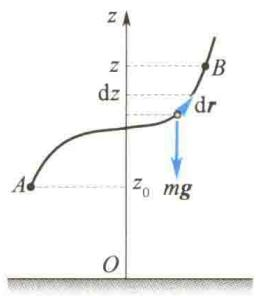  
(a) 重力的功
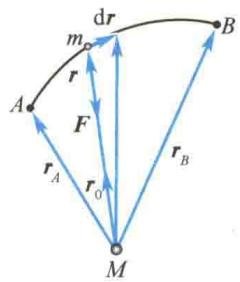  
(b) 万有引力的功  
图2.20 重力与万有引力的功

### 3) 弹性力的功

如图 2.21 所示,选取弹簧自然伸长处为坐标原点,则当弹簧形变量为 x 时,弹簧对质点的弹性力为
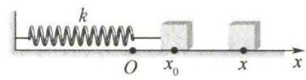  
图2.21 弹性力的功
$$
F = - k x
$$
式中，负号表示弹性力的方向总是指向弹簧的平衡位置，即坐标原点. $k$ 为弹簧的刚度系数，单位是 $\mathrm{N / m}$ 因为作用力只有 $x$ 轴分量，故由式(2.26）可得
$$
W = \int_ {x _ {0}} ^ {x} F _ {x} \mathrm{d} x = \int_ {x _ {0}} ^ {x} - k x \mathrm{d} x = - \left(\frac {1}{2} k x ^ {2} - \frac {1}{2} k x _ {0} ^ {2}\right)\tag{2.31}
$$
这说明弹性力的功只与始末位置有关,而与弹簧的中间形变过程无关.
综上所述，重力、万有引力、弹性力的功的共同特点是，它们都只与物体的始末位置有关，而与具体路径无关。或者说，当在这些力作用下的物体沿任意闭合路径绕行一周时，它们的功值均为零。在物理学中，除了这些力，静电力、分子力等也具有这种特性，把具有这种特性的力统称为保守力。保守力可用下面的数学表达式来定义，即
$$
\oint_ {l} \pmb {F} _ {\mathrm{保}} \cdot \mathrm{d} \pmb {r} = 0\tag{2.32}
$$
如果某力的功与路径有关,或该力沿任意闭合路径的功值不等于零,则称这种力为非保守力,如摩擦力、爆炸力等.
在离水面的高度为 H 的岸上,有人用大小不变的力 F 拉绳使船靠岸,如图 2.22 所示.求船从离岸 $x_{1}$ 处移到 $x_{2}$ 处的过程中,力 F 对船所做的功.

<Solution title="解">
由题意知,虽然力的大小不变,但其方向在不断变化,故仍然是变力做功.
如图 2.22 所示, 以岸边为坐标原点, 向左为 x 轴正方向, 则力 F 在坐标为 x 处的任意一小段位移元 dx 上所做的元功为
$$
\begin{array}{r l} \mathrm{d} W & = F \cdot \mathrm{d} x = F \cos \alpha (- \mathrm{d} x) \\ & = - F \frac {x}{\sqrt {x ^ {2} + H ^ {2}}} \mathrm{d} x \end{array}
$$
由于 $x_{1} > x_{2}$ ，所以力 $\pmb{F}$ 做正功.
$$
\begin{array}{r l} W & = \int_ {x _ {1}} ^ {x _ {2}} - F \frac {x \mathrm{d} x}{\sqrt {x ^ {2} + H ^ {2}}} \\ & = F (\sqrt {H ^ {2} + x _ {1} ^ {2}} - \sqrt {H ^ {2} + x _ {2} ^ {2}}) \end{array}
$$
于是
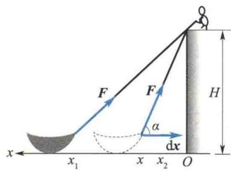  
图2.22 例2.9图
</Solution>

<Example title="例 2.10">
一质点所受外力 $F = (y^{2} - x^{2})i + 3xyj$ (SI)，求质点由点(0,0)运动到点(2,4)的过程中力 $\pmb{F}$ 所做的功：（1）先沿 $x$ 轴由点(0,0)运动到点(2,0)，再平行于 $y$ 轴由点(2,0)运动到点(2,4)；(2)沿连接(0,0)、(2,4)两点的直线运动；(3)沿抛物线 $y = x^{2}$ 由点(0,0)运动到点(2,4).

<Solution title="解">
（1）由点 $(0,0)$ 沿 x 轴运动到点 $(2,0)$ ，此时 y=0，dy=0，所以
$$
W _ {1} = \int_ {0} ^ {2} F _ {x} \mathrm{d} x = \int_ {0} ^ {2} (- x ^ {2}) \mathrm{d} x = - \frac {8}{3} \mathrm{J}
$$
(2) 因为由坐标原点到点 $(2,4)$ 的直线方程为 y = 2x，所以
由点(2,0)平行于 y 轴运动到点(2,4)，此时 x=2，dx=0，故
$$
\begin{array}{r l} W & = \int_ {0} ^ {2} F _ {x} \mathrm{d} x + \int_ {0} ^ {4} F _ {y} \mathrm{d} y \\ & = \int_ {0} ^ {2} (4 x ^ {2} - x ^ {2}) \mathrm{d} x + \int_ {0} ^ {4} \frac {3}{2} y ^ {2} \mathrm{d} y = 4 0 \mathrm{J} \end{array}
$$
$$
W _ {2} = \int_ {0} ^ {4} F _ {y} \mathrm{d} y = \int_ {0} ^ {4} 6 y \mathrm{d} y = 4 8 \mathrm{J}
$$
$$
W = W _ {1} + W _ {2} = 4 5 \frac {1}{3} \mathrm{J}
$$
(3) 因为 $y = x^{2}$ ，所以
$$
W = \int_ {0} ^ {2} (x ^ {4} - x ^ {2}) \mathrm{d} x + \int_ {0} ^ {4} 3 y ^ {\frac {3}{2}} \mathrm{d} y = \frac {6 3 2}{1 5} \mathrm{J}
$$
可见题中所示力是非保守力.
</Solution>
</Example>

## 2.4.2 动能 动能定理

下面讨论力对物体做功后,物体的运动状态将发生的变化.
设有一质点沿任一曲线运动. 在曲线上任取一位移元 $\mathrm{d}r$ , 则力 $F$ 在这段位移元上的功为
$$
\mathrm{d} W = \boldsymbol {F} \cdot \mathrm{d} \boldsymbol {r} = \frac {\mathrm{d} (m \boldsymbol {v})}{\mathrm{d} t} \cdot \boldsymbol {v} \mathrm{d} t = m \boldsymbol {v} \cdot \mathrm{d} \boldsymbol {v}
$$
与 $r \cdot dr$ 类似[见式(2.29)]，可得
$$
\boldsymbol {v} \cdot \mathrm{d} \boldsymbol {v} = v \mathrm{d} v
$$
所以
$$
\mathrm{d} W = m v \mathrm{d} v = \mathrm{d} \left(\frac {1}{2} m v ^ {2}\right)
$$
若质点由初位置1处运动到末位置2处，其速率由 $v_{1}$ 增至 $v_{2}$ ，则有
$$
W = \int_ {1} ^ {2} \mathrm{d} W = \int_ {v _ {1}} ^ {v _ {2}} \mathrm{d} \left(\frac {1}{2} m v ^ {2}\right) = \frac {1}{2} m v _ {2} ^ {2} - \frac {1}{2} m v _ {1} ^ {2}
$$
即
$$
\int_ {1} ^ {2} \boldsymbol {F} \cdot \mathrm{d} \boldsymbol {r} = \frac {1}{2} m v _ {2} ^ {2} - \frac {1}{2} m v _ {1} ^ {2}\tag{2.33}
$$
由式(2.33)可知,如果把 $\frac{1}{2}mv^{2}$ 看作一个独立的物理量,就可发现 $\frac{1}{2}mv^{2}$ 是与力在空间上的积累效应相联系的. $\frac{1}{2}mv^{2}$ 称为质点的动能.动能是标量,是与参考系的选择有关的相对量.如果令 $E_{k}=\frac{1}{2}mv^{2}$ ,则式(2.33)又可写成
$$
W _ {1 - 2} = E _ {\mathrm{k2}} - E _ {\mathrm{k1}}\tag{2.34}
$$
式(2.34)说明外力对质点所做的功等于质点动能的增量.式(2.33)就是质点动能定理的数学表达式.

<Example title="例 2.11">
一质量为 $10\mathrm{kg}$ 的物体沿 $x$ 轴无摩擦地滑动， $t = 0$ 时物体静止于原点。（1）物体在力 $F = 3 + 4t(\mathrm{N})$ 的作用下运动了 $3\mathrm{s}$ 时，它的速度增至多大？（2）物体在力 $F = 3 + 4x(\mathrm{N})$ 的作用下移动了 $3\mathrm{m}$ 时，它的速度增至多大？

<Solution title="解">
（1）由动量定理 $\int_0^t F\mathrm{d}t = mv$ ，得
(2) 由动能定理 $\int_{0}^{x} F \mathrm{~d} x = \frac{1}{2} m v^2$ ，得
$$
v = \int_ {0} ^ {t} \frac {F}{m} \mathrm{d} t = \int_ {0} ^ {3} \frac {3 + 4 t}{1 0} \mathrm{d} t = 2. 7 \mathrm{m/s}
$$
$$
\begin{array}{r l} v & = \sqrt {\int_ {0} ^ {x} \frac {2 F}{m} \mathrm{d} x} = \sqrt {\int_ {0} ^ {3} \frac {2 (3 + 4 x)}{1 0} \mathrm{d} x} \\ & = 2. 3 \mathrm{m/s} \end{array}
$$
</Solution>
</Example>

## 2.4.3 势能

在第1章已指出，描述质点机械运动状态的参量是位矢 $r$ 和速度 $\pmb{v}$ 。对应于状态参量 $\pmb{v}$ 引入了动能 $E_{\mathrm{k}} = E_{\mathrm{k}}(v)$ ，那么对应于状态参量 $r$ 可引入什么样的能量形式呢？下面讨论这个问题。
势能的定义和意义
在前面的讨论中已指出,保守力的功与质点运动的路径无关,仅取决于相互作用的两个物体的初态和末态的相对位置.如重力、万有引力、弹性力的功,其值分别为
$$
\begin{array}{r l} & W _ {\text {重}} = - (m g z - m g z _ {0}) \\ & W _ {\text {引}} = - \left[ \left(- G \frac {m M}{r}\right) - \left(- G \frac {m M}{r _ {0}}\right) \right] \\ & W _ {\text {弹}} = - \left(\frac {1}{2} k x ^ {2} - \frac {1}{2} k x _ {0} ^ {2}\right) \end{array}
$$
可以看出，保守力做功的结果总是等于一个由相对位置决定的函数增量的负值。而功总是与能量的改变量相联系。因此，上述由相对位置决定的函数必定是某种能量的函数形式。现在将其称为势能函数，用 $E_{p}$ 表示。即
$$
\int_ {1} ^ {2} \pmb {F} _ {\mathrm{保}} \bullet \mathrm{d} \pmb {r} = - (E _ {\mathrm{p}} - E _ {\mathrm{p0}}) = - \Delta E _ {\mathrm{p}}\tag{2.35}
$$
式(2.35)定义的只是势能之差,而不是势能函数本身.为了定义势能函数,可以将式(2.35)的定积分改写为不定积分,即
$$
E _ {\mathrm{p}} = - \int F _ {\mathrm{保}} \cdot \mathrm{d} r + c\tag{2.36}
$$
式中，c 是一个由系统的零势能点决定的积分常数.
式(2.36)表明只要已知一种保守力的力函数,即可求出与之相关的势能函数.例如,已知万有引力的力函数为
$$
\mathbf {F} = - G \frac {m M}{r ^ {2}} \mathbf {r} _ {0}
$$
  
潮汐
那么由式(2.36)知,与万有引力相对应的势能函数为
$$
E _ {\mathrm{p} \text {引}} = - \int - G \frac {m M}{r ^ {2}} r _ {0} \bullet \mathrm{d} r = - G \frac {m M}{r} + c
$$
如果令 $r \to \infty$ 时 $E_{\mathrm{p}}$ 引 $= 0$ ，则 $c = 0$ .即取无穷远处为引力势能的零势能点时，引力势能函数为
$$
E _ {\mathrm{p引}} = - G \frac {m M}{r}\tag{2.37}
$$
读者自己可以证明:若取离地面的高度 z = 0 的点为重力势能的零势能点(此时 c = 0),则重力势能函数为
$$
E _ {\mathrm{p} \text {重}} = m g z\tag{2.38}
$$
对于弹簧的弹性力, 若取弹簧自然伸长处为坐标原点和弹性势能的零势能点 (此时 c = 0), 则弹性势能函数为
$$
E _ {\mathrm{p} \mathrm{弹}} = \frac {1}{2} k x ^ {2}\tag{2.39}
$$
有关势能的几点讨论如下.
（1）势能是相对量，其值与零势能点的选择有关。零势能点的选择不同，式(2.36)中常数 $c$ 就不同。上面的讨论说明，对于给定的保守力的力函数，只要选取适当的零势能点，总可使 $c = 0$ 。在一般情况下，这时的势能函数较为简洁，如式(2.37)、式(2.38)、式(2.39)所示。需要说明的是，并非在任何情况下，式(2.36)中的积分常数都一定能为零，这一点在静电场中尤为突出。
（2）势能函数的形式与保守力的性质密切相关，对应于一种保守力的函数就可引进一种相关的势能函数。因此，势能函数的形式就不可能像动能那样有统一的表达式。
（3）势能由以保守力形式相互作用的物体系统所共有.例如，式(2.37)所表示的实际上是物体 $m, M$ 互以万有引力作用的结果；式(2.38)所表示的实际上是物体与地球互以重力作用的结果；式(2.39)所表示的是物体与弹簧以弹性力相互作用的结果.在平常的叙述中，说某物体具有多少势能，这只是一种简便叙述，不能认为势能是某一物体所有.
（4）由于势能由相互以保守力作用的系统所共有，因此式(2.35)的物理意义可解释为：一对保守力的功等于相关势能增量的负值。因此，当保守力做正功时，系统势能减少；当保守力做负功时，系统势能增加。

## \*2.4.4 势能曲线

将势能随相对位置变化的函数关系用一条曲线描绘出来,就是势能曲线.图2.23(a)、(b)、(c)分别给出的就是重力势能、弹性势能及引力势能的势能曲线.
势能曲线可提供多种信息.
(1) 质点在轨迹上任意位置时,质点系所具有的势能值可由势能曲线读出.
(2) 势能曲线上任意一点处切线的斜率 $\left(\mathrm{d}E_{\mathrm{p}}/\mathrm{d}l\right)$ 的负值, 表示质点在该处所受的保守力.
设有一保守系统，其中一质点沿 $x$ 轴方向做一维运动，则由式(2.36)有
$$
\mathrm{d} E _ {\mathrm{p}} = - F (x) \mathrm{d} x
$$
故可知
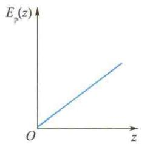  
(a) 重力势能的势能曲线
$$
F (x) = - \frac {\mathrm{d} E _ {\mathrm{p}}}{\mathrm{d} x}\tag{2.40}
$$
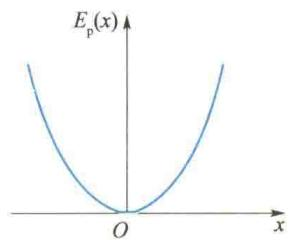  
(b) 弹性势能的势能曲线  
图2.23 势能曲线
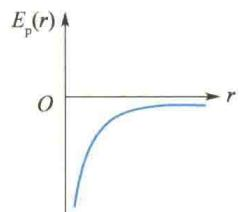  
(c) 引力势能的势能曲线
势能函数取极值时，势能曲线的切线斜率为零，物体在相应位置受力为零，这些位置即为平衡位置。进一步的理论指出，势能曲线的极大值点是不稳定平衡位置，势能曲线的极小值点是稳定平衡位置，如图2.24所示[图2.24(c)表示随遇平衡位置]。
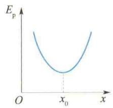  
(a) 稳定平衡位置
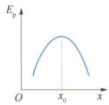  
(b) 不稳定平衡位置
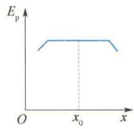  
(c) 随遇平衡位置  
图 2.24 势能曲线的极值点与平衡位置的对应关系
若质点做三维运动，则有
$$
\boldsymbol {F} = F _ {x} \boldsymbol {i} + F _ {y} \boldsymbol {j} + F _ {z} \boldsymbol {k} = - \left(\frac {\partial E _ {\mathrm{p}}}{\partial x} \boldsymbol {i} + \frac {\partial E _ {\mathrm{p}}}{\partial y} \boldsymbol {j} + \frac {\partial E _ {\mathrm{p}}}{\partial z} \boldsymbol {k}\right)\tag{2.41}
$$
这是直角坐标系中由势能函数求保守力的一般式.

<Example title="例 2.12">
一刚度系数为 k 的轻弹簧，下悬一质量为 m 的物体而处于静止状态。今以该平衡位置为坐标原点，并作为系统的重力势能和弹性势能的零势能点，那么当物体 m 偏离平衡位置的位移为 x 时，整个系统的总势能为多少？

<Solution title="解">
题中所指系统是由地球、弹簧、物体 m 所组成的系统. 为便于叙述, 以弹簧原长处 (即自然伸长处) 为坐标原点 $O'$ , 并以向下为 x 轴正方向 (见图 2.25), 则当物体 m 位于平衡位置 O 点时, 其坐标值为
$$
x _ {1} ^ {\prime} = \frac {m g}{k}
$$
由势能函数的定义可知,弹性势能为
$$
E _ {\mathrm{p弹}} = \frac {1}{2} k x ^ {\prime 2} + c
$$
根据题意,物体 m 在 O 点时 $E_{p弹} = 0$ , 所以 $c = -\frac{1}{2} k x_{1}^{\prime 2}$ . 即以 O 点为弹性势能的零势能点时, 系统的弹性势能表达式为
$$
E _ {\mathrm{p} \mathrm{弹}} = \frac {1}{2} k x ^ {\prime 2} - \frac {1}{2} k x _ {1} ^ {\prime 2}
$$
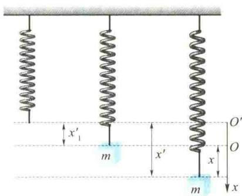  
图2.25 例2.12图
当物体 m 到 O 点的距离为 x 时，它相对于 $O'$ 点的坐标 $x' = x + x_{1}'$ ，所以此时系统的弹性势能为
$$
E _ {\mathrm{p} \mathrm{弹}} = \frac {1}{2} k (x + x _ {1} ^ {\prime}) ^ {2} - \frac {1}{2} k x _ {1} ^ {\prime 2}
$$
$$
= \frac {1}{2} k x ^ {2} + k x _ {1} ^ {\prime} x = \frac {1}{2} k x ^ {2} + m g x
$$
同时，题中又设 O 点处重力势能为零，故 x 处的重力势能为
$$
= \frac {1}{2} k x ^ {2}
$$
$$
E _ {\mathrm{p} \text {重}} = - m g x
$$
则总势能为
$$
E _ {\mathrm{p}} = E _ {\mathrm{p} \mathrm{弹}} + E _ {\mathrm{p} \mathrm{重}} = \frac {1}{2} k x ^ {2} + m g x - m g x
$$
这说明，对于竖直悬挂的弹簧，若以平衡位置为坐标原点及重力势能、弹性势能的零势能点，则此系统的总势能（或称系统的振动势能）为 $\frac{1}{2} kx^2$ 。这种处理方法在讨论弹簧振子的简谐振动能量时极为方便。
</Solution>
</Example>

## 2.4.5 质点系的动能定理与功能原理

设一质点系有 $n$ 个质点，现考察第 $i$ 个质点.由2.3节可知，质点 $i$ 所受合力为 $\pmb{F}_{i\text{外}} + \sum_{j=1, j \neq i}^{n} f_{ji}$ ，则对质点 $i$ 应用动能定理有
  
质点系的动能
定理与功能
原理
$$
\int_ {1} ^ {2} \pmb {F} _ {i \text {外}} \bullet \mathrm{d} \pmb {r} _ {i} + \int \sum_ {j = 1, j \neq i} ^ {n} \pmb {f} _ {j i} \bullet \mathrm{d} \pmb {r} _ {i} = \frac {1}{2} m _ {i} v _ {i 2} ^ {2} - \frac {1}{2} m _ {i} v _ {i 1} ^ {2}
$$
对所有质点求和可得
$$
\sum_ {i = 1} ^ {n} \int_ {1} ^ {2} \pmb {F} _ {i \text {外}} \bullet \mathrm{d} \pmb {r} _ {i} + \sum_ {i = 1} ^ {n} \int_ {j = 1, j \neq i} ^ {\sum_ {j = 1, j \neq i} ^ {n}} \pmb {f} _ {j i} \bullet \mathrm{d} \pmb {r} _ {i} = \sum_ {i = 1} ^ {n} \frac {1}{2} m _ {i} v _ {i 2} ^ {2} - \sum_ {i = 1} ^ {n} \frac {1}{2} m _ {i} v _ {i 1} ^ {2}\tag{2.42}
$$
式 $(2.42)$ 便是质点系的动能定理的数学表达式.

<Note>
在式(2.42)中, 不能先求合力, 再求合力的功. 这是因为在质点系内各质点的位移 $dr_{i}$ 是不同的, 不能作为公因子提到求和符号之外. 因此, 在计算质点系的功时, 只能先求每个力的功, 再对这些功求和.
在质点系内, 内力总是成对出现. 可以把内力分为保守内力和非保守内力. 于是内力的功可分为两部分, 即保守内力的功和非保守内力的功, 现分别用 $W_{内保}$ 和 $W_{内非}$ 表示. 如果再用 $W_{外}$ 表示质点系外力的功, 用 $E_{k}$ 表示质点系的总动能, 则式(2.42) 可表示为
$$
W _ {\mathrm{外}} + W _ {\mathrm{内非}} + W _ {\mathrm{内保}} = E _ {\mathrm{k2}} - E _ {\mathrm{k1}}\tag{2.43}
$$
即质点系总动能的增量等于外力的功、质点系内保守内力的功和质点系内非保守内力的功三者之和，这称为质点系的动能定理.
考虑到一对保守内力的功之和等于相关势能增量的负值,即有 $W_{内保} = -\Delta E_{p} = -(E_{p2} - E_{p1})$ (式中 $E_{p}$ 表示系统内各种势能的和),则式(2.43)又可进一步表示成
$$
W _ {\mathrm{外}} + W _ {\mathrm{内非}} = (E _ {\mathrm{k2}} - E _ {\mathrm{k1}}) + (E _ {\mathrm{p2}} - E _ {\mathrm{p1}})\tag{2.44}
$$
如果令
$$
E = E _ {\mathrm{k}} + E _ {\mathrm{p}}\tag{2.45}
$$
表示系统的机械能,则有
$$
W _ {\mathrm{外}} + W _ {\mathrm{内非}} = E _ {2} - E _ {1}\tag{2.46}
$$
这就是质点系的功能原理的数学表达式. 即系统机械能的增量等于外力所做的功与非保守内力所做的功之和.
顺便指出,由于势能的大小与零势能点的选择有关,因此在运用功能原理解题时,应先指明系统的范围,并确定零势能点.
</Note>

<Example title="例 2.13">
一轻弹簧的一端系于固定斜面的上端，另一端连着质量为 $m$ 的物块（见图2.26），物块与斜面的滑动摩擦系数为 $\mu$ ，弹簧的刚度系数为 $k$ ，斜面倾角为 $\theta$ ，今将物块由弹簧的自然长度拉伸 $l$ 后由静止释放，物块开始运动，物块第一次静止在什么位置上？

<Solution title="解">
以弹簧、物块、地球为系统，取弹簧自然伸长处为坐标原点，沿斜面向下为 x 轴正方向，且以坐标原点为弹性势能和重力势能的零势能点，则由功能原理[式(2.46)]，在物块向上滑至 x 处时，有
$$
\left(\frac {1}{2} m v ^ {2} + \frac {1}{2} k x ^ {2} - m g x \sin \theta\right) - \left(\frac {1}{2} k l ^ {2} - m g l \sin \theta\right)
$$
$$
= - \mu m g \cos \theta (l - x)
$$
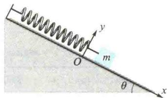  
图2.26 例2.13图
物块静止位置与 $v = 0$ 对应，故有
解得
$$
\frac {1}{2} k x ^ {2} - m g x (\sin \theta + \mu \cos \theta) +
$$
$$
x = \frac {2 m g (\sin \theta + \mu \cos \theta)}{k} - l
$$
$$
m g l (\sin \theta + \mu \cos \theta) - \frac {1}{2} k l ^ {2} = 0
$$
方程的另一根 x = l，即初始位置，舍去。
</Solution>
</Example>

## 2.4.6 机械能守恒定律

由功能原理[式(2.46)]可知：
若 $W_{外} + W_{内非} > 0$ ，则系统的机械能增加；
若 $W_{外} + W_{内非} < 0$ ，则系统的机械能减少；
若 $W_{外} + W_{内非} = 0$ ，则系统的机械能保持不变。
现考虑 $W_{外} = 0$ 的情况.
若 $W_{内非} > 0$ ，则系统的机械能增加。如炸弹爆炸，人从静止开始走动，就属于这种情形（这里伴随有其他形式能量转化为机械能的过程）。
若 $W_{内非} < 0$ ，则系统的机械能减少。如克服摩擦力做功，这样的非保守力常称为耗散力（这时伴随有机械能转化为其他形式能量的过程）。
若 $W_{内非} = 0$ ，则系统的机械能守恒。
由以上分析可知,当系统所受合外力所做的功及非保守内力所做的功均为零时,系统的机械能保持不变.这就是机械能守恒定律.
当系统的机械能守恒时,有
或
即
$$
\begin{array}{r l} & E _ {\mathrm{k1}} + E _ {\mathrm{p1}} = E _ {\mathrm{k2}} + E _ {\mathrm{p2}} \\ & E _ {\mathrm{p2}} - E _ {\mathrm{p1}} = - (E _ {\mathrm{k2}} - E _ {\mathrm{k1}}) \\ & \Delta E _ {\mathrm{p}} = - \Delta E _ {\mathrm{k}} \end{array}\tag{2.47}
$$
(2.48)
这表明系统势能的增量等于系统动能减少的量.

## 2.4.7 能量守恒定律

上面的讨论已指出，当 $W_{\text{外}} = 0, W_{\text{内非}} \neq 0$ 时，虽然系统与外界无机械能的交换，但系统的机械能仍不守恒。那么，系统增加（或减少）的机械能是从何处来的（或向何处去了）呢？现在讨论 $W_{\text{外}} = 0$ 的孤立系统情况。
大量事实证明,在孤立系统内,若系统的机械能发生了变化,必然伴随着等值的其他形式能量(如内能、电磁能、化学能、生物能及核能等)的增加或减少.这说明能量既不能消失也不会创生,只能从一种形式转化成另一种形式.也就是说,在一个孤立系统内,不论发生何种变化过程,各种形式的能量之间怎样转化,系统的总能量都将保持不变.这就是能量守恒定律.
  
时空对称性和守恒定律
能量守恒定律是自然界中的普遍规律. 它不仅适用于物质的机械运动、热运动、电磁运动、核子运动等物理运动形式, 而且适用于化学运动、生物运动等运动形式. 由于运动是物质的存在形式, 而能量又是物质运动的量度, 因此, 能量守恒定律的深刻含义是, 运动既不能消失也不能创造, 它只能由一种形式转化为另一种形式. 能量的守恒在数量上体现了运动的守恒.

<Example title="例 2.14">
在光滑的水平台面上放有质量为 M 的沙箱，一颗从左方飞来的质量为 m 的子弹从沙箱左侧击入，在沙箱中前进一段距离 l 后停止。在这段时间内沙箱向右运动的距离为 $\xi$ ，此后沙箱带着子弹匀速运动。求此过程中内力所做的功。（假定子弹所受阻力为一恒力）

<Solution title="解">
如图 2.27 所示, 设子弹对沙箱的作用力为 $f'$ , 沙箱的位移大小为 $\xi$ ; 沙箱对子弹的作用力为 f. 子弹的位移大小为 $\xi + l, f = -f'$ . 则这一对内力做的功为
功之和不为零，它等于子弹与沙箱组成的系统的机械能的损失。损失的机械能转化为热能。
$$
W = - f (\xi + l) + f ^ {\prime} \xi = - f l \neq 0
$$
说明 沙箱对子弹做的功 $-f(\xi+l)$ 与子弹对沙箱做的功 $f'\xi=-f\xi$ 两者不相等；而这一对内力做的
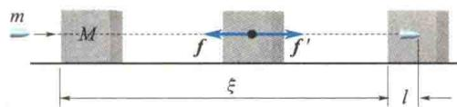  
图2.27 例2.14图
关于一对内力做的功之和的一般证明：
考虑质点系内第 $i$ 个质点和第 $j$ 个质点，设质点 $j$ 对质点 $i$ 的作用力为 $\mathbf{F}_{ji}$ ，质点 $i$ 对质点 $j$ 的作用力为 $\mathbf{F}_{ij}$ 。当 $i$ 和 $j$ 两个质点运动时，这一对作用与反作用内力均要做功。这两个力所做的元功之和应为
$$
\mathrm{d} W = \boldsymbol {F} _ {j i} \cdot \mathrm{d} \boldsymbol {r} _ {i} + \boldsymbol {F} _ {i j} \cdot \mathrm{d} \boldsymbol {r} _ {j}
$$
由 $F_{ij} = -F_{ji}$ 可以得到
$$
\mathrm{d} W = \boldsymbol {F} _ {j i} \cdot (\mathrm{d} \boldsymbol {r} _ {i} - \mathrm{d} \boldsymbol {r} _ {j}) = \boldsymbol {F} _ {j i} \cdot \mathrm{d} (\boldsymbol {r} _ {i} - \boldsymbol {r} _ {j}) = \boldsymbol {F} _ {j i} \cdot \mathrm{d} \boldsymbol {r} _ {i j}
$$
式中， $r_{i}$ 和 $r_{j}$ 分别为 i 和 j 两个质点对参考系坐标原点的位矢， $r_{ij}$ 是质点 i 对质点 j 的相对位矢， $dr_{i}$ 和 $dr_{j}$ 则分别是两个质点的位移元， $dr_{ij}$ 为两个质点间的相对位移元（见图 2.28）.
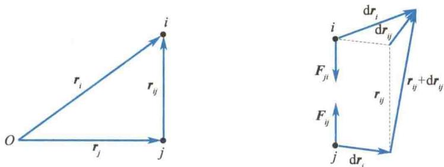  
图2.28 一对内力做功之和
由以上讨论可得到两点结论：
（1）由于 $dr_{i}$ 与 $dr_{j}$ 不一定相同， $dr_{ij}$ 一般不为零，故一对内力的元功之和一般不为零，一对内力做的功之和一般也不为零；
(2) 因相对位矢 $r_{ij}$ 及相对位移元 $dr_{ij}$ 与参考系无关, 故一对内力做的功之和也与参考系的选择无关.
</Solution>
</Example>

<Example title="例 2.15">
如图 2.29 所示, 一链条长为 l, 质量为 m, 放在桌面上并使其一部分下垂, 下垂部分的长度为 a. 设链条与桌面间的滑动摩擦系数为 $\mu$ , 令链条从静止开始运动. (1) 从开始运动到链条离开桌面的过程中, 摩擦力对链条做了多少功? (2) 链条离开桌面时的速率是多少?

<Solution title="解">
（1）建立坐标系，如图2.29所示.设某时刻链条下垂部分的长度为 $x$ ，则保留在桌面上的长度为 $l - x$ ，剩余长度所受摩擦力 $f = \mu mg(l - x) / l$ ，方向与滑动方向相反.
在链条滑落过程中,摩擦力做的功为
$$
\begin{array}{r l} W _ {f} & = \int_ {a} ^ {l} \left[ - \mu n g (l - x) \mathrm{d} x \right] / l \\ & = - \left[ \frac {\mu n g}{l} \left(l x - \frac {1}{2} x ^ {2}\right) \right] _ {a} ^ {l} \\ & = - \frac {\mu n g}{2 l} (l - a) ^ {2} \end{array}
$$
（2）链条所受重力、摩擦力两个力做功，依据动能定理，则有
$$
\sum W = W _ {G} + W _ {f} = \frac {1}{2} m v ^ {2} - \frac {1}{2} m v _ {0} ^ {2}
$$
而在滑落过程中,重力做的功为
</Solution>
</Example>

<Example title="例 2.16">
试分析航天器的三种宇宙速度.

<Solution title="解">
（1）第一宇宙速度.航天器绕地球运动所需的最小速度，称为第一宇宙速度.以地心为坐标原点，航天器在距地心 $r$ 处绕地球做圆周运动的速度为 $v_{1}$ ，则有
$$
G \frac {m M _ {\mathrm{地}}}{r ^ {2}} = m \frac {v _ {1} ^ {2}}{r}
$$
$$
v _ {1} = \sqrt {G \frac {M _ {\mathrm{地}}}{r}} = \sqrt {\frac {R ^ {2}}{r} g _ {0}}
$$
式中，m 为航天器的质量， $M_{地}$ 为地球的质量，R 为地球半径， $g_{0}=G\frac{M_{地}}{R^{2}}$ 为地球表面处的重力加速度。若 r=R，则
图2.29 例2.15图  
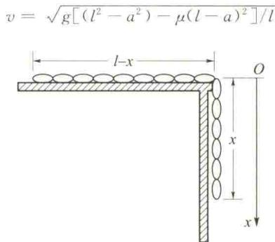
$$
v _ {1} = \sqrt {R g _ {0}} \approx 7. 9 \mathrm{km/s}
$$
这就是第一宇宙速度.
(2) 第二宇宙速度. 在地球表面处的航天器要脱离地球引力范围所需的最小速度, 称为第二宇宙速度.
$$
W _ {G} = \int_ {a} ^ {l} \frac {m g}{l} x \mathrm{d} x = \frac {m g (l ^ {2} - a ^ {2})}{2 l}
$$
又 $v_{0} = 0$ ，则
$$
\sum W = \frac {m g (l ^ {2} - a ^ {2})}{2 l} - \frac {\mu m g (l - a) ^ {2}}{2 l} = \frac {1}{2} m v ^ {2}
$$
解得链条离开桌面时的速率为
以地球和航天器为系统，航天器在地球表面处的引力势能为 $-G\frac{mM_{地}}{R}$ ，动能为 $\frac{1}{2}mv_{2}^{2}$ ，航天器能脱离地球时，地球的引力可忽略不计，系统势能为零，动能的最小量为零，由机械能守恒定律，有
$$
\begin{array}{r l} & {\frac {1}{2} m v _ {2} ^ {2} - G \frac {m M _ {\mathrm{地}}}{R} = 0} \\ & {v _ {2} = \sqrt {2 R g _ {0}} = \sqrt {2} v _ {1} \approx 1 1. 2 \mathrm{km/s}} \end{array}
$$
这就是第二宇宙速度.
（3）第三宇宙速度. 在地球表面发射的航天器, 能逃逸出太阳系所需的最小速度, 称为第三宇宙速度. 作为近似处理, 可分两步进行: 第一步, 从地球表面把航天器送出地球引力圈, 在此过程中略去太阳引力, 这一步的计算方法与分析第二宇宙速度类似, 所不同的是航天器还必须有剩余动能 $\frac{1}{2} mv^2$ , 因此有
$$
\frac {1}{2} m v _ {3} ^ {2} - G \frac {m M _ {\mathrm{地}}}{R} = \frac {1}{2} m v ^ {2}
$$
由前面的讨论知: $G \frac{mM_{地}}{R} = \frac{1}{2}mv_{2}^{2}$ ，代入上式，有 $v_{3}^{2} = v_{2}^{2} + v^{2}$ .
第二步,航天器由脱离地球引力圈的地点(近似为地球公转的轨道上)出发,继续运动,逃离太阳系,在此过程中,忽略地球的引力.以太阳为参考系,地球绕太阳的公转速度(相当于计算地球相对于太阳的第一宇宙速度)为
$$
v _ {1} ^ {\prime} = \sqrt {G \frac {M _ {\mathrm{太}}}{r _ {0}}} \approx 3 0 \: \mathrm{km/s}
$$
式中， $M_{\text{太}}$ 为太阳的质量， $r_{0}$ 为太阳中心到地球中心的距离。航天器逃离太阳引力范围所需的速度（相当于计算地球相对于太阳的第二宇宙速度）为
$$
\frac {1}{2} m v _ {2} ^ {\prime 2} - G \frac {m M _ {\mathrm{太}}}{r _ {0}} = 0
$$
$$
v _ {2} ^ {\prime} = \sqrt {\frac {2 G M _ {\mathrm{太}}}{r _ {0}}} = \sqrt {2} v _ {1} ^ {\prime} \approx 4 2. 4 \: \mathrm{km/s}
$$
为了充分利用地球的公转速度,必须使航天器在第二步开始时的速度沿公转方向,这样,在第二步开始时,航天器所需的相对地球速度为
$$
v = v _ {2} ^ {\prime} - v _ {1} ^ {\prime} = 1 2. 4 \mathrm{km/s}
$$
这就是第一步航天器所需的剩余动能所对应的速度. 因此
即
$$
\begin{array}{r l} v _ {3} ^ {2} & = v _ {2} ^ {2} + v ^ {2} = 1 1. 2 ^ {2} \mathrm{km} ^ {2} / \mathrm{s} ^ {2} + 1 2. 4 ^ {2} \mathrm{km} ^ {2} / \mathrm{s} ^ {2} \\ & = 1 6. 7 ^ {2} \mathrm{km} ^ {2} / \mathrm{s} ^ {2} \\ & v _ {3} = 1 6. 7 \mathrm{km} / \mathrm{s} \end{array}
$$
这就是第三宇宙速度.
以上三种宇宙速度仅为理论上的最小速度,没有考虑空气阻力的影响.

</Solution>
</Example>
