import Guide from '@/components/Guide.astro';
import Knowledge from '@/components/Knowledge.astro';
import Example from '@/components/Example.astro';
import Analysis from '@/components/Analysis.astro';
import Solution from '@/components/Solution.astro';
import Variant from '@/components/Variant.astro';
import Note from '@/components/Note.astro';
import Block from '@/components/Block.astro';
import Method from '@/components/Method.astro';
import Exercise from '@/components/Exercise.astro';

流体是指质量连续分布且具有流动性的质点系.一般来说,流体不具备保持原来形状的弹性.地面上的水顺沟槽弯弯曲曲地伸展并分成支流,绝无回到原来形状的可能,这就是流体的流动性.连续性是指系统由一个紧挨一个的无穷多个无穷小的流团组成.
流体力学包含许多部分,如流体静力学、水力学、气体动力学、磁流体力学、高温流体动力学、湍流理论和相对论流体动力学等.本节所介绍的用功能原理处理理想流体的方法是除流体静力学外的其他部分的基础.

## 2.5.1 理想流体

无论气体还是液体, 都是可以压缩的. 在 500 个标准大气压下, 每增加一个标准大气压, 水的体积的减少量不到原体积的两万分之一, 水银体积的减少量不到原体积的百万分之四, 所以通常不考虑液体的可压缩性. 气体的可压缩性非常明显, 譬如用不太大的力推动活塞即可使气缸中的气体明显地压缩. 但由于其良好的流动性, 因此在一定的条件下, 气体也是不易压缩的. 例如, 对一根光滑管中的气体, 当其流动速度较小时, 因流动而引起的压缩使管中气体的密度发生的变化是非常微小的. 反之, 在打喷嚏或咳嗽这类情境中, 即当气体的流速可与声速相比时, 则应考虑可压缩性. 为此定义一个马赫数 $M =$ 流速 / 声速, 若 $M^2 \ll 1$ , 则气体可视为不可压缩. 总之, 在一定问题中, 若可以不考虑流体的可压缩性, 便可将它抽象为不可压缩流体的理想模型.
中国物理学家
  
钱学森
流体流动时,会表现出或多或少的黏性,即当流体运动时,层与层之间会出现阻碍相对运动的内摩擦力.例如,河流中心的水流动较快,由于黏性,靠近岸边的水却几乎不动.在某些问题中,若流体的流动性是主要的,黏性居于次要地位,则可以认为流体完全没有黏性,这样的理想流体叫作非黏性流体.
所谓理想流体,是指不可压缩的无黏性的流体.

## 2.5.2 不可压缩流体的连续性方程

### 1. 定常流、流线和流管

流体可视为由无穷多个流体微团组成的质点系. 显然, 跟踪每个流体微团并求出它们各自的运动规律是非常困难的. 但是, 如果把注意力移到各空间点, 观察各流体微团经过这些空间点的流速, 则比较方便. 这时空间的每一点均有一定的流速矢量与之对应, 这样的空间区域称为速度场.
流体的运动在一般情况下,既与观察点的位置有关,又与观察时刻有关.在同一时刻,不同的观察点看到的流体的情况不一样,这时描述流体运动的物理量,如速度,既是位置的函数,又是时间的函数,即
$$
\boldsymbol {v} = \boldsymbol {v} (r, t)
$$
但在流体运动中,有一种简单而重要的运动,即流体的速度仅为位置的函数,而与时间无关,即 $v=v(r)$ ,这种流动称为定常流或稳定流动.例如,水龙头中的细流、水渠中的缓流、石油输送管中的石油流动,在不太长的时间内,均可看作定常流.
在定常流中，流体的运动速度只与其经过的空间位置有关，而与具体的质点无关。例如，在流体所流经的空间中取 $1,2,3,\dots$ 点，则不管流体的哪一部分体元流经 $1,2,3,\dots$ 位置，都必定以 $v_{1}$ ， $v_{2},v_{3},\dots$ 的速度运动。设 $1,2,3,\dots$ 是一些连续的点，当流体流出1点后，则必然顺次流经2、3等点，则这样的一些点的轨迹称为流线。在速度场中，作一簇曲线，使曲线上每一点的切线方向都与流体流经该点时的流速矢量一致，这样的一簇曲线称为流线。
在定常流中，流线的形状是稳定不变的。流线上每一点的速度只可能有一个方向，故流线不能相交，如图2.30(a)、(b)、(c)所示。
由于在流线上每一点的流体运动方向与流线相切，而在定常流中流线又不会相交，因此可以选取一束流线，形成一条管道，则管外的流体不会流入管内，而管内的流体也不会流出管外。把这种由流线形成的管道称为流管。
在定常流中，流管的形状与实际的管道非常相似，于是可以将管道内的流体划分为许多相邻的流管，那么研究了每个流管中流体运动的情况，就可以知道整个管道内全部流体运动的情况。因此，流管就相当于流体力学中的隔离体，如图2.30(d)所示。
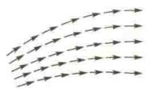  
(a)
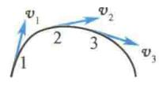  
(b)
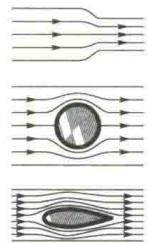  
(c)
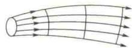  
(d)  
图 2.30 流线和流管

### 2. 不可压缩流体的连续性方程

在流体中任取一流管，在流管中任取两点1、2，过1、2两点作垂直于流管的横截面 $\Delta S_{1}$ 、 $\Delta S_{2}$ （横截面的面积亦用 $\Delta S_{1},\Delta S_{2}$ 表示），并令 $\Delta S_{1},\Delta S_{2}$ 足够小，即使得 $\Delta S_{1},\Delta S_{2}$ 面上各点的流速分别为1、2两点的流速 $\pmb{v}_{1}$ 和 $\pmb{v}_{2}$ ，如图2.31(a)所示。由于流体是不可压缩的，因此，在 $\Delta t$ 时间内通过横截面 $\Delta S_{1}$ 的流体的体积与通过横截面 $\Delta S_{2}$ 的流体的体积应该相等，即有
亦即
$$
\begin{array}{r} v _ {1} \Delta t \Delta S _ {1} = v _ {2} \Delta t \Delta S _ {2} \\ v _ {1} \Delta S _ {1} = v _ {2} \Delta S _ {2} \end{array}
$$
由于1、2两点是在流管中任取的，因此上式对任何垂直于流管的横截面 $\Delta S$ 都是正确的[见图2.31(b)]，即
$$
v \Delta S = \mathrm{恒量}
$$
该式称为连续性方程. 令 $Q = v \Delta S$ ，则 Q 称为流量，即单位时间内通过流管中某一横截面的流体体积. 上式表明：对于不可压缩的流体，通过流管各横截面的流量相等，这就是连续性原理.
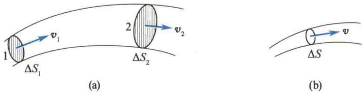  
图 2.31 连续性方程的推导
由连续性方程可以看出，同一流管中，横截面面积大的地方的流速小，而横截面面积小的地方的流速大。例如，若把整个河道看成一个流管，则可知河道狭窄处，水流湍急，而河道宽阔处，流速缓慢。流管中横截面面积小处流速大，而横截面面积小的地方也正是流线密集之处。由此可见，对于不可压缩的流体，流线密集处流速大，流线稀疏处流速小。

## 2.5.3 流体动力学的处理方法——伯努利方程

解决动力学问题有三种方法:一是突出过程的矢量性与瞬时性的牛顿运动定律;二是突出始末状态的矢量关系的动量定理与角动量定理;三是突出始末状态的标量关系的功能原理.对于流体,由于它的流动性和连续性,过程中瞬时性和矢量性相当复杂,故在处理流体力学问题时,通常采用功能原理,而伯努利方程就是功能原理在理想流体定常流中的具体表达形式.
下面在惯性系中讨论理想流体在重力作用下做定常流的情况. 如图 2.32 所示, 在理想流体内某一细流管中任取微团 ab, 其自位置 1 运动至位置 2, 形状发生变化, 在 1 和 2 处的长度各为 $\Delta l_{1}$ 和 $\Delta l_{2}$ , 底面积各为 $\Delta S_{1}$ 和 $\Delta S_{2}$ . 由于不可压缩, 密度 $\rho$ 不变, 微团 ab 的质量 $m = \rho \Delta l_{1} \Delta S_{1} = \rho \Delta l_{2} \Delta S_{2}$ . 另外, 微团 ab 的体积相对于流体流过的空间很小, 微团范围内各点的压强和流速也可认为是均匀的, 1 和 2 处的压强与流速分别用 $p_{1}$ 与 $p_{2}$ 、 $v_{1}$ 与 $v_{2}$ 表示. 设微团始末位置距重力势能的零势能点的高度分别为 $h_{1}$ 和 $h_{2}$ . 由于考虑到微团 ab 本身的线度和它所经过的路径相比非常小, 在应用动力学原理时可将它视为质点. 现应用质点系功能原理, 有
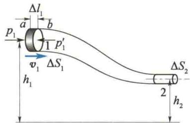
$$
W _ {\mathrm{外}} + W _ {\mathrm{内非}} = (E _ {\mathrm{k}} + E _ {\mathrm{p}}) - (E _ {\mathrm{k} _ {0}} + E _ {\mathrm{p} _ {0}})
$$
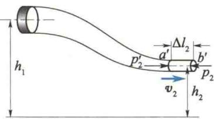  
图2.32 伯努利方程的推导
微团的动能增量为
$$
\begin{array}{r l} E _ {\mathrm{k}} - E _ {\mathrm{k} _ {0}} & = \frac {1}{2} m v _ {2} ^ {2} - \frac {1}{2} m v _ {1} ^ {2} \\ & = \frac {1}{2} \rho \Delta l _ {2} \Delta S _ {2} v _ {2} ^ {2} - \frac {1}{2} \rho \Delta l _ {1} \Delta S _ {1} v _ {1} ^ {2} \end{array}
$$
微团的势能增量为
$$
E _ {\mathrm{p}} - E _ {\mathrm{p} _ {0}} = m g h _ {2} - m g h _ {1} = \rho g \Delta l _ {2} \Delta S _ {2} h _ {2} - \rho g \Delta l _ {1} \Delta S _ {1} h _ {1}
$$
因为理想流体没有黏性(即没有切向力)，故不存在黏性力的功，只需考虑周围流体对微团的压力所做的功。但压力总与所取横截面垂直，因此作用于微团侧面上的压力不做功，只有作用于微团前后两底面的压力做功。它包括两部分：作用于后底面的压力由 $a$ 至 $a'$ 做的正功及作用于前底面的压力由 $b$ 至 $b'$ 做的负功。值得注意的是，前底面和后底面都经过路程 $ba'$ 。因为是定常流，它们先后通过这段路程同一位置时的横截面积相同，压强也相等，不同的只是一力做正功，另一力做负功，其和恰好为零。所以，压力所做的功只包括压力推后底面由 $a$ 至 $b$ 做的正功及压力阻止前底面由 $a'$ 至 $b'$ 做的负功，即
$$
W _ {\mathrm{外}} + W _ {\mathrm{内非}} = p _ {1} \Delta S _ {1} \Delta l _ {1} - p _ {2} \Delta S _ {2} \Delta l _ {2}
$$
代入功能原理，得
$$
\begin{array}{r l} & {\frac {1}{2} \rho v _ {2} ^ {2} \Delta l _ {2} \Delta S _ {2} + \rho g h _ {2} \Delta l _ {2} \Delta S _ {2} - \frac {1}{2} \rho v _ {1} ^ {2} \Delta l _ {1} \Delta S _ {1} - \rho g h _ {1} \Delta l _ {1} \Delta S _ {1}} \\ & {= p _ {1} \Delta S _ {1} \Delta l _ {1} - p _ {2} \Delta S _ {2} \Delta l _ {2}} \end{array}
$$
因理想流体不可压缩，由连续性原理有
$$
\Delta l _ {1} \Delta S _ {1} = \Delta l _ {2} \Delta S _ {2} = \Delta V
$$
代入上式，并用 $\Delta V$ 除等式两端，整理得
$$
\frac {1}{2} \rho v _ {1} ^ {2} + \rho g h _ {1} + p _ {1} = \frac {1}{2} \rho v _ {2} ^ {2} + \rho g h _ {2} + p _ {2}\tag{2.49}
$$
位置 1、2 是任意选定的，所以对同一细流管内各个不同横截面，有
$$
\frac {1}{2} \rho v ^ {2} + \rho g h + p = \text { 恒量 }\tag{2.50}
$$
式 $(2.49)$ 和式 $(2.50)$ 称为伯努利方程.
科研成果介绍
  
C919 国产
大型客机
在以上推导过程中，选择了一定的流体微团并研究其沿细流管的运动，因此涉及的压强 p 和流速 v 实际上指细流管横截面上的平均值。可以在推导的最后阶段，令 $\Delta S \rightarrow 0$ ，于是流管演变为流线，而式(2.49)中各量则表示在同一流线上不同的两点1和2的取值。于是得到下面的结论：在惯性系中，当理想流体在重力作用下做定常流时，一定流线上（或细流管内）各点的量 $\frac{1}{2}\rho v^{2} + \rho gh + p$ 为一恒量。
一般来说，恒量 $\frac{1}{2}\rho v^2 +\rho gh + p$ 的数值因流线而异.但在特殊情况下，不同流线上的恒量相同.其中一种值得提出的情况是，在均匀流场中，即在某个空间中当各流体微团以相同的速度沿水平方向做匀速直线运动时，若在这个空间选取一个竖直方向的柱形隔离体，其上、下底面包含 $A$ 点、 $B$ 点，此隔离体必将沿水平方向匀速运动，而在竖直方向上无加速度，根据平衡条件可得出与静止液体中类似的公式：
$$
p _ {B} = p _ {A} + \rho g h\tag{2.51}
$$
式中， $h$ 表示 $A, B$ 两点的高度差. 以 $B$ 点为重力势能的零势能点，则对 $A$ 点所在流线上各点有
$$
\frac {1}{2} \rho v ^ {2} + \rho g h + p _ {A} = C _ {A}\tag{2.52}
$$
式中， $C_{A}$ 为恒量. 对 B 点所在流线上各点有
$$
\frac {1}{2} \rho v ^ {2} + p _ {B} = C _ {B}\tag{2.53}
$$
式中， $C_{B}$ 亦为恒量。由式(2.51)～式(2.53)得 $C_{A}=C_{B}$ ，故不同流线上伯努利方程中的恒量是相等的。例如，在图2.33中A点、B点、C点和D点等处伯努利方程中的恒量都一样。上面仅论述了流速沿水平方向的情况，不难证明，只要流线来自这样的空间，该处的流体微团均以相同的速率沿同一方向做匀速运动，上面的结论总是正确的。现在看另一种情况。图2.33中，诸流线均来自彼此平行的空间，但流速不同。因在竖直方向上可按平衡问题处理，故式(2.51)仍成立。然而因式(2.52)和式(2.53)中的流速不同，故 $C_{A}\neq C_{B}$ 。于是，伯努利方程只适用于同一流线的情况。
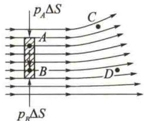  
图 2.33 各流线上伯努利方程中恒量取相同数值的特例

<Example title="例 2.17">
文丘里(Venturi)流量计(文丘里管)的原理.文丘里流量计常用于测量液体在管中的流量或流速.如图2.34所示,在变截面管的下方,装有U形管,内装水银.测量水平管道内的流速时,可将文丘里流量计串联于管道中,根据水银表面的高度差,即可求出流量或流速.
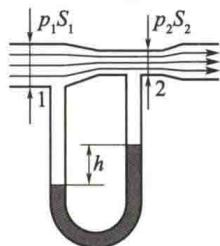
已知管道 1 和 2 处的横截面面积分别为 $S_{1}$ 和 $S_{2}$ ，水银与液体的密度分别为 $\rho_{汞}$ 与 $\rho$ ，水银面高度差为 h，求液体流量。设管中为理想流体，并做定常流。
图 2.34 文丘里流量计

<Solution title="解">
在惯性系中,文丘里流量计内理想流体在重力作用下做定常流,可运用伯努利方程.根据伯努利方程,在管道中心轴线处取细流线,对流线上1、2两处,有
$$
\frac {1}{2} \rho v _ {1} ^ {2} + p _ {1} = \frac {1}{2} \rho v _ {2} ^ {2} + p _ {2}
$$
在1、2处与管道垂直的横截面的面积分别为 $S_{1}$ 和 $S_{2}$ ，根据连续性方程有
$$
v _ {1} S _ {1} = v _ {2} S _ {2}
$$
压强随高度分布的规律与静止流体中相同（参考图2.33及有关论述). U形管内显然为静止流体. 因此，自1处经U形管到2处，可运用不可压缩静止流体的压强公式，由此得出管道中心线上1处与2处的压强差为
由于通过 1、2 两处横截面的流线是平行的，横截面上
$$
p _ {1} - p _ {2} = (\rho_ {\mathrm{汞}} - \rho) g h
$$
将以上三式联立,可解出流量为
$$
Q = v _ {1} S _ {1} = v _ {2} S _ {2} = \sqrt {\frac {2 (\rho_ {\mathrm{汞}} - \rho) g h S _ {1} ^ {2} S _ {2} ^ {2}}{\rho (S _ {1} ^ {2} - S _ {2} ^ {2})}}
$$
等式右端除 h 外均为常数, 因此可根据高度差求出流量.
</Solution>
</Example>

<Example title="例 2.18">
皮托(Pitot)管原理. 皮托管常用来测量气体的流速. 如图2.35所示, 开口1和 $1'$ 与气体流动的方向平行, 开口2则垂直于气体流动的方向. 开口 $1(1')$ 和开口2分别通向U形管压强计的两端, 根据液面的高度差便可求出气体的流速.
已知空气密度为 $\rho$ ，液体密度为 $\rho_{液}$ ，管内液面高度差为 h，求空气流速。空气沿水平方向流动，皮托管也水平放置。空气视作理想流体，并做定常流。

<Solution title="解">
因空气可视作理想流体, 又知空气做定常流, 并在惯性系的重力场中, 故可应用伯努利方程.
用皮托管测流速,相当于在流体内放一障碍物,流体将被迫分成两路绕过此物体,在物体前方流体开始分开的地方,流线流速等于零的一点,称为驻点(如图2.35中的2点).如图2.35所示,通过1、2两点的各流线均来自远处,在远处未受皮托管干扰的地方,流体内各部分均相对于仪器以相同的速度做匀速直线运动(例如,飞机在空中沿直线匀速飞行,远处空气相对于机身均以相同的速度做匀速直线运动), 空间各点的 $\frac{1}{2}\rho v^{2} + \rho gh + p$ 为一恒量. 对于 1、2 两点, 有
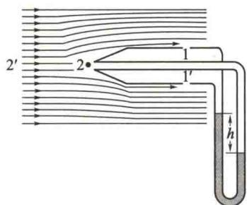  
图 2.35 皮托管
$$
\frac {1}{2} \rho v _ {1} ^ {2} + \rho g h _ {1} + p _ {1} = \rho g h _ {2} + p _ {2}
$$
$h_{1}$ 和 $h_{2}$ 分别表示 1、2 两点相对于零势能点的高度，这两点的高度差很小，可不予考虑，因此
$$
\frac {1}{2} \rho v _ {1} ^ {2} = p _ {2} - p _ {1}
$$
皮托管的大小和气体流动的范围相比是微乎其微的，仪器的放置对流速分布的影响不大，可近似认为 $v_{1}$ 即为欲测流速v，于是
又
$$
v = \sqrt {\frac {2 (p _ {2} - p _ {1})}{\rho}}
$$
$$
p _ {2} - p _ {1} = \rho_ {\mathrm{液}} g h
$$
故流速
$$
v = \sqrt {2 \rho_ {\mathrm{液}} g h / \rho}
$$
这里介绍一下“驻点压强”. 将伯努利方程应用于图 2.35 中的流线 $2'2, 2'$ 点的压强为大气压 $p_{0}$ ，流速为 v，而 $p_{2}$ 表示驻点压强，驻点处流速为零，则
$$
p _ {2} = p _ {0} + \frac {1}{2} \rho v ^ {2}
$$
由于 $\frac{1}{2}\rho v^{2}>0$ ，所以 $p_{2}>p_{0}$ ，即驻点处有较高的压强.
将皮托管用在飞机上，可测飞机相对于空气的航速。但飞机上不宜用 U 形管，而应采用金属盒，其内、外空气分别与图 2.35 中的 1 和 2 两点相通，根据金属盒因内、外压强差发生的形变来测飞机航速。
</Solution>
</Example>

<Example title="例 2.19">
水库放水、水塔经管道向城市输水及利用挂瓶为病人输液等，其共同特点是液体自大容器经小孔流出。由此得到下面研究的理想模型：大容器下部有一小孔，小孔的线度与容器内液体自由表面至小孔处的高度 h 相比很小，液体可视作理想流体。求在重力场中液体从小孔流出的速度。

<Solution title="解">
随着液面的下降,小孔处的流速也会逐渐降低,严格说来,液体并不做定常流.但因孔径极小,若观测时间较短,液面高度没有明显变化,仍然可以看作定常流.选择小孔中心为零势能点,并对从自由表面到小孔的流线运用伯努利方程.因为可认为液体自由表面的流速为零,故
$$
\rho g h + p _ {0} = \frac {1}{2} \rho v ^ {2} + p _ {0}
$$
式中， $p_{0}$ 表示大气压，v 表示小孔处流速， $\rho$ 表示液体密度. 解出 v 即得
$$
v = \sqrt {2 g h}
$$
结果表明,小孔处流速和物体自高度 h 处自由下落得到的速度是相同的.
图 2.36(a) 中, 若喷嘴与容器内壁的接合处呈圆滑曲线, 则流束横截面面积将与孔口面积相同. 如果是直壁孔口, 如图 2.36(b) 所示, 情况就不同了. 由于流体微团的惯性, 沿壁面流出小孔的流体微团不可能突然改变自己的运动方向而必然沿着光滑的曲线运动. 小孔外流管(又称流束)的直径比孔口直径小, 这种现象称为流束收缩. 流束横截面面积与孔口面积之比称为收缩系数, 自薄壁圆孔出来的射流, 收缩系数为 0.61 \~ 0.64.
已知小孔流速，还可求出流量。若无流束收缩，又不计黏性影响，则流量 $Q=\upsilon S=S\sqrt{2gh}$ ，其中S为孔口面积。若有流束收缩，又考虑黏性，则流量表达式应加以改进，为 $Q=\mu S\sqrt{2gh}$ ，其中， $\mu<1$ 。 $\mu$ 称为流量系数，可由实验测出。根据理想模型推出公式，再根据实验加以修正，这是很常见的方法。
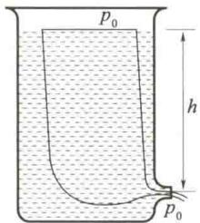
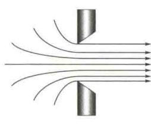  
(a) 小孔流速问题的研究  
(b) 流束收缩  
图 2.36 理想流体的小孔流速
</Solution>
</Example>
