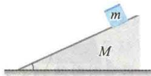

import Guide from '@/components/Guide.astro';
import Knowledge from '@/components/Knowledge.astro';
import Example from '@/components/Example.astro';
import Analysis from '@/components/Analysis.astro';
import Solution from '@/components/Solution.astro';
import Variant from '@/components/Variant.astro';
import Note from '@/components/Note.astro';
import Block from '@/components/Block.astro';
import Method from '@/components/Method.astro';
import Exercise from '@/components/Exercise.astro';

## 选择题

<Exercise title="习题 2.1.1">
一质量为 M 的斜面原来静止于光滑水平面上, 将一质量为 m 的木块轻轻放于斜面上, 如题 2.1.1 图所示. 如果此后木块能静止于斜面上, 则斜面将 ( )

A. 保持静止. B. 向右加速运动. C. 向右匀速运动. D. 向左加速运动.
</Exercise>

<Exercise title="习题 2.1.2">
质量分别为 $m_{1}$ 和 $m_{2}$ 的两滑块 A 和 B 通过一轻弹簧水平连接后置于水平桌面上，两滑块与桌面间的滑动摩擦系数均为 $\mu$ ，系统在水平拉力 F 的作用下匀速运动，如题 2.1.2 图所示。若突然撤去拉力，则刚撤去的瞬间，两滑块的加速度 $a_{A}$ 和 $a_{B}$ 分别为（）

A. $a_{A}=0, a_{B}=0$ . B. $a_{A}>0, a_{B}<0$ . C. $a_{A}<0, a_{B}>0$ . D. $a_{A}<0, a_{B}=0$ .

  

题2.1.1图

  

题2.1.2图

对功的概念有以下几种说法：

①保守力做正功时，系统内相应的势能增加；

②质点沿一闭合路径运动，保守力对质点做的功为零；

③作用力与反作用力大小相等，方向相反，所以两者所做功的代数和必为零.

在上述说法中

A. ①、②是正确的.

B. ②、③是正确的.

C. 只有 ② 是正确的.

D. 只有 ③ 是正确的.

</Exercise>
