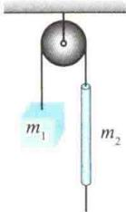
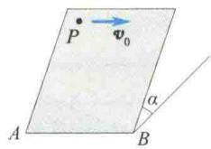
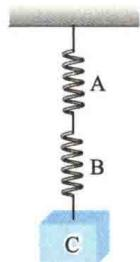
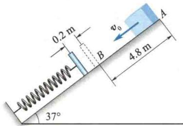
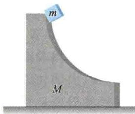
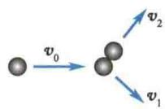

import Guide from '@/components/Guide.astro';
import Knowledge from '@/components/Knowledge.astro';
import Example from '@/components/Example.astro';
import Analysis from '@/components/Analysis.astro';
import Solution from '@/components/Solution.astro';
import Variant from '@/components/Variant.astro';
import Note from '@/components/Note.astro';
import Block from '@/components/Block.astro';
import Method from '@/components/Method.astro';
import Exercise from '@/components/Exercise.astro';

## 解答题

<Exercise title="习题 2.3.1">
在下列情况下,说明质点所受合力的特点.
(1) 质点做匀速直线运动;
(2) 质点做匀减速直线运动;
(3) 质点做匀速圆周运动;
(4) 质点做匀加速圆周运动.
</Exercise>

<Exercise title="习题 2.3.2">
举例说明以下两种说法是不正确的.
(1) 物体受到的摩擦力的方向总是与物体的运动方向相反；
(2) 摩擦力总是阻碍物体的运动.
</Exercise>

<Exercise title="习题 2.3.3">
质点系动量守恒的条件是什么？在什么情况下，即使外力不为零，也可用动量守恒定律近似求解？
</Exercise>

<Exercise title="习题 2.3.4">
在经典力学中，下列哪些物理量与参考系的选取有关：质量、动量、冲量、动能、势能、功？
</Exercise>

<Exercise title="习题 2.3.5">
一细绳跨过一定滑轮，绳的一端悬有一质量为 $m_{1}$ 的物体，另一端穿过质量为 $m_{2}$ 的圆柱体的竖直细孔，圆柱体可沿绳子滑动，如题2.3.5图所示。今看到绳子从圆柱体的细孔中加速上升，圆柱体相对于绳子以匀加速度 $a^{\prime}$ 下滑，求物体与圆柱体相对于地面的加速度、绳的张力及圆柱体与绳子间的摩擦力（绳轻且不可伸长，定滑轮的质量及轮与轴间的摩擦忽略不计）。
</Exercise>

<Exercise title="习题 2.3.6">
一个质量为 m 的质点 P，在光滑的固定斜面（倾角为 $\alpha$ ）上以初速度 $v_{0}$ 运动， $v_{0}$ 的方向与斜面底边的水平线 AB 平行，如题 2.3.6 图所示，求该质点的轨迹方程.
  
题2.3.5图
  
题2.3.6图
</Exercise>

<Exercise title="习题 2.3.7">
质量为 16 kg 的质点在 xOy 平面内运动，受一恒力作用，力的分量为 $f_{x} = 6 \, N, f_{y} = -7 \, N$ . 当 t = 0 时，x = y = 0, $v_{x} = -2 \, m/s, v_{y} = 0$ . 求当 t = 2 s 时质点的位矢和速度.
</Exercise>

<Exercise title="习题 2.3.8">
质点在流体中做直线运动，受与速率成正比的阻力 $kv(k$ 为常数)作用， $t = 0$ 时质点的速率为 $v_0$ ，证明：(1) $t$ 时刻质点的速率为 $v = v_0 \mathrm{e}^{-\frac{k}{m} t}$ ；(2) 由0到 $t$ 的时间间隔内质点通过的距离为 $x = (mv_0 / k)[1 - \mathrm{e}^{-\frac{k}{m} t}]$ ；(3) 停止运动前质点通过的距离为 $\frac{m}{k} v_0$ ；(4) 当 $t = m / k$ 时，质点的速率减至 $\frac{v_0}{\mathrm{e}}$ 。（ $m$ 为质点的质量）
</Exercise>

<Exercise title="习题 2.3.9">
一质量为 m 的质点以与地面的仰角 $\theta = 30^{\circ}$ 的初速度 $v_{0}$ 从地面抛出，若忽略空气阻力，求质点落地时相对抛射时的动量增量.
</Exercise>

<Exercise title="习题 2.3.10">
一质量为 m 的小球从某一高度处水平抛出，落在水平桌面上发生弹性碰撞，并在抛出 1 s 后，跳回到原高度，速度仍是水平方向，速度大小也与抛出时相等。求小球与桌面碰撞过程中，桌面给予小球的冲量的大小和方向，并指出在碰撞过程中小球的动量是否守恒。
</Exercise>

<Exercise title="习题 2.3.11">
作用在质量为 $10\mathrm{kg}$ 的物体上的力为 $F = (10 + 2t)i(\mathrm{N})$ ，式中 $t$ 的单位是s.(1)求4s后，该物体的动量和速度的改变量，以及力给予物体的冲量；(2）为了使该力的冲量为 $200\mathrm{N}\cdot \mathrm{s}$ ，该力应在物体上作用多久？试就一原来静止的物体和一个具有初速度 $-6j\mathrm{m / s}$ 的物体，回答这两个问题.
</Exercise>

<Exercise title="习题 2.3.12">
一质量为 $m$ 的质点在 $xOy$ 平面上运动，其位矢为 $r = a\cos \omega t i + b\sin \omega t j$ 求质点的动量及 $t = 0$ 到 $t = \frac{\pi}{2\omega}$ 时间间隔内质点所受的合力的冲量和质点动量的改变量.
</Exercise>

<Exercise title="习题 2.3.13">
一颗子弹由枪口射出时速率为 $v_0$ (SI)，当子弹在枪筒内被加速时，它所受的合力大小为 $F = a - bt$ (N) ( $a, b$ 均为常数)，式中 $t$ 以 $s$ 为单位。（1）假设子弹飞行到枪口处时合力刚好为零，试计算子弹走完枪筒全长所需的时间；（2）求子弹所受的冲量；（3）求子弹的质量。
</Exercise>

<Exercise title="习题 2.3.14">
一炮弹质量为 m，以速率 v 飞行，其内部炸药爆炸使其分裂为两块，爆炸后弹片增加的动能为 T，且其中一块弹片的质量为另一块弹片质量的 k 倍，如两者仍沿原方向飞行，试证其速率分别为
$$
v + \sqrt {\frac {2 k T}{m}}, v - \sqrt {\frac {2 T}{k m}}
$$
</Exercise>

<Exercise title="习题 2.3.15">
设一质点所受合外力 $F_{合} = 7i - 6j(N)$ . (1) 当质点从坐标原点运动到位矢为 $r = -3i + 4j + 16k(m)$ 处时，求 $F_{合}$ 所做的功；(2) 如果质点运动到位矢为 r 处时需 0.6 s，试求平均功率；(3) 如果质点的质量为 1 kg，试求动能的改变量.
</Exercise>

<Exercise title="习题 2.3.16">
用铁锤将一铁钉击入木板,设木板对铁钉的阻力与铁钉进入木板内的深度成正比,在第一次击打时,能将铁钉击入木板内1 cm,则第二次击打时能击入多深?假定铁锤两次击打铁钉时的速度相同.
</Exercise>

<Exercise title="习题 2.3.17">
已知一质点(质量为 m)在其保守力场中位矢为 r 处的势能为 $E_{\mathrm{p}}(r) = -k / r^{n}$ ，试求质点所受保守力的大小和方向.
</Exercise>

<Exercise title="习题 2.3.18">
一根刚度系数为 $k_{1}$ 的轻弹簧A的下端，挂一根刚度系数为 $k_{2}$ 的轻弹簧B，B的下端又挂一重物C，C的质量为 $M$ ，如题2.3.18图所示.求这一系统静止时两弹簧的伸长量之比和弹性势能之比.
</Exercise>

<Exercise title="习题 2.3.19">
(1) 月球和地球对质量为 $m$ 的物体的引力相抵消的一点 $P$ , 到月球表面的距离是多少? 地球质量为 $5.98 \times 10^{24} \mathrm{~kg}$ , 地球中心到月球中心的距离为 $3.84 \times 10^{8} \mathrm{~m}$ , 月球质量为 $7.35 \times 10^{22} \mathrm{~kg}$ , 月球半径为 $1.74 \times 10^{6} \mathrm{~m}$ . (2) 如果一个 $1 \mathrm{~kg}$ 的物体在与月球和地球的距离均为无限远处的势能为零, 那么它在 $P$ 点的势能为多少?
  
题2.3.18图
</Exercise>

<Exercise title="习题 2.3.20">
如题 2.3.20 图所示, 一物体质量为 2 kg, 以初速率 $v_{0} = 3 \, m/s$ 从斜面上 A 点处下滑, 它与斜面的摩擦力为 8 N, 到达 B 点后压缩弹簧 0.2 m 后停止, 然后又被弹回, 求弹簧的刚度系数和物体第一次被弹回的最大高度.
  
题2.3.20图
</Exercise>

<Exercise title="习题 2.3.21">
一质量为 M 的大木块具有半径为 R 的四分之一弧形槽, 如题 2.3.21 图所示. 将大木块放在光滑水平面上, 质量为 m 的小木块从弧形槽的顶端滑下, 二者都做无摩擦的运动, 而且都从静止开始运动, 求小木块脱离大木块时的速度.
</Exercise>

<Exercise title="习题 2.3.22">
一个小球与一质量相等的静止小球发生非对心弹性碰撞,如题 2.3.22 图所示,试证明碰撞后两小球的运动方向互相垂直.
  
题2.3.21图
  
题2.3.22图
</Exercise>
