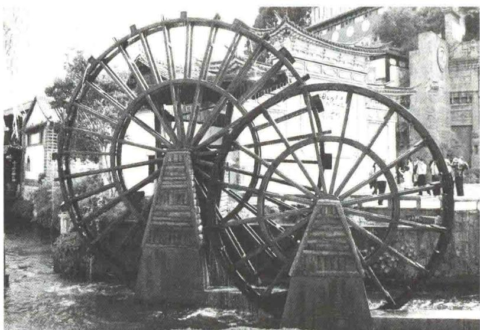
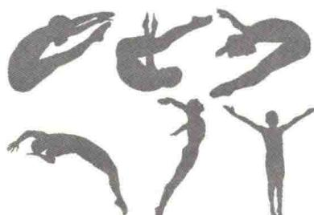
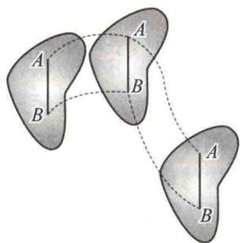
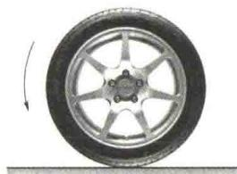
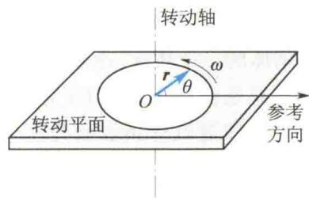

import Guide from '@/components/Guide.astro';
import Knowledge from '@/components/Knowledge.astro';
import Example from '@/components/Example.astro';
import Analysis from '@/components/Analysis.astro';
import Solution from '@/components/Solution.astro';
import Variant from '@/components/Variant.astro';
import Note from '@/components/Note.astro';
import Block from '@/components/Block.astro';
import Method from '@/components/Method.astro';
import Exercise from '@/components/Exercise.astro';

## 第3章 刚体力学基础

  
本章提要

在研究物体的机械运动规律时,仅仅讨论质点的情况是不全面的.在许多实际力学问题中,研究的对象往往是由许多质点组成的系统,刚体便是其中一种特殊的系统.
本章将介绍有关刚体运动的基本概念和规律,主要包括刚体做定轴转动时的转动定律、动能定理、转动惯量、角动量定理及角动量守恒定律等.

## 3.1.1 刚体的引入

通过前面的学习,我们知道,在物理学中研究物体的运动规律时,有时需要对实
际物体进行一定的简化.例如，当物体的形状和大小在所研究的问题中产生的影响很小而可以忽略时，提出了质点这一理想模型.通过质点概念的引入，物理学对物体运动的描述变得简明而深刻.但是，不是在所有情况下物体的形状和大小都可以忽略.例如，研究跳水运动员在空中的翻转动作时，就不能将人体视为一个质点（见图3.1).同样，研究地球的自转运动时，也不能将地球视为质点.这样的例子还有很多，如电机转子的转动、车轮的滚
  
图3.1 跳水运动员的翻转动作
动等. 在研究这些问题时, 物体的形状和大小有着重要的影响, 因此必须予以考虑.
在外力作用下,物体的形状和大小一般都要发生变化.对这一类问题的研究,往往都是相当复杂的.为了使问题简化,对于在外力作用下形变很小,对所研究的结果影响甚微的物体,物理学中引入刚体这一理想模型.所谓刚体(rigid body),就是在任何外力作用下,其形状和大小完全不变的物体.
在研究刚体的运动规律时,可以将刚体看成是由许多质点组成的.每一个质点叫作刚体的一个质元.由刚体的定义可知,在外力作用下,刚体内各质元之间的相对位置总是保持不变.对于刚体这一特殊的质点系,可以运用前面讨论的质点系的运动规律进行分析和研究.

## 3.1.2 刚体的基本运动

刚体最基本的运动形式是平动和转动. 任何复杂的刚体运动都可以分解为平动和转动的叠加.

### 1. 刚体的平动

如图 3.2 所示, 在运动过程中, 若刚体内部任意两质元间的连线在各个时刻的位置都和初始时刻的位置保持平行, 这样的运动称为刚体的平动. 不难证明, 刚体在平动过程中的任意一段时间内, 所有质元的运动轨迹和位移都是相同的, 并且在任意时刻, 各个质元均具有相同的速度和加速度. 所以, 当刚体做平动时, 可以选取刚体中任一质元的运动来表示整个刚体的运动. 由此, 平动的刚体可当成一个质点来处理.
  
图3.2 刚体的平动

### 2. 刚体的转动

若刚体上各个质元都绕同一直线做圆周运动,这样的运动称为刚体的转动(rotation),这条直线称为转动轴(转动轴可在刚体之内,也可在刚体之外).在刚体转动过程中,若转动轴的方向或位置随时间变化,这样的运动称为刚体的非定轴转动,该转动轴称为转动瞬轴.如图3.3所示,车轮的滚动就是非定轴转动.若转动轴固定不动,即既不改变方向又不发生平移,这样的运动称为刚体的定轴转动,该转动轴称为固定轴,如门绕门
  
图 3.3 车轮朝左滚动
轴的转动、电机转子的转动等.本章主要介绍刚体定轴转动的一些基本规律.

## 3.1.3 刚体定轴转动的描述

为了研究刚体的定轴转动,定义垂直于固定轴的平面为转动平面.显然,转动平面不止一个,可以有无数多个.如果以某转动平面与转动轴的交点为坐标原点,则该转动平面上的所有质元都绕着这个坐标原点做圆周运动.下面就讨论怎样来描述刚体的定轴转动.

### 1. 角位移、角速度和角加速度

刚体定轴转动的基本特征是，轴上各点都保持不动，轴外各点在同一时间间隔内转过的角度都一样。所以，可以采用类似质点做圆周运动时的角位移、角速度、角加速度的定义方法来定义绕定轴转动刚体的角位移、角速度、角加速度。
如图 3.4 所示, 在刚体上任取一个转动平面, 以该转动平面与转动轴的交点为坐标原点, 在该平面内作一射线, 将其作为参考方向 (或称极轴), 转动平面上任一质元对坐标原点的位矢 r 与极轴的夹角称为角位置 $\theta$ . 刚体在一段时间内转过的角度 (末时刻与初始时刻的角位置之差) $\Delta\theta = \theta_{2} - \theta_{1}$ 称为角位移.

在 t 到 $t + \Delta t$ 时间内的角位移 $\Delta\theta$ 与 $\Delta t$ 的比值称为刚体的平均角速度，用 $\bar{\omega}$ 表示：
图3.4 转动平面
$$
\bar {\omega} = \frac {\Delta \theta}{\Delta t}
$$
当 $\Delta t \rightarrow 0$ 时，平均角速度的极限称为瞬时角速度，简称角速度，用 $\omega$ 表示：
$$
\omega = \lim _ {\Delta t \rightarrow 0} \frac {\Delta \theta}{\Delta t} = \frac {\mathrm{d} \theta}{\mathrm{d} t}\tag{3.1}
$$
刚体的定轴转动有两种不同的转动方向，顺着转动轴观察时，刚体可以按顺时针方向转动，也可以按逆时针方向转动。如果把一种转动方向的角速度取为正，另一种转动方向的角速度取为负，则角速度的大小反映了定轴转动的快慢，角速度的正负反映了定轴转动的方向。角速度的单位名称是弧度每秒，符号是 rad/s。

## 角速度矢量

在研究质点的圆周运动时，我们曾把圆周运动的角速度看作矢量，其方向沿垂直于圆周平面的轴线，方向满足右手螺旋定则。在刚体的转动中，虽然对于刚体定轴转动（转动轴在空间的方位不变），只有“正”和“反”两种转动方向，角速度 $\omega$ 的方向可通过角速度的正负来指明，但对于刚体的一般转动，转动轴可在空间取各种方位，只用正负号不足以表明转动方向，因而需要引入角速度矢量。我们规定角速度矢量的方向是沿转动轴的，且和刚体的旋转运动组成右手螺旋系统。
将角速度看作矢量后,定轴转动中的线量与角量之间的关系可表示成简洁的形式.但是,这样规定的角速度矢量是否具有矢量的性质呢?尽管在定轴转动中,我们规定了角速度的大小和方向,但有大小、有方向的量不一定是矢量.矢量的一个重要特征是满足平行四边形定则.角速度矢量是否满足这一定则?可以证明(见第1章),有限大角位移并不符合矢量相加的平行四边形定则,因为平行四边形定则表明矢量求和满足交换律,而有限大角位移相加时不满足交换律.但无限小角位移满足交换律.
角速度总是与无限小角位移相联系. 它是无限小角位移与相应无限小时间间隔的比值, 既然无限小角位移是矢量, 那么角速度也是矢量.
在 $\Delta t$ 时间内, 角速度的改变量 $\Delta\omega$ 与 $\Delta t$ 的比值称为该段时间内刚体的平均角加速度, 用 $\bar{\alpha}$ 表示:
$$
\bar {\alpha} = \frac {\Delta \omega}{\Delta t}
$$
当 $\Delta t \rightarrow 0$ 时，平均角加速度的极限称为瞬时角加速度，简称角加速度，用 $\alpha$ 表示：
$$
\alpha = \lim _ {\Delta t \rightarrow 0} \frac {\Delta \omega}{\Delta t} = \frac {\mathrm{d} \omega}{\mathrm{d} t}
$$
角加速度的单位名称是弧度每二次方秒,符号是 $rad/s^{2}$ .
由以上讨论可知,刚体的定轴转动与质点的直线运动相似,只要在描述质点直线运动的各物理量(位移、速度、加速度)前加一个“角”字,就成了描述刚体定轴转动的各相应物理量(角位移、角速度、角加速度),两者的运动学关系亦完全相似.
$$
\begin{array}{r l r} & {\text {定轴转动}} & {\qquad \text {直线运动}} \\ & {\omega =  \frac {\mathrm{d} \theta}{\mathrm{d} t}} & {\qquad v =  \frac {\mathrm{d} x}{\mathrm{d} t}} \\ & {\alpha =  \frac {\mathrm{d} \omega}{\mathrm{d} t}} & {\qquad a =  \frac {\mathrm{d} v}{\mathrm{d} t}} \\ & {\omega - \omega_ {0} =  \int_ {0} ^ {t} \alpha \mathrm{d} t} & {\qquad v - v _ {0} =  \int_ {0} ^ {t} a \mathrm{d} t} \\ & {\theta - \theta_ {0} =  \int_ {0} ^ {t} \omega \mathrm{d} t} & {\qquad x - x _ {0} =  \int_ {0} ^ {t} v \mathrm{d} t} \end{array}
$$

### 2. 角量与线量的关系

当刚体绕固定轴转动时,尽管刚体上各质元的角位移、角速度和角加速度均相同,但由于各质元做圆周运动的半径不一定相同,因此各质元的速度和加速度的大小也不一定相同.
由前面所学质点做圆周运动的知识可知，刚体定轴转动的角速度和角加速度确定后，刚体内任一质元的速度和加速度也就可以完全确定了。若刚体上某质元 $i$ 到转动轴的距离为 $r_i$ ，则该质元的线速度为
$$
v _ {i} = \omega r _ {i}\tag{3.2}
$$
加速度的切向分量和法向分量分别为
$$
a _ {i \tau} = \alpha r _ {i}\tag{3.3}
$$
$$
a _ {i n} = \omega^ {2} r _ {i}\tag{3.4}
$$
由此可见，尽管刚体是一个复杂的质点系，但引入角量后，刚体定轴转动的描述就显得十分简单。刚体上各质元的角量（角位移、角速度、角加速度）相同，而各质元的线量（线位移、线速度、线加速度）大小与质元到转动轴的距离成正比。
