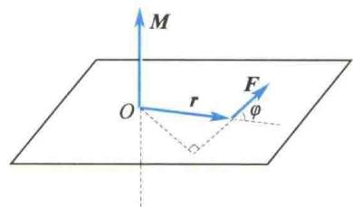
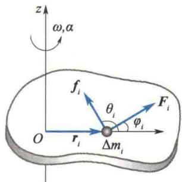
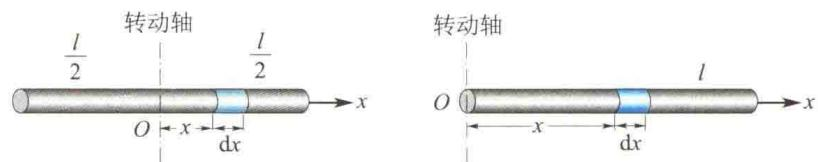
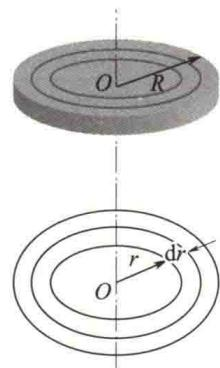
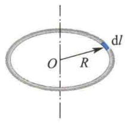
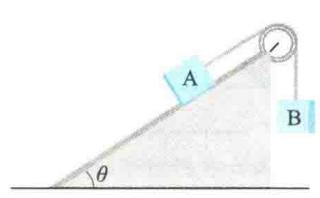
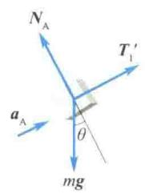
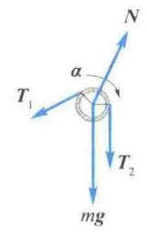
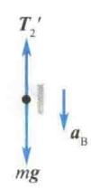

import Guide from '@/components/Guide.astro';
import Knowledge from '@/components/Knowledge.astro';
import Example from '@/components/Example.astro';
import Analysis from '@/components/Analysis.astro';
import Solution from '@/components/Solution.astro';
import Variant from '@/components/Variant.astro';
import Note from '@/components/Note.astro';
import Block from '@/components/Block.astro';
import Method from '@/components/Method.astro';
import Exercise from '@/components/Exercise.astro';

力是使物体平动状态发生改变的原因,而力矩是使物体转动状态发生改变的原因.本节先介绍力矩的概念,然后讨论刚体做定轴转动时的动力学关系.

## 3.2.1 力矩

力矩可分为力对点的力矩和力对轴的力矩. 在此, 先分析力对某固定点的力矩.
如图 3.5 所示, r 为由固定点 O 指向力 F 的作用点的矢径, $\varphi$ 为 r 与 F 的夹角. 力 F 对 O 点的力矩的大小等于此力和力臂的乘积, 即
$$
M = F r \sin \varphi
$$
力矩是矢量,定义为
(3.5)
$$
\boldsymbol {M} = \boldsymbol {r} \times \boldsymbol {F}\tag{3.6a}
$$

即 M 的方向垂直于 r 和 F 所确定的平面, 其指向用右手螺旋定则确定.
图3.5 力对点的力矩
M 在直角坐标系中各坐标轴上的分量为
$$
\left\{ \begin{array}{l} M _ {x} = y F _ {z} - z F _ {y} \\ M _ {y} = z F _ {x} - x F _ {z} \\ M _ {z} = x F _ {y} - y F _ {x} \end{array} \right.\tag{3.6b}
$$
$M_{x}$ 、 $M_{y}$ 、 $M_{z}$ 分别称为对 x 轴、y 轴、z 轴的力矩.
力 F 对固定点 O 的力矩为零有两种情况: 一是力 F 等于零; 二是力 F 的作用线与矢径 r 共线 (力 F 的作用线穿过 O 点), 此时 $\sin \varphi = 0$ . 如果一个物体所受的力始终指向 (或背离) 某一固定点, 这种力称为有心力, 此固定点称为力心. 显然, 有心力 F 与矢径 r 是共线的. 因此, 有心力对力心的力矩恒为零.
刚体做定轴转动时，刚体所受合外力对轴上一点的力矩在该轴上的投影为力对轴的力矩。不难证明，力对轴的力矩为零也有两种情况：一是力的作用线与轴平行；二是力的作用线与轴相交。掌握这些特点，对后面讲到的判断系统是否满足角动量守恒的条件，非常方便。
在国际单位制中，力矩的单位名称是牛[顿]米，符号是N·m.

## 3.2.2 刚体定轴转动的转动定律

理论与实践证明,当刚体绕固定轴转动时,作用在刚体上的力,若其作用线与转动轴平行,或其作用线的延长线与转动轴相交,则该力对转动轴的力矩为零,即该力对转动轴没有转动效应.只有力的作用线在转动平面内而又不与轴相交的力才对转动轴产生力矩,从而使刚体转动状态发生改变.因此,在研究引起做定轴转动刚体的转动状态发生改变的原因时,只需考虑外力在转动平面内的分量对转动轴的力矩.
  
刚体定轴转动的转动惯量和转动定律
如图3.6所示，刚体绕定轴 $z$ 转动.在刚体上任取一质元 $\Delta m_{i}$ ，它绕 $z$ 轴做圆周运动的轨道的半径为 $r_i$ ，设它所受的合外力在转动平面内的分量为 $\pmb{F}_i$ ，刚体内其他质元对 $\Delta m_{i}$ 作用的合内力在转动平面内的分量为 $f_{i}$ ，它们与矢径 $\pmb{r}_i$ 的夹角分别为 $\varphi_{i}$ 和 $\theta_{i}$ .设刚体绕定轴转动的角速度和角加速度分别为 $\omega$ 和 $\alpha$ .根据牛顿第二定律，采用自然坐标系，可得质元 $\Delta m_{i}$ 的法向方程和切向方程分别为
  
图 3.6 推导转动定律示意图
$$
\begin{array}{r l} & - (F _ {i} \cos \varphi_ {i} + f _ {i} \cos \theta_ {i}) = \Delta m _ {i} a _ {i n} = \Delta m _ {i} r _ {i} \omega^ {2} \\ & F _ {i} \sin \varphi_ {i} + f _ {i} \sin \theta_ {i} = \Delta m _ {i} a _ {i \tau} = \Delta m _ {i} r _ {i} \alpha \end{array}
$$
式中， $a_{\mathrm{in}} = r_i\omega^2$ ， $a_{i\tau} = r_i\alpha$ 分别是质元的加速度的法向分量和切向分量.由于向心力的作用线穿过转动轴，其力矩为零，所以法向方程不予考虑，只讨论切向方程.将切向方程的两端分别乘以 $r_i$ ，可得
$$
F _ {i} r _ {i} \sin \varphi_ {i} + f _ {i} r _ {i} \sin \theta_ {i} = \Delta m _ {i} r _ {i} ^ {2} \alpha\tag{3.7}
$$
式中，左端第一项和第二项分别为外力和内力对转动轴的力矩。由于在定轴转动中，力矩的方向只可能沿转动轴的正方向或负方向，因此，当有几个力同时作用在刚体上时，这些力对转动轴的力矩的矢量和就可用代数和来计算。利用式（3.7）对刚体的所有质元进行相关计算，并考虑到各质元的角加速度相同，有
$$
\sum_ {i} F _ {i} r _ {i} \sin \varphi_ {i} + \sum_ {i} f _ {i} r _ {i} \sin \theta_ {i} = \left(\sum_ {i} \Delta m _ {i} r _ {i} ^ {2}\right) \alpha\tag{3.8}
$$
由于内力总是成对出现,而且可以证明每对内力对同一轴的力矩之和必定为零.因此式(3.8)中左端第二项为零.
令 $M = \sum_{i} F_{i} r_{i} \sin \varphi_{i}$ ，则 M 表示作用在刚体上的所有外力的力矩的和，称为合外力矩.
令
$$
J = \sum_ {i} \Delta m _ {i} r _ {i} ^ {2}\tag{3.9}
$$
则 J 与刚体的运动及所受的外力无关,仅由各质元相对于转动轴的分布决定,称 J 为刚体绕轴转动的转动惯量.
于是式(3.8)可表示为
$$
M = J \alpha\tag{3.10}
$$
式(3.10)表示:刚体绕定轴转动时,作用于刚体上的合外力矩等于刚体对转动轴的转动惯量与角加速度的乘积.或者说,绕定轴转动的刚体的角加速度与作用于刚体上的合外力矩成正比,与刚体的转动惯量成反比.这就是刚体定轴转动的转动定律.
转动定律是力矩的瞬时作用规律. 式(3.10) 中各量均是对同一刚体、同一转动轴而言的. 转动定律在定轴转动中的地位相当于牛顿第二定律在平动中的地位.

## 3.2.3 转动惯量

由式(3.10)可知,当将相同的外力矩作用于两个转动惯量大小不同的刚体时,转动惯量大的刚体获得的角加速度反而小,这说明刚体转动惯量越大,其原有的转动状态越难改变,转动惯量是刚体转动时惯性大小的量度.下面就来讨论如何计算刚体的转动惯量.
根据转动惯量的定义式, 可知刚体的转动惯量就是组成刚体的各质元的质量与其到转动轴的距离的平方的乘积之和.
如果是单个质点绕某轴转动,其转动惯量为
$$
J = m r ^ {2}
$$
如果是分立质点组成的质点系统同一轴转动,其转动惯量为
$$
J = \sum_ {i} m _ {i} r _ {i} ^ {2}
$$
如果是质量连续分布的刚体绕同一轴转动,其转动惯量为
$$
J = \int_ {m} r ^ {2} \mathrm{d} m\tag{3.11}
$$
以上各式中的 r 均应理解成质点(或质元)到转动轴的距离.
转动惯量的单位名称是千克二次方米,符号是 $kg \cdot m^{2}$ .

<Example title="例 3.1">
如图 3.7 所示, 求质量为 m、长为 l 的均匀细棒的转动惯量。(1) 转动轴通过棒的中心并与棒垂直; (2) 转动轴通过棒的一端并与棒垂直.
  
图3.7 例3.1图

<Solution title="解">
（1）转动轴通过棒的中心并与棒垂直.
在棒上任取一质元, 其长度为 dx, 到转动轴 O 的距离为 x, 设棒的线密度(即单位长度上的质量)为 $\lambda = \frac{m}{l}$ , 则该质元的质量 dm = $\lambda dx$ . 该质元对中心轴的转动惯量为
$$
\mathrm{d} J = x ^ {2} \mathrm{d} m = \lambda x ^ {2} \mathrm{d} x
$$
整个棒对中心轴的转动惯量为
$$
J = \int \mathrm{d} J = \int_ {- \frac {l}{2}} ^ {\frac {l}{2}} \lambda x ^ {2} \mathrm{d} x = \frac {1}{1 2} m l ^ {2}
$$
(2) 转动轴通过棒的一端并与棒垂直时, 整个棒对该转动轴的转动惯量为
$$
J = \int_ {0} ^ {l} \lambda x ^ {2} \mathrm{d} x = \frac {1}{3} \lambda l ^ {3} = \frac {1}{3} m l ^ {2}
$$
由此可以看出,同一均匀细棒,转动轴位置不同,转动惯量也不同.
</Solution>
</Example>

<Example title="例 3.2">
质量均为 m、半径均为 R 的细圆环和均匀圆盘，分别绕通过各自中心并与圆面垂直的轴转动，求细圆环和圆盘的转动惯量.
其质量为 dm，该质元到转动轴的距离为 R，则该质元对转动轴的转动惯量为
$$
\mathrm{d} J = R ^ {2} \mathrm{d} m
$$
考虑到所有质元到转动轴的距离均为 R，所以细圆环对中心轴的转动惯量为
$$
J = \int \mathrm{d} J = \int_ {m} R ^ {2} \mathrm{d} m = R ^ {2} \int_ {m} \mathrm{d} m = m R ^ {2}
$$
（2）求质量为 $m$ 、半径为 $R$ 的圆盘对中心轴的转动惯量. 整个圆盘可以看成由许多半径不同的同心圆环构成. 为此, 在到转动轴的距离为 $r$ 处取一小圆环, 如图3.8(b)所示, 其面积为 $\mathrm{d}S = 2\pi r\mathrm{d}r$ . 设圆盘的面密度(单位面积上的质量) $\sigma = m / (\pi R^2)$ , 则小圆环的质量 $\mathrm{dm} = \sigma \mathrm{d}S = \sigma 2\pi r\mathrm{d}r$ , 该小圆环对中心轴的转动惯量为

  
(a)  
(b)  
图3.8 例3.2图
$$
\mathrm{d} J = r ^ {2} \mathrm{d} m = 2 \pi \sigma r ^ {3} \mathrm{d} r
$$
则整个圆盘对中心轴的转动惯量为
$$
J = \int \mathrm{d} J = \int_ {0} ^ {R} 2 \pi \sigma r ^ {3} \mathrm{d} r = \frac {1}{2} \sigma \pi R ^ {4} = \frac {1}{2} m R ^ {2}
$$
以上计算结果表明,质量相同、转动轴位置相同的刚体,由于质量分布不同,因此转动惯量不同.
由以上两例可以归纳出,刚体转动惯量的大小与三个因素有关:①与刚体的总质量有关;②与刚体质量对轴的分布有关,质量分布离轴越远,转动惯量越大;③与轴的位置有关,质量分布均匀的物体,其对中心轴的转动惯量最小.
上述计算方法只适用于形状规则的刚体. 对于形状不规则的刚体, 可以用实验方法测定其转动惯量. 表 3.1 列出了几种质量分布均匀、具有简单几何形状的刚体对于不同轴的转动惯量.
表 3.1 刚体的转动惯量
<table><tr><td>刚体形状</td><td>转动惯量</td><td>刚体形状</td><td>转动惯量</td></tr><tr><td>圆环</td><td>转动轴通过中心且与环面垂直 $J = mr^{2}$ </td><td>圆环</td><td>转动轴沿直径 $J = \frac{mr^{2}}{2}$ </td></tr><tr><td>薄圆盘</td><td>转动轴通过中心且与盘面垂直 $J = \frac{mr^{2}}{2}$ </td><td>圆筒</td><td>转动轴沿几何轴 $J = \frac{m}{2}(r_{1}^{2} + r_{2}^{2})$ </td></tr></table>
</Example>

## 大学物理学（第7版）（上）

续表
<table><tr><td>刚体形状</td><td>转动惯量</td><td>刚体形状</td><td>转动惯量</td></tr><tr><td>圆柱体</td><td>转动轴沿几何轴 $J = \frac{mr^{2}}{2}$ </td><td>圆柱体转动轴</td><td>转动轴通过中心且与几何轴垂直 $J = \frac{mr^{2}}{4} + \frac{ml^{2}}{12}$ </td></tr><tr><td>细棒</td><td>转动轴通过中心且与棒垂直 $J = \frac{ml^{2}}{12}$ </td><td>细棒</td><td>转动轴通过端点且与棒垂直 $J = \frac{ml^{2}}{3}$ </td></tr><tr><td></td><td>转动轴沿直径 $J = \frac{2mr^{2}}{5}$ </td><td></td><td>转动轴沿直径 $J = \frac{2mr^{2}}{3}$ </td></tr></table>

## 3.2.4 转动定律的应用

运用刚体的定轴转动定律,结合牛顿运动定律,可以讨论许多有关转动的动力学问题.值得注意的是,由于角加速度具有瞬时性,所以式(3.10)和牛顿第二定律一样都是瞬时方程,它只能确定某一时刻刚体所受力矩与其角加速度之间的关系.因此,根据角加速度的定义,式(3.10)也可表示为
$$
M = J \alpha = J \frac {\mathrm{d} \omega}{\mathrm{d} t}\tag{3.12}
$$

<Example title="例 3.3">
如图3.9(a)所示，质量均为 $m$ 的两物体A、B，A放在倾角为 $\theta$ 的光滑斜面上，通过定滑轮由不可伸长的轻绳与B相连.定滑轮是半径为 $R$ 的圆盘，其质量也为 $m$ .物体运动时，绳与定滑轮无相对滑动.求绳中张力 $T_{1}$ 和 $T_{2}$ 及物体的加速度的大小（轮轴光滑）.
  
(a)

  
图3.9 例3.3图  
(b)

<Solution title="解">
物体 A、B 及定滑轮受力图如图 3.9(b) 所示. 对于做平动的物体 A、B, 由牛顿第二定律得
$$
T _ {1} ^ {\prime} - m g \sin \theta = m a _ {\mathrm{A}}
$$
又
$$
a _ {\mathrm{A}} = a _ {\mathrm{B}} = R \alpha
$$
$$
J = \frac {1}{2} m R ^ {2}
$$
$$
m g - T _ {2} ^ {\prime} = m a _ {\mathrm{B}}
$$
联立以上各式得
又
$$
T _ {1} ^ {\prime} = T _ {1}, \quad T _ {2} ^ {\prime} = T _ {2}
$$
$$
T _ {1} = \frac {2 + 3 \sin \theta}{5} m g
$$
对定滑轮，由转动定律得
$$
T _ {2} R - T _ {1} R = J \alpha
$$
$$
T _ {2} = \frac {3 + 2 \sin \theta}{5} m g
$$
由于绳不可伸长，所以
$$
a _ {\mathrm{A}} = a _ {\mathrm{B}} = \frac {2 (1 - \sin \theta)}{5} g
$$
</Solution>
</Example>

<Example title="例 3.4">
转动着的飞轮的转动惯量为 J，在 t=0 时角速度为 $\omega_{0}$ . 此后飞轮经历制动过程，阻力矩 M 的大小与角速度 $\omega$ 的平方成正比，比例系数为 k (k 为大于零的常数). 当 $\omega=\frac{1}{3}\omega_{0}$ 时，飞轮的角加速度是多少？从开始制动到此时经历的时间是多少？

<Solution title="解">
由题意知 $M = -k\omega^2$ ，故由转动定律有
$$
- k \omega^ {2} = J \alpha
$$
$$
M = J \alpha = J \frac {\mathrm{d} \omega}{\mathrm{d} t}
$$
即
$$
\alpha = - \frac {k \omega^ {2}}{J}
$$
$$
- k \omega^ {2} = J \frac {\mathrm{d} \omega}{\mathrm{d} t}
$$
将 $\omega = \frac{1}{3}\omega_0$ 代入，求得这时飞轮的角加速度为
分离变量，并考虑到 $t = 0$ 时 $\omega = \omega_0$ ，两边积分得
$$
\alpha = - \frac {k \omega_ {0} ^ {2}}{9 J}
$$
$$
\int_ {\omega_ {0}} ^ {\frac {1}{3} \omega_ {0}} \frac {\mathrm{d} \omega}{\omega^ {2}} = - \int_ {0} ^ {t} \frac {k}{J} \mathrm{d} t
$$
为求从开始制动到此时经历的时间 t，可将转动定律写成微分方程的形式，即
解得
$$
t = \frac {2 J}{k \omega_ {0}}
$$
</Solution>
</Example>
