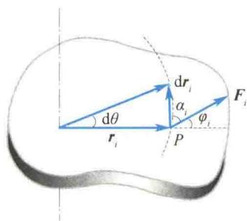
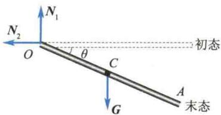
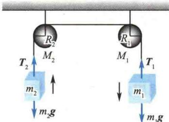

import QRCodeVideo from '@/components/QRCodeVideo.astro';

import Guide from '@/components/Guide.astro';
import Knowledge from '@/components/Knowledge.astro';
import Example from '@/components/Example.astro';
import Analysis from '@/components/Analysis.astro';
import Solution from '@/components/Solution.astro';
import Variant from '@/components/Variant.astro';
import Note from '@/components/Note.astro';
import Block from '@/components/Block.astro';
import Method from '@/components/Method.astro';
import Exercise from '@/components/Exercise.astro';

## 3.3.1 转动动能

刚体绕定轴转动时的动能,称为转动动能.设刚体以角速度 $\omega$ 绕定轴转动,其中每一质元都在各自的转动平面内以角速度 $\omega$ 做圆周运动.设第 i 个质元的质量为 $\Delta m_{i}$ ,到轴的距离为 $r_{i}$ ,它的线速度为 $v_{i}=r_{i}\omega$ ,则质元 i 的动能为 $\frac{1}{2}\Delta m_{i}v_{i}^{2}=\frac{1}{2}\Delta m_{i}(r_{i}\omega)^{2}$ ,整个刚体的转动动能为
$$
E _ {\mathrm{k}} = \sum_ {i = 1} ^ {n} \frac {1}{2} \Delta m _ {i} r _ {i} ^ {2} \omega^ {2} = \frac {1}{2} \big (\sum_ {i = 1} ^ {n} \Delta m _ {i} r _ {i} ^ {2} \big) \omega^ {2} = \frac {1}{2} J \omega^ {2}\tag{3.13}
$$
这说明: 刚体绕定轴转动时的转动动能等于刚体的转动惯量与角速度平方的乘积的二分之一. 与物体的平动动能(质点的动能) $\frac{1}{2}mv^{2}$ 相比较, 二者在形式上十分相似.
其中转动惯量与质量相对应,角速度与线速度对应.由于转动惯量与轴的位置有关,因此,转动动能也与轴的位置有关.

## 3.3.2 力矩的功

如图 3.10 所示, 设在转动平面内的外力 $F_{i}$ 作用于 P 点(注: 此处之所以不考虑内力的功, 是因为一对内力做的功之和仅与相对位移有关, 而刚体各质元之间不存在相对位移, 内力做的功之和始终为零), 经 dt 时间后 P 点沿一圆周轨道移动了 $ds_{i}$ 弧长, 矢径 $r_{i}$ 扫过 $d\theta$ 角, 则有 $\left| dr_{i} \right| = ds_{i} = r_{i} d\theta$ , 由功的定义式(2.24)有

$$
\mathrm{d} W _ {i} = F _ {\tau i} \mathrm{d} s _ {i} = F _ {\tau i} r _ {i} \mathrm{d} \theta = M _ {i} \mathrm{d} \theta
$$
图3.10 力矩的功
式中， $F_{\tau i}=F_{i}\cos\alpha_{i}$ ， $M_{i}=F_{\tau i}r_{i}$ 。然后关于i求和，得
$$
\mathrm{d} W = \left(\sum_ {i = 1} ^ {n} M _ {i}\right) \mathrm{d} \theta = M \mathrm{d} \theta\tag{3.14}
$$
式中，M 为作用于刚体上的外力矩的大小之和。式(3.14)说明，力矩所做的元功等于力矩和角位移的乘积。当刚体在力矩 M 的作用下由 $\theta_{1}$ 转到 $\theta_{2}$ 时，力矩做的功为
$$
W = \int_ {\theta_ {1}} ^ {\theta_ {2}} M \mathrm{d} \theta\tag{3.15}
$$
力矩的功率为
$$
P = \frac {\mathrm{d} W}{\mathrm{d} t} = M \frac {\mathrm{d} \theta}{\mathrm{d} t} = M \omega\tag{3.16}
$$
当功率一定时,力矩与角速度成反比.

## 3.3.3 刚体定轴转动的动能定理

如果将转动定律写成如下形式：
<QRCodeVideo title="刚体定轴转动的功能推导" url="https://api.guangyiedu.com/v3/resource/resource/r/NewQrCode-7cvCaeoIYvEgtaaJPATJ" />  
$$
M = J \alpha = J \frac {\mathrm{d} \omega}{\mathrm{d} t} = J \frac {\mathrm{d} \omega}{\mathrm{d} \theta} \frac {\mathrm{d} \theta}{\mathrm{d} t} = J \omega \frac {\mathrm{d} \omega}{\mathrm{d} \theta}
$$
分离变量并积分，又因为 $\theta = \theta_{1}$ 时 $\omega = \omega_{1},\theta = \theta_{2}$ 时 $\omega = \omega_{2}$ ，所以
$$
\int_ {\theta_ {1}} ^ {\theta_ {2}} M \mathrm{d} \theta = \int_ {\omega_ {1}} ^ {\omega_ {2}} J \omega \mathrm{d} \omega
$$
于是
$$
\int_ {\theta_ {1}} ^ {\theta_ {2}} M \mathrm{d} \theta = \frac {1}{2} J \omega_ {2} ^ {2} - \frac {1}{2} J \omega_ {1} ^ {2}\tag{3.17}
$$
此式表明,合外力矩对定轴转动的刚体所做的功等于刚体转动动能的增量.这就是刚体定轴转动的动能定理.

<Example title="例 3.5">
如图3.11所示，一根质量为 $m$ 、长为 $l$ 的均匀细棒 $OA$ ，可绕固定点 $O$ 在竖直平面内转动.今使细棒从水平位置开始自由下摆，求细棒摆到与水平位置成 $30^{\circ}$ 角时中心点 $C$ 和端点 $A$ 的速度大小.

<Solution title="解">
细棒受力如图 3.11 所示, 其中重力 G 对 O 轴的力矩的大小为 $mg \frac{l}{2} \cos \theta$ , 是 $\theta$ 的函数, 轴的支持力对 O 轴的力矩为零. 由转动动能定理, 有
$$
\begin{array}{r l} \int_ {0} ^ {\frac {\pi}{6}} m g \frac {l}{2} \cos \theta \mathrm{d} \theta & = \frac {1}{2} J \omega^ {2} - \frac {1}{2} J \omega_ {0} ^ {2} \\ & = \frac {1}{2} J \omega^ {2} \end{array}\tag{\textcircled{1}}
$$
等式左边的积分为重力矩的功，而
$$
\begin{array}{r l} W _ {G} & = \int_ {0} ^ {\frac {\pi}{6}} m g \frac {l}{2} \cos \theta \mathrm{d} \theta = \frac {l}{4} m g \\ & = - m g (h _ {C \text {末}} - h _ {C \text {初}}) \end{array}
$$
  
图3.11 例3.5图
式中， $h_{C初}$ 和 $h_{C末}$ 分别为初态和末态细棒的质心所在处相对细棒的质心 C 在最低点（细棒在竖直位置处）的高度。这说明，重力矩所做的功，也等于细棒的质心 C 的重力势能增量的负值。可以证明：刚体的重力势能等于将刚体的全部质量都集中在质心处时所具有的重力势能，而与刚体的方位无关。即刚体的重力势能可表示为 $mgh_{C}, h_{C}$ 表示质心相对重力势能的零势能点的高度。因此，对于刚体，同样可引入机械能守恒定律，其守恒条件与质点系的条件相同。
将 $W_{G} = mg\frac{l}{4}$ 及 $J = \frac{1}{3} ml^{2}$ 代入式①，得
$$
\omega = \sqrt {\frac {3 g}{2 l}}
$$
则中心点 $C$ 和端点 $A$ 的速度大小分别为
$$
v _ {C} = \omega \frac {l}{2} = \frac {1}{4} \sqrt {6 g l}
$$
$$
v _ {A} = \omega l = \frac {1}{2} \sqrt {6 g l}
$$
</Solution>
</Example>

<Example title="例 3.6">
如图 3.12 所示, 两物体的质量分别为 $m_{1}$ 和 $m_{2}$ , 且 $m_{1} > m_{2}$ , 开始时两物体处于同一高度. 两定滑轮的质量分别为 $M_{1}$ 和 $M_{2}$ , 半径分别为 $R_{1}$ 和 $R_{2}$ , 质量均匀分布. 绳轻且不可伸长, 绳与定滑轮间无相对滑动, 定滑轮轴承光滑. 试求当物体 $m_{1}$ 下降了 x 距离时两物体的速度和加速度的大小.

<Solution title="解">
以两物体、两定滑轮、地球为一系统， $W_{外}=0, W_{内非}=0$ ，故机械能守恒。以物体 $m_{1}$ 下降 x 距离时的位置为重力势能的零势能点，则有
$$
\begin{array}{r l} m _ {1} g x + m _ {2} g x & = m _ {2} g 2 x + \frac {1}{2} m _ {1} v ^ {2} + \frac {1}{2} m _ {2} v ^ {2} \\ & + \frac {1}{2} J _ {1} \omega_ {1} ^ {2} + \frac {1}{2} J _ {2} \omega_ {2} ^ {2} \end{array}
$$
由于 $v = \omega_{1}R_{1} = \omega_{2}R_{2}, J_{1} = \frac{1}{2}M_{1}R_{1}^{2}, J_{2} =$
$\frac{1}{2}M_{2}R_{2}^{2}$ ，可解得
$$
v = 2 \sqrt {\frac {(m _ {1} - m _ {2}) g x}{2 (m _ {1} + m _ {2}) + M _ {1} + M _ {2}}}
$$
  
图3.12 例3.6图
由于运动过程中物体所受合力为恒力， $a$ 为常数， $v^{2} = 2ax$ ，故有
$$
a = \frac {2 (m _ {1} - m _ {2}) g}{2 (m _ {1} + m _ {2}) + M _ {1} + M _ {2}}
$$
</Solution>
</Example>
