import QRCodeVideo from '@/components/QRCodeVideo.astro';

import Guide from '@/components/Guide.astro';
import Knowledge from '@/components/Knowledge.astro';
import Example from '@/components/Example.astro';
import Analysis from '@/components/Analysis.astro';
import Solution from '@/components/Solution.astro';
import Variant from '@/components/Variant.astro';
import Note from '@/components/Note.astro';
import Block from '@/components/Block.astro';
import Method from '@/components/Method.astro';
import Exercise from '@/components/Exercise.astro';

在研究物体的平动问题时,我们用物体的动量来描述物体的运动状态.当研究物体的转动问题,如研究匀质飞轮绕通过其中心并垂直于飞轮平面的定轴转动问题时,虽然飞轮在转动,但按质点系动量的定义,它的总动量为零.这说明仅用动量来描述物体的机械运动是不够的. 因此, 还有必要引进另一个物理量——角动量来描述物体的机械运动. 角动量的概念与动量、能量的概念一样, 也是物理学中的基本概念. 大到天体, 小到电子、质子等微观粒子, 对它们的运动描述和研究都经常用到角动量.

## 3.4.1 角动量 质点的角动量定理及角动量守恒定律

### 1. 质点的角动量

与质点运动时的动量类似,角动量是物体“转动运动量”的量度,是与物体的一定转动状态相联系的物理量.这里先引入运动质点对某一固定点的角动量.
如图 3.13 所示, 一个质量为 m 的质点, 以速度 v 运动, 其相对于固定点 O 的矢径为 r, 则把质点相对于 O 点的矢径 r 与质点的动量 mv 的矢积定义为该时刻质点相对于 O 点的角动量, 用 L 表示. 即
$$
\boldsymbol {L} = \boldsymbol {r} \times m \boldsymbol {v}\tag{3.18}
$$
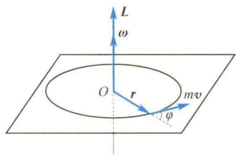
角动量是矢量.由矢积的定义可知,角动量L的方向垂直于r和mv所确定的平面,其指向可用右手螺旋定则确定.L的大小为
图3.13 质点的角动量
$$
L = r m v \sin \varphi\tag{3.19}
$$
式中， $\varphi$ 为 $r$ 和 $m\pmb{v}$ 间的夹角。当质点做圆周运动时， $\varphi = \frac{\pi}{2}$ ，这时质点对圆心 $O$ 的角动量的大小为
$$
L = r m v = m r ^ {2} \omega\tag{3.20}
$$
<QRCodeVideo title="质点的角动量及质点的角动量守恒定律" url="https://api.guangyiedu.com/v3/resource/resource/r/NewQrCode-DulzOcy7KrkLDImuyINp" />
由定义式(3.18)可知,质点的角动量与质点对固定点 O 的矢径有关.同一质点对不同固定点的位矢不同,因而角动量也不同.因此,在讲质点的角动量时,必须指明是对哪一个给定点而言的.
质点的角动量
及角动量守恒
定律
由式(3.18)容易推出,在直角坐标系中,角动量L对各坐标轴的分量为
$$
\left\{ \begin{array}{l} L _ {x} = y p _ {z} - z p _ {y} \\ L _ {y} = z p _ {x} - x p _ {z} \\ L _ {z} = x p _ {y} - y p _ {x} \end{array} \right.\tag{3.21}
$$
<QRCodeVideo title="猫从高处落下后为什么不会受伤？" url="https://api.guangyiedu.com/v3/resource/resource/r/NewQrCode-RjefyffWBCD516vr4TKR" />  
它们分别称为角动量 L 在 x 轴、y 轴、z 轴上的分量式，或称为对 x 轴、y 轴、z 轴的角动量。在国际单位制中，角动量的单位名称是千克二次方米每秒，符号是 $kg \cdot m^{2}/s$ 。

### 2. 质点的角动量定理

如果将质点对 O 点的角动量 $L = r \times m v$ 对时间 t 求导, 可得
$$
\frac {\mathrm{d} \boldsymbol {L}}{\mathrm{d} t} = \frac {\mathrm{d}}{\mathrm{d} t} (\boldsymbol {r} \times m \boldsymbol {v}) = \boldsymbol {r} \times \frac {\mathrm{d} (m \boldsymbol {v})}{\mathrm{d} t} + \frac {\mathrm{d} \boldsymbol {r}}{\mathrm{d} t} \times m \boldsymbol {v}
$$
由于
$$
\boldsymbol {F} = \frac {\mathrm{d} (m \boldsymbol {v})}{\mathrm{d} t}, \quad \boldsymbol {v} = \frac {\mathrm{d} \boldsymbol {r}}{\mathrm{d} t}
$$
故上式可写为

$$
\frac {\mathrm{d} \boldsymbol {L}}{\mathrm{d} t} = \boldsymbol {r} \times \boldsymbol {F} + \boldsymbol {v} \times m \boldsymbol {v}
$$
根据矢积的性质, $v \times mv$ 为零,而 $r \times F = M$ ,于是有
$$
\boldsymbol {M} = \frac {\mathrm{d} \boldsymbol {L}}{\mathrm{d} t}\tag{3.22}
$$
式(3.22)说明,作用在质点上的力矩等于质点的角动量对时间的变化率.这就是质点角动量定理的微分形式.其积分形式为
$$
\int_ {t _ {0}} ^ {t} \pmb {M} \mathrm{d} t = \pmb {L} - \pmb {L} _ {0}\tag{3.23}
$$
式中， $\int_{t_0}^{t}M\mathrm{d}t$ 称为冲量矩.这说明，作用于质点的冲量矩，等于质点的角动量的增量.在运用角动量定理时，一定要注意，等式两边的力矩和角动量必须是对同一固定点而言的.

### 3. 质点的角动量守恒定律

由式(3.22)知,若M=0,则
$$
\pmb {L} = \pmb {r} \times m \pmb {v} = \text {常矢量}
$$
即若质点所受外力对某固定点的力矩为零，则质点对该固定点的角动量守恒，这就是质点的角动量守恒定律.
在研究天体运动和微观粒子运动时,常遇到角动量守恒的问题.例如,地球和其他行星绕太阳的转动,太阳可看作处于静止状态,而地球和行星所受太阳的引力是有心力(力心在太阳),因此地球、行星对太阳的角动量守恒.又如,带电微观粒子射到质量较大的原子核附近时,该粒子所受的原子核的电场力就是有心力(力心在原子核心),所以微观粒子在与原子核的碰撞过程中对力心的角动量守恒.
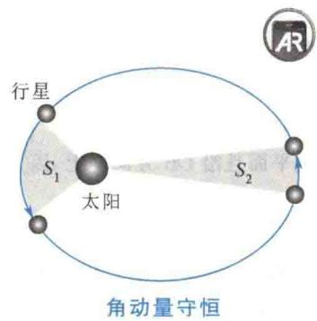

<Example title="例 3.7">
在光滑的水平桌面上，放有质量为 $M$ 的木块，木块与一弹簧相连，弹簧的另一端固定在 $O$ 点，弹簧的刚度系数为 $k$ ，设有一质量为 $m$ 的子弹以初速度 $\pmb{v}_0$ 垂直于 $OA$ 射向木块并留在木块内，如图3.14所示。弹簧原长为 $l_0$ ，子弹击中木块后，木块运动到 $B$ 点，弹簧长度变为 $l$ ，此时 $OB$ 垂直于 $OA$ 。求在 $B$ 点时木块的运动速度 $\pmb{v}_2$

<Solution title="解">
击中瞬间,在水平面内,设由子弹与木块组成的系统的速度为 $v_{1}$ ,沿 $v_{0}$ 方向动量守恒,即有
$$
m v _ {0} = (m + M) v _ {1}\tag{\textcircled{1}}
$$
在由 A 点运动到 B 点的过程中,系统的机械能守恒,即
$$
\frac {1}{2} (m + M) v _ {1} ^ {2} = \frac {1}{2} (m + M) v _ {2} ^ {2} + \frac {1}{2} k (l - l _ {0}) ^ {2}\tag{\textcircled{2}}
$$
在由 A 点运动到 B 点的过程中, 木块在水平面内只受指向 O 点的弹性有心力, 故木块对 O 点的角动量守恒. 设 $v_{2}$ 与 OB 的夹角为 $\theta$ , 则有
<figure class="vp-figure">
  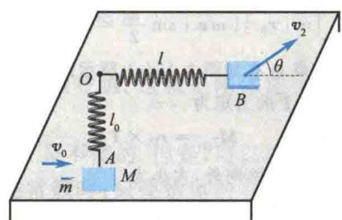
  <figcaption>图3.14 例3.7图</figcaption>
</figure>
<table><tr><td> $l_{0}(m+M)v_{1}=l(m+M)v_{2}\sin\theta$ 联立 1、2两式,得 $\mathbf{v}_{2}$ 的大小为 $v_{2}=\sqrt{\frac{m^{2}}{(m+M)^{2}}v_{0}^{2}-\frac{k(l-l_{0})^{2}}{m+M}}$ </td><td>3</td><td>由式 3 得 $\mathbf{v}_{2}$ 与 OB 的夹角为 $\theta=\arcsin\frac{l_{0}mv_{0}}{l\sqrt{m^{2}v_{0}^{2}-k(l-l_{0})^{2}(m+M)}}$ </td></tr></table>
</Solution>
</Example>

<Example title="例 3.8">
一长为 l 的轻线一端固定于天花板上的 B 点，另一端系一质点 m. 质点 m 在水平面内做角速度为 $\omega$ 的圆周运动，设圆轨道的半径为 r.（1）求质点 m 对圆心 O 和悬点 B 的角动量 $L_{O}$ 和 $L_{B}$ ;（2）求作用在质点 m 上的重力 mg 及张力 T 对圆心 O 和悬点 B 的力矩 $M_{O}$ 和 $M_{B}$ ;（3）讨论质点 m 对 O 点或 B 点的角动量是否守恒（见图 3.15）.
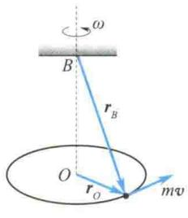  
(a)
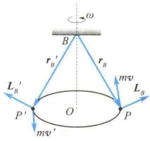  
(b)
<figure class="vp-figure">
  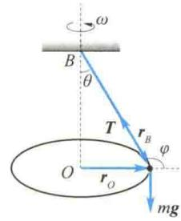
  <figcaption>图3.15 例3.8图</figcaption>
</figure>
(c)

<Solution title="解">
（1）在图3.15(a)中，由圆心 $O$ 向质点 $m$ 引矢量 $\pmb{r}_0$ ，则
$$
\boldsymbol {L} _ {0} = \boldsymbol {r} _ {0} \times m \boldsymbol {v}
$$
其方向垂直于轨道平面且沿 OB 方向向上，因为 $r_{0} \perp mv$ ，所以
$$
L _ {O} = r m v = m r ^ {2} \omega
$$
即质点 m 对圆心 O 的角动量 $L_{0}$ 是一个沿 OB 向上的大小和方向都不变的常矢量.
在图 3.15(b) 中, 由悬点 B 向在某位置 P 处的质点 m 引矢径 $r_{B}$ , 则
$$
\boldsymbol {L} _ {B} = \boldsymbol {r} _ {B} \times m \boldsymbol {v}
$$
即 $L_{B}$ 的方向垂直于 $r_{B}$ 与 mv 所确定的平面. 显然, 质点 m 在不同的位置处, 如 $P'$ 点处, 其矢径 $r_{B}'$ 和动量 $mv'$ 与 $r_{B}$ 和 mv 均不相同, 因此, 其矢积 $L_{B}'$ 与 $L_{B}$ 也不相同, 即 $L_{B}$ 的方向是不断变化的. 这时 $L_{B}$ 的大小为
$$
\mid \boldsymbol {L} _ {B} \mid = \mid \boldsymbol {r} _ {B} \mid \mid m \boldsymbol {v} \mid \sin \frac {\pi}{2} = l m v = m l r \omega
$$
（2）质点 m 在如图 3.15(c) 所示的位置时，对于圆心 O，张力 T 的力矩为
$$
\boldsymbol {M} _ {T _ {O}} = \boldsymbol {r} _ {O} \times \boldsymbol {T}
$$
其方向垂直于纸面向外，大小为
$$
M _ {T _ {O}} = r T \sin \varphi = r T \cos \theta
$$
因为在竖直方向上有 $T\cos \theta = mg$ ，所以
$$
M _ {T _ {O}} = r m g
$$
此时重力对圆心 $O$ 的力矩为
$$
\boldsymbol {M} _ {m g _ {O}} = \boldsymbol {r} _ {O} \times m \boldsymbol {g}
$$
其方向垂直于纸面向里. 因为 $mg$ 始终垂直于轨道平面, 所以 $r_{O} \perp mg$ , 故 $M_{mg_{O}}$ 的大小为
$$
M _ {m g _ {O}} = r m g
$$
由上面的计算可以得出,作用在质点 m 上的张力 T 和重力 mg 对圆心 O 的合力矩为
$$
\boldsymbol {M} _ {O} = \boldsymbol {M} _ {T _ {O}} + \boldsymbol {M} _ {m g _ {O}} = \mathbf {0}
$$
同样，质点 $m$ 在如图3.15(c)所示的位置时，对于悬点 $B$ ，张力 $\pmb{T}$ 因为与 $\pmb{r}_B$ 始终共线，故 $\pmb{T}$ 对 $B$ 点的力矩为零.而重力 $mg$ 对悬点 $B$ 的力矩为
则
$$
\begin{array}{r} {\pmb {M} _ {m g _ {B}} = \pmb {r} _ {B} \times m \pmb {g}} \\ {\pmb {M} _ {B} = \pmb {M} _ {T _ {B}} + \pmb {M} _ {m g _ {B}} = \pmb {M} _ {m g _ {B}}} \end{array}
$$
其方向始终垂直于 $r_{B}$ 与重力作用线 mg 所确定的平面. 由于 $r_{B}$ 的方向在不断地变化, 所以 $M_{mg_{B}}$ 的方向也在不断地变化, 在如图 3.15(c) 所示位置, $M_{mg_{B}}$ 的方向垂直于纸面向里.
（3）由（2）中的讨论可知，重力 mg 和张力 T 对圆心 O 的合力矩为零（实际上 mg 与 T 的合力构成了 m 做圆周运动的向心力，为有心力，其对圆心 O 的合力矩必定为零），所以质点 m 对圆心 O 的角动量守恒，这
与(1)中的讨论一致.
同样，由(2)中的讨论知，因为 $mg$ 对悬点 $B$ 的力矩的方向始终变化，即对悬点 $B$ 的力矩不为零，故质点 $m$ 对悬点 $B$ 的角动量不守恒. 这与前面的结果也是一致的.
</Solution>
</Example>

## 3.4.2 刚体对轴的角动量 刚体定轴转动的角动量定理

### 1. 刚体对轴的角动量

根据前面质点对点和轴的角动量的分析,质点对某点的角动量在通过该点的任意轴上的投影称为质点对该轴的角动量.刚体是特殊的质点系,刚体定轴转动时各质元都以相同的角速度在各自的转动平面内做圆周运动.刚体对转动轴的角动量就是刚体上所有质元对转动轴的角动量之和.设质元P的质量为 $\Delta m_{i}$ ,其到转动轴的距离为 $r_{i}$ ,转动的角速度为 $\omega$ ,则该质元对转动轴的圆心的角动量的大小为
$$
L _ {i} = \Delta m _ {i} r _ {i} ^ {2} \omega
$$
方向沿转动轴方向. 对组成刚体的所有质元求和, 得
$$
L = \sum_ {i} L _ {i} = \sum_ {i} (\Delta m _ {i} r _ {i} ^ {2} \omega) = \left(\sum_ {i} \Delta m _ {i} r _ {i} ^ {2}\right) \omega = J \omega\tag{3.24}
$$
式(3.24) 就是刚体对轴的角动量的大小, 即刚体对某定轴的角动量的大小等于刚体对该轴的转动惯量与角速度的乘积, 方向沿该转动轴, 并与转动的角速度方向相同.

### 2. 刚体定轴转动的角动量定理

当刚体做定轴转动时,其转动惯量保持不变.根据转动定律,有
即
$$
\begin{array}{r l} M = J \alpha & = J \frac {\mathrm{d} \omega}{\mathrm{d} t} = \frac {\mathrm{d} (J \omega)}{\mathrm{d} t} = \frac {\mathrm{d} L}{\mathrm{d} t} \\ M & = \frac {\mathrm{d} L}{\mathrm{d} t} \end{array}\tag{3.25}
$$
式(3.25)说明,定轴转动的刚体所受的合外力矩等于此时刚体的角动量对时间的变化率.这就是刚体定轴转动的角动量定理.
设 $t = t_{0}$ 时， $\omega = \omega_{0}, L = L_{0}$ ，把式(3.25)分离变量并积分，可得
$$
\int_ {t _ {0}} ^ {t} M \mathrm{d} t = \int_ {L _ {0}} ^ {L} \mathrm{d} L = L - L _ {0} = J \omega - J \omega_ {0}\tag{3.26}
$$
式(3.26)说明,定轴转动的刚体所受的合外力矩的冲量矩等于刚体在这段时间内对该轴的角动量的增量.它是刚体定轴转动的角动量定理的积分形式.

## 3.4.3 刚体对轴的角动量守恒定律

由式(3.26)可知,若 M=0, 即刚体所受的合外力矩等于零, 则有
$$
J \omega = J \omega_ {0}
$$
即若外力对某轴的力矩之和为零，则该刚体对同一轴的角动量守恒。这就是刚体定轴转动的角动量守恒定律。
<QRCodeVideo title="刚体对轴的角动量守恒定律" url="https://api.guangyiedu.com/v3/resource/resource/r/NewQrCode-UmqE6kXdJjsnndax0SDP" />  
在推导式(3.25)时,我们强调了转动惯量在转动过程中是不变的.但是,可以证明,当转动的物体不能视为刚体时,即物体的转动惯量不是常数时,只要物体的各部分以同一角速度 $\omega$ 绕该轴转动,式(3.25)依然成立.其积分式相应地变为
$$
\int_ {0} ^ {t} M \mathrm{d} t = J \omega - J _ {0} \omega_ {0}\tag{3.27}
$$
若物体所受合外力矩为零，即 $M = 0$ ，则有
$$
J \omega = J _ {0} \omega_ {0}
$$
<QRCodeVideo title="空中走钢丝为什么要拿一根长杆？" url="https://api.guangyiedu.com/v3/resource/resource/r/NewQrCode-tUKvCmSqaLuiMALCS2j4" />  
空中走钢丝时为什么要拿一根长杆？
也就是说，若外力对某轴的力矩之和为零，则该物体对同一轴的角动量守恒。这就是对轴的角动量守恒定律。
对轴的角动量守恒定律在生产、生活中应用极广. 现仅从两方面作一些原理上的说明.
（1）对于定轴转动的刚体，在转动过程中，若转动惯量 J 始终保持不变，只要满足合外力矩等于零，则刚体转动的角速度就不变。即原来静止的保持静止，原来做匀角速转动的仍做匀角速转动。例如，在飞机、火箭、轮船上用作定向装置的陀螺仪就是利用这一原理制成的。
如图 3.16 所示,陀螺仪的主要部件是绕几何对称轴高速旋转的边缘厚重的转子 D.为了使陀螺仪的转动轴可取空间任何方位,陀螺仪设有对应三维空间坐标的三个支架 $AA'$ 、 $BB'$ 、 $OO'$ .三个支架的轴承处的摩擦极小.当转子高速旋转时,由于摩擦力矩基本上可以忽略,因而在一个较长的时间内都可认为转子的角动量守恒.由于转动惯量不变,因而角速度的大小、方向均不变,即 $OO'$ 轴的方向保持不变.这时无论怎样移动底座,也不会改变陀螺仪的自转方向,从而起到定向作用.在航行时,只要将航行方向与陀螺仪
<figure class="vp-figure">
  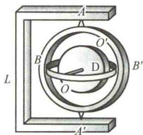
  <figcaption>图 3.16 陀螺仪原理图</figcaption>
</figure>
的自转动轴方向核定,自动驾驶仪就会立即确定当前航行方向与预定方向间的偏离程度,从而及时纠正航行方向.
（2）对于定轴转动的非刚性物体，物体上各质元对转动轴的距离是可以改变的，即转动惯量 $J$ 是可变的。当满足合外力矩等于零时，物体对轴的角动量守恒，即 $J\omega =$ 常矢量。这时 $\omega$ 与 $J$ 成反比，即 $J$ 增加时， $\omega$ 就变小； $J$ 减少时， $\omega$ 就增大。例如，如图3.17所示，一人站在可绕竖直光滑轴转动的转台上，两手各握一个哑铃，两臂伸开时他转动起来，然后他收拢两臂。在此过程中，对竖直轴而言，没有外力矩作用，转台和人这一系统对竖直轴的角动量守恒。所以，当两臂收拢后， $J$ 变小了，旋转角速度就增大了。如果将两臂伸开， $J$ 增大了，旋转角速度又会减小。同样，花样滑冰运动员、芭蕾舞演员在表演时，也是运用角动量守恒定律来增大或减小身体绕对称竖直轴转动的角速度的，从而做出许多优美的动作。
如果研究对象是相互关联的质点、刚体所组成的物体组，也可推得，当物体组对某一定轴的合外力矩等于零时，整个物体组对该轴的角动量守恒。这时有
$$
\sum J \omega + \sum r m v \sin \varphi^ {\prime} = \text {常数}\tag{3.28}
$$
这个式子在解有关力学题时常常用到.
例如，由两个物体组成的系统，原来静止，总角动量为零，当通过内力使一个物体转动时，另一物体必沿反方向转动，而系统的总角动量仍为零。这也可以用下述转台实验来验证：人站在可自由转动的转台上，手举一车轮，使轮轴与转台的转动轴重合，当用手推车轮使其转动时，人和转台就会反向转动。在实际生活中也存在一些这样的例子。例如，直升机在螺旋桨叶片旋转时，为防止机身的反向转动，必须在机尾
附加一侧向旋叶(见图 3.18).
<figure class="vp-figure">
  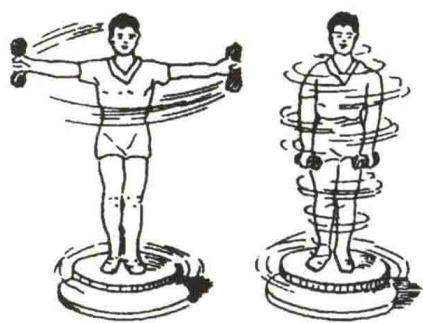
  <figcaption>图 3.17 角动量守恒定律的演示实验</figcaption>
</figure>
<figure class="vp-figure">
  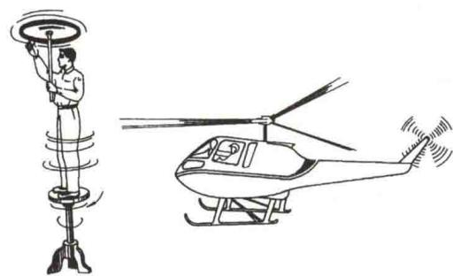
  <figcaption>图 3.18 角动量守恒定律的应用实例</figcaption>
</figure>
  
进动、岁差、章动
为便于读者对刚体的定轴转动有一个较系统的理解,表 3.2 列出了质点与刚体（定轴转动）力学规律的对照情况.
表 3.2 质点与刚体(定轴转动)力学规律的对照情况  
  
刚体和质点运动定理的比较
<table><tr><td>质点</td><td>刚体(定轴转动)</td></tr><tr><td>力 $\boldsymbol{F}$ ,质量 $m$ </td><td>力矩 $\boldsymbol{M} = \boldsymbol{r} \times \boldsymbol{F}$ ,转动惯量 $J = \int r^{2} dm$ </td></tr><tr><td>牛顿第二定律 $\boldsymbol{F} = ma$ </td><td>转动定律 $\boldsymbol{M} = J\alpha$ </td></tr><tr><td>动量 $mv$ ,冲量 $\int F dt$ </td><td>角动量 $L = J\omega$ ,冲量矩 $\int M dt$ </td></tr><tr><td>动量定理 $\int F dt = mv - mv_{0}$ </td><td>角动量定理 $\int M dt = J\omega - J_{0}\omega_{0}$ </td></tr><tr><td>动量守恒定律 $\sum F_{i} = 0$ </td><td>角动量守恒定律 $\boldsymbol{M} = \boldsymbol{0}$ </td></tr><tr><td> $\sum m_{i}v_{i} = \text{常矢量}$ </td><td> $\sum J_{i}\omega_{i} = \text{常矢量}$ </td></tr><tr><td>平动动能 $\frac{1}{2}mv^{2}$ </td><td>转动动能 $\frac{1}{2}J\omega^{2}$ </td></tr><tr><td>力的功 $W = \int_{a}^{b} F \cdot dr$ </td><td>力矩的功 $W = \int_{\theta_{0}}^{\theta} Md\theta$ </td></tr><tr><td>动能定理 $W = \frac{1}{2}mv^{2} - \frac{1}{2}mv_{0}^{2}$ </td><td>动能定理 $W = \frac{1}{2}J\omega^{2} - \frac{1}{2}J\omega_{0}^{2}$ </td></tr></table>

<Example title="例 3.9">
质量很小、长度为 l 的均匀细棒，可绕通过中心 O 点且与纸面垂直的轴在竖直平面内转动。当细棒静止于水平位置时，有一只小虫以速率 $v_{0}$ 垂直落在距 O 点 $\frac{1}{4}l$ 处，并背离 O 点向细棒的 A 端爬行，如图 3.19 所示。设小虫、细棒的质量均为 m。小虫以多大的速率向细棒的 A 端爬行，才能确保细棒以恒定的角速度转动？
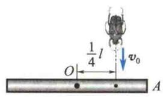  
(a)
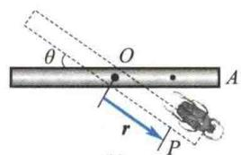  
(b)  
图3.19 例3.9图

<Solution title="解">
如图 3.19 所示, 选择细棒中心为坐标原点, 任意时刻 t 小虫所在细棒位置 P 点对坐标原点的位矢为 r, 小虫爬行的速率为 dr/dt.
小虫以速率 $v_{0}$ 垂直落在细棒上，角动量守恒，即有
$$
m v _ {0} l / 4 = \left[ m l ^ {2} / 1 2 + m (l / 4) ^ {2} \right] \omega
$$
解得 $\omega = 12v_{0}/(7l)$ ，即 $v_{0}$ 、l 为定值时， $\omega$ 恒定.
依据角动量定理, 得
$$
M = \mathrm{d} L / \mathrm{d} t = \mathrm{d} (J \omega) / \mathrm{d} t = \omega \mathrm{d} J / \mathrm{d} t
$$
而由小虫、细棒构成的系统所受合外力矩应为 M = mgr cos θ，转动惯量 J 为
$$
J = m l ^ {2} / 1 2 + m r ^ {2}
$$
故
$$
\begin{array}{r l} m g r \cos \theta & = \omega \mathrm{d} (m l ^ {2} / 1 2 + m r ^ {2}) / \mathrm{d} t \\ & = 2 m r \omega \mathrm{d} r / \mathrm{d} t \end{array}
$$
再利用 $\theta = \omega t$ ，可得
$$
\begin{array}{r l} v & = \mathrm{d} r / \mathrm{d} t = g \cos \omega t / (2 \omega) \\ & = 7 l g \cos [ 1 2 v _ {0} t / (7 l) ] / (2 4 v _ {0}) \end{array}
$$
</Solution>
</Example>

<Example title="例 3.10">
如图 3.20 所示, 质量为 m、长为 l 的均匀细棒, 可绕过其一端的水平轴 O 转动. 现将细棒拉到水平位置 $(OA')$ 后放手, 细棒下摆到竖直位置 (OA) 时, 与静止放置在水平面上 A 点处的质量为 M 的物块做完全弹性碰撞, 物块在水平面上向右滑行了一段距离 s 后停止. 设物块与水平面间的滑动摩擦系数 $\mu$ 处处相同, 求证:
$$
\mu = \frac {6 m ^ {2} l}{(m + 3 M) ^ {2} s}
$$

<Solution title="解">
此题可分解为三个简单过程.
（1）细棒由水平位置下摆至竖直位置但尚未与物块相碰. 此过程机械能守恒. 以细棒、地球为一系统, 以细棒的重心在竖直位置时为重力势能的零势能点, 则
$$
m g \frac {l}{2} = \frac {1}{2} J \omega^ {2} = \frac {1}{6} m l ^ {2} \omega^ {2}\tag{\textcircled{1}}
$$
（2）细棒与物块做完全弹性碰撞. 此过程满足角动量守恒定律(并非动量守恒定律)和机械能守恒定律. 设碰撞后棒的角速度为 $\omega'$ ，物块的速度为 v，则
$$
\frac {1}{3} m l ^ {2} \omega = \frac {1}{3} m l ^ {2} \omega^ {\prime} + l M v
$$
<figure class="vp-figure">
  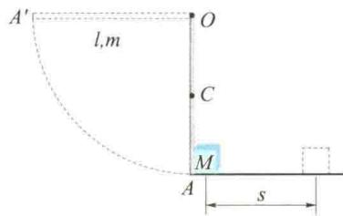
  <figcaption>图3.20 例3.10图</figcaption>
</figure>
$$
\frac {1}{2} \times \frac {1}{3} m l ^ {2} \omega^ {2} = \frac {1}{2} \times \frac {1}{3} m l ^ {2} \omega^ {\prime 2} + \frac {1}{2} M v ^ {2}\tag{\textcircled{2}}
$$
（3）碰撞后物块在水平面上滑行，其满足动能定理，则有
③
$$
- \mu M g s = 0 - \frac {1}{2} M v ^ {2}\tag{\textcircled{4}}
$$
联立式 ①、式 ②、式 ③、式 ④，即可证：
$$
\mu = \frac {6 m ^ {2} l}{(m + 3 M) ^ {2} s}
$$
</Solution>
</Example>
