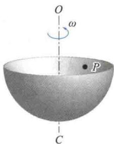
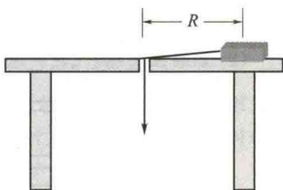

import Guide from '@/components/Guide.astro';
import Knowledge from '@/components/Knowledge.astro';
import Example from '@/components/Example.astro';
import Analysis from '@/components/Analysis.astro';
import Solution from '@/components/Solution.astro';
import Variant from '@/components/Variant.astro';
import Note from '@/components/Note.astro';
import Block from '@/components/Block.astro';
import Method from '@/components/Method.astro';
import Exercise from '@/components/Exercise.astro';

## 选择题

<Exercise title="习题 3.1.1">
(1)有一半径为 $R$ 的水平圆转台,可绕通过其中心的竖直固定光滑轴转动,转动惯量为 $J$ ,开始时转台以匀角速度 $\omega_0$ 转动,此时有一质量为 $m$ 的人站在转台中心,随后人沿半径向外跑去,当人到达转台边缘时,转台的角速度为
( )
A. $\frac{J}{J + mR^2}\omega_0$ .
B. $\frac{J}{(J + m)R^2}\omega_0$ .
C. $\frac{J}{mR^2}\omega_0$ .
D. $\omega_0$ .
</Exercise>

<Exercise title="习题 3.1.2">
如题 3.1.2 图所示,一光滑的半球形碗的内表面半径为 10 cm,以匀角速度 $\omega$ 绕其对称轴 OC 旋转,已知放在碗内表面上的一个小球相对于碗静止,其位置 P 点高于碗底 4 cm,则由此可推知碗旋转的角速度约为
( )
A. 13 rad/s. B. 17 rad/s. C. 10 rad/s. D. 18 rad/s.
</Exercise>

<Exercise title="习题 3.1.3">
如题3.1.3图所示，有一小块物体，置于光滑的水平桌面上，用一绳的一端连接此物体，另一端穿过桌面的小孔，该物体原以角速度 $\omega$ 在距孔 $R$ 的圆周上转动，今将绳从小孔缓慢往下拉，则物体（）A.动能不变，动量改变.B.动量不变，动能改变.C.角动量不变，动量不变.D.角动量改变，动量改变.E.角动量不变，动能、动量都改变.
  
题3.1.2图
  
题3.1.3图

</Exercise>
