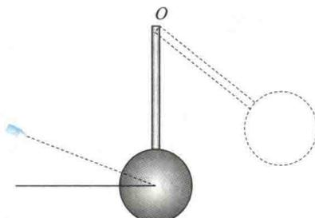

import Guide from '@/components/Guide.astro';
import Knowledge from '@/components/Knowledge.astro';
import Example from '@/components/Example.astro';
import Analysis from '@/components/Analysis.astro';
import Solution from '@/components/Solution.astro';
import Variant from '@/components/Variant.astro';
import Note from '@/components/Note.astro';
import Block from '@/components/Block.astro';
import Method from '@/components/Method.astro';
import Exercise from '@/components/Exercise.astro';

## 填空题

<Exercise title="习题 3.2.1">
半径为 $30 \, cm$ 的飞轮，从静止开始以 $0.5 \, rad/s^{2}$ 的匀角加速度转动，则飞轮边缘上一点在飞轮转过 $240^{\circ}$ 时的切向加速度 $a_{r} =$ \_\_\_\_ ，法向加速度 $a_{n} =$ \_\_\_\_ 。
</Exercise>

<Exercise title="习题 3.2.2">
如题3.2.2图所示，一匀质木球固结在一细棒下端，且可绕水平光滑固定轴 $O$ 转动，今有一子弹沿着与水平面成一角度的方向击中木球而嵌于其中，则在此击中过程中，木球、子弹、细棒系统的\_\_\_\_守恒，原因是\_\_\_\_。木球被击中后，细棒和木球升高的过程中，木球、子弹、细棒、地球系统的\_\_\_\_守恒。

  

题3.2.2图
</Exercise>

<Exercise title="习题 3.2.3">
两个质量分布均匀的圆盘 A 和 B 的密度分别为 $\rho_{A}$ 和 $\rho_{B}$ $(\rho_{A} > \rho_{B})$ ，且两圆盘的总质量和厚度均相同。设两圆盘对

通过盘心且垂直于盘面的轴的转动惯量分别为 $J_{A}$ 和 $J_{B}$ ，则有 $J_{A}$ \_\_\_\_ $J_{B}$ （选填“＞”、“＜”或“＝”）.

</Exercise>
