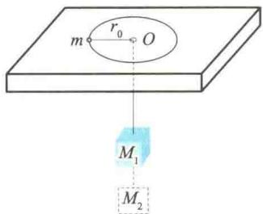
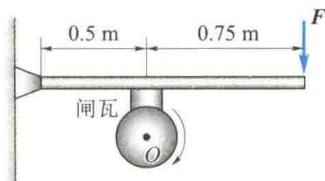
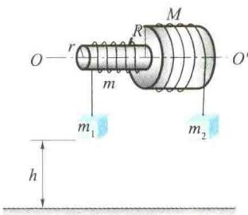
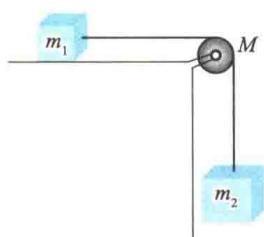
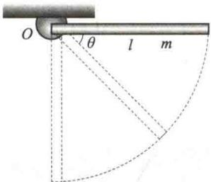
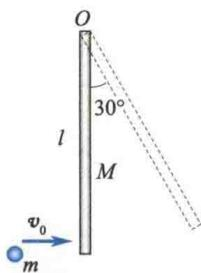
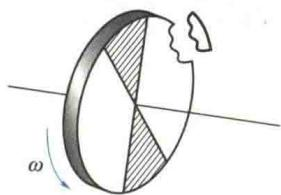
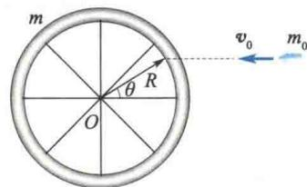
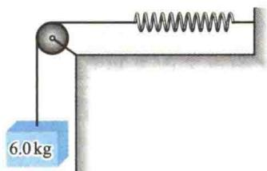

import Guide from '@/components/Guide.astro';
import Knowledge from '@/components/Knowledge.astro';
import Example from '@/components/Example.astro';
import Analysis from '@/components/Analysis.astro';
import Solution from '@/components/Solution.astro';
import Variant from '@/components/Variant.astro';
import Note from '@/components/Note.astro';
import Block from '@/components/Block.astro';
import Method from '@/components/Method.astro';
import Exercise from '@/components/Exercise.astro';

## 解答题

<Exercise title="习题 3.3.1">
刚体平动的特点是什么？平动时刚体上的质元是否可以做曲线运动？
</Exercise>

<Exercise title="习题 3.3.2">
刚体定轴转动的特点是什么？刚体定轴转动时各质元的角速度、线速度、法向加速度、切向加速度是否相同？
</Exercise>

<Exercise title="习题 3.3.3">
刚体的转动惯量与哪些因素有关？请举例说明.
</Exercise>

<Exercise title="习题 3.3.4">
若刚体受到的合外力为零,其合力矩是否一定为零?若刚体受到的合力矩为零,其合外力是否一定为零?
</Exercise>

<Exercise title="习题 3.3.5">
一质量为 m 的质点位于 $(x_{1}, y_{1})$ 处，速度为 $v = v_{x}i + v_{y}j$ ，质点受到一个沿 x 轴负方向的力 f 的作用，求相对于坐标原点的角动量及作用于质点上的力的力矩.
</Exercise>

<Exercise title="习题 3.3.6">
哈雷彗星绕太阳运动的轨道是一个椭圆. 它到太阳的最近距离为 $r_{1}=8.75\times10^{10}$ m, 在此位置时的速率 $v_{1}=5.46\times10^{4}$ m/s, 它离太阳最远时的速率 $v_{2}=9.08\times10^{2}$ m/s, 这时它到太阳的距离 $r_{2}$ 是多少? (太阳位于椭圆的一个焦点处)
</Exercise>

<Exercise title="习题 3.3.7">
一物体的质量为 $3\mathrm{kg}, t = 0$ 时位于 $\pmb{r} = 4\pmb{i}(\mathrm{m})$ 处， $\pmb{v} = i + 6j(\mathrm{m/s})$ ，如一恒力 $f = 5j(\mathrm{N})$ 作用在该物体上，求 $3\mathrm{s}$ 后：(1) 物体动量的变化量；(2) 相对 $z$ 轴角动量的变化量.
</Exercise>

<Exercise title="习题 3.3.8">
一平板中央开一小孔,质量为 m 的小球用细线系住,细线穿过小孔后挂一质量为 $M_{1}$ 的重物.小球做匀速圆周运动,当圆周半径为 $r_{0}$ 时,重物达到平衡.今在 $M_{1}$ 的下方再挂一质量为 $M_{2}$ 的物体,如题 3.3.8 图所示.试问:这时小球做匀速圆周运动的角速度 $\omega'$ 和半径 $r'$ 各为多少?
</Exercise>

<Exercise title="习题 3.3.9">
一飞轮的质量 $m = 60\mathrm{kg}$ ，半径 $R = 0.25\mathrm{m}$ ，绕其水平中心轴 $O$ 转动，转速为 $900\mathrm{r / min}$ 。现有一制动的闸杆，在闸杆的一端加一竖直方向的制动力 $\pmb{F}$ ，可使飞轮减速。已知闸杆的尺寸如题3.3.9图所示，闸瓦与飞轮之间的滑动摩擦系数 $\mu = 0.4$ ，计算飞轮的转动惯量时可将其看作匀质圆盘。
(2) 如果在 2 s 内飞轮转速减少一半, 需加多大的力?
  
题3.3.8图
  
题3.3.9图
</Exercise>

<Exercise title="习题 3.3.10">
固定在一起的两个同轴均匀圆柱体可绕其光滑的水平对称轴 $OO'$ 转动. 设两个圆柱体的半径分别为 R 和 r，质量分别为 M 和 m. 绕在两圆柱体上的细绳分别与物体 $m_{1}$ 和 $m_{2}$ 相连， $m_{1}$ 和 $m_{2}$ 挂在圆柱体的两侧，如题 3.3.10 图所示. 设 $R = 0.20 \, m, r = 0.10 \, m, m = 4 \, kg, M = 10 \, kg, m_{1} = m_{2} = 2 \, kg$ ，且开始时 $m_{1}, m_{2}$ 离地的高度均为 h = 2 m. 求：
(1) 圆柱体转动时的角加速度；
(2) 两侧细绳的张力.
</Exercise>

<Exercise title="习题 3.3.11">
计算题3.3.11图所示的系统中物体的加速度.设滑轮为质量均匀分布的圆柱体,其质量为M,半径为r,在绳与轮缘的摩擦力的作用下旋转,忽略桌面与物体间的摩擦,设 $m_{1}=50\ kg,m_{2}=200\ kg,M=15\ kg,r=0.1\ m$ .
  
题3.3.10图
  
题3.3.11图
</Exercise>

<Exercise title="习题 3.3.12">
如题 3.3.12 图所示,一匀质细杆的质量为 m, 长为 l, 可绕过一端 O 的水平轴自由转动, 杆于水平位置由静止开始摆下. 求:
(1) 初始时刻杆的角加速度;
(2) 杆转过角度 $\theta$ 时的角速度.
</Exercise>

<Exercise title="习题 3.3.13">
如题 3.3.13 图所示, 质量为 M、长为 l 的均匀直棒, 可绕垂直于棒一端的水平轴 O 无摩擦地转动, 它原来静止在平衡位置上. 现有一质量为 m 的弹性小球飞来, 正好在棒的下端与棒垂直相撞. 碰撞后, 棒从平衡位置处摆动到最大角度 $\theta = 30^{\circ}$ 处.
(1) 设该碰撞为弹性碰撞, 试计算小球的初速度 $v_{0}$ 的大小;
(2) 相撞时小球受到多大的冲量？
  
题3.3.12图
  
题3.3.13图
</Exercise>

<Exercise title="习题 3.3.14">
一个质量为 M、半径为 R 并以角速度 $\omega$ 旋转的飞轮（可看作匀质圆盘），在某一瞬时突然有一片质量为 m 的碎片从飞轮的边缘上飞出，如题 3.3.14 图所示。假定碎片脱离飞轮时的瞬时速度方向正好竖直向上。
(1) 碎片能升高多少?
(2) 求飞轮余下部分的角速度、角动量和转动动能.
</Exercise>

<Exercise title="习题 3.3.15">
一质量为 m、半径为 R 的自行车轮，假定质量均匀分布在轮缘上，可绕轴自由转动。另一质量为 $m_{0}$ 的子弹以速度 $v_{0}$ 射入轮缘（如题 3.3.15 图所示方向）。
(1) 开始时车轮是静止的, 子弹射入后的角速度为多少?
(2) 用 $m, m_{0}$ 和 $\theta$ 表示系统（包括车轮和子弹）的末动能和初动能之比.
  
题3.3.14图
  
题3.3.15图
</Exercise>

<Exercise title="习题 3.3.16">
弹簧、定滑轮和物体的连接如题3.3.16图所示，弹簧的刚度系数为 $2.0\mathrm{N / m}$ ；定滑轮可以绕轴自由转动，其转动惯量为 $0.5\mathrm{kg}\cdot \mathrm{m}^2$ ，半径为 $0.30\mathrm{m}$ ，当质量为 $6.0\mathrm{kg}$ 的物体落下 $0.40\mathrm{m}$ 时，它的速率为多大？假设开始时物体静止且弹簧无伸长.
  
题3.3.16图
  
</Exercise>
