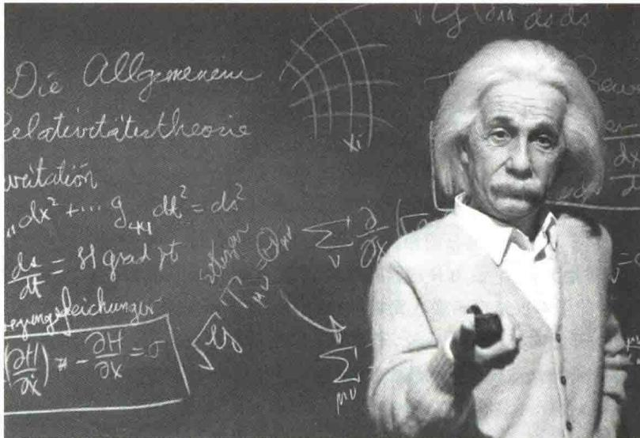
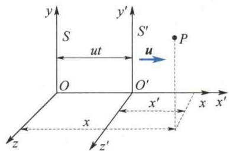

import Guide from '@/components/Guide.astro';
import Knowledge from '@/components/Knowledge.astro';
import Example from '@/components/Example.astro';
import Analysis from '@/components/Analysis.astro';
import Solution from '@/components/Solution.astro';
import Variant from '@/components/Variant.astro';
import Note from '@/components/Note.astro';
import Block from '@/components/Block.astro';
import Method from '@/components/Method.astro';
import Exercise from '@/components/Exercise.astro';

## 第4章 狭义相对论

本章提要
  
广义相对论

对论和量子论是近代物理学的两大理论支柱, 是现代高新技术的理论基础.
相对论是关于时间、空间和物质运动关系的理论，通常包括两部分：狭义相对论（又称特殊相对论）和广义相对论。狭义相对论不考虑物质质量对时空的影响，是相对论的特殊情况。1905年，爱因斯坦发表了《论动体的电动力学》论文，创立了狭义相对论。1915年，爱因斯坦又创立了广义相对论。广义相对论考虑质量对时空的影响，是关于引力的理论。相对论自创立以来，已有百年，经受了大量实验的检验，至今还没发现有什么实验结果与其相违背。
本章重点介绍狭义相对论基础,并将广义相对论的内容作为阅读材料,有兴趣的读者可通过扫描二维码进行阅读.

## 4.1.1 伽利略变换 经典力学时空观

在同一时刻,同一物体的坐标从一个坐标系变换到另一个坐标系,叫作坐标变换.联系这两组坐标的方程,叫作坐标变换方程.设有两个相对做匀速直线运动的参考系S和 $S'$ .参考系 $S'$ (如一节火车车厢)相对参考系S(如地面)沿x轴( $x'$ 轴)正方向做速度为u的匀速直线运动(见图4.1).设时间 $t=t'=0$ 时,两坐标系的原点O与 $O'$ 重合,某一时空点P在S系、 $S'$ 系的坐标分别为 $(x,y,z,t)$ 和 $(x',y',z',t')$ .其坐标变换方程为
  
图4.1 坐标变换
  
伽利略
$$
\left\{ \begin{array}{l l} x ^ {\prime} = x - u t \\ y ^ {\prime} = y \\ z ^ {\prime} = z \\ t ^ {\prime} = t \end{array} \right. \quad \text {或} \quad \left\{ \begin{array}{l l} x = x ^ {\prime} + u t ^ {\prime} \\ y = y ^ {\prime} \\ z = z ^ {\prime} \\ t = t ^ {\prime} \end{array} \right.\tag{4.1}
$$
式(4.1)叫作伽利略坐标变换方程. 这个变换方程已经对时间、空间性质作了某些假定. 这些假定主要有两条. 第一, 假定了时间对于一切参考系、坐标系都是相同的, 也就是假定存在与任何具体参考系的运动状态无关的同一时间, 即 $t = t'$ . 既然时间是不变的, 那么, 时间间隔 $\Delta t = t_2 - t_1 = t_2' - t_1' = \Delta t'$ 在一切参考系中也都是相同的, 时间间隔与空间坐标变换无关. 时间是用时钟测量的数值, 这相当于假定存在不受运动状态影响的时钟. 第二, 假定了在任意确定时刻, 空间两点间的长度为
$$
\Delta L = \sqrt {(x _ {2} - x _ {1}) ^ {2} + (y _ {2} - y _ {1}) ^ {2} + (z _ {2} - z _ {1}) ^ {2}}
$$
对于一切参考系、坐标系都是相同的，也就是假定空间长度与任何具体参考系的运动状态无关。空间长度是用尺测量的数量，这相当于假定存在不受运动状态影响的直尺。用数学式表示就是
或
$$
\begin{array}{r l} & \Delta L = \Delta L ^ {\prime} \\ & \sqrt {(x _ {2} - x _ {1}) ^ {2} + (y _ {2} - y _ {1}) ^ {2} + (z _ {2} - z _ {1}) ^ {2}} \\ & = \sqrt {(x _ {2} ^ {\prime} - x _ {1} ^ {\prime}) ^ {2} + (y _ {2} ^ {\prime} - y _ {1} ^ {\prime}) ^ {2} + (z _ {2} ^ {\prime} - z _ {1} ^ {\prime}) ^ {2}} \end{array}
$$
这些假定与经典力学时空观是一致的. 牛顿说: “绝对的、真正的和数学的时间, 就其本质而言, 是永远均匀地流逝着, 与任何外界事物无关”, “绝对空间, 就其本质而言, 是与任何外界事物无关的, 它永远不动、永远不变”, 这就是经典力学时空观, 也称绝对时空观. 按照这种观点, 时间和空间彼此独立, 互不相关, 并且不受物质和运动的影响. 这种绝对时间可以形象地比拟为独立的不断流逝着的流水; 绝对空间可以比拟为能容纳宇宙万物的一个无形的、永不运动的容器. 伽利略变换就是以这种绝对时空观为前提的. 可以说, 伽利略变换是绝对时空观的数学表述.

## 4.1.2 伽利略相对性原理

伽利略曾对封闭的船舱里的力学现象作出过解释，他指出，在匀速运动的船舱中的人不能根据任何现象来判断船究竟是运动还是停止。当人在船板上跳跃时，人所跳过的距离和在一条静止的船上跳跃时所跳过的距离完全相同。也就是说，人向船尾跳时并不比人向船头跳时——由于船的匀速运动——跳得更远些，虽然当人跳向空中时，下面的船板正在向着和人跳跃方向相反的方向运动。当一个人向另一个人抛一个东西时，如果两个人分别站在船头和船尾，这个人费的力并不比他们站在相反的位置时所费的力更大。从挂在天花板下的装着水的水瓶里滴下的水滴，将竖直地落在地板上，没有任何一滴水偏向船尾方向滴落，虽然当水滴尚在空中时，船在向前走。在这里，伽利略描述的种种现象表明：一切彼此做匀速直线运动的惯性系，对描述运动的力学规律来说是完全相同的。在一个惯性系内所做的任何力学实验都不能确定这个惯性系是处于静止状态还是处于匀速直线运动状态。或者说，力学规律对一切惯性系都是等价的。这就是力学的相对性原理，也称伽利略相对性原理，或称经典相对性原理。
一个物理规律,它的基本定律用数学表述总可以写成一个数学方程式.如果方程式的每一项都服从相同的变换法则,则称该方程在这个变换下是协变的(不变式是协变式的特例,方程式中的每一项在变换下都不变).在某个变换下协变的物理规律,它的基本定律在该变换联系的那些参考系中具有相同的数学表达式,通常称这个规律在该变换下不变.经典力学的基本定律是牛顿运动定律,而牛顿运动定律对于由伽利略变换联系的所有惯性系都有相同的数学表达式,因此说经典力学服从伽利略变换,满足伽利略相对性原理.
把式(4.1)对时间 t 求一次导数, 得
$$
\left\{ \begin{array}{l} v _ {x} ^ {\prime} = v _ {x} - u \\ v _ {y} ^ {\prime} = v _ {y} \\ v _ {z} ^ {\prime} = v _ {z} \end{array} \right.\tag{4.2}
$$
这就是 S 系和 $S'$ 系之间的速度变换法则, 称为伽利略速度变换法则或经典速度相加定理.
把式(4.2)对时间 t 求一次导数, 得到 S 系和 $S'$ 系的加速度变换关系为
$$
\left\{ \begin{array}{l} a _ {x} ^ {\prime} = a _ {x} \\ a _ {y} ^ {\prime} = a _ {y} \\ a _ {z} ^ {\prime} = a _ {z} \end{array} \right.\tag{4.3}
$$
式(4.3)说明在所有惯性系中,加速度是不变量.经典力学中质量也是与参考系选择无关的物理量,即 $m = m'$ .于是,牛顿第二定律在所有惯性系中都具有相同的数学表述,即在 S 系中有 F = ma,则在 $S'$ 系中一定有 $F' = m'a'$ .
