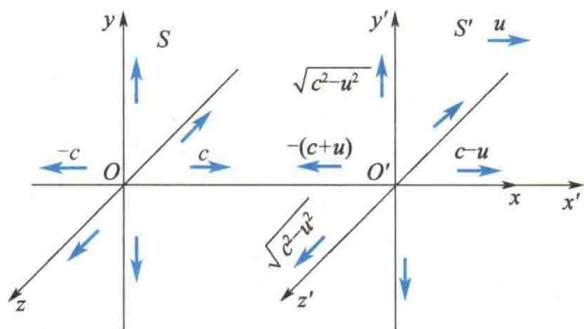
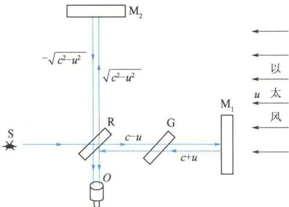

import Guide from '@/components/Guide.astro';
import Knowledge from '@/components/Knowledge.astro';
import Example from '@/components/Example.astro';
import Analysis from '@/components/Analysis.astro';
import Solution from '@/components/Solution.astro';
import Variant from '@/components/Variant.astro';
import Note from '@/components/Note.astro';
import Block from '@/components/Block.astro';
import Method from '@/components/Method.astro';
import Exercise from '@/components/Exercise.astro';

在经典力学中,如声学的研究表明,波动是机械振动在弹性介质中的传播过程.没有弹性介质,就不会有机械波.当时的物理学家认为可以用这样的框架来解释一切波动现象.19世纪,特别是法拉第发现电磁感应定律(1831年)之后,电磁技术被广泛地应用到工业和日常生活之中,促进了人们对电磁运动规律的深入探索.1865年,麦克斯韦建立了描述电磁运动普遍规律的麦克斯韦方程组,其地位、作用相当于经典力学中的牛顿运动定律.麦克斯韦从这组方程出发,预言了电磁波的存在.1888年,赫兹实验证实了电磁波的存在,这是物理学发展史上的重大事件.电磁波就是以波动形式传播的电磁场.如果将真空中电磁波的波动方程与机械波的波动方程相比,就会发现电磁波的波速等于光速,于是断定光是特定波长范围的电磁波.由此麦克斯韦提出了光的电磁学说.人们在考察这一理论的基础时碰到了一些困难.当时,这些困难集中在经典电磁学的以太假说上.以太假说的主要内容是:以太是传播包括光波在内的电磁波的弹性介质,它充满整个宇宙空间.以太中的带电粒子振动会引起以太变形,这种变形以弹性波的形式传播,这就是电磁波.当时人们普遍认为,在相对以太静止的惯性系中,麦克斯韦方程组是成立的,因此导出的电磁波的波动方程成立.电磁波沿各方向传播的速度都等于恒量c.那么,在相对以太运动的惯性系中,按伽利略变换,电磁波沿各方向传播的速度并不等于恒量c.这一结果很重要,引起了当时物理学家的重视.下面计算按伽利略速度变换法则预言的在相对以太做匀速直线运动的参考系中光在真空中传播的速度.设S系相对以太静止, $S'$ 系相对以太的速度为u(见图4.2).光在S系中沿任意方向的速度[设为 $\boldsymbol{v}=\boldsymbol{v}(v_{x},v_{y},v_{z})$ ]的大小都相等,即
$$
v = \sqrt {v _ {x} ^ {2} + v _ {y} ^ {2} + v _ {z} ^ {2}} = c
$$
  
图 4.2 按伽利略速度变换预言 $S'$ 系中光的速度
按伽利略速度变换式(4.2)，计算在 $S'$ 系中光沿 $x'$ 轴、 $y'$ 轴方向传播的速度 $v_x'$ 、 $v_y'$ 。当光沿 $x'$ 轴正方向传播时，要求真空中光速为 $v_x' > 0$ ， $v_y' = v_z' = 0$ ，式(4.2)中 $v_y = v_z = 0$ ， $v_x = c$ ，所以，由此变换得到 $v_x' = c - u$ 。当光沿 $x'$ 轴负方向传播时，要求 $v_x' < 0$ ，$v_{y}^{\prime}=v_{z}^{\prime}=0$ ，式(4.2)中 $v_{y}=v_{z}=0,v_{x}=-c$ ，便得到 $v_{x}^{\prime}=-(c+u)$ 。当光沿垂直于 $x^{\prime}$ 轴的方向传播时，如沿 $y^{\prime}$ 轴正方向传播，相当于要求 $v_{x}^{\prime}=v_{z}^{\prime}=0,v_{y}^{\prime}>0$ ，则式(4.2)中 $v_{x}=u,v_{z}=0$ ，再代入前面速度的公式，得 $u^{2}+v_{y}^{2}+0=c^{2}$ ，即 $v_{y}^{\prime}=v_{y}=\sqrt{c^{2}-u^{2}}$ ，其他沿垂直于 $x^{\prime}$ 轴的方向传播的光速，仿此计算，为 $\pm\sqrt{c^{2}-u^{2}}$ 。
当时(19世纪)，人们认为伽利略变换对一切物理规律都是适用的，因此上述的计算结果应该是正确的。而麦克斯韦方程组在伽利略变换下，方程的形式发生了变化，只能说明，不是伽利略变换不对，而是麦克斯韦方程组不服从伽利略变换，它只在相对以太静止的惯性系里才成立。这样，以太就成了一个优越的参考系。既然根据伽利略相对性原理，人们不可能用力学实验找到力学中优越的惯性系（绝对空间），而现在人们便可以用测量运动物体中光速的方法去寻找这一优越的参考系——以太。
人们若找到以太，则把以太定义为绝对空间，相当于找到了牛顿的绝对空间。于是，人们纷纷设计一些实验来寻找以太。在这些实验中，以迈克耳孙-莫雷的实验精度最高 $\left[\left(\frac{u}{c}\right)^2\right]$ ，最具代表性。
迈克耳孙-莫雷实验的目的是观测地球相对以太的绝对运动. 实验装置是迈克耳孙干涉仪. 该实验的光路原理图如图 4.3 所示. 实验原理及实验步骤的说明如下.
  
图 4.3 迈克耳孙-莫雷实验的光路原理图
设以太相对太阳系(S 系)静止,地球( $S'$ 系)相对太阳系的速度为 u. 实验时,先将干涉仪的一臂(如 $RM_{1}$ )与地球运动方向平行,另一臂(如 $RM_{2}$ )与地球运动方向垂直. 根据伽利略速度变换法则,在与地球固连的实验室参考系中,光沿各方向传播的速度的大小并不相等(见图 4.2). 当两臂长相等时,光程差不为零,可以看到干涉条纹. 如果将整个装置缓慢转过 $90^{\circ}$ , 应该发现干涉条纹移动. 由条纹移动的数目,可以推算出地球相对以太参考系的绝对速度 u. 现在来计算光线通过两臂往返的时间. 对 $RM_{1}$ 臂, 设臂长为 $l_{1}$ , 利用前面已经计算的光沿 $x'$ 轴正、负方向的速度(见图 4.2), 则得
$$
t _ {1} = \frac {l _ {1}}{c - u} + \frac {l _ {1}}{c + u} = \frac {2 l _ {1} c}{c ^ {2} - u ^ {2}}\tag{4.4}
$$
对 $RM_{2}$ 臂，设臂长为 $l_{2}$ ，利用前面计算过的光沿 $y'$ 轴正、负方向传播的速度，求得光通过 $RM_{2}$ 臂往返的时间是
$$
t _ {2} = \frac {2 l _ {2}}{\sqrt {c ^ {2} - u ^ {2}}}
$$
时间差为
$$
\Delta t = t _ {1} - t _ {2} = \frac {2}{c} \left[ \frac {l _ {1}}{1 - \left(\frac {u}{c}\right) ^ {2}} - \frac {l _ {2}}{\sqrt {1 - \left(\frac {u}{c}\right) ^ {2}}} \right]\tag{4.5}
$$
转过 $90^{\circ}$ 后, 时间差为
$$
\Delta t ^ {\prime} = t _ {1} ^ {\prime} - t _ {2} ^ {\prime} = \frac {2}{c} \left[ \frac {l _ {1}}{\sqrt {1 - \left(\frac {u}{c}\right) ^ {2}}} - \frac {l _ {2}}{1 - \left(\frac {u}{c}\right) ^ {2}} \right]\tag{4.6}
$$
于是得到干涉仪转动前后,光通过两臂的时间差的改变量为
$$
\delta t = \Delta t - \Delta t ^ {\prime} = \frac {2 (l _ {1} + l _ {2})}{c} \left[ \frac {1}{1 - \left(\frac {u}{c}\right) ^ {2}} - \frac {1}{\sqrt {1 - \left(\frac {u}{c}\right) ^ {2}}} \right]
$$
考虑到 $\frac{u}{c}$ 是小量，利用如下近似公式：
$$
\frac {1}{1 - \alpha} \approx 1 + \alpha , \quad \alpha = \left(\frac {u}{c}\right) ^ {2}
$$
$$
\frac {1}{\sqrt {1 - \alpha}} \approx 1 + \frac {1}{2} \alpha
$$
则
$$
\delta t \approx \frac {l _ {1} + l _ {2}}{c} \left(\frac {u}{c}\right) ^ {2}
$$
因此，干涉条纹应移动一定的数目。也就是说，在缓慢地旋转迈克耳孙干涉仪时，应该观察到光的干涉条纹移动。然而，1881年，迈克耳孙首次实验时，并没有观察到预期的干涉条纹的移动，也就是说，观察的结果是干涉条纹的零移动。1887年，迈克耳孙和莫雷提高了实验精度，使臂长 $l_{1}=l_{2}=l=11\ m$ ，光波波长 $\lambda=5.9\times10^{-7}\ m$ ，如果取 $u=3.0\times10^{4}\ m/s$ （为地球绕太阳公转的速度），预期 $\Delta N\approx0.37$ 条。但实验观测值小于0.01条，或者说，观察不到干涉条纹的移动。当然，地球有公转和自转，并不是一个真正的惯性系，但在实验持续的如此短的时间内，将地球作为惯性系是没有任何问题的。当然，太阳系也是运动着的，为了避免公转速度与太阳系运动速度正好抵消这种偶然可能性，迈克耳孙和莫雷经过半年后（此时地球相对太阳系运动方向相反）又重复实验，结果仍然没有观察到干涉条纹的移动。之后，许多科学家在地球的不同地点、不同季节里重复迈克耳孙-莫雷实验，结果都没有观察到干涉条纹的移动，也就是说，无法测出地球相对以太的运动。
当时人们认为在地球上用实验应该能测出地球相对以太的运动, 可是一系列实验都否定了这个观点. 于是, 不少科学家提出许多种理论来解释迈克耳孙-莫雷实验. 例如, 洛伦兹的运动长度收缩的假说, 以太完全被实物牵引的假说等, 都保留了以太, 可以解释迈克耳孙-莫雷实验的结果; 也有人(如里兹)认为应该抛弃以太, 同样可以解释迈克耳孙-莫雷实验的结果. 在这一系列理论中, 爱因斯坦的狭义相对论是唯一能圆满地解释迈克耳孙-莫雷实验和其他有关实验、观察事实的理论.

