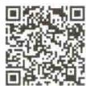
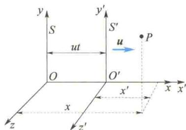

import Guide from '@/components/Guide.astro';
import Knowledge from '@/components/Knowledge.astro';
import Example from '@/components/Example.astro';
import Analysis from '@/components/Analysis.astro';
import Solution from '@/components/Solution.astro';
import Variant from '@/components/Variant.astro';
import Note from '@/components/Note.astro';
import Block from '@/components/Block.astro';
import Method from '@/components/Method.astro';
import Exercise from '@/components/Exercise.astro';

## 4.3.1 狭义相对论的两条基本原理

任何实验都没有观察到地球相对以太参考系的运动,爱因斯坦认为应该抛弃以太,根本就不存在那样一个假想的以太参考系.电磁场不是介质的状态,而是独立的实体,是物质存在的一种基本形态.

实验表明,电磁现象(包括光)与力学现象一样,并不存在特殊的最优越的参考系(力学中最优越的参考系指牛顿的绝对空间,电磁学中最优越的参考系指以太).在所有惯性系中,电磁理论的基本定律(麦克斯韦方程组)具有相同的数学形式,这表明电磁现象也满足物理的相对性原理.那么,经典电磁理论与伽利略变换之间存在的矛盾该怎么解决?这就要求通过建立惯性系之间新的变换关系式和新的相对性原理来解决这个基本矛盾.经典电磁理论应该满足这个新的变换关系式和新的相对性原理,而经典力学则应该受到改造,使之适合这个新的变换关系.当然,在回到宏观世界、低速运动时,应该要求新的力学过渡到经典力学,新的坐标变换过渡到伽利略变换.因为在宏观低速的条件下,牛顿力学和伽利略变换都被实验验证是正确的.

实验表明,对任何惯性系,电磁波(光波)在真空中沿任何方向传播的速度量值都为 c,与光源的运动状态无关.

爱因斯坦把上述观点概括表述为狭义相对论的两条基本原理.

爱因斯坦

（1）相对性原理：所有物理定律在一切惯性系中都具有相同的形式。或者说，所有惯性系都是平权的，在它们之中所有物理规律都一样。

（2）光速不变原理：所有惯性系中测量到的真空中的光速沿各个方向都等于 $c$ 与光源的运动状态无关.

这两条基本原理是整个狭义相对论的基础。爱因斯坦于1905年建立狭义相对论时，将上述两条基本原理称作“两条基本假设”。因为当时只有为数不多的几个实验事实。然而，至今已有上百年，大量实验事实直接、间接地验证了这两条基本假设和相对论的结论，因此改称为原理。

## 4.3.2 洛伦兹变换

  

伽利略变换与

洛伦兹变换

设 S 系和 $S'$ 系是两个相对做匀速直线运动的惯性系，如图 4.4 所示。可以适当地选取坐标轴、坐标原点和计时零点，使 S 系与 $S'$ 系的关系满足以下规定：设 $S'$ 系沿 S 系的 x 轴正方向以速度 u 相对 S 系做匀速直线运动； $x'$ 轴、 $y'$ 轴、 $z'$ 轴分别与 x 轴、y 轴、z 轴平行；S 系的坐标原点 O 与 $S'$ 系的坐标原点 $O'$ 重合时，两惯性系在坐标原点处的时钟都指示零点。洛伦兹求出了同一事件 P（在某时刻、空间某点的物理事件，仅用一个时空点来表示）的两组坐标 $(x,y,z,t)$ 和 $(x^{\prime},y^{\prime},z^{\prime},t^{\prime})$ 之间存在如下关系. $S\to S^{\prime}$ 的洛伦兹变换（正变换）方程为

  

图4.4 两个相对做匀速直线运动的坐标系

$$

\left\{ \begin{array}{l} x ^ {\prime} = \gamma (x - u t) \\ y ^ {\prime} = y \\ z ^ {\prime} = z \\ t ^ {\prime} = \gamma \left(t - \frac {u}{c ^ {2}} x\right) \end{array} \right.\tag{4.7a}

$$

$S'\rightarrow S$ 的洛伦兹变换(逆变换)方程为

$$

\left\{ \begin{array}{l} x = \gamma (x ^ {\prime} + u t ^ {\prime}) \\ y = y ^ {\prime} \\ z = z ^ {\prime} \\ t = \gamma \left(t ^ {\prime} + \frac {u}{c ^ {2}} x ^ {\prime}\right) \end{array} \right.\tag{4.7b}

$$

式中

$$

\gamma = \frac {1}{\sqrt {1 - \left(\frac {u}{c}\right) ^ {2}}} = \frac {1}{\sqrt {1 - \beta^ {2}}}

$$

$$

\beta = \frac {u}{c}

$$

事实上,早在爱因斯坦建立狭义相对论之前,洛伦兹在研究电磁场理论、解释迈克耳孙-莫雷实验时就提出了这些变换方程,因此将式(4.7a)和式(4.7b)称为洛伦兹变换式.

  

洛伦兹

## \*4.3.3 洛伦兹变换式的具体推导

仍采用图4.4中的两个惯性系 $S$ 和 $S^{\prime}$ ，显然有 $y^{\prime} = y,z^{\prime} = z.$ 现在主要推导 $x$ 和 $t$ 的变换式.对于 $O$ 点，在惯性系 $S$ 中观测，不论什么时间，总是有 $x = 0$ ，但在惯性系 $S^{\prime}$ 中观测，其在 $t^\prime$ 时刻的坐标是 $x^{\prime} = -ut^{\prime}$ ，亦即 $x^{\prime} + ut^{\prime} = 0.$ 可见对同一空间点 $O$ ，数值 $x$ 和 $x^{\prime} + ut^{\prime}$ 同时为零.由于空间和时间都是均匀的，变换必须是线性的，因此在任意时刻、任意一点（包括 $O$ 点）， $x$ 与 $x^{\prime} + ut^{\prime}$ 之间必然存在一个比例关系，即

$$

x = k (x ^ {\prime} + u t ^ {\prime})\tag{4.8}

$$

式中， $k$ 为不为零的常数.用同样的方法对 $O^{\prime}$ 点进行分析，有

$$

x ^ {\prime} = k ^ {\prime} (x - u t)\tag{4.9}

$$

根据狭义相对性原理,两个惯性系是等价的,除把 u 改为 -u 外,上面两式应有相同的数学形式.这就要求 $k = k'$ ,于是

$$

x ^ {\prime} = k (x - u t)\tag{4.10}

$$

式(4.8)、式(4.10)是满足狭义相对论第一条基本原理的变换式.为了求出常数k,需要结合第二条基本原理.设 $t=t'=0$ ,两坐标系原点重合时,在重合点发出一沿x轴传播的光信号,则在任意瞬时(在S系中测量为t,在 $S'$ 系测量中为 $t'$ ),光信号到达的位置对两坐标系来说,分别为

$$

x = c t, \quad x ^ {\prime} = c t ^ {\prime}\tag{4.11}

$$

把式 $(4.8)$ 和式 $(4.10)$ 相乘，得

$$

\begin{array}{l} x x ^ {\prime} = k ^ {2} (x - u t) (x ^ {\prime} + u t ^ {\prime}) \\ c ^ {2} t t ^ {\prime} = k ^ {2} t t ^ {\prime} (c - u) (c + u) \end{array}

$$

再把式(4.11)代入上式,得

由此求得

$$

k = \frac {c}{\sqrt {c ^ {2} - u ^ {2}}} = \frac {1}{\sqrt {1 - \left(\frac {u}{c}\right) ^ {2}}}

$$

则式（4.8）、式（4.10）可写成

$$

x = \frac {x ^ {\prime} + u t ^ {\prime}}{\sqrt {1 - \left(\frac {u}{c}\right) ^ {2}}}, x ^ {\prime} = \frac {x - u t}{\sqrt {1 - \left(\frac {u}{c}\right) ^ {2}}}

$$

从这两个式子消去 $x^{\prime}$ 或 $x$ ，便得到关于时间的变换式.消去 $x^{\prime}$ ，得

$$

x \sqrt {1 - \left(\frac {u}{c}\right) ^ {2}} = \frac {x - u t}{\sqrt {1 - \left(\frac {u}{c}\right) ^ {2}}} + u t ^ {\prime}

$$

由此求得

$$

t ^ {\prime} = \frac {t - \frac {u x}{c ^ {2}}}{\sqrt {1 - \left(\frac {u}{c}\right) ^ {2}}}

$$

同样，消去 $x$ 得

$$

t = \frac {t ^ {\prime} + \frac {u x ^ {\prime}}{c ^ {2}}}{\sqrt {1 - \left(\frac {u}{c}\right) ^ {2}}}

$$

把 k 换成一般文献中常用的符号 $\gamma$ ，便得到洛伦兹变换式.

对于洛伦兹变换需作如下几点说明.

（1）在狭义相对论中，洛伦兹变换占据中心地位。它以确切的数学语言反映了相对论与伽利略变换及经典相对性原理的本质差别。新的相对论时空观的内容都集中表现在洛伦兹变换上。相对论的物理定律的数学表达式（如力学规律，见相对论动力学）在洛伦兹变换下保持不变。

（2）再次强调，洛伦兹变换是同一事件在不同惯性系中两组时空坐标之间的变换。所以，在应用时，必须首先核实 $(x, y, z, t)$ 和 $(x', y', z', t')$ 确实代表了同一个事件。

（3）各个惯性系中的时间、空间量度的基准必须一致. 时间的基准必须选择相同的物理过程, 如某种晶体振动的周期. 空间长度的基准必须选择相同的物体或对象, 如某种原子的半径或某一定频率的电磁波长. 将作为基准的过程和物体分别称为标准时钟和标准直尺. 统一规定, 各个惯性系中的钟和尺, 必须相对于该惯性系处在静止状态. 这样, 各个惯性系时空度量结果的差异, 反映出与这些惯性系固连的标准时钟和标准直尺的运动状态的差异.

（4）由式(4.7a)和式(4.7b)可知，不仅 $x^{\prime}$ 是x、t的函数， $t^{\prime}$ 也是x、t的函数，而且都与两惯性系的相对速度u有关。这就是说，相对论将时间和空间，以及它们与物质的运动不可分割地联系起来了。

（5）时间和空间的坐标必须都是实数，变换式中 $\sqrt{1 - \left(\frac{u}{c}\right)^2}$ 不应该出现虚数，这就要求 $u \leqslant c$ ，而 $u$ 代表选为参考系的任意两个物理系统的相对速度。这就得到一个结论：物体的速度有个上限，就是光速 $c$ 。换句话说，任何物体都不能超光速运动。这是狭义相对论本身的要求，它已被现代科技实践证实。

(6) 洛伦兹变换与伽利略变换在本质上不同, 但在低速 $(u \ll c)$ 和宏观世界范围内 (即空间尺度远小于宇宙尺度), 洛伦兹变换可以还原为伽利略变换. 利用这两个条件, 因为 $u \ll c$ , 所以

$$

\beta = \frac {u}{c} \rightarrow 0

$$

于是

$$

\gamma = \frac {1}{\sqrt {1 - \left(\frac {u}{c}\right) ^ {2}}} \rightarrow 1

$$

$$

\frac {u}{c ^ {2}} x \rightarrow 0

$$

代入式(4.7a)和式(4.7b)便过渡为伽利略变换式.这就说明，伽利略变换只是洛伦兹变换的一种特殊情况，而洛伦兹变换更具普遍性.通常把 $u \ll c$ 叫作经典极限条件或非相对论条件.

## 4.3.4 洛伦兹速度变换

现在考虑一个质点 P 在某一瞬时的速度. 设该质点在 S 系的速度为 $\boldsymbol{v}(v_{x}, v_{y}, v_{z})$ ，在 $S'$ 系的速度为 $\boldsymbol{v}'(v_{x}', v_{y}', v_{z}')$ . 根据速度的定义，则

$$

\begin{array}{l} v _ {x} = \frac {\mathrm{d} x}{\mathrm{d} t}, \quad v _ {y} = \frac {\mathrm{d} y}{\mathrm{d} t}, \quad v _ {z} = \frac {\mathrm{d} z}{\mathrm{d} t} \\ v _ {x} ^ {\prime} = \frac {\mathrm{d} x ^ {\prime}}{\mathrm{d} t ^ {\prime}}, \quad v _ {y} ^ {\prime} = \frac {\mathrm{d} y ^ {\prime}}{\mathrm{d} t ^ {\prime}}, \quad v _ {z} ^ {\prime} = \frac {\mathrm{d} z ^ {\prime}}{\mathrm{d} t ^ {\prime}} \end{array}

$$

对洛伦兹变换式 $(4.7a)$ 取微分,得

$$

\begin{array}{r l} \mathrm{d} x ^ {\prime} & = \gamma (\mathrm{d} x - u \mathrm{d} t) = \gamma \left(\frac {\mathrm{d} x}{\mathrm{d} t} - u\right) \mathrm{d} t \\ \mathrm{d} y ^ {\prime} & = \mathrm{d} y \\ \mathrm{d} z ^ {\prime} & = \mathrm{d} z \\ \mathrm{d} t ^ {\prime} & = \gamma \left(\mathrm{d} t - \frac {u}{c ^ {2}} \mathrm{d} x\right) = \gamma \left(1 - \frac {u}{c ^ {2}} \frac {\mathrm{d} x}{\mathrm{d} t}\right) \mathrm{d} t = \gamma \left(1 - \frac {u v _ {x}}{c ^ {2}}\right) \mathrm{d} t \end{array}

$$

用 $\mathrm{dt}^{\prime}$ 去除前三个式子，即得 $S$ 系到 $S^{\prime}$ 系的洛伦兹速度变换式为

$$

\left\{ \begin{array}{l} v _ {x} ^ {\prime} = \frac {\mathrm{d} x ^ {\prime}}{\mathrm{d} t ^ {\prime}} = \frac {\gamma (v _ {x} - u) \mathrm{d} t}{\gamma \left(1 - \frac {u v _ {x}}{c ^ {2}}\right) \mathrm{d} t} = \frac {v _ {x} - u}{1 - \frac {u v _ {x}}{c ^ {2}}} \\ v _ {y} ^ {\prime} = \frac {\mathrm{d} y ^ {\prime}}{\mathrm{d} t ^ {\prime}} = \frac {\mathrm{d} y}{\gamma \left(1 - \frac {u v _ {x}}{c ^ {2}}\right) \mathrm{d} t} = \frac {v _ {y}}{\gamma \left(1 - \frac {u v _ {x}}{c ^ {2}}\right)} \\ v _ {z} ^ {\prime} = \frac {\mathrm{d} z ^ {\prime}}{\mathrm{d} t ^ {\prime}} = \frac {\mathrm{d} z}{\gamma \left(1 - \frac {u v _ {x}}{c ^ {2}}\right) \mathrm{d} t} = \frac {v _ {z}}{\gamma \left(1 - \frac {u v _ {x}}{c ^ {2}}\right)} \end{array} \right.\tag{4.12}

$$

根据相对性原理,把式(4.12)中的u换为-u,带“/”的量和不带“/”的量对调,便得到从 $S'$ 系到S系的洛伦兹速度变换式为

$$

\left\{ \begin{array}{l} v _ {x} = \frac {v _ {x} ^ {\prime} + u}{1 + \frac {u v _ {x} ^ {\prime}}{c ^ {2}}} \\ v _ {y} = \frac {v _ {y} ^ {\prime}}{\gamma \left(1 + \frac {u v _ {x} ^ {\prime}}{c ^ {2}}\right)} \\ v _ {z} = \frac {v _ {z} ^ {\prime}}{\gamma \left(1 + \frac {u v _ {x} ^ {\prime}}{c ^ {2}}\right)} \end{array} \right.\tag{4.13}

$$

虽然垂直于运动方向的长度不变,但速度是变的,这是因为时间间隔变了.

当 $u \ll c$ 和 $v_{x} \ll c$ 时， $\gamma \to 1, \frac{uv_{x}}{c^{2}} \to 0$ ，则式(4.12)就蜕变为

$$

v _ {x} ^ {\prime} = v _ {x} - u, \quad v _ {y} ^ {\prime} = v _ {y}, \quad v _ {z} ^ {\prime} = v _ {z}

$$

这就是伽利略速度变换式.

在v平行于x轴的特殊情况下， $v_{x}=v,v_{y}=0,v_{z}=0$ ，代入式(4.12)，得

$$

v _ {x} ^ {\prime} = \frac {v - u}{1 - \frac {u v}{c ^ {2}}}, \quad v _ {y} ^ {\prime} = 0, \quad v _ {z} ^ {\prime} = 0\tag{4.14}

$$

在 $v'$ 平行于 $x'$ 轴的特殊情况下， $v_x' = v', v_y' = 0, v_z' = 0$ ，代入式(4.13)，得到其逆变换：

$$

v _ {x} = \frac {v ^ {\prime} + u}{1 + \frac {u v ^ {\prime}}{c ^ {2}}}, \quad v _ {y} = 0, \quad v _ {z} = 0\tag{4.15}

$$

式(4.14)、式(4.15)是常用的特殊情况.

<Example title="例 4.1">
有一辆火车以速度 u 相对地面做匀速直线运动. 在火车上向前和向后射出两道光, 求光相对地面的速度.

<Solution title="解">
以地面为参考系 S，火车为参考系 $S'$ ，则光相对车向前的速度为 $v' = +c$ ，向后的速度为 $v' = -c$ ，代入式（4.11），得光向前的速度为

$$

v = \frac {c + u}{1 + \frac {u c}{c ^ {2}}} = c

$$

光向后的速度为

$$

v = \frac {- c + u}{1 - \frac {u c}{c ^ {2}}} = - c

$$

这正是光速不变原理所要求的结果.
</Solution>
</Example>

<Example title="例 4.2">
设有两艘火箭 A、B 相向运动，在地面测得 A、B 的速度均沿 x 轴，分别为 $v_{A} = 0.9c, v_{B} = -0.9c$ . 试求它们相对运动的速度.

<Solution title="解">
设地球为参考系 S，火箭 A 为参考系 $S'$ . A 沿 x 轴正方向运动，x 轴与 $x'$ 轴同向，则 $u = v_{A}$ . B 相对 A 的运动速度，就是在参考系 $S'$ 中测得的 B 的速度 $v_{x}'$ . 现已知 B 在 S 系中的速度 $v_{x} = v_{B} = -0.9c$ ，代入式 (4.14) 得

$$

= - \frac {1 . 8 c}{1 . 8 1} \approx - 0. 9 9 4 c

$$

这就是 B 相对 A 的速度. 同样可得 A 相对 B 的速度为

$$

v _ {x} ^ {\prime} = \frac {v _ {x} - u}{1 - \frac {u v _ {x}}{c ^ {2}}} = \frac {- 0 . 9 c - 0 . 9 c}{1 - \left[ \frac {(0 . 9 c) (- 0 . 9 c)}{c ^ {2}} \right]}

$$

$$

v _ {x} ^ {\prime} = 0. 9 9 4 c

$$

洛伦兹速度变换表明:两个小于光速的速度合成后仍小于光速;两个速度中有一个等于光速,或两个速度都等于光速,合成后的速度等于光速.因此,可得出普遍结论:通过速度变换,在任何惯性系中物体的运动速度都不可能超过光速.也就是说,光速是物体运动的极限速度.
</Solution>
</Example>
