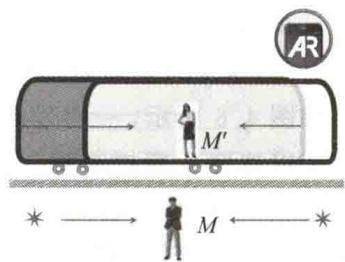
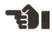
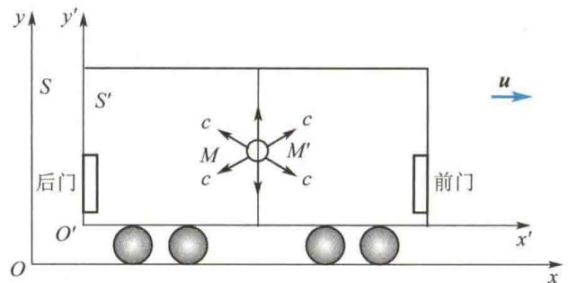
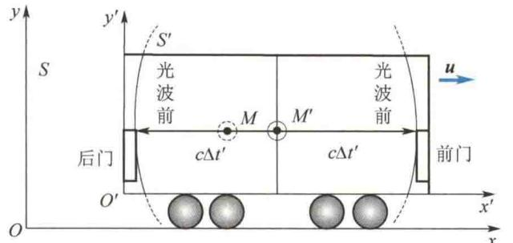
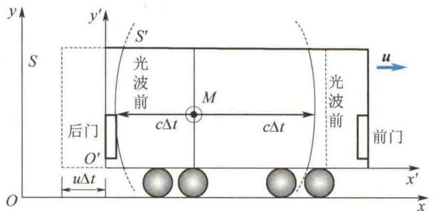
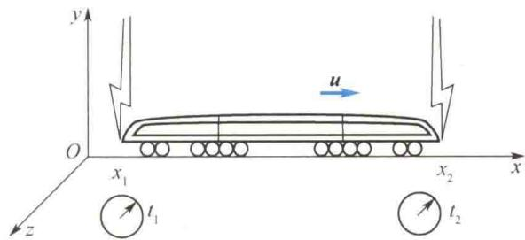
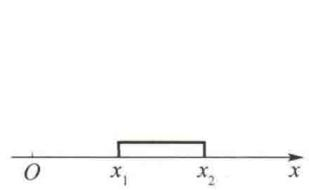
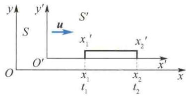
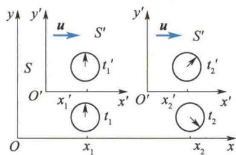
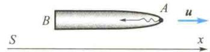

import QRCodeVideo from '@/components/QRCodeVideo.astro';

import Guide from '@/components/Guide.astro';
import Knowledge from '@/components/Knowledge.astro';
import Example from '@/components/Example.astro';
import Analysis from '@/components/Analysis.astro';
import Solution from '@/components/Solution.astro';
import Variant from '@/components/Variant.astro';
import Note from '@/components/Note.astro';
import Block from '@/components/Block.astro';
import Method from '@/components/Method.astro';
import Exercise from '@/components/Exercise.astro';

<QRCodeVideo title="时间延缓和长度收缩" url="https://api.guangyiedu.com/v3/resource/resource/r/NewQrCode-1k4vyzTTk1FXgnmIbsPm" />  

## 4.4.1 同时的相对性

在相对论时空观中,同时的相对性占有重要地位.经典力学认为所有惯性系具有同一的绝对的时间,于是,同时也是绝对的.也就是说,如果有两个事件,在某个惯性系中观测是同时的,那么在所有其他惯性系中观测也都是同时的.狭义相对论则
指出不能给同时性以任何绝对的意义.
首先定性分析一个理想实验. 如图 4.5 所示, 一相对地面惯性系 (S 系) 以速度 u 匀速行驶的列车, 通常称为爱因斯坦火车, 取车厢为另一惯性系 ( $S'$ 系). 设在车厢的正中央 $M'$ 处有一光源. 当 $M'$ 点与 S 系中的 M 点重合时 (M 点是 S 系的发光点), 光源闪光, 如图 4.5(a) 所示. 设同一光信号到达车厢前门为事件 1, 到达后门为事件 2. 根据
  
同时的相对性

光速不变原理，在车厢 $(S^{\prime}$ 系 $)$ 中，光信号沿 $x^{\prime}$ 轴正、负方向的传播速度都是c，光源在车厢正中央，所以光信号同时到达前、后门，即事件1、2为同时事件，如图4.5(b)所示。在地面参考系(S系)中，光信号沿x轴的正、负方向传播的速度也是c。但车厢前、后门随车厢一起沿x轴正方向以速度u相对地面运动，后门接近M点，前门远离M点。所以，地面观测者测得光信号先到达后门、后到达前门，即事件1、2不是同时事件，如图4.5(c)所示。
(c)在地面惯性系(S系)中，光速不变，因后门以速度u接近M点，所以同一光信号先到达后门，后到达前门  

(a)车厢正中央 $M'$ 处的灯与地面(S系)中的M点重合时，开始闪光  

  
图4.5 同时的相对性
这个例子说明,在一个惯性系中的两个同时事件,在另一个惯性系中观测时不是同时的,这是时空均匀性和光速不变原理的一个直接结果.
如图 4.6 所示,一列爱因斯坦火车以速度 u 通过车站.车站观测者测得两道闪电同时分别击中车头和车尾.此时车尾和车头在车站(S系)中的坐标分别为 $x_{1}$ 和 $x_{2}$ .设击中车尾为事件1,在S系时空坐标为 $(x_{1}, t_{1})$ ,在火车 $(S'$ 系)中时空坐标为 $(x_{1}', t_{1}')$ ;设击中车头为事件2,在S系中时
  
图 4.6 两道闪电同时分别击中车头和车尾
空坐标为 $(x_{2},t_{2})$ ，在 $S^{\prime}$ 系中时空坐标为 $(x_{2}^{\prime},t_{2}^{\prime})$ .
根据洛伦兹变换
得
$$
\begin{array}{r l} & t _ {1} ^ {\prime} = \gamma \left(t _ {1} - \frac {u}{c ^ {2}} x _ {1}\right) \\ & t _ {2} ^ {\prime} = \gamma \left(t _ {2} - \frac {u}{c ^ {2}} x _ {2}\right) \\ & t _ {2} ^ {\prime} - t _ {1} ^ {\prime} = \gamma \left[ (t _ {2} - t _ {1}) - \frac {u}{c ^ {2}} (x _ {2} - x _ {1}) \right] \end{array}
$$
车站(S系)观测者测得两道闪电同时分别击中车头和车尾,即 $t_{2}=t_{1}$ ,则上式为
$$
t _ {2} ^ {\prime} - t _ {1} ^ {\prime} = - \gamma \frac {u}{c ^ {2}} (x _ {2} - x _ {1})
$$
因为 $u \neq 0, x_2 - x_1 \neq 0$ ，所以在火车（ $S'$ 系）上的观测者测得两道闪电不是同时击中车头和车尾的。按本例条件 $u > 0, x_2 - x_1 > 0$ ，则有 $(t_2' - t_1') < 0$ ，即在火车上观测，闪电先击中车头，后击中车尾。如果将火车改为后退， $u < 0, x_2 - x_1 > 0$ ，则有 $t_2' - t_1' > 0$ ，火车上的观测者测得的结果是闪电先击中车尾，后击中车头。火车速度方向改变即参考系改变，因为参考系不同，两事件的时序一般不同。

## 4.4.2 长度的相对性

设一物体（如一把直尺）相对坐标系是静止的，如图4.7所示。物体在 $x$ 轴方向上的长度等于物体两端坐标之差，即 $l = |x_{2} - x_{1}|$ ，这里测量 $x_{1}$ 和 $x_{2}$ 的时间不要求是同时的。若物体是运动的，如图4.8所示，物体相对 $S^{\prime}$ 系是静止的，相对 $S$ 系则以速度 $\pmb{u}$ 运动。在 $S$ 系中必须同时 $(t_1 = t_2 = t)$ 记录下物体两端的坐标 $x_{1}$ 和 $x_{2}$ 。在 $S$ 系中测得的长度 $l = x_{2} - x_{1}$ ，称为物体的运动长度，而在 $S^{\prime}$ 系中测得该物体的长度 $l_0 = x_2' - x_1'$ ，称为静止长度或固有长度。根据洛伦兹变换有
$$
\begin{array}{l} x _ {2} ^ {\prime} = \gamma (x _ {2} - u t _ {2}) \\ x _ {1} ^ {\prime} = \gamma (x _ {1} - u t _ {1}) \end{array}
$$
两式相减，得
$$
x _ {2} ^ {\prime} - x _ {1} ^ {\prime} = \gamma [ (x _ {2} - x _ {1}) - u (t _ {2} - t _ {1}) ]
$$
因为在 S 系中测量是同时的，即 $t_{2} = t_{1}$ ，所以
$$
x _ {2} ^ {\prime} - x _ {1} ^ {\prime} = \gamma (x _ {2} - x _ {1})
$$
  
图 4.7 静止长度的测量
  
图 4.8 运动长度的测量
即
$$
l _ {0} = \gamma l
$$
$$
\gamma = \frac {1}{\sqrt {1 - \beta^ {2}}}
$$
<QRCodeVideo title="愚人横竿能过城门吗？" url="https://api.guangyiedu.com/v3/resource/resource/r/NewQrCode-bzOA6aPczwQ9OjvaxnMJ" />
则
$$
l = \frac {1}{\gamma} l _ {0} = \sqrt {1 - \beta^ {2}} l _ {0}\tag{4.16}
$$
愚人横竿能过城门吗？
这就是说,运动长度缩短了. $\sqrt{1-\beta^{2}}$ 称为洛伦兹收缩因子.
从以上分析可以看出,相对论中,物体长度的比较在一定意义上是相对的.长度的收缩是普遍的时空性质,与物体的具体性质(如材料、结构等)无关.在相对物体静止的惯性系中,测得物体的长度最长.两个相对静止的物体的长度的比较即固有长度的比较,有绝对的意义.长度的收缩只发生在运动方向上,与运动垂直的方向上并不发生长度收缩.特别要注意的是,长度收缩是测量的结果,不要错误地说成是某人眼睛看见的结果.因为看见的图像是物体上各点发出的光同时到达观测者眼睛而感知的总图像.光速是有限的,同时到达眼睛的光是与眼睛距离不同的各点在不同时刻发出的光,这与前面讲的同时 $(t_{1}=t_{2})$ 记录 $x_{1}$ 和 $x_{2}$ 坐标是不一致的.测量中观测者只能直接了解他所在地点的事件,而眼睛看到的图像包含光信号的传输特征,所以观看与测量的图像不是一回事.

## 4.4.3 时间间隔的相对性

在 $S^{\prime}$ 系中同一地点发生了两个事件，例如，某振荡晶体到达相邻的两个正向峰值时，这两个事件的时空坐标分别是 $(x_1', t_1')$ 和 $(x_2', t_2')$ ，因为是同地事件， $x_1' = x_2'$ ，时间间隔 $\Delta t' = t_2' - t_1'$ ，也就是晶体静止时振动的周期。在 $S$ 系中测得这两事件的时空坐标分别是 $(x_1, t_1)$ 和 $(x_2, t_2)$ ，如图4.9所示，显然 $x_1 \neq x_2, t_1$ 和 $t_2$ 是 $S$ 系中两只同步时钟上的读数。根据洛伦兹变换有
  
图 4.9 运动时钟变慢
<QRCodeVideo title="双生子佯谬" url="https://api.guangyiedu.com/v3/resource/resource/r/NewQrCode-xniWlH792A91MEtlyucN" />  
$$
t _ {1} = \gamma \left(t _ {1} ^ {\prime} + \frac {u}{c ^ {2}} x _ {1} ^ {\prime}\right), \quad t _ {2} = \gamma \left(t _ {2} ^ {\prime} + \frac {u}{c ^ {2}} x _ {2} ^ {\prime}\right)
$$
两式相减，得
$$
t _ {2} - t _ {1} = \gamma \left[ (t _ {2} ^ {\prime} - t _ {1} ^ {\prime}) + \frac {u}{c ^ {2}} (x _ {2} ^ {\prime} - x _ {1} ^ {\prime}) \right]
$$
因为 $x_2' = x_1'$ ，则有
$$
t _ {2} - t _ {1} = \gamma (t _ {2} ^ {\prime} - t _ {1} ^ {\prime})
$$
即
$$
\Delta t = \gamma \Delta t ^ {\prime}\tag{4.17}
$$
因为 $\gamma > 1$ ，所以 $\Delta t > \Delta t'$ ，表示时间膨胀了，或者说 S 系的观察者认为运动的 $S'$ 系上的时钟变慢了.
式(4.17)表示,一个过程,在某惯性系中发生在同一地点,则在与其相对静止的惯性系中测得该过程的时间间隔最小,称它为该过程的固有时间,记作 $\tau_{0}$ ;在其他所有相对运动的惯性系中测量该过程的时间间隔,都不是用一只钟测量,而是用不同地点的两只同步钟测量,测得的数值都大于固有时间,记作 $\tau$ ,则式(4.17)改写为
$$
\tau = \gamma \tau_ {0}\tag{4.18}
$$
$\gamma>1$ , 有时称它为时间延缓因子. 时间膨胀效应是一种普遍的时空属性, 与过程的具体性质和作用机制无关.
相对论的运动时钟变慢和长度收缩效应,已经被大量的近代物理实验证实.下面举例说明.

<Example title="例 4.3">
在大气上层 9 000 m 处，宇宙射线中有 $\mu^{-}$ 介子，速率约为 $u = 2.994 \times 10^{8} \, m/s = 0.998c$ . $\mu^{-}$ 介子在静止参考系中的平均寿命为 $2 \times 10^{-6} \, s$ ，之后就会衰变为电子和中微子，试解释地面实验室为什么能接收其信号.

<Solution title="解">
在 $\mu^{-}$ 介子静止的参考系中， $\Delta t^{\prime}=2\times10^{-6}$ s. 若没有时间延缓效应，它们在从产生到发生衰变的时间里，是根本不可能到达地面实验室的。因为它通过的距离只有
$$
\Delta t = \frac {\Delta t ^ {\prime}}{\sqrt {1 - \frac {u ^ {2}}{c ^ {2}}}} = \frac {2 \times 1 0 ^ {- 6}}{\sqrt {1 - 0 . 9 9 8 ^ {2}}} \mathrm{s}
$$
$$
u \Delta t ^ {\prime} = 2. 9 9 4 \times 1 0 ^ {8} \times 2 \times 1 0 ^ {- 6} \mathrm{m} \approx 6 0 0 \mathrm{m}
$$
但事实是， $\mu^{-}$ 介子到达了地面实验室！这可用时间延缓效应来解释：将运动参考系 $S'$ 建立在 $\mu^{-}$ 介子上，在地面参考系 $S$ 上看，由式(4.17)可得
$$
\approx 3. 1 6 \times 1 0 ^ {- 5} \mathrm{s}
$$
它约是固有时间 $2 \times 10^{-6}$ s 的 16 倍. 按此寿命计算, 它在这段时间里, 在地面参考系移动的距离为
$$
\begin{array}{r l} u \Delta t & = 2. 9 9 4 \times 1 0 ^ {8} \times 3. 1 6 \times 1 0 ^ {- 5} \mathrm{m} \\ & = 9 4 6 1 \mathrm{m} > 9 0 0 0 \mathrm{m} \end{array}
$$
所以 $\mu^{-}$ 介子能到达地面，即地面实验室能接收到其信号.
</Solution>
</Example>

<Example title="例 4.4">
一静止长度为 $l_{0}$ 的火箭以恒定速度 $\pmb{u}$ 相对参考系 $S$ 运动，如图4.10所示.从火箭头部的 $A$ 点发出一光信号，对以下两位观测者而言，光信号从 $A$ 点传到火箭尾部的 $B$ 点需经多长时间？（1）火箭上的观测者；(2) $S$ 系中的观测者.

<Solution title="解">
（1）以火箭为参考系，A 点到 B 点的距离等于火箭的静止长度，所需时间为
$$
t = \frac {l - u t}{c} = \frac {\sqrt {1 - \beta^ {2}} l _ {0} - u t}{c}
$$
$$
t ^ {\prime} = \frac {l _ {0}}{\bar {c}}
$$
解得
$$
t = \frac {\sqrt {1 - \beta^ {2}} l _ {0}}{c + u} = \sqrt {\frac {c - u}{c + u}} \frac {l _ {0}}{\bar {c}}
$$
（2）对 S 系中的观测者，测得火箭的长度为 $l = \sqrt{1 - \beta^{2}} l_{0}$ ，光信号也是以光速 c 传播的。设光信号从 A 点传到 B 点所用的时间为 t，在此时间内火箭尾部的 B 点向前推进了 ut 的距离，所以有
  
图4.10 相对 $S$ 系飞行的火箭
</Solution>
</Example>

## 4.4.4 因果关系

在相对论中，一个时空点 $(x, y, z, t)$ 表示一个事件。不同事件的时空点不同。两个存在因果关系的事件，必定原因（设时刻 $t_1$ ）在先，结果（设时刻 $t_2$ ）在后，即 $\Delta t = t_2 - t_1 > 0$ 。那么，是否对所有的惯性系都是如此呢？结论是肯定的。因为不论是同地或异地的两事件，空间间隔（距离） $\Delta x$ 都满足 $\Delta x \geqslant 0$ 。这两个有因果关系的事件必须通过某种物质或信息相联系。而相对论的结论之一是任何物质运动的速率 $v \leqslant c$ 。设在其他惯性系中观测时，这两个事件的时间间隔为 $\Delta t' = t_2' - t_1'$ 。根据洛伦兹变换式 $\Delta t' = \gamma \left( \Delta t - \frac{u}{c^2} \Delta x \right) = \gamma \Delta t \left( 1 - \frac{u}{c^2} \frac{\Delta x}{\Delta t} \right)$ 。因联系有因果关系的两事件的物质或信息的平均速率必须满足 $\overline{v} = \frac{\Delta x}{\Delta t} \leqslant c$ ，所以 $\left( 1 - \frac{u}{c^2} \frac{\Delta x}{\Delta t} \right) > 0$ ，则 $\Delta t'$ 与 $\Delta t$ 同号，说明时序不会颠倒，即因果关系不会颠倒。
若两个事件没有因果关系,则可以有 $\frac{\Delta x}{\Delta t}>c$ ,因为 $\frac{\Delta x}{\Delta t}$ 并不是某种物质或信息传递的速率.于是, $\Delta t'$ 可以小于零.这意味着在另一个惯性系中观测,两事件的时序可以颠倒.因为两事件无因果关系,所以不存在因果关系颠倒的问题.

<Example title="例 4.5">
一短跑选手,在地球上以10 s的时间跑完了100 m,在沿跑道方向飞行的速率为0.98c的飞船中的观察者看来,这个选手跑了多长时间和多长距离?

<Solution title="解">
设地面为 S 系, 飞船为 $S'$ 系, 由公式
所观察到的时间间隔为
$$
x _ {1} ^ {\prime} = \frac {x _ {1} - u t _ {1}}{\sqrt {1 - \beta^ {2}}}, x _ {2} ^ {\prime} = \frac {x _ {2} - u t _ {2}}{\sqrt {1 - \beta^ {2}}}
$$
得飞船中观察者所观察到的距离为
$$
\begin{array}{r l} t _ {2} ^ {\prime} - t _ {1} ^ {\prime} & = \frac {t _ {2} - t _ {1} - \frac {u}{c ^ {2}} (x _ {2} - x _ {1})}{\sqrt {1 - \beta^ {2}}} \\ & = 5 0. 2 5 \mathrm{s} \end{array}
$$
$$
\begin{array}{r l} x _ {2} ^ {\prime} - x _ {1} ^ {\prime} & = \frac {x _ {2} - x _ {1} - u (t _ {2} - t _ {1})}{\sqrt {1 - \beta^ {2}}} \\ & = - 1. 4 7 \times 1 0 ^ {1 0} \mathrm{m} \end{array}
$$
</Solution>
</Example>
