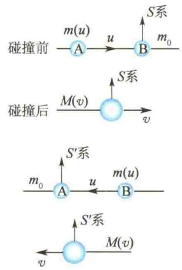
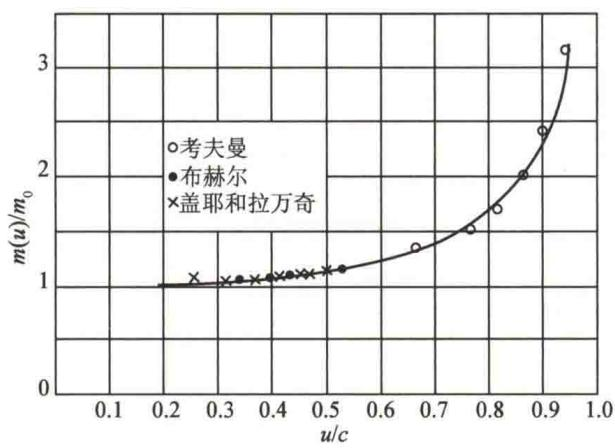
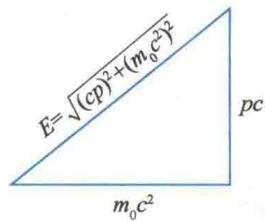

import QRCodeVideo from '@/components/QRCodeVideo.astro';

import Guide from '@/components/Guide.astro';
import Knowledge from '@/components/Knowledge.astro';
import Example from '@/components/Example.astro';
import Analysis from '@/components/Analysis.astro';
import Solution from '@/components/Solution.astro';
import Variant from '@/components/Variant.astro';
import Note from '@/components/Note.astro';
import Block from '@/components/Block.astro';
import Method from '@/components/Method.astro';
import Exercise from '@/components/Exercise.astro';

相对性原理要求物理定律在所有惯性系中具有相同的形式,描述物理定律的方程式应是满足洛伦兹变换的不变式.这样,描述粒子动力学的物理量,如动量、能量、质量等,都必须重新定义,并且要求它们在低速、近似条件下过渡到经典力学中相对应的物理量.

## 4.5.1 动量、质量与速度的关系

在相对论中定义一个质点的动量 p 为
$$
\boldsymbol {p} = m \boldsymbol {u}\tag{4.19}
$$
式中，u 是速度，m 是质点的质量。不过动量在数量上不一定与 u 构成线性的正比关系，因为 m 不再是常量，可以假定 m 是速度 u 的函数。由于空间各向同性，m 只与速度 u 的大小有关，而与其方向无关，即
$$
m = m (u)
$$
而且在低速、近似条件下过渡为经典力学中的质量.
下面考察两个全同粒子的完全非弹性碰撞过程. 如图 4.11 所示, A、B 两个全同粒子正碰后结合为一个复合粒子. 在 S 和 $S'$ 两个惯性系中讨论: 在 S 系中粒子 B 静止, 粒子 A 的速度为 u, 它们的质量分别为 $m_{\mathrm{B}} = m_{0}, m_{\mathrm{A}} = m(u)$ , 这里 $m_{0}$ 是静止质量, $m(u)$ 称为运动质量. 在 $S'$ 系中 A 静止, B 的速度为 -u, 它们的质量分别为 $m_{\mathrm{A}} = m_{0}, m_{\mathrm{B}} = m(u)$ . 显然, $S'$ 系相对于 S 系的速率为 u. 设碰撞后复合粒子在 S 系中的速率为 v, 质量为 $M(v)$ ; 在 $S'$ 系中的速率为 $v'$ , 由对称性可知 $v' = -v$ , 故复合粒子的质量仍为 $M(v)$ . 根据守恒定律, 有
<figure class="vp-figure">
  
  <figcaption>图4.11 完全非弹性碰撞</figcaption>
</figure>
质量守恒 $m(u)+m_{0}=M(v)$
(4.20)
动量守恒 $m(u)u = M(v)v$
(4.21)
由此两式消去 $M(v)$ ，解得
$$
1 + \frac {m _ {0}}{m (u)} = \frac {u}{v}\tag{4.22}
$$
由洛伦兹速度变换式[式(4.12)]有
$$
v ^ {\prime} = - v = \frac {v - u}{1 - \frac {u v}{c ^ {2}}}
$$
即
$$
\frac {u}{v} - 1 = 1 - \frac {u v}{c ^ {2}}
$$
等式两边乘以 $\frac{u}{v}$ 并整理为
$$
\left(\frac {u}{v}\right) ^ {2} - 2 \left(\frac {u}{v}\right) + \left(\frac {u}{c}\right) ^ {2} = 0
$$
解得
$$
\frac {u}{v} = 1 \pm \sqrt {1 - \frac {u ^ {2}}{c ^ {2}}}
$$
因为 v &lt; u，所以舍去负号，则
$$
\frac {u}{v} = 1 + \sqrt {1 - \frac {u ^ {2}}{c ^ {2}}}
$$
代入式 $(4.22)$ ，有
$$
m (u) = \frac {m _ {0}}{\sqrt {1 - \frac {u ^ {2}}{c ^ {2}}}} = \gamma m _ {0}\tag{4.23}
$$
这就是相对论中的质速关系. 动量的表达式为
$$
\pmb {p} = m \pmb {u} = \frac {m _ {0} \pmb {u}}{\sqrt {1 - \frac {u ^ {2}}{c ^ {2}}}} = \gamma m _ {0} \pmb {u}\tag{4.24}
$$
图4.12所示是几位工作者早年测量电子质量随速度变化的实验曲线，可以说明质速关系[式(4.23)]与实验相符.理论和实验都表明：当物体速率远小于光速时，运动质量和静止质量基本相等，可以看作与速度大小无关的常量；但当速率接近光速时，运动质量迅速增大，相对论效应显著；当 $\beta = \frac{u}{c}\rightarrow 1$ 时， $m(u)\rightarrow \infty$ ，动量也趋向于无穷大.在回旋加速器（见10.5节）里，当粒子速率接近光速时就很难再加速.对于 $m_0\neq 0$ 的粒子，速率不能等于光速.光速 $c$ 是一切物体速率的上限.如果速率超过光速，即 $u > c$ ，则式(4.23)给出的是虚质量，没有意义.光、电磁辐射等的速率 $u = c$ ，其静止质量为零.
<figure class="vp-figure">
  
  <figcaption>图 4.12 电子质量随速度变化的实验曲线</figcaption>
</figure>

## 4.5.2 质量和能量的关系

在相对论中把力定义为动量对时间的变化率,即
$$
\boldsymbol {F} = \frac {\mathrm{d} \boldsymbol {p}}{\mathrm{d} t}\tag{4.25}
$$
<QRCodeVideo title="质能关系式" url="https://api.guangyiedu.com/v3/resource/resource/r/NewQrCode-GU4BbEoureA6hlII932a" />  
这里 p 是式(4.24)表示的相对论动量. 式(4.25)所表示的力学规律, 对不同的惯性系, 在洛伦兹变换下是不变的. 但是, 要说明的是质量和速度 u 在不同惯性系中是不同的, 所以相对论中力 F 在不同惯性系中也是不同的, 它们都不是恒量, 不同惯性系之间有其相应的变换关系, 这一点与经典力学不同.
在相对论中,功能关系仍具有牛顿力学中的形式.设静止质量为 $m_{0}$ 的质点,初始静止,在外力作用下,发生位移ds,获得速度u,质点动能的增量等于外力所做的功,即
$$
\mathrm{d} E _ {\mathrm{k}} = \boldsymbol {F} \cdot \mathrm{d} s = \boldsymbol {F} \cdot \boldsymbol {u} \mathrm{d} t
$$
因为 $F = \frac{\mathrm{d}}{\mathrm{d}t}(mu)$ ，代入上式，得
$$
\mathrm{d} E _ {\mathrm{k}} = \mathrm{d} (m \boldsymbol {u}) \cdot \boldsymbol {u} = (\mathrm{d} m) \boldsymbol {u} \cdot \boldsymbol {u} + m (\mathrm{d} \boldsymbol {u}) \cdot \boldsymbol {u} = u ^ {2} \mathrm{d} m + m u \mathrm{d} u
$$
又有
$$
m = \frac {m _ {0}}{\sqrt {1 - \frac {u ^ {2}}{c ^ {2}}}}
$$
对上式进行微分,有
$$
\mathrm{d} m = \frac {m _ {0} u \mathrm{d} u}{c ^ {2} \left(1 - \frac {u ^ {2}}{c ^ {2}}\right) ^ {3 / 2}}
$$
解得
$$
\mathrm{d} u = \frac {c ^ {2} \left(1 - \frac {u ^ {2}}{c ^ {2}}\right) ^ {3 / 2} \mathrm{d} m}{m _ {0} u}
$$
将 $m, \mathrm{d}u$ 的关系式代入 $\mathrm{d}E_{\mathrm{k}}$ 表达式，并化简，得
$$
\mathrm{d} E _ {\mathrm{k}} = c ^ {2} \mathrm{dm}
$$
当 $u = 0$ 时， $m = m_0$ ，动能 $E_{\mathrm{k}} = 0$ 。上式积分得
$$
\int_ {0} ^ {E _ {\mathrm{k}}} \mathrm{d} E _ {\mathrm{k}} = \int_ {m _ {0}} ^ {m} c ^ {2} \mathrm{d} m
$$
即
$$
E _ {\mathrm{k}} = m c ^ {2} - m _ {0} c ^ {2}\tag{4.26}
$$
科研成果介绍
这是相对论动能的表达式，显然与经典力学的动能公式不同.但是当 $u\ll c$ 时，有
<QRCodeVideo title="华龙一号" url="https://api.guangyiedu.com/v3/resource/resource/r/NewQrCode-VXB1XqeEqf1vgbTqmfkF" />  
$$
\begin{array}{r l} E _ {\mathrm{k}} & = m _ {0} c ^ {2} \left(1 - \frac {u ^ {2}}{c ^ {2}}\right) ^ {- \frac {1}{2}} - m _ {0} c ^ {2} \\ & = m _ {0} c ^ {2} \left(1 + \frac {1}{2} \frac {u ^ {2}}{c ^ {2}} + \dots\right) - m _ {0} c ^ {2} \approx \frac {1}{2} m _ {0} u ^ {2} \end{array}
$$
这里忽略高阶小量,回到了经典力学中的质点动能公式.
式 $(4.26)$ 可写成
$$
m c ^ {2} = E _ {\mathrm{k}} + m _ {0} c ^ {2}
$$
爱因斯坦称 $m_0c^2$ 为静能， $mc^2$ 等于物体的动能和静能之和，称为总能量，则
科研成果介绍
$$
E = m c ^ {2}\tag{4.27}
$$
<QRCodeVideo title="全超导托卡马克核聚变实验装置" url="https://api.guangyiedu.com/v3/resource/resource/r/NewQrCode-9DycvI6bmgodezYGJuwG" />  
实验装置
这就是质能关系,它把能量和质量联系在了一起.
质能关系说明,一定的质量就代表一定的能量.质量和能量都是物质属性的量度,质量和能量可以相互转化,当然,这只能是物质属性的转化.在相对论中,质量的概念不独立存在,质量守恒定律和能量守恒定律统一为质能守恒定律,简称能量守恒定律.在能量较高的情况下,微观粒子(如原子核、基本粒子等)相互作用,导致产生分裂、聚合等反应过程.反应前粒子的静止质量和反应后生成物的总静止质量之差,称为质量亏损.质量亏损对应的能量称为结合能,通常称为原子能.原子能的利用使人类进入原子时代.爱因斯坦建立的质能关系式被认为是一个具有划时代意义的理论公式.

<Example title="例 4.6">
已知质子和中子的静止质量分别为
$$
\begin{array}{r l} & M _ {\mathrm{p}} = 1. 0 0 7 2 8 \mathrm{amu} \\ & M _ {\mathrm{n}} = 1. 0 0 8 6 6 \mathrm{amu} \end{array}
$$
amu 为原子质量单位， $1\ amu = 1.660 \times 10^{-27}\ kg$ ，两个质子和两个中子结合成一个氦核 $^{4}_{2}He$ ，实验测得它的静止质量 $M_{A} = 4.00150\ amu$ 。计算形成一个氦核放出的能量。

<Solution title="解">
两个质子和两个中子的质量和为
$$
= 4. 5 3 9 \times 1 0 ^ {- 1 2} \mathrm{J}
$$
$$
M = 2 M _ {\mathrm{p}} + 2 M _ {\mathrm{n}} = 4. 0 3 1 8 8 \mathrm{amu}
$$
这就是形成一个氦核放出的能量.
形成一个氦核的质量亏损为
若形成 1 mol 氦核(4.002 g)，则放出的能量为
$$
\Delta M = M - M _ {\mathrm{A}} = 0. 0 3 0 3 8 \mathrm{amu}
$$
则相应的能量改变量为
$$
\begin{array}{r l} \Delta E & = 4. 5 3 9 \times 1 0 ^ {- 1 2} \times 6. 0 2 2 \times 1 0 ^ {2 3} \mathrm{J} \\ & = 2. 7 3 3 \times 1 0 ^ {1 2} \mathrm{J} \end{array}
$$
$$
\begin{array}{r l} \Delta E & = \Delta M c ^ {2} \\ & = 0. 0 3 0 3 8 \times 1. 6 6 0 \times 1 0 ^ {- 2 7} \times (3 \times 1 0 ^ {8}) ^ {2} \mathrm{J} \end{array}
$$
这相当于燃烧 $100\mathrm{t}$ 煤时放出的热量.
</Solution>
</Example>

## 4.5.3 动量和能量的关系

将相对论动量定义式 p = mu 两边取平方, 得
$$
p ^ {2} = m ^ {2} u ^ {2}
$$
将质能关系式 $E = mc^2$ 两边取平方，并运算，得
$$
\begin{array}{r l} E ^ {2} & = m ^ {2} c ^ {4} = m ^ {2} c ^ {4} - m ^ {2} u ^ {2} c ^ {2} + m ^ {2} u ^ {2} c ^ {2} \\ & = m ^ {2} c ^ {4} \left(1 - \frac {u ^ {2}}{c ^ {2}}\right) + p ^ {2} c ^ {2} = m _ {0} ^ {2} c ^ {4} + p ^ {2} c ^ {2} \end{array}
$$
即
$$
E ^ {2} = p ^ {2} c ^ {2} + m _ {0} ^ {2} c ^ {4} = (p c) ^ {2} + (m _ {0} c ^ {2}) ^ {2}
$$
这就是相对论中总能量和动量的关系式. 可以用一个直角三角形的勾股弦形象地表示这一关系, 如图 4.13 所示.
(4.28)
有些粒子，如光子， $m_{0}=0$ ，则 E=cp，得
$$
p = \frac {E}{c} = \frac {m c ^ {2}}{c} = m c
$$
<figure class="vp-figure">
  
  <figcaption>图4.13 总能量和动量的关系</figcaption>
</figure>
说明静止质量为零的粒子一定以光速运动.
