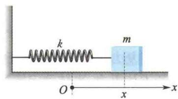
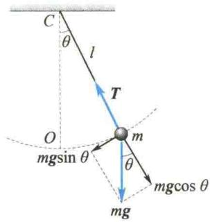
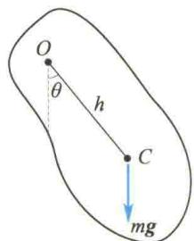
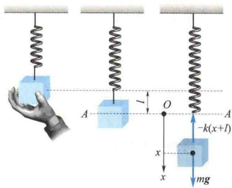

import Guide from '@/components/Guide.astro';
import Knowledge from '@/components/Knowledge.astro';
import Example from '@/components/Example.astro';
import Analysis from '@/components/Analysis.astro';
import Solution from '@/components/Solution.astro';
import Variant from '@/components/Variant.astro';
import Note from '@/components/Note.astro';
import Block from '@/components/Block.astro';
import Method from '@/components/Method.astro';
import Exercise from '@/components/Exercise.astro';

## 第5章 机械振动

  

本章提要

  

非线性振动

简介

物体在某固定位置附近的往复运动叫作机械振动,它是物体的一种普遍运动形式.例如,活塞的往复运动、树叶在空气中的抖动、琴弦的振动、心脏的跳动等都是振动.物体在受到打击,或摇摆、颠簸、发声时必有振动.任何一个具有质量和弹性的系统在其运动状态发生突变时都会发生振动.

广义地说,任何一个物理量在某一量值附近随时间的周期性变化都可以叫作振动.例如,交流电路中的电流、电压,振荡电路中的电场强度和磁场强度等均随时间做周期性的变化,因此它们的变化都可以称为振动.这种振动虽然和机械振动有本质的不同,但它们都具有相同的数学特征和运动规律.所以,振动不仅是声学、地震学、建筑学、机械制造等必需的基础知识,也是电学、光学、无线电学的基础.

本章主要讨论简谐振动和振动的合成，并简要介绍阻尼振动、受迫振动和共振现象.

简谐振动是振动中最基本、最简单的振动形式，任何一个复杂的振动都可以看成若干个或无限多个简谐振动的合成.

一个做往复运动的物体,如果其偏离平衡位置的位移 x(或角位移 $\theta$ ) 随时间 t 按余弦(或正弦) 规律变化,即

$$

x = A \cos (\omega t + \varphi_ {0})

$$

(5.1)

则这种振动称为简谐振动.

简谐振动的特征

研究表明,做简谐振动的物体(或系统),尽管描述它们偏离平衡位置位移的物理量可以千差万别,但描述它们动力学特征的运动微分方程却完全相同.

## 5.1.1 弹簧振子模型

将轻弹簧(质量可忽略不计)一端固定,另一端与质量为 m 的物体(可视为质点)相连,若该系统在振动过程中弹簧的形变较小(即形变弹簧作用于物体的力总是满足胡克定律),那么,这样的弹簧-物体系统称为弹簧振子.

如图 5.1 所示, 将弹簧振子水平放置, 使振子在水平光滑支撑面上振动. 以弹簧处于自然状态(弹簧既未伸长也未压缩的状态)的稳定平衡位置为坐标原点, 当振子偏离平衡位置的位移为 x 时, 其受到的弹性力为

$$

F = - k x\tag{5.2}

$$

  

图5.1 弹簧振子

式中，k 为弹簧的刚度系数，负号表示弹性力的方向与振子的位移方向相反。即振子在运动过

程中受到的力总是指向平衡位置,且力的大小与振子偏离平衡位置的位移成正比,这种力就称为线性回复力.

若不计阻力(如振子与支撑面的摩擦力,在空气中运动时受到的空气阻力及其他能量损耗),则振子的运动微分方程为

$$

- k x = m \frac {\mathrm{d} ^ {2} x}{\mathrm{d} t ^ {2}}

$$

令

$$

\omega^ {2} = \frac {k}{m}\tag{5.3}

$$

则有

$$

\frac {\mathrm{d} ^ {2} x}{\mathrm{d} t ^ {2}} + \omega^ {2} x = 0\tag{5.4}

$$

式(5.4)的解就是式(5.1) $^{①}$ ，可知式(5.4)就是描述简谐振动的运动微分方程。由此可以给出简谐振动的一种较普遍的定义: 若某力学系统的动力学方程可归结为式(5.4)的形式, 且其中 $\omega$ 仅取决于振动系统本身的性质, 则该系统的运动为简谐振动. 能满足式(5.4)的系统, 又称为谐振子系统.

## 5.1.2 微振动的简谐近似

上述弹簧振子(谐振子)是一个理想模型. 实际发生的振动大多较为复杂, 一方面, 回复力可能不是弹性力, 而是重力、浮力或其他力; 另一方面, 回复力可能是非线性的, 只能在一定条件下才可近似当作线性回复力, 如单摆、复摆、扭摆等.

一端固定且不可伸长的细线与可视为质点的物体相连，当它在竖直平面内做小角度 $(\theta\leqslant5^{\circ})$ 摆动时，该系统称为单摆，如图5.2所示.

以摆球为研究对象,单摆的运动可看作绕过C点的垂直于纸面的水平轴的转动.显然,摆球在铅直方向CO处为稳定平衡位置(即回复力为零的位置).当摆线偏离铅直方向的角度为 $\theta$ 时(此处 $\theta$ 又称角位移),摆球受到重力mg与绳拉力T的合力,对过C点的转动轴的力矩为

  

图5.2 单摆

$$

M = - m g l \sin \theta\tag{5.5}

$$

式中，负号表示力矩的方向总是与角位移的方向相反。在 $\theta \leqslant 5^{\circ}$ 时，将 $\theta$ 值用弧度表示，则有 $\sin \theta = \theta - \frac{\theta^{3}}{3!} + \frac{\theta^{5}}{5!} - \cdots$ ，略去高阶无穷小，式(5.5)可近似简化为

$$

M = - m g l \theta\tag{5.6}

$$

此时的回复力矩与角位移成正比,方向相反.

若不计阻力,由转动定律可写出摆球的动力学方程为

$$

- m g l \theta = m l ^ {2} \frac {\mathrm{d} ^ {2} \theta}{\mathrm{d} t ^ {2}}

$$

令

$$

\omega^ {2} = \frac {g}{l}\tag{5.7}

$$

则有

$$

\frac {\mathrm{d} ^ {2} \theta}{\mathrm{d} t ^ {2}} + \omega^ {2} \theta = 0\tag{5.8}

$$

即单摆的小角度摆动是简谐振动.

绕不过质心的水平固定轴转动的刚体称为复摆 $^{①}$ ，如图5.3所示。质心C在铅直位置时为平衡位置，以质心C至轴心O的距离h为摆长，同上分析，当 $\theta\leqslant5^{\circ}$ 时，复摆的动力学方程为

$$

- m g h \theta = J \frac {\mathrm{d} ^ {2} \theta}{\mathrm{d} t ^ {2}}\tag{5.9}

$$

  

图5.3 复摆

令

$$

\omega^ {2} = \frac {m g h}{J}

$$

(5.10)

式中，J 为刚体对过 O 点的水平轴的转动惯量。于是式(5.9)亦可归为式(5.8)。

由上述讨论可知,单摆或复摆在小角度摆动情况下,经过近似处理,它们的运动方程与弹簧振子的运动方程具有完全相同的数学形式,即式(5.4)、式(5.8).进一步的研究表明,任何一个物理量(如长度、角度、电流、电压及化学反应中某种化学组分的浓度等)的变化规律只要满足式(5.4),且常量 $\omega$ 取决于系统本身的性质,则该物理量做简谐振动.

<Example title="例 5.1">
一质量为 m 的物体悬挂于轻弹簧下端, 不计空气阻力, 试证其在平衡位置附近的振动是简谐振动.

<Solution title="证明">
如图 5.4 所示, 以平衡位置 A 为坐标原点, 向下为 x 轴正方向, 设某一瞬时振子的坐标为 x, 则物体在振动过程中的运动方程为

$$

m \frac {\mathrm{d} ^ {2} x}{\mathrm{d} t ^ {2}} = - k (x + l) + m g

$$

式中， $l$ 是弹簧挂上重物后静止时的伸长量.因为 $mg = kl$ ，所以上式为

$$

m \frac {\mathrm{d} ^ {2} x}{\mathrm{d} t ^ {2}} = - k x

$$

故

$$

\frac {\mathrm{d} ^ {2} x}{\mathrm{d} t ^ {2}} + \omega^ {2} x = 0

$$

  

(a)  

(b)  

(c)

式中， $\omega^2 = \frac{k}{m}$ 于是该系统做简谐振动

图5.4 例5.1图

上例说明:若一个谐振子系统受到一个恒力(以使系统中不出现非线性因素为限)作用,只要将其坐标原点移至恒力作用下新的平衡位置,则该系统仍是一个与原系统动力学特征相同的谐振子系统.

</Solution>
</Example>
