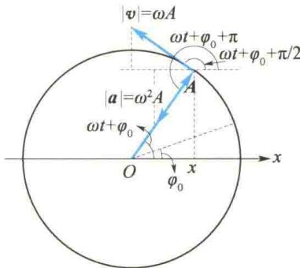
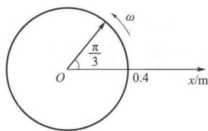
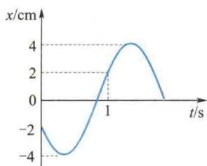
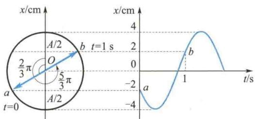

import Guide from '@/components/Guide.astro';
import Knowledge from '@/components/Knowledge.astro';
import Example from '@/components/Example.astro';
import Analysis from '@/components/Analysis.astro';
import Solution from '@/components/Solution.astro';
import Variant from '@/components/Variant.astro';
import Note from '@/components/Note.astro';
import Block from '@/components/Block.astro';
import Method from '@/components/Method.astro';
import Exercise from '@/components/Exercise.astro';

## 5.2.1 简谐振动的运动方程

如前所述,微分方程
$$
\frac {\mathrm{d} ^ {2} x}{\mathrm{d} t ^ {2}} + \omega^ {2} x = 0
$$
的解可写作
$$
x = A \cos (\omega t + \varphi_ {0})\tag{5.11}
$$
式中， $A$ 和 $\varphi_0$ 是由初始条件确定的两个积分常数.式（5.11）称为简谐振动的运动方程.
由于
$$
\cos (\omega t + \varphi_ {0}) = \sin \left(\omega t + \varphi_ {0} + \frac {\pi}{2}\right)
$$
令
$$
\varphi^ {\prime} = \varphi_ {0} + \frac {\pi}{2}
$$
则式 $(5.11)$ 亦可写成
$$
x = A \sin (\omega t + \varphi^ {\prime})
$$
可见,简谐振动的运动规律也可用正弦函数表示.本书对机械振动统一用余弦函数表示.

## 5.2.2 描述简谐振动的重要参量

### 1. 振幅 $A$

根据简谐振动的运动学方程,物体的最大位移不能超过 A, 物体偏离平衡位置的最大位移(或角位移)的绝对值叫作振幅. 显然, 振幅 A 是由初始条件决定的.
简谐振动的运动学方程和它对时间的一阶导数(简谐振动的速度方程)分别如下:
$$
\left\{ \begin{array}{l} x = A \cos (\omega t + \varphi_ {0}) \\ v = - \omega A \sin (\omega t + \varphi_ {0}) \end{array} \right.\tag{5.12}
$$
将初始条件 $t = 0, x = x_0, v = v_0$ 代入式(5.12)，得
$$
\left\{ \begin{array}{l} x _ {0} = A \cos \varphi_ {0} \\ - \frac {v _ {0}}{\omega} = A \sin \varphi_ {0} \end{array} \right.\tag{5.13}
$$
取二式平方和,即求出振幅为
$$
A = \sqrt {x _ {0} ^ {2} + \left(\frac {v _ {0}}{\omega}\right) ^ {2}}\tag{5.14}
$$
例如，当 $t = 0$ 时，物体位移为 $x_0$ ，而振速为零，此时的 $\mid x_0\mid$ 即为振幅；当 $t = 0$ 时，物体在平衡位置，而初速为 $v_{0}$ ，则 $A = \left|\frac{v_0}{\omega}\right|$ ，可见此时初速越大，振幅越大.

### 2. 周期、频率和角频率

物体做简谐振动时,完成一次全振动所需的时间叫作简谐振动的周期,用 T 表示.由周期函数的性质,有
由此可知
$$
\begin{array}{r l} A \cos (\omega t + \varphi_ {0}) & = A \cos [ \omega (t + T) + \varphi_ {0} ] \\ & = A \cos (\omega t + \varphi_ {0} + 2 \pi) \\ & T = \frac {2 \pi}{\omega} \end{array}\tag{5.15}
$$
和周期密切相关的另一物理量是频率,即单位时间内系统所完成的全振动的次数,用 $\nu$ 表示:
$$
\nu = \frac {1}{T} = \frac {\omega}{2 \pi}\tag{5.16}
$$
在国际单位制中， $\nu$ 的单位名称是赫兹，符号是 Hz.
由式(5.16)，有
$$
\omega = \frac {2 \pi}{T} = 2 \pi \nu\tag{5.17}
$$
表示系统在 $2\pi \, s$ 内完成的全振动的次数，称为角频率（又称圆频率）。它的单位名称为弧度每秒，符号为 $rad \cdot s^{-1}$ 。由 5.1 节的讨论可知，简谐振动的角频率 $\omega$ 是由系统的力学性质决定的，故又称为固有（本征）角频率。例如：
弹簧振子
$$
\omega = \sqrt {\frac {k}{m}}
$$
单摆
$$
\omega = \sqrt {\frac {g}{l}}
$$
复摆
$$
\omega = \sqrt {\frac {m g h}{J}}
$$
由此确定的振动周期称为固有(本征)周期.例如：
弹簧振子
$$
T = 2 \pi \sqrt {\frac {m}{k}}\tag{5.18}
$$
单摆
$$
T = 2 \pi \sqrt {\frac {l}{g}}\tag{5.19}
$$
复摆
$$
T = 2 \pi \sqrt {\frac {J}{m g h}}\tag{5.20}
$$

### 3. 相位和初相位

简谐振动的振幅确定了振动的范围,频率或周期则描绘了振动的快慢.不过仅由参量 A 和 $\omega$ 还不能确定振动系统在任意瞬时的运动状态.式(5.12)表明,只有在 A、 $\omega$ 、 $\varphi_{0}$ 为已知量时,系统的振动状态才是完全确定的.能确定系统任意时刻振动状态的物理量
$$
\varphi = \omega t + \varphi_ {0}\tag{5.21}
$$
叫作简谐振动的相位.例如，由式(5.12)可知，当相位 $(\omega t_{1} + \varphi_{0}) = \frac{\pi}{2}$ 时，有 $x = 0$ $v = -\omega A$ ，其表明系统此时的振动状态是：振子处于平衡位置并以速率 $\omega A$ 向 $x$ 轴负方向运动.当相位 $(\omega t_2 + \varphi_0) = 3\pi /2$ 时，有 $x = 0,v = \omega A$ ，此时系统的振动状态是：振子处于平衡位置并以速率 $\omega A$ 向 $x$ 轴正方向运动.可见，在 $t_1$ 和 $t_2$ 时刻，振动相位不同，系统的振动状态就不同.反之，系统的一个确定的振动状态必与一个确定的振动相位对应.例如，若某时刻系统的位移为 $x = A / 2$ ，而速度 $v > 0$ （即向正最大位移方向移动），则由式(5.12）可推知，与此运动状态对应的振动相位为 $\varphi = -\pi /3$ （或 $5\pi /3)$
两振动相位之差 $\Delta \varphi = \varphi_{2} - \varphi_{1}$ ，称作相位差.若相位差等于零或 $2\pi$ 的整数倍，则称两振动相位相同（或同相），如果两振动的振幅和频率也相同，则表明此时它们的振动状态相同；若 $\Delta \varphi = (2k + 1)\pi$ ，则称两振动的相位相反（或反相），表明它们的运动状态相反；若 $0 < \Delta \varphi < \pi$ ，则称 $\varphi_{2}$ 超前于 $\varphi_{1}$ ，或说 $\varphi_{1}$ 滞后于 $\varphi_{2}$ .总之，相位差的不同，反映了两个振动不同程度的参差错落.
用相位表征简谐振动的运动状态还能充分地反映简谐振动的周期性. 简谐振动在一个周期内所经历的运动状态每时每刻都不相同，从相位来理解，这相当于相位经历了从0到 $2\pi$ 的变化过程.因此，对于一个以某个振幅和频率振动的系统，若它们的运动状态相同，则它们所对应的相位差必定为 $2\pi$ 或 $2\pi$ 的整数倍.
$t = 0$ 时的相位叫作初相位.由式(5.13)可得
$$
\tan \varphi_ {0} = - \frac {v _ {0}}{\omega x _ {0}}\tag{5.22}
$$
可见，初相位也是由初始条件确定的。
由式(5.22)求出的,且代入式(5.12),使其成立的 $\varphi_{0}$ 值,即为该振动的初相位.
若已知振子的初始振动状态，则可直接由式(5.12)得出其初相位。例如，若 $t = 0$ ， $x_0 = -A / 2$ ，而 $v < 0$ ，由式(5.12)可推知，与此振动状态对应的初相位为 $\varphi_0 = 2\pi / 3$

## 5.2.3 简谐振动的旋转矢量表示法

在研究简谐振动问题时,常采用一种较为直观的几何方法,即旋转矢量法.
如图 5.5 所示, 从坐标原点 O(平衡位置)
画一矢量A，使它的模等于简谐振动的振幅A，并令t=0时A与x轴的夹角等于简谐振动的初相位 $\varphi_{0}$ ，然后使A以等于角频率 $\omega$ 的角速度在平面上绕O点做逆时针转动，这样作出的矢量称为旋转矢量。显然，旋转矢量A任一时刻在x轴上的投影 $x=A\cos(\omega t+\varphi_{0})$ 就描述了一个简谐振动，矢端沿圆周运动的速度大小等于 $\omega A$ ，其方向与x轴的夹角等于 $(\omega t+\varphi_{0}+\pi/2)$ ，在x轴上的投影为 $\omega A\cos(\omega t+\varphi_{0}+\pi/2)=-\omega A\sin(\omega t+\varphi_{0})$ ，这就是简谐振动的

  
图5.5 旋转矢量法  
旋转矢量法
速度方程;矢端做圆周运动的加速度为 $a_{n}=\omega^{2}A$ ，它与x轴的夹角为 $(\omega t+\varphi_{0}+\pi)$ ，所以加速度在x轴上的投影为
$$
\omega^ {2} A \cos (\omega t + \varphi_ {0} + \pi) = - \omega^ {2} A \cos (\omega t + \varphi_ {0}) = - \omega^ {2} x
$$
以上讨论表明,简谐振动速度的相位比位移超前 $\frac{\pi}{2}$ ,加速度的相位比速度超前 $\frac{\pi}{2}$ ,比位移超前 $\pi$ .

<Example title="例 5.2">
弹簧振子沿 x 轴做简谐振动，振幅为 0.4 m，周期为 2 s，当 t = 0 时，位移为 0.2 m，且向 x 轴负方向运动。求简谐振动的振动方程，并画出 t = 0 时的旋转矢量图。

<Solution title="解">
设此简谐振动的振动方程为
$$
x = A \cos (\omega t + \varphi_ {0})
$$
将 $A = 0.4\mathrm{m},\omega = \frac{2\pi}{T} = \pi \mathrm{rad}\cdot \mathrm{s}^{-1}$ 和 $t = 0$ 时，
则其速度为
$$
v = \frac {\mathrm{d} x}{\mathrm{d} t} = - \omega A \sin (\omega t + \varphi_ {0})
$$
$x_{0}=0.2\ m$ , 代入 $x=A\cos(\omega t+\varphi_{0})$ 得
$$
\varphi_ {0} = \pm \frac {\pi}{3}
$$
再由 t=0 时， $v_{0}<0$ 的条件，得 $v_{0}=-0.4\pi\sin\varphi_{0}<0$ ，所以
$$
\varphi_ {0} = \frac {\pi}{3}
$$
于是此简谐振动的振动方程为
$$
x = 0. 4 \cos \left(\pi t + \frac {\pi}{3}\right) (\mathrm{m})
$$
t = 0 时的旋转矢量图如图 5.6 所示.
  
图5.6 旋转矢量图
</Solution>
</Example>

<Example title="例 5.3">
已知简谐振动曲线如图 5.7 所示, 试写出其振动方程.
  
图 5.7 简谐振动曲线

<Solution title="解">
设简谐振动方程为
$$
x = A \cos (\omega t + \varphi_ {0})
$$
从图5.7中易知 $A = 4\mathrm{cm}$ ，下面只需求出 $\varphi_0$ 和 $\omega$ 即可.从图5.7中分析可知， $t = 0$ 时， $x_0 = -2\mathrm{cm}$ ，且 $v_{0} = \frac{\mathrm{dx}}{\mathrm{dt}} < 0$ （由曲线的斜率决定），代入振动方程，有 $-2 = 4\cos \varphi_0$ 故 $\varphi_0 = \pm \frac{2}{3}\pi$ ，又由 $v_{0} = -\omega A\sin \varphi_{0} <   0$ ，得 $\sin \varphi_0 > 0$ 因此只能取 $\varphi_0 = \frac{2}{3}\pi .$
再从图 5.7 中分析, t = 1 s 时, x = 2 cm, v > 0, 代入振动方程有
即
$$
\begin{array}{r l} 2 & = 4 \cos (\omega + \varphi_ {0}) = 4 \cos \left(\omega + \frac {2}{3} \pi\right) \\ & \cos \left(\omega + \frac {2}{3} \pi\right) = \frac {1}{2}. \end{array}
$$
所以 $\omega + \frac{2}{3}\pi = \frac{5}{3}\pi$ 或 $\frac{7}{3}\pi$ （应注意这里不能取 $\pm \frac{\pi}{3}$ ）.
因同时要满足 $v = -\omega A \sin \left(\omega + \frac{2}{3} \pi\right) > 0$ ，即 $\sin \left(\omega + \frac{2}{3} \pi\right) < 0$ ，故应取 $\omega + \frac{2}{3} \pi = \frac{5}{3} \pi$ ，即 $\omega = \pi \mathrm{rad} \cdot \mathrm{s}^{-1}$ ，所以振动方程为
$$
x = 4 \cos \left(\pi t + \frac {2}{3} \pi\right) \mathrm{cm}
$$
用旋转矢量法也可以简单地求出简谐振动的 $\varphi_{0}$ 和 $\omega$ . 如图 5.8 所示，在 x-t 曲线的左侧作 Ox 轴与位移坐标轴平行，由振动曲线可知，a、b 两点对应于 t=0、1 s 时刻的振动状态，可确定这两个时刻旋转矢量的位置分别为 $\overrightarrow{Oa}$ 和 $\overrightarrow{Ob}$ . 下面作详细说明：由 a 点向 Ox 轴作垂线，其交点就是 t=0 时刻旋转矢量端点的投影点. 已知该处 $x_{0}=-2\ cm$ ，且此时刻 $v_{0}<0$ ，故旋转矢量应在 Ox 轴的左侧，它与 Ox 轴正方向的夹角 $\varphi_{0}=\frac{2}{3}\pi$ 就是 t=0 时刻的振动相位，即初相位；又由 x-t 曲线上的 b 点向 Ox 轴作垂线，其交点就是 t=1 s 时刻旋转矢量端点的投影点，该处 x=2 cm 且 v>0，故此时刻旋转矢量应在 Ox 轴的右侧，它与 Ox 轴的夹角 $\varphi=\frac{5}{3}\pi$ 就是 t=1 s 时刻的振动相位，即 $\omega+\frac{2}{3}\pi=\frac{5}{3}\pi$ ，解得 $\omega=\pi rad\cdot s^{-1}$ .
  
图5.8 用旋转矢量法求解

</Solution>
</Example>
