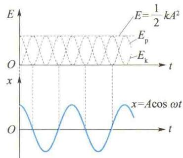
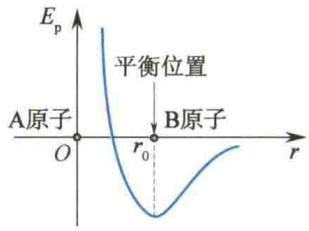
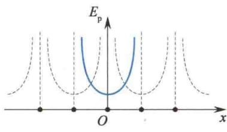
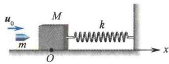

import QRCodeVideo from '@/components/QRCodeVideo.astro';

import Guide from '@/components/Guide.astro';
import Knowledge from '@/components/Knowledge.astro';
import Example from '@/components/Example.astro';
import Analysis from '@/components/Analysis.astro';
import Solution from '@/components/Solution.astro';
import Variant from '@/components/Variant.astro';
import Note from '@/components/Note.astro';
import Block from '@/components/Block.astro';
import Method from '@/components/Method.astro';
import Exercise from '@/components/Exercise.astro';

下面以弹簧振子为例来说明简谐振动的能量.
设振子质量为 m，弹簧的刚度系数为 k，在某一时刻的位移为 x，速率为 v，即
$$
\begin{array}{r l} & x = A \cos (\omega t + \varphi_ {0}) \\ & v = - \omega A \sin (\omega t + \varphi_ {0}) \end{array}
$$
于是振子所具有的振动动能和振动势能分别为
$$
\begin{array}{r l} & E _ {\mathrm{k}} = \frac {1}{2} m v ^ {2} = \frac {1}{2} m \omega^ {2} A ^ {2} \sin^ {2} (\omega t + \varphi_ {0}) \\ & \qquad = \frac {1}{2} k A ^ {2} \sin^ {2} (\omega t + \varphi_ {0}) \\ & E _ {\mathrm{p}} = \frac {1}{2} k x ^ {2} = \frac {1}{2} k A ^ {2} \cos^ {2} (\omega t + \varphi_ {0}) \end{array}\tag{5.23}
$$
(5.24)
这说明弹簧振子的动能和势能是按余弦或正弦函数的平方随时间变化的. 图 5.9 表示初相位 $\varphi_{0}=0$ 时，弹簧振子的动能、势能和总能量随时间变化的曲线. 显然，动能最大时，势能最小，而动能最小时，势能最大. 简谐振动的过程正是动能和势能相互转化的过程.

<QRCodeVideo title="简谐振动的能量" url="https://api.guangyiedu.com/v3/resource/resource/r/NewQrCode-0c1jF1Dk1gHYBxKJUeFm" />  
将式 $(5.23)$ 和式 $(5.24)$ 相加,得简谐振动的总能量为
$$
E = \frac {1}{2} k A ^ {2} = \frac {1}{2} m \omega^ {2} A ^ {2}\tag{5.25}
$$
图 5.9 弹簧振子的动能、势能和总能量随时间变化的曲线
即简谐振动系统在振动过程中机械能守恒. 从力学观点看, 这是因为做简谐振动的系统都是
孤立的保守系统. 此外, 式(5.25) 还说明简谐振动的能量正比于振幅的平方和系统固有角频率的平方.
动能和势能在一个周期内的平均值为
同理，有
$$
\begin{array}{r l} \overline {{E _ {\mathrm{k}}}} & = \frac {1}{T} \int_ {0} ^ {T} E _ {\mathrm{k}} (t) \mathrm{d} t \\ & = \frac {1}{T} \int_ {0} ^ {T} \frac {1}{2} k A ^ {2} \sin^ {2} (\omega t + \varphi_ {0}) \mathrm{d} t = \frac {1}{4} k A ^ {2} \\ & \overline {{E _ {\mathrm{p}}}} = \frac {1}{4} k A ^ {2} \\ & \overline {{E _ {\mathrm{k}}}} = \overline {{E _ {\mathrm{p}}}} = \frac {1}{4} k A ^ {2} = \frac {1}{2} E \end{array}
$$
即
(5.26)
动能和势能在一个周期内的平均值相等,且均等于总能量的一半.
上述结论虽然是从弹簧振子这一特例推出的,但具有普遍意义,适用于任何一个谐振动系统.
对于实际的振动系统,可以通过讨论它的势能曲线来研究其能否做简谐振动近似处理.
设系统沿 x 轴振动, 其势能函数为 $E_{\mathrm{p}}(x)$ , 如果势能曲线存在一个极小值, 该位置就是系统的稳定平衡位置. 在该位置 (取 x = 0) 附近将势能函数用级数展开为
$$
E _ {\mathrm{p}} (x) = E _ {\mathrm{p}} (0) + \left(\frac {\mathrm{d} E _ {\mathrm{p}}}{\mathrm{d} x}\right) _ {x = 0} x + \frac {1}{2} \left(\frac {\mathrm{d} ^ {2} E _ {\mathrm{p}}}{\mathrm{d} x ^ {2}}\right) _ {x = 0} x ^ {2} + \dots
$$
由于在 $x = 0$ 的平衡位置处有 $\frac{\mathrm{d}E_{\mathrm{p}}}{\mathrm{d}x} = 0$ ，若系统是做微振动，当 $\left(\frac{\mathrm{d}^2E_{\mathrm{p}}}{\mathrm{d}x^2}\right)_{x = 0}\neq 0$ 时，可略去高阶无穷小，得到
$$
E _ {\mathrm{p}} (x) \approx E _ {\mathrm{p}} (0) + \frac {1}{2} \left(\frac {\mathrm{d} ^ {2} E _ {\mathrm{p}}}{\mathrm{d} x ^ {2}}\right) _ {x = 0} x ^ {2}
$$
根据保守力与势能函数的关系 $F = -\frac{\mathrm{d}E_{\mathrm{p}}(x)}{\mathrm{d}x}$ ，将上式两边对 $x$ 求导可得
$$
F = - \left(\frac {\mathrm{d} ^ {2} E _ {\mathrm{p}}}{\mathrm{d} x ^ {2}}\right) _ {x = 0} x\tag{5.27}
$$
这说明，微振动系统所受作用力与弹簧振子所受作用力 $(F=-kx)$ 相似，一般可以当作简谐振动处理。图5.10(a)、(b)所示分别是双原子分子的势能曲线和晶体中晶格离子的势能曲线，由上面的讨论可知，这些原子或离子在其平衡位置附近的振动都可当作简谐振动。
  
(a)
  
(b)  
图5.10 双原子分子和晶格离子的势能曲线

<Example title="例 5.4">
如图5.11所示，光滑水平面上的弹簧振子由质量为 $M$ 的木块和刚度系数为 $k$ 的轻弹簧构成。现有一个质量为 $m$ 、速度为 $\pmb{u}_0$ 的子弹射入静止的木块后陷入其中，此时弹簧处于自由状态。（1）写出该谐振子的振动方程；(2)求出 $x = \frac{A}{2}$ 处系统的动能和势能。

<Solution title="解">
（1）子弹射入木块的过程中，水平方向上动量守恒. 设子弹陷入木块后两者的共同速度为 $V_{0}$ ，则有
$$
m u _ {0} = (m + M) V _ {0}
$$
$$
V _ {0} = \frac {m}{m + M} u _ {0}
$$
取弹簧处于自由状态时，木块的位置为坐标原点，水平向右为 x 轴正方向，并取木块和子弹一起开始向右运动的时刻为计时起点。因此初始条件为 $x_{0}=0, v_{0}=V_{0}>0$ ，而子弹射入木块后，简谐振动系统的角频率为
  
图5.11 例5.4图
设简谐振动系统的振动方程为 $x = A \cos(\omega t + \varphi_{0})$ ，将初始条件代入得
$$
\omega = \sqrt {\frac {k}{m + M}}
$$
$$
\left\{ \begin{array}{l} 0 = A \cos \varphi_ {0} \\ V _ {0} = - \omega A \sin \varphi_ {0} > 0 \end{array} \right.
$$
联立解得
$$
\varphi_ {0} = \frac {3}{2} \pi
$$
$$
A = - \frac {V _ {0}}{\omega \sin \varphi_ {0}} = \frac {m u _ {0}}{\sqrt {k (m + M)}}
$$
所以谐振子的振动方程为
$$
\begin{array}{r l} x & = A \cos (\omega t + \varphi_ {0}) \\ & = \frac {m u _ {0}}{\sqrt {k (m + M)}} \cos \left(\sqrt {\frac {k}{m + M}} t + \frac {3}{2} \pi\right) \end{array}
$$
(2) $x=\frac{A}{2}$ 处简谐振动系统的势能和动能分别为
$$
\begin{array}{r l} & E _ {\mathrm{p}} = \frac {1}{2} k x ^ {2} = \frac {1}{2} k \left(\frac {A}{2}\right) ^ {2} = \frac {m ^ {2} u _ {0} ^ {2}}{8 (m + M)} \\ & E _ {\mathrm{k}} = E - E _ {\mathrm{p}} = \frac {1}{2} k A ^ {2} - \frac {1}{8} k A ^ {2} = \frac {3}{8} k A ^ {2} \\ & = \frac {3 m ^ {2} u _ {0} ^ {2}}{8 (m + M)} \end{array}
$$
</Solution>
</Example>
