import QRCodeVideo from '@/components/QRCodeVideo.astro';

import Guide from '@/components/Guide.astro';
import Knowledge from '@/components/Knowledge.astro';
import Example from '@/components/Example.astro';
import Analysis from '@/components/Analysis.astro';
import Solution from '@/components/Solution.astro';
import Variant from '@/components/Variant.astro';
import Note from '@/components/Note.astro';
import Block from '@/components/Block.astro';
import Method from '@/components/Method.astro';
import Exercise from '@/components/Exercise.astro';

<QRCodeVideo title="简谐振动的合成" url="https://api.guangyiedu.com/v3/resource/resource/r/NewQrCode-V3rHfNHCxekWo7sXzevK" />  
在实际问题中,常常遇到一个物体同时参与两个或更多个振动的情况.在一定条件下,合振动的位移等于各个分振动位移的矢量和.

## 5.4.1 同方向同频率简谐振动的合成

设质点同时参与两个同方向同频率的简谐振动：
$$
\begin{array}{l} x _ {1} = A _ {1} \cos (\omega t + \varphi_ {1 0}) \\ x _ {2} = A _ {2} \cos (\omega t + \varphi_ {2 0}) \end{array}
$$
因两分振动在同一方向上进行,故质点的合位移等于两个位移的代数和,即
$$
x = x _ {1} + x _ {2} = A _ {1} \cos (\omega t + \varphi_ {1 0}) + A _ {2} \cos (\omega t + \varphi_ {2 0})\tag{5.28}
$$
利用三角恒等式,上式可化为
$$
x = A \cos (\omega t + \varphi_ {0})
$$
式中，合振幅 A 和初相位 $\varphi_{0}$ 的值分别为
$$
A = \sqrt {A _ {1} ^ {2} + A _ {2} ^ {2} + 2 A _ {1} A _ {2} \cos (\varphi_ {2 0} - \varphi_ {1 0})}\tag{5.29}
$$
$$
\varphi_ {0} = \arctan \frac {A _ {1} \sin \varphi_ {1 0} + A _ {2} \sin \varphi_ {2 0}}{A _ {1} \cos \varphi_ {1 0} + A _ {2} \cos \varphi_ {2 0}}\tag{5.30}
$$
由此可见，同方向同频率的简谐振动合成后仍为一简谐振动，其频率与分振动频率相同，合振动的振幅、相位由两分振动的振幅 $A_{1}$ 、 $A_{2}$ 及初相位 $\varphi_{10}$ 、 $\varphi_{20}$ 决定.
利用旋转矢量讨论上述问题更为简洁直观. 如图 5.12 所示, 取坐标轴 Ox, 画出两分振动的旋转矢量 $A_{1}$ 和 $A_{2}$ , 它们与 x 轴的夹角分别为 $\varphi_{10}$ 和 $\varphi_{20}$ , 并以相同的角速度 $\omega$ 沿逆时针方向旋转. 因两分矢量 $A_{1}$ 、 $A_{2}$ 的夹角恒定不变, 所以合矢量 A 的模保持不变, 而且同样以角速度 $\omega$ 旋转. 图中矢量 A 即 t = 0 时的合成振动矢量, 任一时刻合振动的位移等于该时刻 A 在 x 轴上的投影, 即
<figure class="vp-figure">
  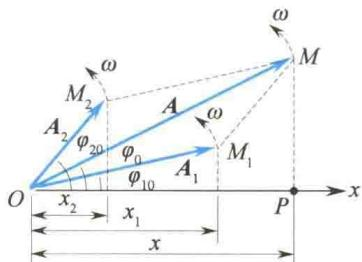
  <figcaption>图5.12 用旋转矢量法求同一</figcaption>
</figure>
直线上两简谐振动的合成
$$
x = A \cos (\omega t + \varphi_ {0})
$$
可见，合振动是振幅为 A、初相位为 $\varphi_{0}$ 的简谐振动，其角频率与两分振动相同，和前文结论一致。利用图 5.12 中的几何关系，可求得合振动的振幅 A、初相位 $\varphi_{0}$ ，结果分别与式 (5.29)、式 (5.30) 一致。
现进一步讨论合振动的振幅与两分振动相位差之间的关系.由式(5.29)可知：
(1) 相位差 $\varphi_{20}-\varphi_{10}=\pm2k\pi(k=0,1,2,\cdots)$ 时
$$
A = \sqrt {A _ {1} ^ {2} + A _ {2} ^ {2} + 2 A _ {1} A _ {2}} = A _ {1} + A _ {2}\tag{5.31}
$$
即两分振动相位相同时，合振幅等于两分振动振幅之和，合振幅最大.
(2) 相位差 $\varphi_{20}-\varphi_{10}=\pm(2k+1)\pi(k=0,1,2,\cdots)$ 时
$$
A = \sqrt {A _ {1} ^ {2} + A _ {2} ^ {2} - 2 A _ {1} A _ {2}} = | A _ {1} - A _ {2} |\tag{5.32}
$$
即两分振动相位相反时,合振幅等于两分振幅之差的绝对值,合振幅最小.
一般情况下，两分振动既不同相亦非反相，合振幅在 $A_{1} + A_{2}$ 与 $\mid A_1 - A_2\mid$ 之间.
同方向同频率简谐振动的合成原理,在讨论声波、光波及电磁辐射的干涉和衍射时经常用到.

## 5.4.2 同方向不同频率简谐振动的合成

设质点同时参与两个同方向,但频率分别为 $\omega_{1}$ 和 $\omega_{2}$ 的简谐振动.为突出频率不同引起的效果,设两分振动的振幅相同,且初相位均等于 $\varphi$ ,即
$$
\begin{array}{l} x _ {1} = A \cos (\omega_ {1} t + \varphi) \\ x _ {2} = A \cos (\omega_ {2} t + \varphi) \end{array}
$$
合振动的位移为
$$
x = x _ {1} + x _ {2} = A \cos (\omega_ {1} t + \varphi) + A \cos (\omega_ {2} t + \varphi)
$$
利用三角恒等式可求得
$$
x = 2 A \cos \left(\frac {\omega_ {2} - \omega_ {1}}{2} t\right) \cos \left(\frac {\omega_ {2} + \omega_ {1}}{2} t + \varphi\right)\tag{5.33}
$$
由式(5.33)可知,合振动不是简谐振动.但若两分振动的频率满足 $\omega_{2}+\omega_{1}\gg\left|\omega_{2}-\omega_{1}\right|$ , 则合振动表现出非常值得注意的特点.这时式(5.33)中等号右边第一项因子 $2A\cos\frac{\omega_{2}-\omega_{1}}{2}t$ 的周期要比另一因子 $\cos\left(\frac{\omega_{2}+\omega_{1}}{2}t+\varphi\right)$ 的周期大得多.于是可将式(5.33)表示的运动看作振幅按照 $\left|2A\cos\frac{\omega_{2}-\omega_{1}}{2}t\right|$ 缓慢变化,而角频率等于 $\frac{\omega_{2}+\omega_{1}}{2}$ 的准简谐振动,这是一种振幅有周期性变化的简谐振动.或者说,合振动描述的是一个高频振动受到一个低频振动调制的运动,如图5.13所示.这种振幅时大时小的现象叫作拍.
合振幅每变化一个周期称为一拍,单位时间内拍出现的次数(合振幅变化的频率)叫作拍频.由于振幅只能取正值,因此拍 $\left|2A\cos\frac{\omega_{2}-\omega_{1}}{2}t\right|$ 的角频率应为调制频率的2倍,即
$$
\omega_ {\mathrm{拍}} = | \omega_ {2} - \omega_ {1} |
$$
<figure class="vp-figure">
  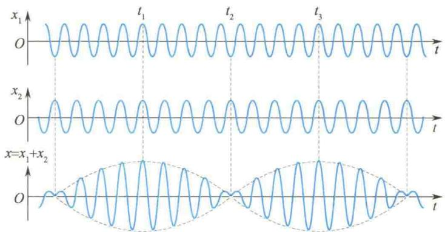
  <figcaption>图5.13 拍的形成</figcaption>
</figure>
于是拍频为
$$
\nu_ {\mathrm{拍}} = \frac {\omega_ {\mathrm{拍}}}{2 \pi} = \left| \frac {\omega_ {2}}{2 \pi} - \frac {\omega_ {1}}{2 \pi} \right| = | \nu_ {2} - \nu_ {1} |\tag{5.34}
$$
这就是说,拍频等于两个分振动频率之差.
拍现象在声振动、电磁振荡和波动中经常遇到。例如，当两个频率相近的音叉同时振动时，就可听到时强时弱的“嗡、嗡……”的拍音。人耳能区分的拍音低于每秒7次。利用拍现象还可以测定振动频率、校正乐器和制造拍振荡器等。
上述关于拍现象的讨论只限于线性叠加. 当两个不同频率的分振动出现物理上的非线性耦合时, 就可能出现“同步锁模”现象, 即两个振动系统锁定在同一频率上. 历史上首先注意这种现象的是 17 世纪的惠更斯, 他发现家中挂在同一木板墙壁上的两个挂钟因相互影响而同步. 以后的观察表明, 这种锁模现象也发生在“生物钟”内. 在电子示波器中, 人们充分利用这一原理把波形锁定在屏幕上.

## 5.4.3 振动的频谱分析

由上面的讨论可知,几个不同频率的简谐振动合成后可成为一个复杂的振动.反之,一个复杂的振动也可以分解成若干个或无穷多个简单的简谐振动.确定一个复杂振动能包含的各种简谐振动的频率及其对应的振幅称为频谱分析.
在数学上，一个周期为 $T$ 的函数可表示为
$$
x (t + T) = x (t)\tag{5.35}
$$
按傅里叶级数展开为
$$
x (t) = \frac {a _ {0}}{2} + \sum_ {n = 1} ^ {\infty} (a _ {n} \cos n \omega t + b _ {n} \sin n \omega t)\tag{5.36}
$$
式中
$$
\omega = 2 \pi \nu = \frac {2 \pi}{T}
$$
这就是说，如果把周期振动 $x(t)$ 看成一个复杂的振动，则这一振动可以看成许多简谐振动的叠加，或者说，可以分解成许多个简谐振动。这些简谐振动中有一个最小的频率 $\nu_{0}$ ，称为基频，其他频率都是基频的整数倍，为 $n\nu_{0}$ ，如 $2\nu_{0}, 3\nu_{0} \cdots\cdots$ ，它们分别称为二次、三次……谐频。不同的振动分解为简谐振动时，式（5.36）中的系数 $a_{n}, b_{n}$ 是不同的， $a_{n}, b_{n}$ 表示 $n$ 次谐频振动的振幅，它可以反映各种频率的振动在合振动中所占的比例。
例如，对于图5.14(a)所示的方波，根据数学计算有
$$
x = \frac {A}{2} + \frac {2 A}{\pi} \sin \omega t + \frac {2 A}{3 \pi} \sin 3 \omega t + \frac {2 A}{5 \pi} \sin 5 \omega t + \dots = x _ {0} + x _ {1} + x _ {2} + x _ {3} + \dots
$$
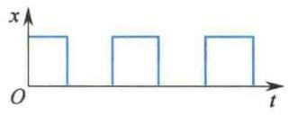
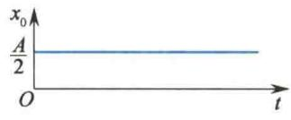  
(a)
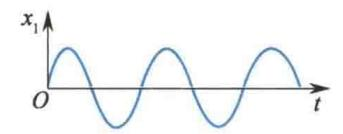
(b)  
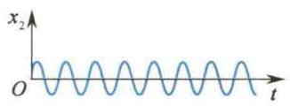  
(d)
(c)  
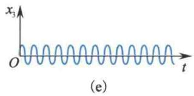
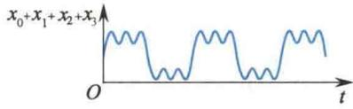  
(f)  
图5.14 方波的分解
式中，第一项可看成周期为无穷大的零频项，如图5.14(b)所示；第二、三、四项就是频率分别为 $\nu_{0},3\nu_{0},5\nu_{0}$ 的简谐振动，其振动曲线分别如图5.14(c)、(d)、(e)所示，它们的合振动曲线就接近方波了，如图5.14(f)所示.所取项数越多，则合成波越接近方波.如果以频率为横坐标，各频率对应的振幅为纵坐标，可作出如图5.15所示的频谱图.在频谱图上可直观地反映出不同频率的振动在合振动中所占的比例.对于周期振动，其频谱图是分立的；对于非周期振动，如脉冲等，其频谱图是连续的.这是因为，非周期振动的傅里叶展开是一个积分，即
$$
x = f (t) = \int_ {0} ^ {\infty} A (\omega) \cos \omega t \mathrm{d} \omega + \int_ {0} ^ {\infty} B (\omega) \sin \omega t \mathrm{d} \omega
$$
<figure class="vp-figure">
  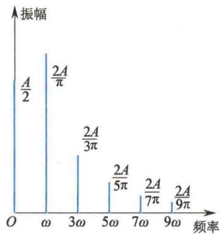
  <figcaption>图5.15 频谱图</figcaption>
</figure>
(5.37)
频谱分析是一种很有用的方法.例如，用钢琴、小提琴、手风琴等演奏同一音阶时，我们能分辨出是由哪几种乐器在演奏.因为它们虽然基频相同，但谐频不同，或者说频谱不同.只要做出各种乐器的频谱图，就可以用电子琴来模拟.频谱分析还在机械制造、地震学、电子技术、光谱分析中有重要的应用.

<Example title="例 5.5">
已知两个简谐振动的 x-t 曲线如图 5.16 所示, 它们的频率相同, 求它们的合振动方程.

<Solution title="解">
由图 5.16 中的曲线可以看出, 两个简谐振动的振幅相同, $A_{1} = A_{2} = A = 5 \, cm$ , 周期均为 T = 0.1 s, 因而角频率为
$$
\omega = \frac {2 \pi}{T} = 2 0 \pi \mathrm{rad} \cdot \mathrm{s} ^ {- 1}
$$
由 x-t 曲线(1) 可知, 简谐振动(1) 在 t=0 时, $x_{10}=0$ , $v_{10}>0$ , 因此可求出简谐振动(1) 的初相位 $\varphi_{10}=-\frac{\pi}{2}$ .
又由 x-t 曲线(2)可知, 简谐振动(2)在 t=0 时, $x_{20}=-5\ cm=-A$ , 因此可求出简谐振动(2)的初相位 $\varphi_{20}=\pm\pi$ .
由上面求得的 $A, \omega$ 和 $\varphi_{10}, \varphi_{20}$ ，可写出简谐振动（1）和（2）的振动方程分别为
<figure class="vp-figure">
  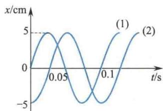
  <figcaption>图5.16 例5.5图</figcaption>
</figure>
$$
\begin{array}{r l} x _ {1} & = 5 \cos \left(2 0 \pi t - \frac {\pi}{2}\right) \mathrm{cm} \\ x _ {2} & = 5 \cos (2 0 \pi t \pm \pi) \mathrm{cm} \end{array}
$$
因此合振动的振幅和初相位分别为
$$
\begin{array}{r l} A ^ {\prime} & = \sqrt {A _ {1} ^ {2} + A _ {2} ^ {2} + 2 A _ {1} A _ {2} \cos (\varphi_ {2 0} - \varphi_ {1 0})} \\ & = \sqrt {2 A ^ {2} + 2 A ^ {2} \times 0} = \sqrt {2} A = 5 \sqrt {2} \mathrm{cm} \end{array}
$$
$$
\begin{array}{r l} \varphi_ {0} & = \arctan \frac {A _ {1} \sin \varphi_ {1 0} + A _ {2} \sin \varphi_ {2 0}}{A _ {1} \cos \varphi_ {1 0} + A _ {2} \cos \varphi_ {2 0}} = \arctan 1 \\ & = \frac {\pi}{4} \text {或} \frac {5}{4} \pi \end{array}
$$
由矢量合成的方法,从图中很容易求出合振动的振幅和初相位分别为
由 x-t 曲线可知，t=0 时， $x=x_{1}+x_{2}=-5\ cm$ ，因此， $\varphi_{0}$ 应取 $\frac{5}{4}\pi$ ，故合振动方程为
$$
x = 5 \sqrt {2} \cos \left(2 0 \pi t + \frac {5}{4} \pi\right) \mathrm{cm}
$$
故合振动方程为
事实上，从 $x - t$ 曲线分析出两个分振动（1）和（2）的振动方程后，用旋转矢量法求合振动方程更简单一些.如图5.17所示，在取定了 $Ox$ 轴的坐标原点后，分别画出两个旋转矢量 $\overrightarrow{OM_1}$ 和 $\overrightarrow{OM_2}$ ，代表两个简谐振动（1）和（2），其中 $\overrightarrow{OM_1} = \overrightarrow{OM_2} = 5\mathrm{cm}$ ，由 $\overrightarrow{OM_1}$ 与 $\overrightarrow{OM_2}$ 两个矢量合成的矢量 $\overrightarrow{OM}$ 就是代表合振动的旋转矢量，
$$
A ^ {\prime} = \sqrt {2} \overline {{{O M _ {1}}}} = 5 \sqrt {2} \mathrm{cm}, \quad \varphi_ {0} = \frac {5}{4} \pi .
$$
$$
x = 5 \sqrt {2} \cos \left(2 0 \pi t + \frac {5}{4} \pi\right) \mathrm{cm}
$$
<figure class="vp-figure">
  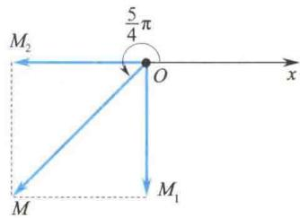
  <figcaption>图 5.17 用旋转矢量法求解</figcaption>
</figure>
</Solution>
</Example>

## 5.4.4 两个相互垂直的同频率简谐振动的合成

上面讨论了同一直线上两个简谐振动的合成,另外也存在方向不同的两个简谐振动的合成问题.在后一类问题中,特别是两个简谐振动相互垂直的情况,在电学、光学中有着广泛而重要的应用.
当一个质点同时参与两个不同方向的简谐振动时，质点的位移是这两个振动的位移的矢量和。一般情况下，质点将在平面上做曲线运动。质点轨迹的各种形状由两个振动的频率、振幅和相位差等决定。下面先讨论两个相互垂直的同频率简谐振动的合成情况。
设质点同时参与两个相互垂直方向上的简谐振动，一个沿 x 轴方向，另一个沿 y 轴方向，并且振动频率相同，以质点的平衡位置为坐标原点，两个振动方程分别为
$$
\begin{array}{r l} & x = A _ {1} \cos (\omega t + \varphi_ {1 0}) \\ & y = A _ {2} \cos (\omega t + \varphi_ {2 0}) \end{array}
$$
在任意时刻 t，质点的位置坐标是 $(x, y)$ ; t 改变时， $(x, y)$ 也改变. 所以这两个方程就是含参变量 t 的质点的运动方程，消去时间参数 t，便得到质点合振动的轨迹方程：
$$
\frac {x ^ {2}}{A _ {1} ^ {2}} + \frac {y ^ {2}}{A _ {2} ^ {2}} - 2 \frac {x y}{A _ {1} A _ {2}} \cos (\varphi_ {2 0} - \varphi_ {1 0}) = \sin^ {2} (\varphi_ {2 0} - \varphi_ {1 0})\tag{5.38}
$$
由式(5.38)可知,质点合振动的轨迹一般为椭圆,如图5.18所示.因为质点在两个垂直方向上的位移x和y只在一定范围内变化,所以椭圆轨道不会超出以 $2A_{1}$ 和 $2A_{2}$ 为边长的矩形范围.当两个分振动振幅 $A_{1}$ 、 $A_{2}$ 给定时,椭圆的其他性质(长短轴及方位)由两个分振动的相位差( $\varphi_{20}-\varphi_{10}$ )决定.下面讨论几种特殊情况.
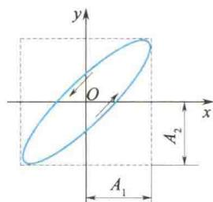
(1) $\varphi_{20}-\varphi_{10}=0$ ，即两个分振动相位相同。这时式(5.38)变为
即
$$
\begin{array}{r l} & {\left(\frac {x}{A _ {1}} - \frac {y}{A _ {2}}\right) ^ {2} = 0} \\ & {y = \frac {A _ {2}}{A _ {1}} x \quad \text {或} \quad \frac {x}{A _ {1}} = \frac {y}{A _ {2}}} \end{array}
$$
图5.18 两个相互垂直的简谐振动的合成
合振动的轨迹为通过坐标原点且在第一、第三象限内的直线，其斜率为两个分振动的振幅之比 $\frac{A_{2}}{A_{1}}$ ，如图5.19(a)所示。在任意时刻t，质点离开平衡位置的位移（即合振动的位移）为
$$
S = \sqrt {x ^ {2} + y ^ {2}} = \sqrt {A _ {1} ^ {2} + A _ {2} ^ {2}} \cos (\omega t + \varphi)
$$
上式表明,这种情况下合振动也是简谐振动,且与原来两个分振动的频率相同,但振幅为 $\sqrt{A_{1}^{2} + A_{2}^{2}}$ .
(2) $\varphi_{20}-\varphi_{10}=\pi$ ，即两个分振动相位相反。当其中一个分振动达到正最大时，另一个达到负最大。此时式(5.38)变为
$$
\left(\frac {x}{A _ {1}} + \frac {y}{A _ {2}}\right) ^ {2} = 0
$$
即
$$
\frac {x}{A _ {1}} = - \frac {y}{A _ {2}} \quad \text {或} \quad y = - \frac {A _ {2}}{A _ {1}} x
$$
其合振动的轨迹仍为一直线（在第二、四象限内），但直线的斜率为 $-\frac{A_2}{A_1}$ 。质点将在此直线上做振幅为 $\sqrt{A_1^2 + A_2^2}$ 、角频率为 $\omega$ 的简谐振动，如图5.19(b)所示。
(3) $\varphi_{20}-\varphi_{10}=\frac{\pi}{2}$ ，即y轴方向上的分振动比x轴方向上的分振动超前 $\frac{\pi}{2}$ .此时式(5.38)变为
$$
\frac {x ^ {2}}{A _ {1} ^ {2}} + \frac {y ^ {2}}{A _ {2} ^ {2}} = 1
$$
即合振动的轨迹为以 $x$ 轴和 $y$ 轴为轴线的椭圆，两个半轴长分别为 $A_{1}$ 和 $A_{2}$ ，如图5.19(c)所示。这时两个分振动方程分别为
$$
\begin{array}{r l} & x = A _ {1} \cos (\omega t + \varphi_ {1 0}) \\ & y = A _ {2} \cos \left(\omega t + \varphi_ {1 0} + \frac {\pi}{2}\right) \end{array}
$$
当 $(\omega t + \varphi_{10}) = 0$ 时， $x = A_1, y = 0$ ，质点在图5.19(c)中 $P$ 点；下一瞬间，有 $(\omega t + \varphi_{10}) > 0$ ，因而此时 $x$ 略小于 $A_1$ ，由于此时 $\left(\omega t + \varphi_{10} + \frac{\pi}{2}\right)$ 略大于 $\frac{\pi}{2}$ ，故 $y < 0$ ，质点将处于第四象限，因此可判定质点沿椭圆轨迹的运动方向是顺时针方向。
(4) $\varphi_{20}-\varphi_{10}=-\frac{\pi}{2}$ ，即x轴方向上的分振动比y轴方向上的分振动超前 $\frac{\pi}{2}$ ，由与(3)中类同的分析知，合振动的轨迹仍为以x轴和y轴为轴线的椭圆，如图5.19(d)所示，但质点的运动方向与(3)相反.
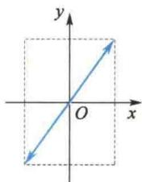  
(a) $\varphi_{20}-\varphi_{10}=0$
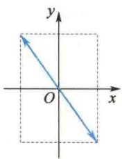  
(b) $\varphi_{20} - \varphi_{10} = \pi$
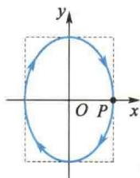
$$
\varphi_ {2 0} - \varphi_ {1 0} = \frac {\pi}{2}
$$
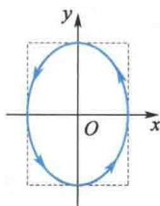  
(d) $\varphi_{20} - \varphi_{10} = -\frac{\pi}{2}$  
图 5.19 几个不同相位差的垂直振动的合成轨迹
在上面的(3)和(4)中,若两个分振动的振幅相同,即 $A_{1}=A_{2}$ ,则合振动的轨迹为一圆.
上面是几种特殊情形,一般情况下,若两个分振动的相位差取其他数值,则合振动的轨迹将为形状与方位各不相同的椭圆,质点的运动方向则可能为顺时针或逆时针方向,如图5.20所示.
总之，一般来说，两个振动方向相互垂直的同频率的简谐振动合成，合振动轨迹为一直线、圆或椭圆。轨迹的具体形状、方位和运动方向由分振动的振幅和相位差决定。在电子示波器中，若使相互垂直的正弦变化的电学量频率相同，就可以在屏上观察到合振动的轨迹。
以上讨论也说明:任何一个直线简谐振动、椭圆运动或匀速圆周运动都可以分解为两个相互垂直的同频率的简谐振动.
<figure class="vp-figure">
  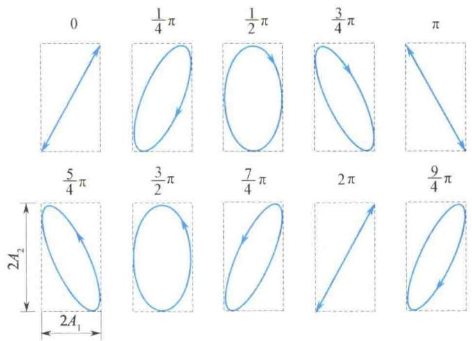
  <figcaption>图 5.20 两个相互垂直的振幅不同频率相同的简谐振动的合成</figcaption>
</figure>

