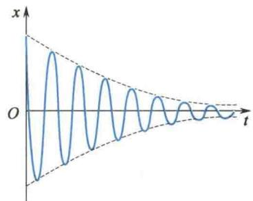
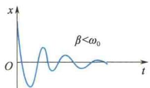
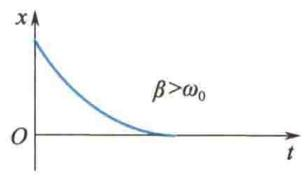
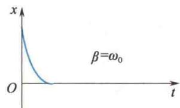
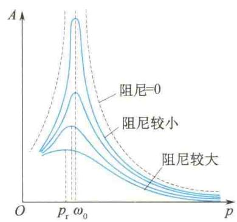
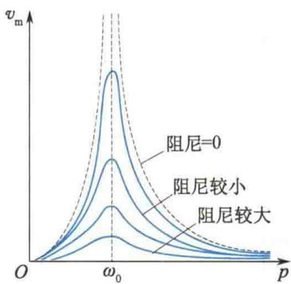
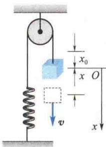

import QRCodeVideo from '@/components/QRCodeVideo.astro';

import Guide from '@/components/Guide.astro';
import Knowledge from '@/components/Knowledge.astro';
import Example from '@/components/Example.astro';
import Analysis from '@/components/Analysis.astro';
import Solution from '@/components/Solution.astro';
import Variant from '@/components/Variant.astro';
import Note from '@/components/Note.astro';
import Block from '@/components/Block.astro';
import Method from '@/components/Method.astro';
import Exercise from '@/components/Exercise.astro';

## 5.5.1 阻尼振动

前面所讨论的简谐振动是一种理想状况, 即谐振子系统做无阻尼(无摩擦和辐射损失) 的自由振动. 它是等幅振动. 而在实际中, 阻尼是不可消除的, 如没有能量补充, 由于机械能有损耗, 其振幅将不断地衰减. 这种振幅随时间不断衰减的振动叫作阻尼振动.
下面讨论的是谐振子系统受到弱介质阻力而衰减的情况. 弱介质阻力是指当振子运动速度较低时, 介质对物体的阻力仅与速度的一次方成正比, 即这时阻力为
$$
f _ {\mathrm{r}} = - \gamma v = - \gamma \frac {\mathrm{d} x}{\mathrm{d} t}\tag{5.39}
$$
式中， $\gamma$ 称为阻力系数，与物体的形状、大小、物体的表面性质及介质性质有关.
仍以弹簧振子为例,这时振子的动力学方程为
$$
m \frac {\mathrm{d} ^ {2} x}{\mathrm{d} t ^ {2}} = - k x - \gamma \frac {\mathrm{d} x}{\mathrm{d} t}
$$
令 $\omega_{0}^{2}=\frac{k}{m},2\beta=\frac{\gamma}{m}$ ，上式可化成
$$
\frac {\mathrm{d} ^ {2} x}{\mathrm{d} t ^ {2}} + 2 \beta \frac {\mathrm{d} x}{\mathrm{d} t} + \omega_ {0} ^ {2} x = 0\tag{5.40}
$$
式中， $\omega_{0}$ 是系统的固有角频率， $\beta$ 称为阻尼系数.
式(5.40)的解,与阻尼的大小有关.当 $\beta<\omega_{0}$ 时,称为弱阻尼,其方程的解为
$$
x = A _ {0} \mathrm{e} ^ {- \beta t} \cos (\omega t + \varphi_ {0})\tag{5.41}
$$
式中， $\omega=\sqrt{\omega_{0}^{2}-\beta^{2}}$ ， $A_{0}$ 和 $\varphi_{0}$ 依然是由初始条件确定的两个积分常数。阻尼振动的位移随时间变化的曲线如图 5.21 所示，图中虚线表示阻尼振动的振幅 $A_{0}e^{-\beta t}$ 随时间 t 按指数衰减，阻尼越大（仍满足 $\beta<\omega_{0}$ ），振幅衰减越快。阻尼振动的准周期为
$$
T = \frac {2 \pi}{\omega} = \frac {2 \pi}{\sqrt {\omega_ {0} ^ {2} - \beta^ {2}}} > \frac {2 \pi}{\omega_ {0}}\tag{5.42}
$$
<figure class="vp-figure">
  
  <figcaption>图 5.21 阻尼振动的位移曲线</figcaption>
</figure>
可见,阻尼振动的周期比系统的固有周期大.
若 $\beta > \omega_{0}$ ，称为过阻尼，此时方程的解为
$$
x = c _ {1} \mathrm{e} ^ {- (\beta - \sqrt {\beta^ {2} - \omega_ {0} ^ {2}}) t} + c _ {2} \mathrm{e} ^ {- (\beta + \sqrt {\beta^ {2} - \omega_ {0} ^ {2}}) t}\tag{5.43}
$$
这时系统不做往复运动,而是非常缓慢地回到平衡位置,如图 5.22(b) 所示.
若 $\beta = \omega_{0}$ ，称为临界阻尼，这时式(5.40)的解为
$$
x = (c _ {1} + c _ {2} t) \mathrm{e} ^ {- \beta t}\tag{5.44}
$$
此时系统也不做往复运动,而是较快地回到平衡位置并停下来,如图 5.22(c) 所示.
  
(a) 弱阻尼
  
(b) 过阻尼
  
(c) 临界阻尼  
图 5.22 阻尼振动三种情况的比较
在实际应用中,常利用改变阻尼的方法来控制系统的振动情况.例如,各类机器的防震器大多采用一系列的阻尼装置;有些精密仪器,如物理天平、灵敏电流计中装有阻尼装置并调至临界阻尼状态,使测量快捷、准确.

## 5.5.2 受迫振动

阻尼振动又称减幅振动. 要使有阻尼的振动系统维持等幅振动, 必须不断地给振动系统补充能量, 即施加持续的周期性外力. 振动系统在周期性外力的作用下发生的振动叫作受迫振动. 这个周期性外力叫作驱动力.
为简单起见,假设驱动力取如下形式:
$$
F = F _ {0} \cos p t\tag{5.45}
$$
式中， $F_{0}$ 为驱动力的幅值，p 为驱动力的频率。这种驱动力又称谐和驱动力。
仍以弹簧振子为例,讨论弱阻尼谐振子系统在谐和驱动力作用下的受迫振动,其动力学方程为
$$
m \frac {\mathrm{d} ^ {2} x}{\mathrm{d} t ^ {2}} = - k x - \gamma \frac {\mathrm{d} x}{\mathrm{d} t} + F _ {0} \cos p t\tag{5.46}
$$
令 $\omega_0^2 = \frac{k}{m}, 2\beta = \frac{\gamma}{m}, f_0 = \frac{F_0}{m}$ , 可得
$$
\frac {\mathrm{d} ^ {2} x}{\mathrm{d} t ^ {2}} + 2 \beta \frac {\mathrm{d} x}{\mathrm{d} t} + \omega_ {0} ^ {2} x = f _ {0} \cos p t\tag{5.47}
$$
该方程的解为
$$
x = A _ {0} \mathrm{e} ^ {- \beta t} \cos (\omega t + \varphi_ {0}) + A \cos (p t + \varphi)\tag{5.48}
$$
由微分方程理论可知,解的第一项实际是式(5.40)在弱阻尼下的通解,随着时间的推移,很快就会衰减为零,故第一项称为衰减项.第二项才是稳定项,即式(5.47)的稳定解为
$$
x = A \cos (p t + \varphi)\tag{5.49}
$$
可见,稳定受迫振动的频率等于驱动力的频率.
将式(5.49)代入式(5.47)，并采用待定系数法可确定稳定受迫振动的振幅为
$$
A = \frac {f _ {0}}{\sqrt {(\omega_ {0} ^ {2} - p ^ {2}) ^ {2} + 4 \beta^ {2} p ^ {2}}}\tag{5.50}
$$
<QRCodeVideo title="共振的条件和特征" url="https://api.guangyiedu.com/v3/resource/resource/r/NewQrCode-B6LzCs8NgeGk1JNti5HX" />  
这说明,稳定受迫振动的振幅与系统的初始条件无关,而是与系统的固有频率、阻尼系数及驱动力频率和幅值均有关的函数.

## 5.5.3 共振

共振是受迫振动中一个重要而具有实际意义的现象,下面分别从位移共振和速度共振两方面加以讨论.

### 1. 位移共振

<QRCodeVideo title="共振的应用和危害" url="https://api.guangyiedu.com/v3/resource/resource/r/NewQrCode-GIMPtKU4jHdvo1ix9hLR" />  
共振的应用与危害
由式(5.50)可知,对于一个给定的振动系统,当阻尼和驱动力幅值不变时,受迫振动的位移振幅是驱动力角频率 p 的函数,它存在一个极值.受迫振动的位移达极大值的现象称为位移共振.将式(5.50)对 p 求导并令 $\frac{dA}{dp}=0$ ,可求出位移共振的角频率满足
$$
p _ {\mathrm{r}} = \sqrt {\omega_ {0} ^ {2} - 2 \beta^ {2}}
$$

(5.51)
显然,共振位移的大小与阻尼有关,其关系如图 5.23 所示.
图 5.23 位移共振曲线

### 2. 速度共振

系统做受迫振动时,其速度也是与驱动力角频率相关的函数,即
式中
$$
\begin{array}{r l} v = - p A \sin (p t + \varphi) & = - v _ {\mathrm{m}} \sin (p t + \varphi) \\ v _ {\mathrm{m}} = p A & = \frac {p f _ {0}}{\sqrt {(\omega_ {0} ^ {2} - p ^ {2}) ^ {2} + 4 \beta^ {2} p ^ {2}}} \end{array}\tag{5.52}
$$
称为速度振幅,同样可求出当
$$
p _ {v} = \omega_ {0}\tag{5.53}
$$
时，速度振幅有极大值，这种现象称为速度共振，如图5.24所示.进一步的研究表明，当系统发生速度共振时,外界能量的输入处于最佳状态,即驱动力在整个周期内对系统做正功,用以补偿阻尼引起的能耗.因此,速度共振又称能量共振.在弱阻尼情况下,位移共振与速度共振的条件趋于一致,所以一般不必区分两种共振.

共振现象在光学、电学、无线电技术中应用极广. 如收音机的调谐就是利用了电共振. 此外, 如何避免共振对桥梁、烟囱、水坝、高楼等建筑物的破坏, 也是设计制造者必须考虑的问题.
<figure class="vp-figure">
  
  <figcaption>图 5.24 速度共振曲线</figcaption>
</figure>

<Example title="例 5.6">
一定滑轮的转动惯量为 J，半径为 R。如图 5.25 所示，一轻绳绕过该定滑轮，一端系一质量为 m 的物体，另一端与一刚度系数为 k，且另一端固定的轻弹簧相连。现将物体从平衡位置沿竖直方向移动一微小距离后释放。试分析该物体的运动，并求其运动的周期。（不考虑轮轴处的摩擦及物体、绳子、滑轮与空气间的摩擦）

<Solution title="解">
如图 5.25 所示,选取物体悬挂于弹簧上处于平衡状态时的位置为坐标原点 O, 竖直向下为 x 轴正方向.
物体在坐标原点 O 时, 物体的重力势能为零, 弹簧的伸长量为 $x_{0}$ , 弹簧的弹性势能即系统的初始机械能为 $E_{0} = kx_{0}^{2}/2$ , 且有 $kx_{0} = mg$ .
任意位置 x 处, 弹簧的伸长量为 $x_{0} + x$ , 物体的速率为 v. 系统的机械能为
$$
E = m v ^ {2} / 2 + J \omega^ {2} / 2 - m g x + k (x + x _ {0}) ^ {2} / 2
$$
将 $v = R\omega, kx_0 = mg$ 代入上式，整理得
$$
\begin{array}{r l} E - k x _ {0} ^ {2} / 2 & = v ^ {2} (m + J / R ^ {2}) / 2 + k x ^ {2} / 2 \\ & = \text { 常量 } \end{array}
$$
令 $m^{\prime} = m + J / R^{2}$ ，则上式简化为
$$
\frac {1}{2} m ^ {\prime} v ^ {2} + \frac {1}{2} k x ^ {2} = \mathrm{常量}
$$
将上式两边对时间 t 求导, 可得
$$
m ^ {\prime} v \frac {\mathrm{d} v}{\mathrm{d} t} + k x \frac {\mathrm{d} x}{\mathrm{d} t} = 0
$$
<figure class="vp-figure">
  
  <figcaption>图5.25 例5.6图</figcaption>
</figure>
因为任意时刻速度 $v = dx/dt \neq 0$ ，再将上式两边同时除以 v，有
$$
m ^ {\prime} \frac {\mathrm{d} v}{\mathrm{d} t} + k x = 0
$$
又假设 $\omega^{2}=k/m'$ ，则有 $\frac{d^{2}x}{dt^{2}}+\omega^{2}x=0$ 成立。表明由物体、弹簧等构成的系统的运动为简谐振动。其周期
$$
T = 2 \pi / \omega = 2 \pi \sqrt {m + J / R ^ {2}} / \sqrt {k}
$$
</Solution>
</Example>
