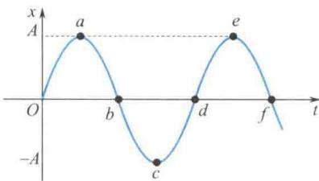

import Guide from '@/components/Guide.astro';
import Knowledge from '@/components/Knowledge.astro';
import Example from '@/components/Example.astro';
import Analysis from '@/components/Analysis.astro';
import Solution from '@/components/Solution.astro';
import Variant from '@/components/Variant.astro';
import Note from '@/components/Note.astro';
import Block from '@/components/Block.astro';
import Method from '@/components/Method.astro';
import Exercise from '@/components/Exercise.astro';

## 填空题

<Exercise title="习题 5.2.1">
一质点在 x 轴上做简谐振动, 振幅 A = 4 cm, 周期 T = 2 s, 其平衡位置取作坐标原点. 若 t = 0 时质点第一次通过 x = -2 cm 处且向 x 轴负方向运动, 则质点第二次通过 x = -2 cm 处的时刻为 \_\_\_\_ s.
</Exercise>

<Exercise title="习题 5.2.2">
一水平弹簧振子的振动曲线如题 5.2.2 图所示. 振子的位移为零、速度为 $-\omega A$ 、加速度为零和弹性力为零的状态分别对应于曲线上的 \_\_\_\_ 点. 振子处在位移的绝对值为 A 、速率为零、加速度为 $-\omega^{2}A$ 和弹性力为 -kA 的状态时, 分别对应曲线上的 \_\_\_\_ 点.

</Exercise>

<Exercise title="习题 5.2.3">
一质点沿 x 轴做简谐振动, 振动范围的中心点为 x 轴的坐标原点, 已知周期为 T, 振幅为 A.

题5.2.2图

(a) 若 t = 0 时质点过 x = 0 处且朝 x 轴正方向运动，则振动方程为 x = \_\_\_\_.  

(b) 若 t = 0 时质点过 x = A / 2 处且朝 x 轴负方向运动，则振动方程为 x = \_\_\_\_.

</Exercise>
