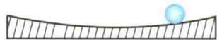
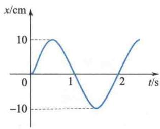
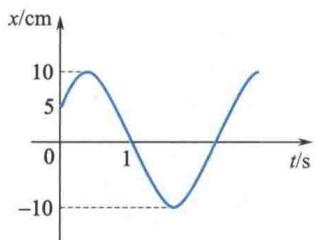

import QRCodeVideo from '@/components/QRCodeVideo.astro';

import Guide from '@/components/Guide.astro';
import Knowledge from '@/components/Knowledge.astro';
import Example from '@/components/Example.astro';
import Analysis from '@/components/Analysis.astro';
import Solution from '@/components/Solution.astro';
import Variant from '@/components/Variant.astro';
import Note from '@/components/Note.astro';
import Block from '@/components/Block.astro';
import Method from '@/components/Method.astro';
import Exercise from '@/components/Exercise.astro';

## 解答题

<Exercise title="习题 5.3.1">
符合什么规律的运动才是简谐振动？分别分析下列运动是不是简谐振动.
(1) 拍皮球时球的运动；
(2) 如题 5.3.1 图所示, 一小球在一个半径很大的光滑凹球面内滚动 (设小球所经过的弧线很短).
  
题5.3.1图
</Exercise>

<Exercise title="习题 5.3.2">
弹簧振子的振幅增大到原振幅的 2 倍时, 其振动周期、振动能量、最大速度和最大加速度等物理量将如何变化?
</Exercise>

<Exercise title="习题 5.3.3">
单摆的周期受哪些因素影响？把某一单摆由赤道拿到北极去，它的周期是否变化？
</Exercise>

<Exercise title="习题 5.3.4">
简谐振动的速度和加速度在什么情况下是同号的？在什么情况下是异号的？加速度为正值时，振动质点的速率是否一定在增大？
</Exercise>

<Exercise title="习题 5.3.5">
质量为 $10 \times 10^{-3}$ kg 的小球与轻弹簧组成的系统，按 $x = 0.1 \cos \left(8\pi t + \frac{2\pi}{3}\right)$ (SI) 的规律做简谐振动.
(1) 求振动的周期、振幅、初相位及速度与加速度的最大值；
(2) 求最大回复力、振动能量、平均动能和平均势能，在哪些位置上动能与势能相等？
(3) 求 $t_{2} = 5 \, s$ 与 $t_{1} = 1 \, s$ 两个时刻的相位差.
</Exercise>

<Exercise title="习题 5.3.6">
一个沿 x 轴做简谐振动的弹簧振子, 振幅为 A, 周期为 T, 其振动方程用余弦函数表示. 如果 t = 0 时质点的状态分别是:
(1) $x_0 = -A$ ;
(2) 过平衡位置向 x 轴正方向运动；
(3) 过 $x = \frac{A}{2}$ 处且向 x 轴负方向运动；
(4) 过 $x = -\frac{A}{\sqrt{2}}$ 处且向 x 轴正方向运动.
试求出相应的初相位，并写出振动方程.
</Exercise>

<Exercise title="习题 5.3.7">
一质量为 $10 \times 10^{-3}$ kg 的物体做简谐振动，振幅为 24 cm，周期为 4.0 s，当 t = 0 时位移为 +24 cm。求：
(1) t = 0.5 s 时, 物体所在的位置及此时所受力的大小和方向;
(2) 由起始位置运动到 x = 12 cm 处所需的最短时间；
(3) 在 $x = 12 \, cm$ 处物体的总能量.
</Exercise>

<Exercise title="习题 5.3.8">
有一轻弹簧,下面悬挂质量为 1.0 g 的物体时,伸长量为 4.9 cm. 用这个弹簧和一个质量为 8.0 g 的小球构成弹簧振子,将小球由平衡位置向下拉开 1.0 cm 后,给予向上的初速率 $v_{0} = 5.0 \, cm/s$ , 求振动周期和振动方程.
</Exercise>

<Exercise title="习题 5.3.9">
题 5.3.9 图所示为两个简谐振动的 x-t 曲线，试分别写出其简谐振动方程.
  
(a)
  
(b)  
题5.3.9图
</Exercise>

<Exercise title="习题 5.3.10">
有一单摆，摆长 $l = 1.0\mathrm{m}$ ，摆球质量 $m = 10\times 10^{-3}\mathrm{kg}$ ，当摆球处在平衡位置时，若给小球一水平向右的冲量 $F\Delta t = 1.0\times 10^{-4}\mathrm{kg}\cdot \mathrm{m / s}$ ，取打击时刻为计时起点（ $t = 0$ ），求振动的初相位和角振幅，并写出小球的振动方程。
</Exercise>

<Exercise title="习题 5.3.11">
有两个同方向同频率的简谐振动 A 和 B，其合振动的振幅为 0.20 m，相位与简谐振动 A 的相位差为 $\frac{\pi}{6}$ ，已知简谐振动 A 的振幅为 0.173 m，求简谐振动 B 的振幅，以及简谐振动 A 和 B 的相位差。
</Exercise>

<Exercise title="习题 5.3.12">
试用最简单的方法求出下列两组简谐振动合成后所得合振动的振幅：
$$
\left\{ \begin{array}{l} x _ {1} = 5 \cos \left(3 t + \frac {\pi}{3}\right) \mathrm{cm} \\ x _ {2} = 5 \cos \left(3 t + \frac {7 \pi}{3}\right) \mathrm{cm} \end{array} \right.
$$
$$
\left\{ \begin{array}{l} x _ {1} = 5 \cos \left(3 t + \frac {\pi}{3}\right) \mathrm{cm} \\ x _ {2} = 5 \cos \left(3 t + \frac {4 \pi}{3}\right) \mathrm{cm} \end{array} \right.
$$
</Exercise>

<Exercise title="习题 5.3.13">
一质点同时参与两个在同一直线上的简谐振动,振动方程为 $\left\{ \begin{array}{l} x_{1} = 0.4 \cos \left(2t + \frac{\pi}{6}\right) \mathrm{m} \\ x_{2} = 0.3 \cos \left(2t - \frac{5}{6}\pi\right) \mathrm{m} \end{array} \right.$ 试分别用旋转矢量法和振动合成法求合振动的振幅和初相位,并写出合振动方程.
<QRCodeVideo title="本章提要" url="https://api.guangyiedu.com/v3/resource/resource/r/NewQrCode-2WlQsDR1Hy6rfvNTsEvk" />  
</Exercise>
