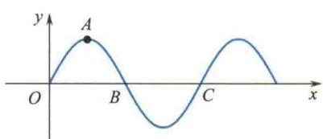
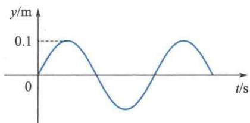
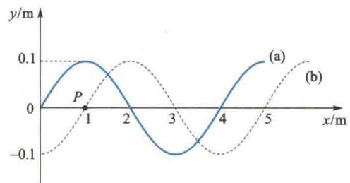
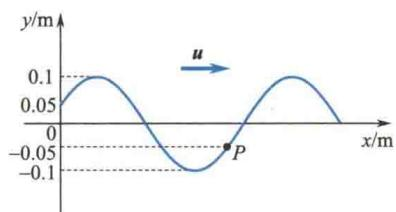
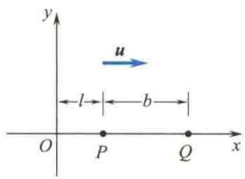
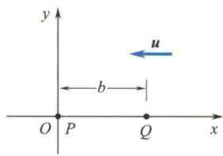
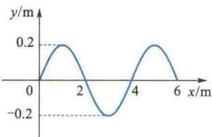
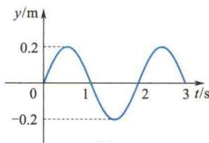
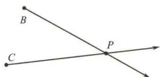
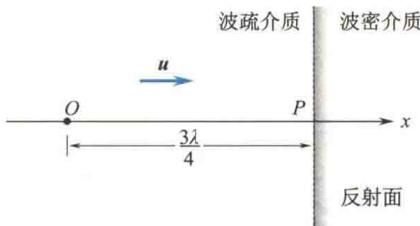

import Guide from '@/components/Guide.astro';
import Knowledge from '@/components/Knowledge.astro';
import Example from '@/components/Example.astro';
import Analysis from '@/components/Analysis.astro';
import Solution from '@/components/Solution.astro';
import Variant from '@/components/Variant.astro';
import Note from '@/components/Note.astro';
import Block from '@/components/Block.astro';
import Method from '@/components/Method.astro';
import Exercise from '@/components/Exercise.astro';

## 解答题

<Exercise title="习题 6.3.1">
产生机械波的条件是什么？两列波叠加产生干涉现象必须满足什么条件？满足什么条件的两列波才能叠加后形成驻波？在什么情况下会出现半波损失？
</Exercise>

<Exercise title="习题 6.3.2">
波长、波速、周期和频率这四个物理量中，哪些量由传播介质决定？哪些量由波源决定？
</Exercise>

<Exercise title="习题 6.3.3">
波速和介质质元的振动速度相同吗？它们各表示什么意思？波的能量是以什么速度传播的？
</Exercise>

<Exercise title="习题 6.3.4">
振动和波动有什么区别和联系？平面简谐波函数和简谐振动方程有什么不同？又有什么联系？振动曲线和波形曲线有什么不同？行波和驻波有何区别？
</Exercise>

<Exercise title="习题 6.3.5">
波源向着观察者运动和观察者向着波源运动都会产生频率增大的多普勒效应,这两种情况有何区别?
</Exercise>

<Exercise title="习题 6.3.6">
已知波源在坐标原点的一列平面简谐波，波函数为 $y = A \cos(Bt - Cx)$ ，其中 A、B、C 均为正值恒量.

(1) 求波的振幅、波速、频率、周期与波长；

(2) 写出传播方向上距波源 l 处一点的振动方程；

(3) 求任意时刻, 在波的传播方向上相距 d 的两点的相位差.

沿绳子传播的平面简谐波的波函数为 $y = 0.05 \cos(10\pi t - 4\pi x)$ ，式中 x, y 的单位为 m, t 的单位为 s.

(1) 求绳子上各质点振动时的最大速度和最大加速度；

(2) 求 $x = 0.2 \, m$ 处质点在 $t = 1 \, s$ 时的相位，它是坐标原点在哪一时刻的相位？这一相位所代表的运动状态在 $t = 1.25 \, s$ 时刻到达哪一点？
</Exercise>

<Exercise title="习题 6.3.8">
题6.3.8图所示是沿 $x$ 轴传播的平面余弦波在 $t$ 时刻的波形曲线。（1）若波沿 $x$ 轴正方向传播，该时刻 $O, A, B, C$ 各点的振动相位是多少？（2）若波沿 $x$ 轴负方向传播，上述各点的振动相位又是多少？
</Exercise>

<Exercise title="习题 6.3.9">
一列平面余弦波沿 x 轴正方向传播, 波速为 5 m/s, 波长为 2 m, 坐标原点处质点的振动曲线如题 6.3.9 图所示.

(1) 写出波函数；

(2) 作出 t = 0 s 时的波形图及距离波源 0.5 m 处质点的振动曲线.

  

题6.3.8图

  

题6.3.9图
</Exercise>

<Exercise title="习题 6.3.10">
如题6.3.10图所示，已知 $t = 0$ 时和 $t = 0.5\mathrm{s}$ 时的波形曲线分别如图中曲线(a)和(b)所示，周期 $T > 0.5\mathrm{s}$ ，波沿 $x$ 轴正方向传播。试根据图6.3.10中给出的条件，求：

(1) 波函数；

(2) $P$ 点的振动方程.
</Exercise>

<Exercise title="习题 6.3.11">
一列机械波沿 x 轴正方向传播, t = 0 时的波形如题 6.3.11 图所示, 已知波速为 10 m/s, 波长为 2 m, 求:

(1) 波函数；

(2) $P$ 点的振动方程及振动曲线；

(3) $P$ 点的坐标；

(4) P 点回到平衡位置所需的最短时间.

  

题6.3.10图

  

题6.3.11图
</Exercise>

<Exercise title="习题 6.3.12">
如题6.3.12图所示，一平面简谐波在空间传播，已知 $P$ 点的振动方程为 $y_{P} = A\cos (\omega t + \varphi_{0})$ （1）分别就图中给出的两种坐标写出其波函数；  

(2) 写出与 $P$ 点的距离为 $b$ 的 $Q$ 点的振动方程.

  

(a)

  

题6.3.12图  

(b)
</Exercise>

<Exercise title="习题 6.3.13">
已知平面简谐波的波函数为

$$

y = A \cos \pi (4 t + 2 x)\tag{SI}

$$

(1) 写出 $t = 4.2 \, s$ 时各波峰位置的坐标式，并求此时离坐标原点最近的一个波峰的位置，该波峰何时通过坐标原点？

(2) 画出 t = 4.2 s 时的波形曲线.
</Exercise>

<Exercise title="习题 6.3.14">
题 6.3.14 图(a)为 t=0 时刻的波形图, 题 6.3.14 图(b)为坐标原点 $(x=0)$ 处质元的振动曲线, 试求此波的波函数, 并画出 $x=2\ m$ 处质元的振动曲线.

  

(a)

  

(b)  

题6.3.14图
</Exercise>

<Exercise title="习题 6.3.16">
一平面余弦波，沿直径为 $14\mathrm{cm}$ 的圆柱形管传播，波的强度为 $18.0\times 10^{-3}\mathrm{J / (m^2\cdot s)}$ ，频率为 $300\mathrm{Hz}$ ，波速为 $300~\mathrm{m / s}$ ，求波的平均能量密度和最大能量密度.如题6.3.16图所示， $\mathbf{S}_1$ 和 $\mathbf{S}_2$ 为两相干波源，振幅均为 $A_{1}$ ，相距 $\frac{\lambda}{4},S_1$ 较 $\mathbf{S}_2$ 相位超前 $\frac{\pi}{2}$ ，求：（1） $\mathbf{S}_1$ 外侧各点的合振幅和强度；(2） $\mathbf{S}_2$ 外侧各点的合振幅和强度.

  

题6.3.16图
</Exercise>

<Exercise title="习题 6.3.17">
如题 6.3.17 图所示，设 B 点发出的平面横波沿 BP 方向传播，它在 B 点的振动方程为 $y_{1} = 2 \times 10^{-3} \cos 2\pi t$ ; C 点发出的平面横波沿 CP 方向传播，它在 C 点的振动方程为 $y_{2} = 2 \times 10^{-3} \cos (2\pi t + \pi)$ ，本题中 y 的单位为 m, t 的单位为 s。设 BP = 0.4 m, CP = 0.5 m，波速 u = 0.2 m/s，求：

(1) 两列波传到 P 点时的相位差；

(2) 当这两列波的振动方向相同时, P 点合振动的振幅.

  

题6.3.17图
</Exercise>

<Exercise title="习题 6.3.18">
一平面简谐波沿 x 轴正方向传播, 如题 6.3.18 图所示. 已知振幅为 A, 频率为 $\nu$ , 波速为 u.

(1) 若 t = 0 时，坐标原点 O 处的质元正好由平衡位置向位移正方向运动，写出此波的波函数；

(2) 若从分界面反射的波的振幅与入射波的振幅相等，试写出反射波的波函数，并求 x 轴上因入射波与反射波干涉而静止的各点的位置.

  

题6.3.18图

设驻波方程为 $y = 0.02\cos 20x\cos 750t(\mathrm{SI})$ ，求：

(1) 形成此驻波的两列行波的振幅和波速；

(2) 相邻两波节之间的距离.

在弦上传播的横波，它的波函数为 $y_{1} = 0.1\cos (13t + 0.0079x)$ (SI)，试写出一个波函数，使它表示的波能与这列已知的横波叠加形成驻波，并在 $x = 0$ 处为波节.

两列波在一根很长的细绳上传播,它们的波函数分别为

$$

\begin{array}{l} y _ {1} = 0. 0 6 \cos (\pi x - 4 \pi t) \\ y _ {2} = 0. 0 6 \cos (\pi x + 4 \pi t) \end{array}\tag{SI}

$$

(SI)

(1) 试证明绳子将做驻波式振动，并求波节、波腹的位置；

(2) 波腹处的振幅多大? x = 1.2 m 处振幅多大?
</Exercise>

<Exercise title="习题 6.3.19">
22 一汽车驶过车站时,车站上的观测者测得汽笛声的频率由1200 Hz变到了1000 Hz,设空气中声速为330 m/s,求汽车的速率.
</Exercise>

<Exercise title="习题 6.3.23">
两列火车分别以 $72 \mathrm{~km} / \mathrm{h}$ 和 $54 \mathrm{~km} / \mathrm{h}$ 的速度相向而行，一列火车发出频率为 $600 \mathrm{~Hz}$ 的汽笛声，若声速为 $340 \mathrm{~m} / \mathrm{s}$ ，则另一列火车上的观测者听见该声音的频率在相遇前和相遇后分别是多少？
</Exercise>
