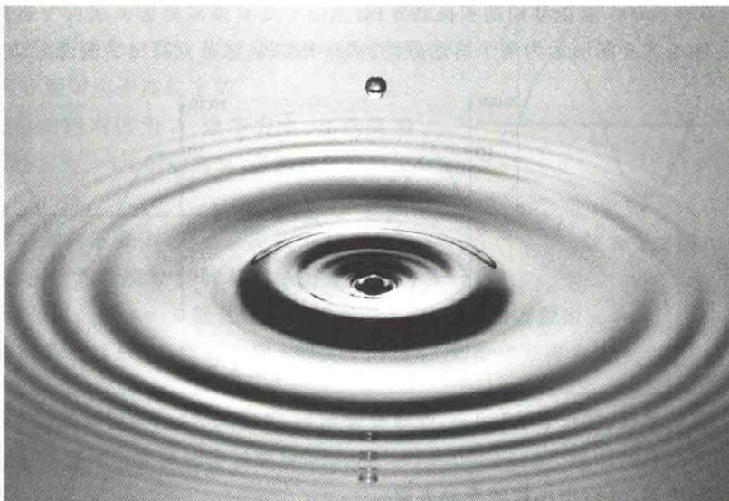
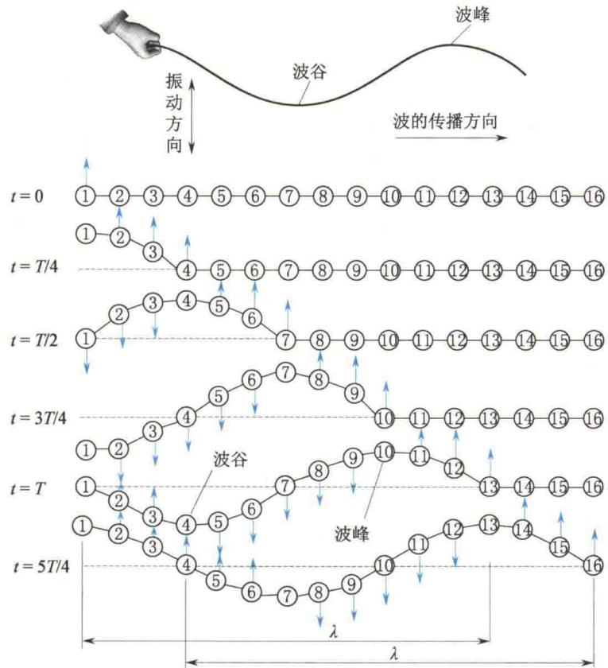
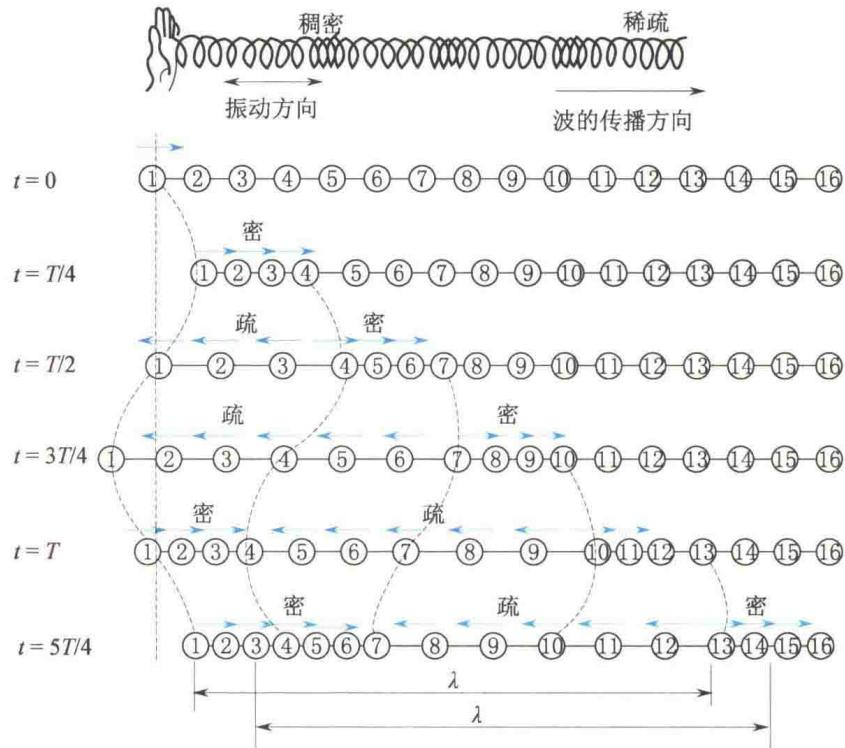
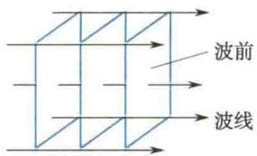
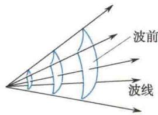
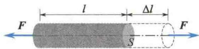
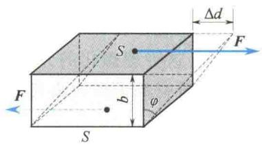
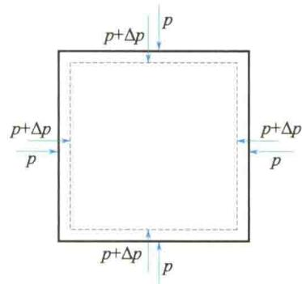

import Guide from '@/components/Guide.astro';
import Knowledge from '@/components/Knowledge.astro';
import Example from '@/components/Example.astro';
import Analysis from '@/components/Analysis.astro';
import Solution from '@/components/Solution.astro';
import Variant from '@/components/Variant.astro';
import Note from '@/components/Note.astro';
import Block from '@/components/Block.astro';
import Method from '@/components/Method.astro';
import Exercise from '@/components/Exercise.astro';

## 第6章 机械波

本章提要

如果在空间某处发生的振动,以有限的速度向四周传播,则这种传播着的振动称为波.机械振动在连续介质内的传播叫作机械波;电磁振荡在真空或介质中的传播叫作电磁波;近代物理学指出,微观粒子以至任何物体都具有波动性,这种波叫作物质波.不同性质的波动虽然机制各不相同,但它们在空间的传播规律却具有共性.
本章以机械波为例,讨论波动运动规律.

## 6.1.1 机械波产生的条件

将石子投入平静的水池中，投石处的水质元会发生振动，振动向四周水面传播而泛起的涟漪即为水面波。音叉振动时，会引起周围空气的振动，此振动在空气中传播，叫作声波。可见，机械波的产生必须具备两个条件：①有做机械振动的物体，谓之波源；②有连续的介质（从宏观来看，气体、液体、固体均可视作连续体）。
如果波动中使介质各部分振动的回复力是弹性力,则称为弹性波.例如,声波即为弹性波.机械波不一定都是弹性波,如水面波就不是弹性波.水面波中的回复力是水质元所受的重力和表面张力的合力,重力和表面张力都不是弹性力.下面只讨论弹性波.

## 6.1.2 横波和纵波

按振动方向与波传播方向之间的关系可将波分为横波与纵波. 振动方向与传播方向垂直的波叫作横波, 振动方向与传播方向平行的波称为纵波.
图 6.1 是横波在一根弦线上传播的示意图. 将弦线分成许多个可视为质点的小段,质点之间以弹性力相联系.设 t=0 时,质点都在各自的平衡位置,此时质点1在外界作用下由平衡位置向上运动.由于弹性力的作用,质点1即带动质点2向上运动,继而质点2又带动质点3……于是各质点就先后上、下振动起来.图6.1中画出了不同时刻各质点的振动状态.设波源的振动周期为 T.由图6.1可知,t=T/4时,质点1的初始振动状态传到了质点4;t=T/2时,质点1的初始振动状态传到了质点7……t=T时,质点1完成了自己的一次全振动,其初始振动状态传到了质点13.此时,质点1至质点13之间各点偏离各自平衡位置的矢端曲线就构成了一个完整的波形.在以后的过程中,每经过一个周期,就向右传出一个完整波形.可见,沿着波的传播方向向前看去,前面各质点的振动相位都依次落后于波源的振动相位.
<figure class="vp-figure">
  
  <figcaption>图 6.1 横波传播示意图</figcaption>
</figure>
横波的振动方向与传播方向垂直. 说明当横波在介质中传播时, 介质中层与层之间将发生相对位移, 即产生切变. 只有固体能承受切变, 因此横波只能在固体中传播.
图 6.2 是纵波在一根弹簧中传播的示意图. 在纵波中, 质点的振动方向与波的传播方向平行, 因此在介质中就形成稠密和稀疏的区域, 故又称为疏密波. 纵波可引起介质产生容变. 固体、液体、气体都能承受容变, 因此纵波能在所有物质中传播. 纵波传播的其他规律与横波相同.
<figure class="vp-figure">
  
  <figcaption>图6.2 纵波传播示意图</figcaption>
</figure>
液面上因有表面张力, 故能承受切变. 所以液面波是纵波与横波的合成波. 此时, 组成液体的微元在自己的平衡位置附近做椭圆运动.
综上所述,机械波向外传播的是波源(及各质点)的振动状态和能量.

## 6.1.3 波线和波面

为了形象地描述波在空间中的传播,本节介绍如下几个概念.
波传播到的空间称为波场. 在波场中, 代表波的传播方向的射线, 称为波射线, 简称波线. 波场中同一时刻振动相位相同的点的轨迹, 称为波面. 某一时刻波源最初的振动状态传到的波面叫作波前, 即最前方的波面. 因此, 任意时刻只有一个波前, 而波面可有任意多个, 如图 6.3 所示.
  
(a) 平面波
  
(b) 球面波  
图6.3 波线和波面
按波面的形状, 波可分为平面波、球面波和柱面波等. 在各向同性介质中, 波线与波面恒垂直.

## 6.1.4 简谐波

一般来说,波动中各质点的振动是复杂的.最简单而又最基本的波动是简谐波,即波源及介质中各质点的振动都是简谐振动.这种情况只能发生在各向同性、均匀、无限大、无吸收的连续弹性介质中.以下所提到的介质都是这种理想化的介质.由于任何复杂的波都可以看成由若干个简谐波叠加而成,因此研究简谐波具有特别重要的意义.

## \*6.1.5 物体的弹性形变

固体、液体和气体在受到外力作用时，不仅运动状态会发生变化，而且其形状和体积也会发生改变，这种改变称为形变。如果外力不超过一定限度，在外力撤去后，物体的形状和体积能完全恢复原状，这种形变称为弹性形变。这个外力限度称为弹性限度。形变有以下几种基本形式。
(1) 长变 如图 6.4 所示, 在一棒的两端沿轴向作用两个大小相等、方向相反的外力 F 时, 其长度发生变化, 由 l 变为 $l + \Delta l$ , 伸长量 $\Delta l$ 的正负 (伸长或压缩) 由外力方向决定, $\frac{\Delta l}{l}$ 表示棒长的相对改变, 称为应变或胁变. 设棒的横截面积为 S, 则 $\frac{F}{S}$ 称为应力或
<figure class="vp-figure">
  
  <figcaption>图6.4 长变</figcaption>
</figure>
胁强. 胡克定律指出, 在弹性限度内, 应力与应变成正比, 即
$$
\frac {F}{S} = E \frac {\Delta l}{l}\tag{6.1}
$$
式中，比例系数 E 只与材料的性质有关，称为杨氏模量，其定义为
$$
E = \frac {F / S}{\Delta l / l}\tag{6.2}
$$
(2) 切变 如图 6.5 所示, 在一块材料的两个相对面上各施加一个与平面平行、大小相等而方向相反的外力 F 时, 块状材料将发生图中所示的形变, 即相对面发生相对滑移, 称为切变. 设施力的平面面积为 S, 则 $\frac{F}{S}$ 称为切变的应力或胁强, 两个施力的相对面相互错开的角度 $\varphi = \arctan \frac{\Delta d}{b}$ 称为切变的应变或胁变. 根据胡克定律, 在弹性限度内, 切变的应力和应变成正比, 即
$$
\frac {F}{S} = G \varphi\tag{6.3}
$$
式中，比例系数 G 只与材料的性质有关，称为剪切模量。其定义式如下：
$$
G = \frac {F / S}{\varphi}\tag{6.4}
$$
（3）容变 当物体（固体、液体或气体）周围受到的压力改变时，其体积也会发生改变，这种形变称为容变。如图6.6所示，物体受到的压强由 $p$ 变为 $p + \Delta p$ ，物体的体积由 $V$ 变为 $V + \Delta V$ ，显然， $\Delta V$ 与 $\Delta p$ 的符号恒相反。 $\frac{\Delta V}{V}$ 表示体积的相对变化，称为容变的应变。实验表明，在弹性限度内，压强的改变量与容变的应变的大小成正比，即
$$
\Delta p = - B \frac {\Delta V}{V}\tag{6.5}
$$
式中，比例系数 B 只与材料的性质有关，称为体积模量。其定义式为
$$
B = - \frac {\Delta p}{\Delta V / V}\tag{6.6}
$$
<figure class="vp-figure">
  
  <figcaption>图6.5 切变</figcaption>
</figure>
<figure class="vp-figure">
  
  <figcaption>图6.6 容变</figcaption>
</figure>

## 6.1.6 描述波动的几个物理量

### 1. 波速

波动是振动状态（即相位）的传播，振动状态在单位时间内传播的距离叫作波速，因此波速又称相速度，用 u 表示。对于机械波，波速通常由介质的性质决定。可以证明，对于简谐波，在固体中传播的横波和纵波的波速分别由式(6.7)、式(6.8)确定，即
$$
u _ {\perp} = \sqrt {\frac {G}{\rho}}\tag{6.7}
$$
$$
u _ {/ /} = \sqrt {\frac {E}{\rho}}\tag{6.8}
$$
式中， $G$ 和 $E$ 分别是介质的剪切模量和杨氏模量， $\rho$ 为介质的密度.对于同一固体介质，一般有 $E > G$ ，所以 $u_{\parallel} > u_{\perp}$ .顺便指出，只有纵波在均匀细长棒中传播时，式(6.8)才准确成立，在非细长棒中，纵向长变过程中引起的横向形变不能忽略.因此，容变不能简化成长变，式(6.8）只能近似成立.
在弦中传播的横波波速为
$$
u _ {\perp} = \sqrt {\frac {T}{\mu}}\tag{6.9}
$$
式中，T 是弦中张力， $\mu$ 为弦的线密度.
在液体或气体中只能传递纵波,其波速为
$$
u _ {/ /} = \sqrt {\frac {B}{\rho}}\tag{6.10}
$$
式中，B 为介质的体积模量。对于理想气体，若把波的传播过程视为绝热过程，则由分子动理论及热力学方程可导出理想气体中的声速公式，即
$$
u = \sqrt {\frac {\gamma p}{\rho}} = \sqrt {\frac {\gamma R T}{M _ {\mathrm{mol}}}}\tag{6.11}
$$
式中， $\gamma$ 为气体的摩尔热容比，p 为气体的压强， $\rho$ 为气体的密度，T 是气体的热力学温度，R 是普适气体常量， $M_{mol}$ 是气体的摩尔质量.
应该注意,机械波的波速是相对于介质的传播速度.若观察者相对于介质静止,则测出的波速就是波在介质中的传播速度;若观察者相对于介质运动,则应根据速度合成的法则计算出机械波相对于观察者的传播速度.也就是说,当观察者相对于介质有不同的运动时,可观测到不同的波速.此结论不适用于电磁波.
顺便指出,波速与介质中质点的振动速度是两个不同的概念,请读者加以区分.

### 2. 波动周期和频率

波动过程也具有时间上的周期性. 波动周期是指一个完整波形通过介质中某固定点所需的时间, 用 T 表示. 周期的倒数叫作频率, 波动频率即为单位时间内通过介质中某固定点完整波的数目, 用 $\nu$ 表示. 由于波源每完成一次全振动, 就有一个完整的波形发送出去, 故当波源相对于介质静止时, 波动周期即为波源的振动周期, 波动频率即为波源的振动频率. 波动周期 T 与频率 $\nu$ 之间亦有
$$
T = \frac {2 \pi}{\omega} = \frac {1}{\nu}\tag{6.12}
$$

### 3. 波长

如前所述,同一时刻,沿波线上各质点的振动相位是依次落后的,则同一波线上相邻的相位差为 $2\pi$ 的两质点之间的距离叫作波长,用 $\lambda$ 表示.波源做一次全振动,波传播的距离就等于一个波长,如图6.1所示,因此波长反映了波的空间周期性.显然,波长与波速、周期和频率的关系为
$$
\lambda = u T = \frac {u}{\nu}\tag{6.13}
$$
此式不仅适用于机械波，也适用于电磁波。
由于机械波的波速仅由介质的力学性质决定,因此,不同频率的波在同一介质中传播时都具有相同的波速,而同一频率的波在不同介质中传播时其波长不同.
