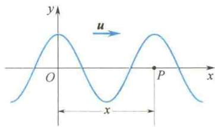
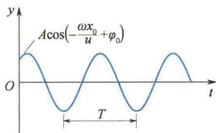
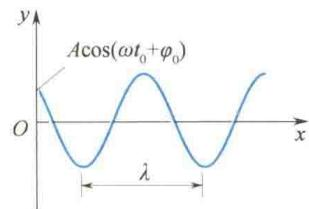
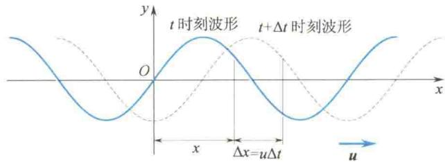
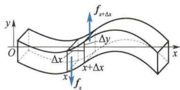
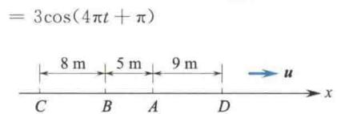
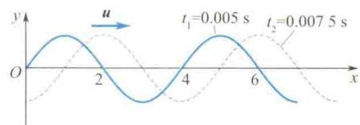

import Guide from '@/components/Guide.astro';
import Knowledge from '@/components/Knowledge.astro';
import Example from '@/components/Example.astro';
import Analysis from '@/components/Analysis.astro';
import Solution from '@/components/Solution.astro';
import Variant from '@/components/Variant.astro';
import Note from '@/components/Note.astro';
import Block from '@/components/Block.astro';
import Method from '@/components/Method.astro';
import Exercise from '@/components/Exercise.astro';

平面简谐波在介质中传播,虽然各质点都在各自的平衡位置附近按余弦(或正弦）规律振动，但同一时刻各质点的振动状态却不尽相同。只有定量地描述出每个质点的振动状态，才算解决了平面简谐波的运动学问题。

在平面简谐波中, 波线是一组垂直于波面的平行射线, 因此可选用其中一条波线为代表来研究平面波的传播规律. 也就是说, 平面简谐波的波函数就是任一波线上任一点的振动方程的通式.

## 6.2.1 平面简谐波的波函数

设有一平面简谐波，在理想介质中沿 x 轴正方向传播，x 轴即为某一波线，在此波线上任取一点为坐标原点，并在坐标原点振动相位为零时开始计时，则坐标原点的振动方程为

平面简谐波的

波函数

$$

y _ {0} = A \cos \omega t\tag{6.14}

$$

设 P 为 x 轴上任意一点, 其坐标为 x, 而用 y 表示该处质点偏离平衡位置的位移, 如图 6.7 所示, 下面求 P 点的振动方程.

设波在介质中的传播速度为 u，则坐标原点的振动状态传到 P 点所需要的时间为 $\Delta t = \frac{x}{u}$ ，因此，P 点在 t 时刻将重复坐标原点在 $\left(t - \frac{x}{u}\right)$ 时刻的振动状态，即 P 点在 t 时刻的振动方程为

  

图6.7 波函数的推导

$$

y = A \cos \omega \left(t - \frac {x}{u}\right)\tag{6.15}

$$

式(6.15)就是沿x轴正方向传播的平面简谐波的表达式,或称波函数,有时也称波动方程 $^{①}$ .

如 6.1 节所述, 当一列波在介质中传播时, 沿着波的传播方向向前看去, 前方各质点的振动要依次落后于波源的振动. 因此, 式(6.15) 中的 $\frac{x}{u}$ 也可理解为 P 点的振动落后于坐标原点的振动的时间. 显然, 这列波若沿 x 轴负方向传播, 则 P 点的振动超前于坐标原点的振动, 超前的时间为 $\frac{x}{u}$ , 此时 P 点的振动方程为

$$

y = A \cos \omega \left(t + \frac {x}{u}\right)\tag{6.16}

$$

式(6.16)就是沿 x 轴负方向传播的平面简谐波的表达式.

若波源(坐标原点)的振动初相位在开始计时时不为零,即

$$

y _ {0} = A \cos (\omega t + \varphi_ {0})\tag{6.17}

$$

由于波源的初相位对波传播过程的贡献是固定的，与波的传播方向、时间、距离无关，因此波函数为

$$

y = A \cos \left[ \omega \left(t \mp \frac {x}{u}\right) + \varphi_ {0} \right]\tag{6.18}

$$

将 $\omega = 2\pi\nu = \frac{2\pi}{T}, u = \frac{\lambda}{T} = \frac{\omega}{2\pi}\lambda$ 代入式(6.18)，经整理，可得到如下几种常用的波函数：

$$

y = A \cos \left[ 2 \pi \left(\frac {t}{T} \mp \frac {x}{\lambda}\right) + \varphi_ {0} \right]\tag{6.19}

$$

$$

y = A \cos \left[ 2 \pi \nu t \mp \frac {2 \pi x}{\lambda} + \varphi_ {0} \right]\tag{6.20}

$$

$$

y = A \cos \left[ \frac {2 \pi}{\lambda} (u t \mp x) + \varphi_ {0} \right] = A \cos [ k (u t \mp x) + \varphi_ {0} ]\tag{6.21}

$$

式中， $k=\frac{2\pi}{\lambda}$ 称为波矢.

## 6.2.2 波函数的物理意义

为了深刻理解平面简谐波的波函数的物理意义,下面分几种情况进行讨论.

(1) 如果 $x = x_{0}$ 为给定值，则位移 y 仅是时间 t 的函数： $y = y(t)$ . 波函数改写为

$$

y (t) = A \cos \left(\omega t - \frac {\omega x _ {0}}{u} + \varphi_ {0}\right) = A \cos \left(\omega t - 2 \pi \frac {x _ {0}}{\lambda} + \varphi_ {0}\right)\tag{6.22}

$$

这就是波线上 $x_{0}$ 处质点在任意时刻离开平衡位置的位移，式(6.22)即为 $x_{0}$ 处质点的振动方程，表明任意坐标 $x_{0}$ 处质点均在做简谐振动，相应地可作出其振动曲线，如图 6.8 所示.

由式(6.22)可知, $x_{0}$ 处质点在t=0时刻的位移为

$$

\begin{array}{r l} y (0, x _ {0}) & = A \cos \left(- \frac {\omega x _ {0}}{u} + \varphi_ {0}\right) \\ & = A \cos \left(- 2 \pi \frac {x _ {0}}{\lambda} + \varphi_ {0}\right) \end{array}

$$

图6.8 波线上给定点的振动曲线

该处质点的振动初相位为 $\varphi' = -\frac{\omega x_{0}}{u} + \varphi_{0} = -2\pi \frac{x_{0}}{\lambda} + \varphi_{0}$ ，显然 $x_{0}$ 处质点的振动相位比坐标原点 O 处质点的振动相位始终落后 $\frac{\omega x_{0}}{u}$ 或 $2\pi \frac{x_{0}}{\lambda}$ . $x_{0}$ 越大，相位落后越多。因此，沿着波的传播方向，各质点的振动相位依次落后。 $x_{0} = \lambda, 2\lambda, 3\lambda, \cdots$ 各处质点的振动相位依次为 $\varphi' = -2\pi + \varphi_{0}, -4\pi + \varphi_{0}, -6\pi + \varphi_{0}, \cdots$ ，这正好表明波线上每隔一个波长的距离，质点的振动曲线就重复一次，波长的确代表了波的空间周期性。

读者自己可以导出,同一质点在相邻两个时刻的振动相位差为

$$

\Delta \varphi = \omega (t _ {2} - t _ {1}) = \frac {t _ {2} - t _ {1}}{T} 2 \pi\tag{6.23}

$$

(2) 若 $t = t_{0}$ 为给定值，则位移 y 只是坐标 x 的函数： $y = y(x)$ . 波函数变为

$$

y = A \cos \left[ \omega \left(t _ {0} - \frac {x}{u}\right) + \varphi_ {0} \right]\tag{6.24}

$$

这时方程给出了在 $t_0$ 时刻波线上各质点离开各自平衡位置的位移分布情况，称为 $t_0$ 时刻的波形方程. $t_0$ 时刻的波形曲线如图6.9所示，它是一条简谐函数曲线，正好说明它是一列简谐波.应该注意的是，对于横波， $t_0$ 时刻的 $y - x$ 曲线实际上就是该时刻波线上所有质点的分布图形；对于纵波，波形曲线并不反映真实的质点分布情况，而只表示该时刻所有质点的位移分布.

由上面的讨论,读者自己可以导出,同一波线上两质点之间的相位差为

$$

\Delta \varphi = - \frac {2 \pi}{\lambda} (x _ {2} - x _ {1})\tag{6.25}

$$

图 6.9 给定时刻 $(t = t_{0})$ 的波形曲线

这说明波动周期反映了波动在时间上的周期性.

(3) 如果 t、x 都在变化, 波函数

$$

y (t, x) = A \cos \left[ \omega \left(t - \frac {x}{u}\right) + \varphi_ {0} \right]

$$

给出了波线上各个不同质点在不同时刻的位移,或者说它包括了各个不同时刻的波形,也就是反映了波形不断向前推进的波动传播的全过程.

进一步分析波函数便可更深入地了解波动的本质.

根据波函数可知，t 时刻的波形方程为

$$

y (x) = A \cos \left[ \omega \left(t - \frac {x}{u}\right) + \varphi_ {0} \right]

$$

波函数的物理意义

而 $t + \Delta t$ 时刻的波形方程为

$$

y (x) = A \cos \left[ \omega \left(t + \Delta t - \frac {x}{u}\right) + \varphi_ {0} \right]

$$

分别用实线和虚线表示 t 时刻和稍后的 $t + \Delta t$ 时刻的两条波形曲线，如图6.10所示，便可形象地看出波形向前传播的图像，波形向前传播的速度就等于波速 u.

  

图6.10 波形的传播

设 t 时刻、x 处的某个振动状态经过 $\Delta t$ 时间，传播了 $\Delta x = u\Delta t$ 的距离，用波函数表示为

$$

\begin{array}{r l} & A \cos \left[ \omega \left(t + \Delta t - \frac {x + u \Delta t}{u}\right) + \varphi_ {0} \right] = A \cos \left[ \omega \left(t - \frac {x}{u}\right) + \varphi_ {0} \right] \\ & y (t + \Delta t, x + \Delta x) = y (t, x) \end{array}

$$

即

(6.26)

这就是说，想获取 $t + \Delta t$ 时刻的波形，只要将 $t$ 时刻的波形沿波的前进方向移动 $\Delta x(\Delta x = u\Delta t)$ 距离即可.故式(6.26）描述的波称为行波.

## 6.2.3 波动微分方程与波速

仅从运动学角度研究波还不够,只有对波进行动力学分析才能了解波传播的机制并进一步研究波动.

### 1. 波动微分方程

在介质中取一体积元,分析其受力情况,应用动力学规律进行研究.以下仅以平面横波为例讨论.

图 6.11 表示横波在某瞬时的波形图，取 x 和 $x + \Delta x$ 处两波面所围体积元为隔离体。体积元两侧受剪切力 $f_{x}$ 和 $f_{x + \Delta x}$ 作用。相比之下重力可不计。体积元发生剪切变形，剪切应变为 $\lim_{\Delta x \to 0} \frac{\Delta y}{\Delta x} = \frac{dy}{dx}$ 。用 S 表示体积元的横截面面积，根据胡克定律有

$$

\frac {f _ {x}}{S} = \left. \frac {\mathrm{d} y}{\mathrm{d} x} \right| _ {x} G

$$

  

图 6.11 当波传播时,介质内某体积元的受力和形变

式中，G 为剪切模量.

体积元的 y 坐标是 x 和 t 的函数. 现在讨论某瞬时的情况, 将 t 视为定值. 上式可写成偏导数形式:

$$

\frac {f _ {x}}{S} = \left. \frac {\partial y (x , t)}{\partial x} \right| _ {x} G

$$

同理也可自 $x + \Delta x$ 处得

$$

\frac {f _ {x + \Delta x}}{S} = \frac {\partial y (x , t)}{\partial x} \Bigg | _ {x + \Delta x} G

$$

体积元所受合外力为

$$

f _ {x + \Delta x} - f _ {x} = \left[ \frac {\partial y (x , t)}{\partial x} \right| _ {x + \Delta x} - \left. \frac {\partial y (x , t)}{\partial x} \right| _ {x} ] G S

$$

方括号内为函数 $\frac{\partial y(x,t)}{\partial x}$ 在 $\Delta x$ 上的增量.若不计高阶无穷小，有

$$

\frac {\partial y (x , t)}{\partial x} \Bigg | _ {x + \Delta x} - \frac {\partial y (x , t)}{\partial x} \Bigg | _ {x} = \frac {\partial^ {2} y (x , t)}{\partial x ^ {2}} \Bigg | _ {x} \Delta x

$$

代入上式得

$$

f _ {x + \Delta x} - f _ {x} = \frac {\partial^ {2} y (x , t)}{\partial x ^ {2}} \Bigg | _ {x} \Delta x G S

$$

体积元在上述合外力作用下的加速度为 $\frac{\partial^{2}y(x,t)}{\partial t^{2}}$ ，故有

$$

f _ {x + \Delta x} - f _ {x} = \Delta m \cdot \frac {\partial^ {2} y (x , t)}{\partial t ^ {2}}

$$

式中， $\Delta m$ 为体积元质量。用 $\rho$ 表示介质密度，因 $\Delta m = \rho S \Delta x$ ，由上两式得

$$

\frac {\partial^ {2} y}{\partial t ^ {2}} = \frac {G}{\rho} \frac {\partial^ {2} y}{\partial x ^ {2}}\tag{6.27}

$$

此即弹性介质中横波的波动微分方程.

依照类似方法,可得固体内弹性平面纵波的波动微分方程为

$$

\frac {\partial^ {2} y}{\partial t ^ {2}} = \frac {E}{\rho} \frac {\partial^ {2} y}{\partial x ^ {2}}\tag{6.28}

$$

式中， $\rho$ 表示介质密度，E 为杨氏模量。张紧的柔软线绳上传播的横波的波动微分方程为

$$

\frac {\partial^ {2} y}{\partial t ^ {2}} = \frac {T}{\mu} \frac {\partial^ {2} y}{\partial x ^ {2}}\tag{6.29}

$$

式中，T 为线绳所受张力； $\mu$ 为单位长度线绳的质量，称为线密度.

以上波函数均根据质点动力学方程得出,故波动微分方程即为关于波的动力学方程.该方程的未知函数为 $y(x,t)$ , 方程中 y 的两个偏导数都是以线性方式出现的, 故本节讨论的波函数是线性的.

### 2. 波速

波动微分方程给出了介质内体积元的运动和受力的关系,反映了波动传播的机制,对应于经典力学的动力学方程.波函数对应于运动学方程,故波函数是波动微分方程的解.平面简谐波为平面波的特例，故平面简谐波的波函数应为波动微分方程一特殊的解.

将式(6.18)的平面简谐波的波函数分别对 t 和 x 求二阶偏导数(设波沿 x 轴正方向传播)，有

$$

\frac {\partial^ {2} y}{\partial t ^ {2}} = - A \omega^ {2} \cos \left[ \omega \left(t - \frac {x}{u}\right) + \varphi_ {0} \right]

$$

$$

\frac {\partial^ {2} y}{\partial x ^ {2}} = - A \frac {\omega^ {2}}{u ^ {2}} \cos \left[ \omega \left(t - \frac {x}{u}\right) + \varphi_ {0} \right]

$$

比较上面两式可得

$$

\frac {\partial^ {2} y}{\partial x ^ {2}} = \frac {1}{u ^ {2}} \frac {\partial^ {2} y}{\partial t ^ {2}}\tag{6.30}

$$

将其与式(6.27)相比,即可得固体中弹性横波的波速为

$$

u _ {\perp} = \sqrt {G / \rho}

$$

同理可得固体中弹性纵波的波速为

$$

u _ {/ /} = \sqrt {E / \rho}

$$

由此可知,固体中波速和介质弹性密切相关.现在有各种精确测量声速或测量固体的杨氏模量和剪切模量的方法.张紧的软绳中横波的波速为

$$

u _ {\perp} = \sqrt {T / \mu}

$$

流体中纵波的波速为

$$

u _ {/ /} = \sqrt {B / \rho}

$$

式中， $B$ 为流体的体积模量.

以上即为式(6.7)～式(6.10)的根由.

表 6.1 给出某些波速实验值, L 和 T 分别表示纵波和横波. 表中列出的波阻(或声阻), 将在 6.5 节中介绍.

表 6.1 波速和波阻

<table><tr><td>介质</td><td>温度/°C</td><td>波速/(m/s)</td><td>波阻/(N·s/m3)</td></tr><tr><td>空气</td><td>0</td><td>331.45</td><td>429</td></tr><tr><td>氧气</td><td>0</td><td>316</td><td>452</td></tr><tr><td>氢气</td><td>0</td><td>1284</td><td>116</td></tr><tr><td>水</td><td>20</td><td>1483</td><td> $1.48 \times 10^{6}$ </td></tr><tr><td>水银</td><td>20</td><td>1451</td><td> $19.6 \times 10^{6}$ </td></tr><tr><td>液氦</td><td>-272.15</td><td>239</td><td> $0.035 \times 10^{6}$ </td></tr><tr><td>液氧</td><td>-183</td><td>909</td><td> $1.04 \times 10^{6}$ </td></tr><tr><td>血液</td><td></td><td>1530</td><td> $1.62 \times 10^{6}$ </td></tr><tr><td>肌肉</td><td></td><td>1545～1630</td><td> $1.65 \times 10^{6} \sim 1.74 \times 10^{6}$ </td></tr><tr><td>骨骼</td><td></td><td>2700～4100</td><td> $3.2 \times 10^{6} \sim 7.4 \times 10^{6}$ </td></tr><tr><td>铁</td><td></td><td>L:5950T:3240</td><td> $47.0 \times 10^{6}$ </td></tr><tr><td>铝</td><td></td><td>L:6420T:3040</td><td> $17.3 \times 10^{6}$ </td></tr><tr><td>火石玻璃</td><td></td><td>L:3980T:2380</td><td> $15.4 \times 10^{6}$ </td></tr></table>

<Example title="例 6.1">
已知波函数为 $y = 0.1 \cos \frac{\pi}{10} (25t - x)$ ，其中 x, y 的单位为 m, t 的单位为 s，求：(1) 振幅、波长、周期、波速；(2) 距坐标原点 8 m 和 10 m 两点处质点振动的相位差；(3) 波线上某质点在时间间隔 0.2 s 内的相位差.

<Solution title="解">
（1）用比较法将题干中的波函数改写成如下形式：

$$

y = 0. 1 \cos \frac {2 5}{1 0} \pi \left(t - \frac {x}{2 5}\right)

$$

并与波函数的标准形式 $y = A \cos \left[ \omega \left( t - \frac{x}{u} \right) + \varphi_{0} \right]$ 比较，即可得

$$

A = 0. 1 \mathrm{m}, \quad \omega = \frac {2 5}{1 0} \pi \mathrm{rad} \cdot \mathrm{s} ^ {- 1}

$$

$$

u = 2 5 \mathrm{m/s}, \quad \varphi_ {0} = 0

$$

所以 $T = \frac{2\pi}{\omega} = 0.8\mathrm{s},\lambda = uT = 20\mathrm{m}$

（2）同一时刻波线上坐标为 $x_{1}$ 和 $x_{2}$ 两点处质点振动的相位差

$$

\Delta \varphi = - \frac {2 \pi}{\lambda} (x _ {2} - x _ {1}) = - 2 \pi \frac {\delta}{\lambda}

$$

$\delta=x_{2}-x_{1}$ 是波动传播到 $x_{1}$ 和 $x_{2}$ 处的波程差，上式就是同一时刻波线上任意两点间相位差与波程差的关系.

当 $\delta = x_{2} - x_{1} = 10 \, m - 8 \, m = 2 \, m$ 时，

$$

\Delta \varphi = - 2 \pi \frac {\delta}{\lambda} = - \frac {\pi}{5}

$$

负号表示 $x_{2}$ 处的振动相位落后于 $x_{1}$ 处的振动相位.

（3）对于波线上任意一个给定点 $(x \text{ 一定})$ ，在时间间隔 $\Delta t$ 内的相位差

$$

\Delta \varphi = \omega (t _ {2} - t _ {1}) = \omega \Delta t

$$

已知 $\Delta t = 0.2\mathrm{s}$ ，则

$$

\Delta \varphi = \frac {\pi}{2}

$$
</Solution>
</Example>

<Example title="例 6.2">
一平面波在介质中以速度 $u = 20 \, m/s$ 沿直线传播，已知在传播路径上某点 A 的振动方程为 $y_{A} = 3 \cos 4\pi t$ ，如图 6.12 所示。（1）若以 A 点为坐标原点，写出波函数，并求出 C、D 两点的振动方程；（2）若以 B 点为坐标原点，写出波函数，并求出 C、D 两点的振动方程。

<Solution title="解">
已知 $u = 20 \mathrm{~m} / \mathrm{s}, \omega = 4\pi \mathrm{rad} \cdot \mathrm{s}^{-1}$ , 则

$$

T = \frac {2 \pi}{\omega} = 0. 5 \mathrm{s}, \quad \lambda = u T = 1 0 \mathrm{m}

$$

（1）若以 A 点为坐标原点，则坐标原点的振动方程为 $y_{0} = y_{A} = 3\cos 4\pi t$ ，所以波函数为

$$

y = 3 \cos 4 \pi \left(t - \frac {x}{2 0}\right) = 3 \cos \left(4 \pi t - \frac {\pi}{5} x\right)

$$

式中，x 是波线上任意一点的坐标（以 A 点为坐标原点）。对 C 点， $x_{C} = -13 \, m$ ；对 D 点， $x_{D} = 9 \, m$ 。故可直接写出 C 点和 D 点的振动方程分别为

$$

\begin{array}{l} y _ {C} = 3 \cos \left(4 \pi t - \frac {\pi}{5} x _ {C}\right) = 3 \cos \left(4 \pi t + \frac {1 3}{5} \pi\right) \\ y _ {D} = 3 \cos \left(4 \pi t - \frac {\pi}{5} x _ {D}\right) = 3 \cos \left(4 \pi t - \frac {9}{5} \pi\right) \end{array}

$$

(2) 若以 B 点为坐标原点, 则坐标原点的振动方程为 $y_{0} = y_{B}$ . 由于波从左向右传播, 因此 B 点的振动始终比 A 点超前一段时间 $\Delta t = \frac{5}{20} s = \frac{1}{4} s$ , 故 B 点在 t 时刻的振动状态与 A 点在 $t + \Delta t$ 时刻的振动状态相同, 即

$$

y _ {O} = y _ {B} (t) = y _ {A} (t + \Delta t) = 3 \cos 4 \pi \left(t + \frac {1}{4}\right)

$$

  

图6.12 例6.2图

此时波函数为

$$

y = 3 \cos \left[ 4 \pi \left(t - \frac {x}{2 0}\right) + \pi \right] = 3 \cos \left(4 \pi t - \frac {\pi}{5} x + \pi\right)

$$

式中，x 是波线上任意一点的坐标（以 B 点为坐标原点）。所以对 C 点， $x_{C} = -8 \, m$ ；对 D 点， $x_{D} = 14 \, m$ 。代入波函数可写出 C 点和 D 点的振动方程分别为

$$

\begin{array}{r l} y _ {C} & = 3 \cos \left(4 \pi t + \frac {8}{5} \pi + \pi\right) \\ & = 3 \cos \left(4 \pi t + \frac {1 3}{5} \pi\right) = 3 \cos \left(4 \pi t + \frac {3}{5} \pi\right) \\ y _ {D} & = 3 \cos \left(4 \pi t - \frac {\pi}{5} \times 1 4 + \pi\right) = 3 \cos \left(4 \pi t - \frac {9}{5} \pi\right) \end{array}

$$

由本例可知,对一列给定的平面波,坐标原点选取不同,波函数的形式就不同,但每个质点的振动方程却是相同的,即每个质点的振动规律是确定的,与坐标原点的选取无关.

</Solution>
</Example>

<Example title="例 6.3">
一平面简谐横波以 $u = 400 \, m/s$ 的波速在均匀介质中沿 x 轴正方向传播。位于坐标原点的质点的振动周期为 0.01 s，振幅为 0.1 m，取坐标原点处质点经过平衡位置且向正方向运动时作为计时起点。（1）写出波函数；（2）写出距坐标原点 2 m 的质点 P 的振动方程；（3）画出 $t_{1} = 0.005 \, s$ 和 $t_{2} = 0.0075 \, s$ 时的波形图；（4）若以距原点 2 m 的点为坐标原点，写出波函数。

解（1）由题意知，坐标原点 $O$ 处质点的振动初始条件为： $t = 0$ 时， $y_0 = 0, v_0 > 0$ 。设坐标原点 $O$ 处质点的振动方程为 $y_0 = A\cos (\omega t + \varphi_0)$ ，将初始条件代入，可求出坐标原点处质点的振动初相位 $\varphi_0 = \frac{3}{2}\pi$ ，坐标原点的振动方程为

$$

y _ {0} = 0. 1 \cos \left(2 0 0 \pi t + \frac {3}{2} \pi\right)

$$

故波函数为

$$

y = 0. 1 \cos \left[ 2 0 0 \pi \left(t - \frac {x}{4 0 0}\right) + \frac {3}{2} \pi \right]

$$

（2）质点 P 所在位置的坐标为 $x_{P} = 2 \, m$ ，代入上面的波函数，即可得质点 P 的振动方程为

$$

\begin{array}{r l} y _ {P} & = 0. 1 \cos \left[ 2 0 0 \pi \left(t - \frac {2}{4 0 0}\right) + \frac {3}{2} \pi \right] \\ & = 0. 1 \cos \left(2 0 0 \pi t + \frac {\pi}{2}\right) \end{array}

$$

(3) 将 $t_{1} = 0.005 \, s$ 代入波函数, 得此时刻的波形方程为

$$

\begin{array}{r l} y & = 0. 1 \cos \left[ 2 0 0 \pi \left(0. 0 0 5 - \frac {x}{4 0 0}\right) + \frac {3}{2} \pi \right] \\ & = 0. 1 \cos \left(\frac {\pi}{2} - \frac {\pi}{2} x\right) \end{array}

$$

画出对应的波形曲线，如图6.13中实线所示。因为 $T = 0.01\mathrm{s}$ ，故 $t_1 = 0.005\mathrm{s}$ 到 $t_2 = 0.0075\mathrm{s}$ 经历了 $\Delta t = t_2 - t_4 = 0.0025\mathrm{s} = \frac{1}{4} T$ ，故 $t_2 = 0.0075\mathrm{s}$ 时刻的波形图只需将 $t_1 = 0.005\mathrm{s}$ 时刻的波形曲线沿着波的传播方向平移 $\frac{1}{4}\lambda = \frac{1}{4} uT = 1\mathrm{m}$ 即可得到，如图6.13中虚线所示。

  

图6.13 $t_1 = 0.005\mathrm{s}$ 和 $t_2 = 0.0075\mathrm{s}$ 时的波形图

（4）由（2）中结果可知，新坐标原点 $O^{\prime}$ 的振动方程为

$$

y _ {O ^ {\prime}} = y _ {P} = 0. 1 \cos \left(2 0 0 \pi t + \frac {\pi}{2}\right)

$$

所以新坐标系下的波函数为

$$

y ^ {\prime} = 0. 1 \cos \left[ 2 0 0 \pi \left(t - \frac {x ^ {\prime}}{4 0 0}\right) + \frac {\pi}{2} \right]

$$

式中， $x'$ 是波线上各点在新坐标系下的位置坐标.
</Example>
