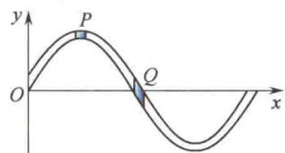
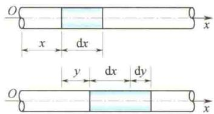
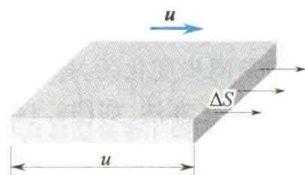
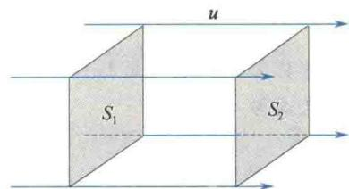

import Guide from '@/components/Guide.astro';
import Knowledge from '@/components/Knowledge.astro';
import Example from '@/components/Example.astro';
import Analysis from '@/components/Analysis.astro';
import Solution from '@/components/Solution.astro';
import Variant from '@/components/Variant.astro';
import Note from '@/components/Note.astro';
import Block from '@/components/Block.astro';
import Method from '@/components/Method.astro';
import Exercise from '@/components/Exercise.astro';

## 6.3.1 波的能量和能量密度

在波的传播中,载波的介质并不随波向前移动,波源的振动能量则通过介质间的相互作用传播出去.介质中各质点都在各自的平衡位置附近振动,因而具有动能;同时,介质因形变而具有弹性势能.下面以介质中任一体积元 dV 为例来讨论波动能量.

设有一平面简谐波在密度为 $\rho$ 的弹性介质中沿 x 轴正方向传播，设其波函数为

$$

y = A \cos \left[ \omega \left(t - \frac {x}{u}\right) + \varphi_ {0} \right]

$$

在坐标为 x 处取一体积元 dV，其质量为 $dm = \rho dV$ ，视该体积元为质点，当波传播到该体积元时，其振动速度为

$$

v = \frac {\partial y}{\partial t} = - A \omega \sin \left[ \omega \left(t - \frac {x}{u}\right) + \varphi_ {0} \right]

$$

则该体积元的动能为

$$

\mathrm{d} E _ {\mathrm{k}} = \frac {1}{2} (\mathrm{d} m) v ^ {2} = \frac {1}{2} \rho \mathrm{d} V A ^ {2} \omega^ {2} \sin^ {2} \left[ \omega \left(t - \frac {x}{u}\right) + \varphi_ {0} \right]\tag{6.31}

$$

同时,该体积元因形变而具有弹性势能,可以证明(见本小节后文中的小字部分),该体积元的弹性势能为

$$

\mathrm{d} E _ {\mathrm{p}} = \frac {1}{2} \rho \mathrm{d} V A ^ {2} \omega^ {2} \sin^ {2} \left[ \omega \left(t - \frac {x}{u}\right) + \varphi_ {0} \right]\tag{6.32}

$$

于是该体积元内总的波动能量为

$$

\mathrm{d} E = \mathrm{d} E _ {\mathrm{k}} + \mathrm{d} E _ {\mathrm{p}} = \rho \mathrm{d} V A ^ {2} \omega^ {2} \sin^ {2} \left[ \omega \left(t - \frac {x}{u}\right) + \varphi_ {0} \right]\tag{6.33}

$$

上式表明,波动在介质中传播时,介质中任一体积元的总能量随时间发生周期性变化.这说明该体积元和相邻的介质之间有能量交换.体积元的能量增加时,它从相邻介质中吸收能量;体积元的能量减少时,它向相邻介质释放能量.这样,能量不断地从介质中的一部分传递到另一部分.所以,波动过程也就是能量传播的过程.

应当注意,波动的能量和简谐振动的能量有着明显的区别.在一个孤立的谐振动系统中,它和外界没有能量交换,所以机械能守恒且动能和势能在不断地相互转换.当动能为极大值时,势能为极小值;当动能为极小值时,势能为极大值.而在波动中,体积内总能量不守恒,且同一体积元内的动能和势能是同步变化的,即动能为极大值时势能也为极大值,反之亦然.如图6.14所示,横波在绳上传播时,平衡位置Q处体积元的速度最大,因而动能最

  

图6.14 不同位置体积元的相对形变

大，此时 $Q$ 处体积元的相对形变也最大，因此弹性势能也最大；在振动位移最大的 $P$ 处的体积元，其振动速度为零，动能为零，而此处体积元的相对形变量为最小值零 $\left(\frac{\partial y}{\partial x}\right|_P = 0$ ，故其弹性势能亦为零.

单位体积介质中所具有的波的能量,称为能量密度,用 w 表示,由式(6.33)有

$$

\omega = \frac {\mathrm{d} E}{\mathrm{d} V} = \rho A ^ {2} \omega^ {2} \sin^ {2} \left[ \omega \left(t - \frac {x}{u}\right) + \varphi_ {0} \right]\tag{6.34}

$$

可见,能量密度 w 随时间发生周期性变化,实际应用中是取其平均值.能量密度 w 在一个周期内的平均值称为平均能量密度,用 $\overline{w}$ 表示,则对平面简谐波有

$$

\overline {{{w}}} = \frac {1}{T} \int_ {0} ^ {T} w \mathrm{d} T = \frac {1}{T} \int_ {0} ^ {T} \rho A ^ {2} \omega^ {2} \sin^ {2} \left[ \omega \left(t - \frac {x}{u}\right) + \varphi_ {0} \right] \mathrm{d} t = \frac {1}{2} \rho A ^ {2} \omega^ {2}\tag{6.35}

$$

上式指出,平均能量密度与波振幅的平方、角频率的平方及介质密度成正比.此公式适用于各种弹性波.

波动中介质体积元的弹性势能公式(6.32)的推导过程如下.如图6.15所示,体积元原长为dx,绝对伸长量为dy,所以体积元的相对伸长(线应变或胁变)为 $\frac{dy}{dx}$ ,则由式(6.1)可知该体积元所

受的弹性力为

$$

F = E S \frac {\mathrm{d} y}{\mathrm{d} x} = k \mathrm{d} y

$$

式中，E 是棒的杨氏模量， $k = \frac{ES}{dx}$ . 故体积元的弹性势能为

  

图6.15 固体细长棒中纵波的传播

$$

\mathrm{d} E _ {\mathrm{p}} = \frac {1}{2} k (\mathrm{dy}) ^ {2} = \frac {1}{2} \frac {E S}{\mathrm{dx}} (\mathrm{dy}) ^ {2} = \frac {1}{2} E S \mathrm{dx} \left(\frac {\mathrm{dy}}{\mathrm{dx}}\right) ^ {2}

$$

因为 $\mathrm{d}V = S\mathrm{d}x,u = \sqrt{\frac{E}{\rho}}$ 或 $E = \rho u^2$ ，且根据波函数可得

$$

\frac {\mathrm{d} y}{\mathrm{d} x} = A \frac {\omega}{u} \sin \left[ \omega \left(t - \frac {x}{u}\right) + \varphi_ {0} \right]

$$

代入得

$$

\begin{array}{r l} \mathrm{d} E _ {\mathrm{p}} & = \frac {1}{2} \rho u ^ {2} (\mathrm{d} V) A ^ {2} \frac {\omega^ {2}}{u ^ {2}} \sin^ {2} \left[ \omega \left(t - \frac {x}{u}\right) + \varphi_ {0} \right] \\ & = \frac {1}{2} \rho \mathrm{d} V A ^ {2} \omega^ {2} \sin^ {2} \left[ \omega \left(t - \frac {x}{u}\right) + \varphi_ {0} \right] \end{array}

$$

这就是式(6.32). 若所考虑的是平面余弦弹性横波, 则只要把上面推导中的 $\frac{dy}{dx}$ 和 F 分别理解为体积元的切变和剪切力, 并用剪切模量 G 代替杨氏模量 E, 便可得到同样的结果.

## 6.3.2 波的能流和能流密度

为了描述波动过程中能量的传播,还需引入能流和能流密度的概念.

所谓能流，即单位时间内通过某一横截面的能量。如图6.16所示，设想在介质中作一个垂直于波速的横截面为 $\Delta S$ 、长度为 $u$ 的长方体，则在单位时间内，体积为 $u\Delta S$ 的长方体内的波动能量都要通过 $\Delta S$ 面，因此通过面积 $\Delta S$ 的能流为 $p = wu\Delta S$ ，将能量密度 $\omega$ 用平均能量密度 $\overline{w}$ 代替，可得

  

图6.16 通过 $\Delta S$ 面的平均能流

$$

\overline {{{p}}} = \overline {{{w}}} u \Delta S\tag{6.36}

$$

式中， $\overline{p}$ 称为平均能流.

显然,平均能流 $\bar{p}$ 与横截面积 $\Delta S$ 有关.与波的传播方向垂直的单位面积的平均能流称为能流密度或波的强度,简称波强.用I表示,则有

$$

I = \frac {\overline {{p}}}{\Delta S} = \overline {{w u}}\tag{6.37}

$$

能流密度是一个矢量，在各向同性介质中，其方向与波速方向相同，矢量式为

$$

\boldsymbol {I} = \overline {{w}} \boldsymbol {u}

$$

波强等于波的平均能量密度与波速的乘积.

简谐波的波强的大小为

$$

I = \frac {1}{2} \rho A ^ {2} \omega^ {2} u\tag{6.38}

$$

即波强与波振幅的平方、角频率的平方成正比.式(6.38)只对弹性波成立.

波强的单位名称是瓦[特]每平方米,符号是 $W/m^{2}$ .

若平面简谐波在各向同性、均匀、无吸收的理想介质中传播，可以证明其波振幅

在传播过程中将保持不变.

设一平面波的传播方向如图6.17所示，在垂直于传播方向上取两个面积分别为 $S_{1}$ 和 $S_{2}(S_{1} = S_{2})$ 的平行平面，其平均能流分别为 $\overline{p}_1$ 和 $\overline{p}_2$ ，因能量无损失，应有

即

$$

\begin{array}{r} {\overline {{{p}}} _ {1} = \overline {{{p}}} _ {2}} \\ {I _ {1} S _ {1} = I _ {2} S _ {2}} \end{array}

$$

图 6.17 平面波的振幅不变

由式 $(6.38)$ ，有

$$

\frac {1}{2} \rho \omega^ {2} A _ {1} ^ {2} u S _ {1} = \frac {1}{2} \rho \omega^ {2} A _ {2} ^ {2} u S _ {2}

$$

因 $S_{1} = S_{2}$ ，于是有

$$

A _ {1} = A _ {2}

$$

用同样的方法可以证明,在理想介质中传播的球面波的振幅随着到波源距离的增加成反比地减小.

## 6.3.3 波的吸收

波在实际介质中传播时,由于波动能量总有一部分会被介质吸收,所以波的机械能会不断地减少,波强亦逐渐减弱,这种现象称为波的吸收.

设波通过厚度为 dx 的介质薄层后, 其振幅衰减量为 -dA, 实验指出

经积分得

$$

\begin{array}{r} - \mathrm{d} A = \alpha A \mathrm{d} x \\ A = A _ {0} \mathrm{e} ^ {- \alpha x} \end{array}\tag{6.39}

$$

式中， $A_0$ 和 $A$ 分别是 $x = 0$ 和 $x = x$ 处的波振幅； $\alpha$ 是常量，称为介质的吸收系数.由于波强与波振幅的平方成正比，所以波强的衰减规律为

$$

I = I _ {0} \mathrm{e} ^ {- 2 \alpha x}\tag{6.40}

$$

式中， $I_{0}$ 和 I 分别是 x = 0 和 x = x 处波的强度.

## \*6.3.4 声压、声强和声强级

为了描述声波在介质中各点的强弱,常采用声压和声强两个物理量.

介质中有声波传播时的压力与无声波时的静压力之间的压差称为声压.由于声波是疏密波，在稀疏区域，实际压力小于静压力，在稠密区域，实际压力大于静压力，前者声压为负值，后者声压为正值.因介质中各点声振动是周期性变化的，所以声压也在发生周期性变化.对平面简谐波，可以证明声压振幅 $p_{m}$ 为

$$

p _ {\mathrm{m}} = \rho u A \omega\tag{6.41}

$$

声强就是声波的能流密度，由式(6.38)和式(6.41)，有

$$

I = \frac {1}{2} \frac {p _ {\mathrm{m}} ^ {2}}{\rho u} = \frac {1}{2} \rho u A ^ {2} \omega^ {2}\tag{6.42}

$$

这说明频率越高越容易获得较大的声压和声强.

引起人的听觉的声波，不仅有频率范围（能引起人耳听觉的频率范围是 $20\sim 20000\mathrm{Hz}$ ），而且有声强范围。对于每个给定频率的可闻声波，声强都有上、下两个限值，低于下限的声强不能引起听觉，高于上限的声强也不能引起听觉，声强太大只能引起痛觉。一般正常人听觉的最高声强为 $10~\mathrm{W / m^2}$ ，最低声强为 $10^{-12}\mathrm{W / m^2}$ 。表6.2为声强和声强级举例，通常把这一最低声强作为测定声强的标准，用 $I_0$ 表示。由于上、下声强的数量级相差悬殊（达 $10^{13}$ ），所以常用对数标度作为声强级

  

人为什么会晕车？

的量度，以 $L_{I}$ 表示，即

$$

L _ {I} = \lg \frac {I}{I _ {0}}\tag{6.43}

$$

其单位名称为贝尔,符号是 Bel, 这个单位太大, 常采用贝尔的十分之一, 即分贝(dB) 为单位, 此时声强级公式为

$$

L _ {I} = 1 0 \lg \frac {I}{I _ {0}}\tag{6.44}

$$

表 6.2 声强和声强级举例

<table><tr><td>声源</td><td>声强/ $(W/m^{2})$ </td><td>声强级/dB</td><td>响度</td></tr><tr><td>听觉阈</td><td> $10^{-12}$ </td><td>0</td><td></td></tr><tr><td>风吹树叶</td><td> $10^{-10}$ </td><td>20</td><td>轻</td></tr><tr><td>通常谈话</td><td> $10^{-6}$ </td><td>60</td><td>正常</td></tr><tr><td>闹市车声</td><td> $10^{-5}$ </td><td>70</td><td>响</td></tr><tr><td>摇滚乐</td><td>1</td><td>120</td><td>震耳</td></tr><tr><td>喷气机起飞</td><td> $10^{3}$ </td><td>150</td><td></td></tr><tr><td>地震(里氏7级,距震中5km)</td><td> $4 \times 10^{4}$ </td><td>166</td><td></td></tr><tr><td>聚焦超声波</td><td> $10^{9}$ </td><td>210</td><td></td></tr></table>

最后顺便指出，仅用声强级尚不能完全反映人耳对声音响度的感觉。人耳对响度的主观感觉由声强级和频率共同决定。例如，同为50 dB声强级的声音，当频率为1 000 Hz时，人耳听起来已相当响；而当频率为50 Hz时，人耳则听不见。当需要考虑这种效应时，可查阅有关手册中列出的等响度曲线。

<Example title="例 6.4">
空气中声波的吸收系数为 $\alpha_{1}=2\times10^{-11}\nu^{2}m^{-1}$ ，钢中的吸收系数为 $\alpha_{2}=4\times10^{-7}\nu m^{-1}$ ，式中 $\nu$ 代表声波的频率。频率为 5 MHz 的超声波透过多厚的空气或钢后其声强减为原来的 1%？

<Solution title="解">
$\alpha_{1} = 2\times 10^{-11}\times (5\times 10^{6})^{2}\mathrm{m}^{-1} = 500\mathrm{m}^{-1}$

$$

\alpha_ {2} = 4 \times 1 0 ^ {- 7} \times 5 \times 1 0 ^ {6} \mathrm{m} ^ {- 1} = 2 \mathrm{m} ^ {- 1}

$$

$$

x _ {1} = \frac {1}{1 0 0 0} \ln 1 0 0 = 0. 0 0 4 6 \mathrm{m}

$$

由

$$

I = I _ {0} \mathrm{e} ^ {- 2 \alpha x}

$$

钢的厚度为 $x_{2} = \frac{1}{4}\ln 100 = 1.15\mathrm{m}$

$$

x = \frac {1}{2 \alpha} \ln \frac {I _ {0}}{I}

$$

得

可见,高频超声波很难通过气体,但极易通过固体.

把 $\alpha_{1}, \alpha_{2}$ 的值分别代入上式，又依题 $I_{0}/I = 100$ ，得空气的厚度为
</Solution>
</Example>
