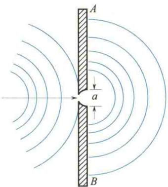
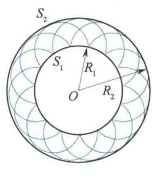
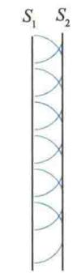
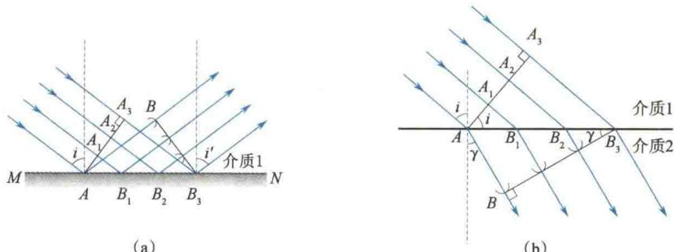
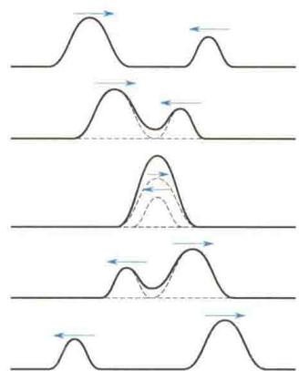
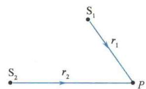
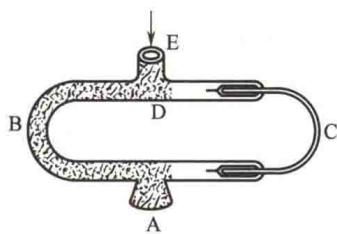
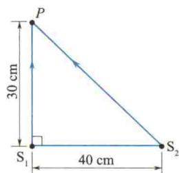

import QRCodeVideo from '@/components/QRCodeVideo.astro';

import Guide from '@/components/Guide.astro';
import Knowledge from '@/components/Knowledge.astro';
import Example from '@/components/Example.astro';
import Analysis from '@/components/Analysis.astro';
import Solution from '@/components/Solution.astro';
import Variant from '@/components/Variant.astro';
import Note from '@/components/Note.astro';
import Block from '@/components/Block.astro';
import Method from '@/components/Method.astro';
import Exercise from '@/components/Exercise.astro';

## 6.4.1 惠更斯原理

当波在弹性介质中传播时,由于介质质点间的弹性力作用,介质中任何一点的振动都会引起邻近各质点的振动,因此,波动到达的任一点都可看作新的波源.例如，水面波的传播如图6.18所示，当一块开有小孔的隔板挡在波的前面时，则不论原来的波面是什么形状，只要小孔的线度远小于波长，都可以看到穿过小孔的波是圆形波，就好像是以小孔为点波源发出的一样，这说明小孔可以看作新的波源，其发出的波称为次波（子波）.
荷兰物理学家惠更斯观察和研究了大量类似现象，于1690年提出了一条描述波传播特性的重要原理：介质中波阵面（波前）上的各点，都可以看作发射子波的波源，其后任一时刻这些子波的包迹就是新的波阵面。这就是惠更斯原理的内容。
惠更斯原理不仅适用于机械波,也适用于电磁波.不论波动经过的介质是均匀的还是非均匀的,是各向同性的还是各向异性的,只要知道了某一时刻的波阵面,就可以根据这一原理,利用几何作图法来确定以后任一时刻的波阵面,进而确定波的传播方向.此外,根据惠更斯原理,还可以很简单地说明波在传播中发生的反射和折射等现象.下面以平面波和球面波为例,说明惠更斯原理的应用.
如图 6.19(a) 所示, 点波源 O 在各向同性的均匀介质中以波速 u 发出球面波, 已知在 t 时刻的波阵面是半径为 $R_{1}$ 的球面 $S_{1}$ . 根据惠更斯原理, $S_{1}$ 上的各点都可以看作发射子波的新波源, 经过 $\Delta t$ 时间, 各子波波阵面是以 $S_{1}$ 球面上各点为球心, 以 $r = u \Delta t$ 为半径的许多球面, 这些子波波阵面的包迹面 $S_{2}$ 就是球面波在 $t + \Delta t$ 时刻的新的波阵面. 显然, $S_{2}$ 是一个仍以点波源 O 为球心, 以 $R_{2} = R_{1} + u \Delta t$ 为半径的球面.
平面波可近似地看作半径很大的球形波阵面上的一小部分.例如，从太阳射出的球面光波，到达地面上时，就可看作平面波.如图6.19(b)所示，若已知在各向同性均匀介质中传播的平面波在某时刻 $t$ 的波阵面 $S_{1}$ ，用惠更斯原理就可以求出以后任一时刻 $t + \Delta t$ 的新的波阵面 $S_{2}$ ，它是一个与 $S_{1}$ 相距 $u\Delta t$ ，且与 $S_{1}$ 平行的平面.
  
图 6.18 障碍物上的小孔成为新的波源
  
(a) 球面波
  
(b) 平面波  
图 6.19 用惠更斯原理求新波阵面
从以上讨论可以看出,当波在各向同性均匀介质中传播时,波阵面的几何形状总是保持不变,即波线方向或者波的传播方向是不变的.当波在不均匀介质或各向异性介质中传播时,同样可以根据惠更斯原理用作图法求出新的波阵面,只是波阵面的形状和波的传播方向都可能发生变化.

## \* 应用惠更斯原理证明波的反射和折射定律

当波从一种介质传播到另一种介质的分界面时，传播方向会发生改变，其中一部分反射回原介质，称为反射波；另一部分进入第二种介质，称为折射波。这种现象称为波的反射和折射现象。通常把入射波、反射波和折射波的波线称为入射线、反射线和折射线。相应地，它们与分界面法线之间的夹角分别称为入射角、反射角和折射角。无数观察和实验表明，波动反射和折射时分别遵循如
<QRCodeVideo title="夜间声音为什么会比白天传得远？" url="https://api.guangyiedu.com/v3/resource/resource/r/NewQrCode-iSXHeDgBGsIn2L30nY5I" />  
下反射定律和折射定律.
(1) 反射定律 反射线、入射线和界面法线在同一平面内，且反射角 $i'$ 恒等于入射角 i，即 $i' = i$ .
（2）折射定律 折射线、入射线和界面法线在同一平面内，且入射角 $i$ 的正弦和折射角 $\gamma$ 的正弦之比等于第一种介质中波速 $u_{1}$ 与第二种介质中波速 $u_{2}$ 之比，即 $\frac{\sin i}{\sin \gamma} = \frac{u_1}{u_2}$ .
下面用惠更斯原理解释波的反射和折射定律.
如图 6.20(a) 所示, 设一平面波传播到两种介质的分界面 MN 上, 它在介质 1 中的波速为 $u_{1}$ . 在 $t$ 时刻, 入射波的波阵面到达 $AA_{1}A_{2}A_{3}$ 位置 (波阵面为通过 $AA_{3}$ 线并与图面垂直的平面), $A$ 点先和分界面相遇, 此后波阵面上 $A_{1}, A_{2}, A_{3}$ 各点经过相等的时间间隔先后到达分界面上的 $B_{1}, B_{2}, B_{3}$ 各点. 设在 $t + \Delta t$ 时刻, $A_{3}$ 点传播到界面上 $B_{3}$ 点处, 则 $A_{1}, A_{2}$ 点依次在 $t + \frac{1}{3}\Delta t, t + \frac{2}{3}\Delta t$ 时刻传到界面上的 $B_{1}, B_{2}$ 点处. 根据惠更斯原理, 入射波到达界面上的各点都可看作发射子波的波源, 则在 $t + \Delta t$ 时刻, 从 $A, B_{1}, B_{2}, B_{3}$ 各点向介质 1 中发出的子波的半径分别为 $u_{1}\Delta t, \frac{2}{3}u_{1}\Delta t, \frac{1}{3}u_{1}\Delta t$ , 0, 这些子波的包迹面即为图 6.20(a) 中的 $B_{3}B$ 面, $B_{3}B$ 面就是 $t + \Delta t$ 时刻的波阵面, 作垂直于此波阵面的直线, 即为反射线. 从图 6.20(a) 中可以看出, 反射线、入射线和界面法线均在同一个平面内, 且 $\triangle AA_{3}B_{3} \cong \triangle ABB_{3}$ , 故 $\angle A_{3}AB_{3} = \angle BB_{3}A$ , 从而得到 $i' = i$ , 即反射角等于入射角, 这就是波的反射定律.
如图6.20(b)所示，一平面波从介质1传到两种介质的分界面时，一部分进入介质2继续传播，波速由 $u_{1}$ 变为 $u_{2}$ .设在t时刻，入射波的波阵面是 $AA_{1}A_{2}A_{3}$ ，此时A点已到达分界面，此后波阵面上 $A_{1}$ 、 $A_{2}$ 、 $A_{3}$ 各点经过相等的时间间隔先后到达界面上的 $B_{1}$ 、 $B_{2}$ 、 $B_{3}$ 点.若假定 $t+\Delta t$ 时刻 $A_{3}$ 点到达 $B_{3}$ 点，则 $A_{1}$ 、 $A_{2}$ 点到达 $B_{1}$ 、 $B_{2}$ 点的时刻分别是 $t+\frac{1}{3}\Delta t,t+\frac{2}{3}\Delta t.A,B_{1},B_{2},B_{3}$ 各点作为新的波源向介质2中发出子波，在 $t+\Delta t$ 时刻，它们发出的子波半径分别为 $u_{2}\Delta t,\frac{2}{3}u_{2}\Delta t,\frac{1}{3}u_{2}\Delta t,0$ ，作出这些子波的包迹面 $B_{3}B$ ，就是此时波动在介质2中的波阵面，作垂直于此波阵面的直线，即为折射线.从图6.20(b)中可以看出：折射线、入射线和界面法线都在同一个平面内，且 $A_{3}B_{3}=u_{1}\Delta t=AB_{3}\sin i,AB=u_{2}\Delta t=AB_{3}\sin\gamma$ ，由此可得 $\frac{\sin i}{\sin\gamma}=\frac{u_{1}}{u_{2}}$ .令
$$
\frac {\sin i}{\sin \gamma} = \frac {u _ {1}}{u _ {2}} = n _ {2 1}\tag{6.45}
$$
式中， $n_{21}$ 称为介质 2 对介质 1 的相对折射率. 这就是波的折射定律.
  
(a)  
(b)  
图 6.20 波的反射和折射

## 6.4.2 波的叠加原理

当 n 个波源激发的波在同一介质中相遇时, 观察和实验表明: 各列波在相遇前和相遇后都保持原来的特性(频率、波长、振动方向、传播方向等)不变,与各波单独传播时一样;而在相遇处各质点的振动是各列波在该处激起的振动的合成.这就是波传播的独立性原理或波的叠加原理.例如,把两个石块同时投入静止的水中,两个振源所激起的水波可以互相贯穿地传播.又如,在嘈杂的公共场所,各种声音都传到人的耳朵,但我们仍能将它们区分开来.每天空中同时有许多无线电波在传播,我们却能随意地选取某一电台的广播收听.这些实例都反映了波传播的独立性.图6.21是波的叠加原理示意图.
  
图6.21 波的叠加原理
波的叠加与振动的叠加是不完全相同的.
振动的叠加仅发生在单一质点上,而波的叠加发生在两波相遇范围内的许多质元上,这就构成了波的叠加所特有的现象,如下面将要介绍的波的干涉现象.此外,正如任何复杂的振动都可以分解为不同频率的许多简谐振动一样,任何复杂的波也都可以分解为频率或波长不同的许多平面简谐波.
两个实物粒子相遇时会发生碰撞,而两列波相遇仅在重叠区域构成合成波,过了重叠区域又能按照原来的方向继续前进,这就是波不同于粒子的一个重要运动特征.在我们通常遇到的波动现象中,线性波函数和波的叠加原理一般都是正确的.但是,当人们的实验观察和理论研究扩大到强波范围时,介质就会表现出非线性特征,这时,波就不再遵循叠加原理,而线性波函数也不再是正确的,研究这种情形的新理论称为非线性波理论.本书只讨论叠加原理适用的线性波.

## 6.4.3 波的干涉

在一般情况下，n 列波的合成波既复杂又不稳定，没有实际意义。但满足下述条件的两列波在介质中相遇，则可形成一种稳定的叠加图样，即出现所谓的干涉现象。

两列波若频率相同、振动方向相同、在相遇点的相位相同或相位差恒定，则在合成波场中会出现某些点的振动始终加强，另一些点的振动始终减弱（或完全抵消）的现象，这种现象称为波的干涉。满足上述条件的波源叫作相干波源，相干波源发出的波称为相干波。
波的干涉
由以上讨论可知,定量分析波的干涉的出发点仍然是求相干区域内各质元的同频率、同方向简谐振动的合振动.
设 $S_{1}$ 和 $S_{2}$ 为两相干波源, 它们的振动方程分别为
$$
\begin{array}{r l} & y _ {1} = A _ {1} \cos (\omega t + \varphi_ {1 0}) \\ & y _ {2} = A _ {2} \cos (\omega t + \varphi_ {2 0}) \end{array}
$$
式中， $\omega$ 为角频率， $A_{1}, A_{2}$ 分别为两波源的振幅， $\varphi_{10}$ 、 $\varphi_{20}$ 分别为两波源的振动初相位。设由这两个波源发出的两列波在同一理想介质中传播后相遇，现在分析相遇区域中任意一点 $P$ 的振动合成结果（见图6.22）。
  
图 6.22 两列相干波的叠加
两列波各自单独传播到 P 点时, 在 P 点引起的振动方程分别为
$$
y _ {1} = A _ {1} \cos \left(\omega t - \frac {2 \pi r _ {1}}{\lambda} + \varphi_ {1 0}\right)
$$
$$
y _ {2} = A _ {2} \cos \left(\omega t - \frac {2 \pi r _ {2}}{\lambda} + \varphi_ {2 0}\right)
$$
式中， $r_{1}$ 和 $r_{2}$ 分别为 $S_{1}$ 和 $S_{2}$ 到 P 点的距离， $\lambda$ 是波长。P 点同时参与了这两个同频率、同方向的简谐振动。从上式容易看出，这两个分振动的初相位分别为 $\left(-\frac{2\pi r_{1}}{\lambda} + \varphi_{10}\right)$ 和 $\left(-\frac{2\pi r_{2}}{\lambda} + \varphi_{20}\right)$ 。根据第 5 章两个同方向、同频率简谐振动的合成结论，P 点的合振动也是简谐振动，合振动方程为
$$
y = y _ {1} + y _ {2} = A \cos (\omega t + \varphi_ {0})\tag{6.46}
$$
而 $P$ 点处合振动的初相位 $\varphi_0$ 和振幅 $A$ 分别由下面两式给出：
$$
\sin \varphi_ {1} = \frac {A _ {1} \sin \left(\varphi_ {1 0} - \frac {2 \pi r _ {1}}{\lambda}\right) + A _ {2} \sin \left(\varphi_ {2 0} - \frac {2 \pi r _ {2}}{\lambda}\right)}{A _ {3}}
$$
$$
\tan \varphi_ {0} = \frac {\left(\varphi_ {1 0} - \frac {2 \pi r _ {1}}{\lambda}\right)}{A _ {1} \cos \left(\varphi_ {1 0} - \frac {2 \pi r _ {1}}{\lambda}\right) + A _ {2} \cos \left(\varphi_ {2 0} - \frac {2 \pi r _ {2}}{\lambda}\right)}\tag{6.47}
$$
$$
A ^ {2} = A _ {1} ^ {2} + A _ {2} ^ {2} + 2 A _ {1} A _ {2} \cos \Delta \varphi\tag{6.48}
$$
由于波的强度正比于振幅的平方,若以 $I_{1}$ 、 $I_{2}$ 和 I 分别表示两个分振动和合振动的强度,则式(6.48)可写成
$$
I = I _ {1} + I _ {2} + 2 \sqrt {I _ {1} I _ {2}} \cos \Delta \varphi\tag{6.49}
$$
式中， $\Delta\varphi$ 是 P 点处两个分振动的相位差：
$$
\Delta \varphi = (\varphi_ {2 0} - \varphi_ {1 0}) - 2 \pi \frac {r _ {2} - r _ {1}}{\lambda}\tag{6.50}
$$
式中， $(\varphi_{20} - \varphi_{10})$ 是两个相干波源的相位差，为一常量； $(r_2 - r_1)$ 是两个波源发出的波传到 $P$ 点的几何路程之差，称为波程差； $2\pi \frac{r_2 - r_1}{\lambda}$ 是两列波之间因波程差而产生的相位差，对于空间任一给定的 $P$ 点，它也是常量。因此，两列相干波在空间任一给定点所引起的两个分振动的相位差 $\Delta \varphi$ 也是恒定的，因而合振幅 $A$ 或强度 $I$ 也是一定的。但对于空间中不同点，波程差 $(r_2 - r_1)$ 不同，故相位差不同，因而不同点有不同的、恒定的合振幅或强度。所以，在两列相干波相遇的区域会呈现出振幅或强度分布不均匀而又相对稳定的干涉图样。具体讨论如下。
对于满足
$$
\Delta \varphi = (\varphi_ {2 0} - \varphi_ {1 0}) - 2 \pi \left(\frac {r _ {2} - r _ {1}}{\lambda}\right) = \pm 2 k \pi (k = 0, 1, 2, \dots)\tag{6.51}
$$
的空间各点， $A = A_{1} + A_{2} = A_{\max}$ ， $I = I_{1} + I_{2} + 2\sqrt{I_{1}I_{2}} = I_{\max}$ ，合振幅和强度最大，这些点处的合振动始终加强，称为干涉加强或干涉相长.
对于满足
$$
\Delta \varphi = (\varphi_ {2 0} - \varphi_ {1 0}) - 2 \pi \left(\frac {r _ {2} - r _ {1}}{\lambda}\right) = \pm (2 k + 1) \pi \quad (k = 0, 1, 2, \dots)\tag{6.52}
$$
的空间各点， $A = \left|A_{1} - A_{2}\right| = A_{\min}, I = I_{1} + I_{2} - 2\sqrt{I_{1}I_{2}} = I_{\min}$ ，合振幅和强度最小，这些点处的合振动始终减弱，称为干涉减弱或干涉相消.
进一步地, 如果 $\varphi_{10} = \varphi_{20}$ , 即对于振动初相位相同的两个相干波源, 上述干涉加强或减弱的条件可简化为
$$
\delta = r _ {2} - r _ {1} = \pm 2 k   \frac {\lambda}{2} \quad (k = 0, 1, 2, \dots) \quad \text { 干涉加强 }\tag{6.53}
$$
$$
\delta = r _ {2} - r _ {1} = \pm (2 k + 1) \frac {\lambda}{2} \quad (k = 0, 1, 2, \dots) \quad \text {干涉减弱}\tag{6.54}
$$
以上两式表明,当两个相干波源同相位时,在两列波的叠加区域内,波程差 $\delta$ 等于零或半波长偶数倍的各点,振幅和强度最大;波程差 $\delta$ 等于半波长奇数倍的各点,振幅和强度最小.
从以上讨论可知,两列相干波叠加时,空间各处波的强度并不简单地等于两列波强度之和,它反映出能量在空间上的重新分布,但这种能量的重新分布在时间上是稳定的,在空间上又是强弱相间且具有周期性的.两列不满足相干条件的波相遇叠加称为波的非相干叠加,这时空间任意一点合成波的强度就等于两列波强度的代数和,即
$$
I = I _ {1} + I _ {2}\tag{6.55}
$$
干涉现象是波动所独具的基本特征之一, 只有波动的叠加, 才可能产生干涉现象. 干涉现象在光学、声学研究中都非常重要, 对于近代物理学的发展也起着重大作用.

<Example title="例 6.5">
图 6.23 所示的仪器是声波干涉仪。声波从入口 E 处进入仪器，分别经 B、C 两管传播，在喇叭口 A 处会合后传出。C 管可以左右移动，当它渐渐右移时，喇叭口 A 发出的声音周期性地增强或减弱。设 C 管每右移 8 cm，由喇叭口 A 发出的声音就减弱一次，求此声波的频率（空气中声速为 340 m/s）。

<Solution title="解">
声波从入口 E 进入仪器后分别经 B、C 两管传播, 这两路声波满足相干条件, 它们在喇叭口 A 处产生相干叠加, 干涉减弱的条件是
$$
\delta = \widehat {D C A} - \widehat {D B A} = (2 k + 1) \frac {\lambda}{2} \quad (k = 0, 1, 2, \dots)
$$
当 C 管伸长 $x = 8 \, cm$ 时，再一次出现干涉减弱，即此时两路波的波程差应满足条件
$$
\delta^ {\prime} = \delta + 2 x = [ 2 (k + 1) + 1 ] \frac {\lambda}{2}
$$
  
图 6.23 声波干涉仪
以上两式相减得 $\delta' - \delta = 2x = \lambda$ ，于是可求出声波的频率为
$$
\nu = \frac {u}{\lambda} = \frac {u}{2 x} = \frac {3 4 0}{2 \times 0 . 0 8} \mathrm{Hz} = 2 1 2 5 \mathrm{Hz}
$$
</Solution>
</Example>

<Example title="例 6.6">
如图 6.24 所示, 同一介质中有两个相干波源 $S_{1}$ 、 $S_{2}$ , 振幅皆为 A = 33 cm. 当 $S_{1}$ 处于波峰时, $S_{2}$ 正好处于波谷. 设介质中波速 u = 100 m/s, 欲使两列波在 P 点干涉后得到加强, 这两列波的最小频率为多大?

<Solution title="解">
由图6.24知， $\overline{S_1P} = r_1 = 30\mathrm{cm}$
$$
\overline {{{S _ {2} P}}} = r _ {2} = \sqrt {3 0 ^ {2} + 4 0 ^ {2}} \mathrm{cm} = 5 0 \mathrm{cm}
$$
要使从 $S_{1}$ 、 $S_{2}$ 两个波源发出的波在 P 点干涉后得到加强，其波长必须满足
$$
\Delta \varphi = (\varphi_ {2} - \varphi_ {1}) - 2 \pi \left(\frac {r _ {2} - r _ {1}}{\lambda}\right) = \pm 2 k \pi
$$
$$
(k = 0, 1, 2, \dots)
$$
由题意知 $\varphi_{2}-\varphi_{1}=\pi$ ，而 $r_{2}-r_{1}=50\ cm-30\ cm=20\ cm$ ，代入上式得
$$
\pi - \frac {4 0 \pi}{\lambda} = \pm 2 k \pi
$$
即
$$
\lambda = \frac {4 0}{1 + 2 k}
$$
当 $k = 0$ 时， $\lambda$ 取最大值 $\lambda_{\mathrm{max}}$ ，则
  
图6.24 例6.6图
$$
\lambda_ {\max} = \frac {4 0}{1 + 2 k} \Big | _ {k = 0} = 4 0 \mathrm{cm} = 0. 4 \mathrm{m}
$$
$$
\nu_ {\mathrm{min}} = \frac {u}{\lambda_ {\mathrm{max}}} = \frac {1 0 0}{0 . 4} \mathrm{Hz} = 2 5 0 \mathrm{Hz}
$$
</Solution>
</Example>

<Example title="例 6.7">
如图 6.25 所示，B、C 两点为同一介质中的两个相干波源所在位置，相距 30 m，它们产生的相干波频率 $\nu = 100 \, Hz$ ，波速 $u = 400 \, m/s$ ，且振幅都相同。已知 B 点为波峰时，C 点恰为波谷。求 B、C 两点连线上因干涉而静止的各点的位置。

<Solution title="解">
由题意知，B、C 两点的振动相位正好相反，即 $\varphi_{C0}-\varphi_{B0}=\pi$ ，而 $\lambda=\frac{u}{\nu}=\frac{400}{100}\ m=4\ m.$ 设 B、C 两点连线上的任意一点 P 与两个波源的距离分别为 $\overline{BP}=r_{B},\overline{CP}=r_{C}$ ，要使两列波传到 P 点发生干涉而使 P 点静止，则两列波传到 P 点的相位差必须满足
$$
\begin{array}{r l} \Delta \varphi & = \left(- \frac {2 \pi r _ {C}}{\lambda} + \varphi_ {C 0}\right) - \left(- \frac {2 \pi r _ {B}}{\lambda} + \varphi_ {B 0}\right) \\ & = \pm (2 k + 1) \pi \end{array}
$$
可得 $r_{B}-r_{C}=\pm k\lambda\quad(k=0,1,2,\cdots)$
①
现在进一步作具体讨论.
(1) 若 P 点在 B 点左侧，则 $r_{B} - r_{C} = r_{B} - (r_{B} + \overline{BC}) = -30 \, \text{m}$ ，它不可能为 $\lambda = 4 \, \text{m}$ 的整数倍，即不满足式 ① 要求, 故在 B 点左侧不存在因干涉而静止的点.
  
图6.25 例6.7图
(2) 若 P 点在 C 点右侧, 由与上面类似的讨论可知, C 点右侧也不存在因干涉而静止的点.
(3) 若 P 点在 B、C 两点之间，则 $r_{B}-r_{C}=2r_{B}-(r_{B}+r_{C})=2r_{B}-\overline{BC}$ ，由式①可得
$$
2 r _ {B} - \overline {{{{B C}}}} = \pm k \lambda\tag{即}
$$
$$
2 r _ {B} - 3 0 = \pm k \lambda (k = 0, 1, 2, \dots)
$$
所以在 B、C 两点之间且与 B 点相距 $r_{B}=15\pm2k=1\ m$ ，3 m, 5 m, $\cdots$ , 29 m 的各点会因干涉而静止.
</Solution>
</Example>
