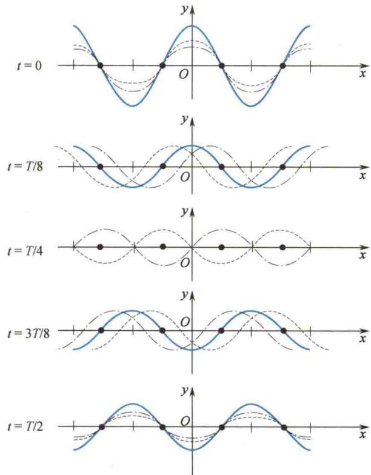
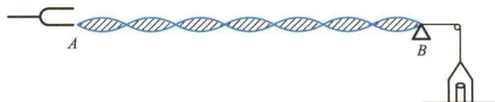
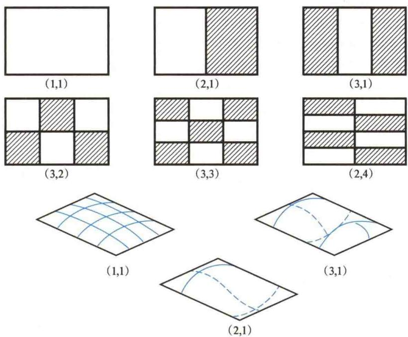
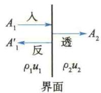
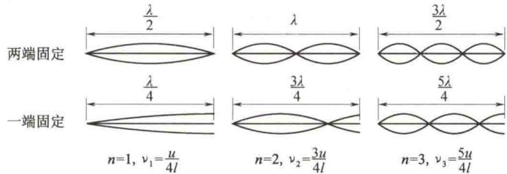
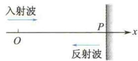

import Guide from '@/components/Guide.astro';
import Knowledge from '@/components/Knowledge.astro';
import Example from '@/components/Example.astro';
import Analysis from '@/components/Analysis.astro';
import Solution from '@/components/Solution.astro';
import Variant from '@/components/Variant.astro';
import Note from '@/components/Note.astro';
import Block from '@/components/Block.astro';
import Method from '@/components/Method.astro';
import Exercise from '@/components/Exercise.astro';

驻波是一种特殊的干涉现象. 两列振幅相同、相向传播的相干波的叠加称为驻波. 平面简谐波正入射到两种介质的界面上时, 入射波和反射波进行叠加即可形成驻波.
  
非线性波、孤波

## 6.5.1 驻波方程

设在坐标原点，入射波和反射波的初相位相同且为零，用 $A$ 表示它们的振幅， $\omega$
表示它们的角频率,则它们的运动学方程分别为
$$
y _ {1} = A \cos \left(\omega t - \frac {2 \pi}{\lambda} x\right), \quad y _ {2} = A \cos \left(\omega t + \frac {2 \pi}{\lambda} x\right)
$$
合成波的方程为
$$
\begin{array}{r l} y & = y _ {1} + y _ {2} = A \cos \left(\omega t - \frac {2 \pi}{\lambda} x\right) + A \cos \left(\omega t + \frac {2 \pi}{\lambda} x\right) \\ & = 2 A \cos \frac {2 \pi}{\lambda} x \cos \omega t \end{array}\tag{6.56}
$$
这就是驻波方程.式中, $\cos\omega t$ 表示简谐振动,而 $\left|2A\cos\frac{2\pi}{\lambda}x\right|$ 即为简谐振动的振幅.式(6.57)中,x与t被分隔于两个余弦函数中,说明此函数不满足 $y(t+\Delta t,x+u\Delta t)=y(t,x)$ ,因此它不表示行波,只表示各质点都在做与原频率相同的简谐振动,但各点的振幅随位置的不同而不同.图6.26画出了不同时刻的入射波、反射波和合成波的波形图,图中实线表示合成波.
  
图6.26 驻波的形成

## 6.5.2 驻波的特点

### 1. 波腹与波节 驻波振幅的分布特点

  
驻波的特点分析
由图 6.26 可以看出, 波线上有些点始终不动(振幅为零), 称为波节; 而有些点的振幅始终具有极大值, 称为波腹.
由式(6.56)可知，与 $\left|\cos\frac{2\pi}{\lambda}x\right|=0$ ，即 $\frac{2\pi x}{\lambda}=(2k+1)\frac{\pi}{2}$ 对应的各点为波节的
位置,因此波节的坐标为
$$
x = (2 k + 1) \frac {\lambda}{4} \quad (k = 0, \pm 1, \pm 2, \dots)\tag{6.57}
$$
同理，与 $\left|\cos \frac{2\pi}{\lambda} x\right| = 1$ ，即 $\frac{2\pi}{\lambda} x = k\pi$ 对应的各点为波腹的位置，因此波腹的坐标为
$$
x = k \frac {\lambda}{2} (k = 0, \pm 1, \pm 2, \dots)\tag{6.58}
$$
由式(6.57)、式(6.58)可知，相邻两个波节或相邻两个波腹之间的距离都是 $\lambda / 2$ ，而相邻的波节、波腹之间的距离为 $\lambda / 4$ 。这就为我们提供了一种测定行波波长的方法，只要测出相邻两波节或相邻两波腹之间的距离就可以确定原来两列行波的波长 $\lambda$ 。
需要说明的是,式(6.57)、式(6.58)给出的波节、波腹位置的结论不具有普遍性,因为它们是从特例中导出的.
介于波腹、波节之间的各质点，它们的振幅随坐标位置按 $\left|2A\cos\frac{2\pi}{\lambda}x\right|$ 的规律变化.

### 2. 驻波相位的分布特点

在驻波方程[式(6.56)]中,振动因子为 $\cos\omega t$ ,但不能认为驻波中各点的振动相位也相同或如行波中那样逐点不同. x 处的振动位移由 $2A\cos\frac{2\pi}{\lambda}x$ 确定,显然对应于不同的 x 值, $2A\cos\frac{2\pi}{\lambda}x$ 可正可负. 如果把相邻两波节之间的各点视为一段,则由余弦函数的取值规律可知, $\cos\frac{2\pi}{\lambda}x$ 的值对同一段内的各质点有相同的符号;对于分别在相邻两段内的两质点则符号相反(见图 6.26).以 $\left|2A\cos\frac{2\pi}{\lambda}x\right|$ 为振幅,这种符号的相同或相反表明,在驻波中,同一段上各质点的振动相位相同,相邻两段中各质点的振动相位相反.因此,实际上这是介质的一种特殊的分段振动现象.同一段内各质点沿相同方向同时到达各自振动位移的最大值,又沿相同方向同时通过平衡位置;而波节两侧各质点同时沿相反方向到达振动位移的正、负最大值,又沿相反方向同时通过平衡位置.图 6.27 表示用电动音叉在弦上激起的驻波振动简图.某时刻电动音叉在 A 点输出一个波列,传到 B 点被界面(支点)B 反射回来,入射波与反射波叠加的结果即在 AB 弦上形成驻波.
  
图 6.27 弦上的驻波振动简图
对于有限大小的二维介质面,同样可以激起驻波振动.图6.28表示一矩形膜上的二维驻波.其中阴影部分和明亮部分表示相邻部位振动反相,两者的交界线为波节.
  
图 6.28 矩形膜上的二维驻波(第三行是第一行的立体图)

### \*3. 驻波能量

驻波振动中既没有相位的传播,也没有能量的传播.由式(6.38)可知,入射波的波强与反射波的波强大小相等、方向相反,即介质中波强的矢量和为零.驻波波强为零并不表示各质点在振动中能量守恒.例如,位于波节处的质点动能始终为零,势能则不断变化.当两波节间各点的振动位移分别达到各自的正、负最大值时,各点处的动能均为零,两节点间总势能最大,波节附近因相对形变最大,势能有极大值,而波腹附近因相对形变最小,则势能有极小值;当两波节间各点从同一方向通过平衡位置时,介质中各处的相对形变为零,势能均为零,总动能达到最大值.波腹附近则因振动速度最大而有最大动能,离波节越近,动能越小,其他时刻则动能、势能并存.这就是说,在驻波振动中,一个波段内不断地进行动能与势能的相互转化,并不断地分别集中在波腹和波节附近而不向外传播,故称为驻波.

## 6.5.3 半波损失

现在我们把注意力集中在两种介质的界面处. 实验发现, 在界面处有时形成波节, 有时形成波腹, 那么规律是什么呢?
理论和实验表明,这一切均取决于界面两边介质的相对波阻.
波阻(波的阻抗)是指介质的密度与波速的乘积 $\rho u$ . 相对波阻较大的介质称为波密介质, 反之称为波疏介质. 实验表明: 波从波疏介质入射而从波密介质上反射时, 界面处形成波节; 波从波密介质入射而从波疏介质上反射时, 界面处形成波腹.
若在界面处形成波节,则表明在界面处入射波与反射波的相位始终相反,或者说在界面处入射波的相位与反射波的相位始终存在着 $\pi$ 的相位差,这种现象叫作半波损失(或叫作半波突变).由上面的讨论可知,使反射波产生半波损失的条件是:波从波疏介质入射并从波密介质反射;对于机械波,还必须是正入射.
如果在界面处形成波腹,则表明在界面处入射波与反射波的相位始终相同,这
时反射波没有半波损失.
“半波损失”是一个很重要的概念,它在研究声波、光波的反射问题时会经常涉及.

## \* 反射波在界面处相位变化的讨论

一般情况下，入射到界面处的波动既有反射波又有透射波（见图6.29）。由于弹性介质的连续性和不可入性，在界面处相邻质点的位移（或振动速度）和能流（或应变）必定是连续的。正是这种连续性，使得反射波的相位仅由界面两边介质的相对波阻来决定。
设入射波、反射波、透射波的表达式分别为
  
图6.29 波阻对反射波相位的影响
$$
y _ {1} = A _ {1} \cos \omega \left(t - \frac {x}{u _ {1}}\right)
$$
$$
y _ {1} ^ {\prime} = A _ {1} ^ {\prime} \cos \left[ \omega \left(t + \frac {x}{u _ {1}}\right) + \varphi_ {1} \right]
$$
$$
y _ {2} = A _ {2} \cos \left[ \omega \left(t - \frac {x}{u _ {2}}\right) + \varphi_ {2} \right]
$$
若以界面处为坐标原点，以界面处振动速度和能流连续性为出发点，则可得
$$
\left(\frac {\partial y _ {1}}{\partial t} + \frac {\partial y _ {1} ^ {\prime}}{\partial t}\right) _ {x = 0} = \left(\frac {\partial y _ {2}}{\partial t}\right) _ {x = 0}
$$
整理，得
$$
A _ {1} \sin \omega t + A _ {1} ^ {\prime} \sin (\omega t + \varphi_ {1}) = A _ {2} \sin (\omega t + \varphi_ {2})\tag{6.59}
$$
另据能流公式(6.36)，并考虑到其在界面处的连续性，可得
$$
\rho_ {1} u _ {1} \left[ A _ {1} ^ {2} \sin^ {2} \omega t - A _ {1} ^ {\prime 2} \sin^ {2} (\omega t + \varphi_ {1}) \right] = \rho_ {2} u _ {2} A _ {2} ^ {2} \sin^ {2} (\omega t + \varphi_ {2})\tag{6.60}
$$
将式(6.60)与式(6.59)相除,即得
$$
\rho_ {1} u _ {1} \left[ A _ {1} \sin \omega t - A _ {1} ^ {\prime} \sin (\omega t + \varphi_ {1}) \right] = \rho_ {2} u _ {2} A _ {2} \sin (\omega t + \varphi_ {2})\tag{6.61}
$$
再将式 $(6.59)$ 代入上式,即得
$$
\rho_ {1} u _ {1} \left[ A _ {1} \sin \omega t - A _ {1} ^ {\prime} \sin (\omega t + \varphi_ {1}) \right] = \rho_ {2} u _ {2} \left[ A _ {1} \sin \omega t + A _ {1} ^ {\prime} \sin (\omega t + \varphi_ {1}) \right]\tag{6.62}
$$
整理，得
$$
\frac {A _ {1} ^ {\prime} \sin (\omega t + \varphi_ {1})}{A _ {1} \sin \omega t} = \frac {\rho_ {1} u _ {1} - \rho_ {2} u _ {2}}{\rho_ {1} u _ {1} + \rho_ {2} u _ {2}}\tag{6.63}
$$
或
$$
\frac {A _ {1} ^ {\prime}}{A _ {1}} \cos \varphi_ {1} + \frac {A _ {1} ^ {\prime}}{A _ {1}} \sin \varphi_ {1} \cot \omega t = \frac {\rho_ {1} u _ {1} - \rho_ {2} u _ {2}}{\rho_ {1} u _ {1} + \rho_ {2} u _ {2}}\tag{6.64}
$$
式(6.64)应对任一时刻 t 均成立,故有
$$
\frac {A _ {1} ^ {\prime}}{A _ {1}} \sin \varphi_ {1} = 0\tag{6.65}
$$
$$
\frac {A _ {1} ^ {\prime}}{A _ {1}} \cos \varphi_ {1} = \frac {\rho_ {1} u _ {1} - \rho_ {2} u _ {2}}{\rho_ {1} u _ {1} + \rho_ {2} u _ {2}}\tag{6.66}
$$
由式(6.65)知 $\varphi_{1}$ 只能取 0 或 $\pi$ ，代入式(6.66)，有
当 $\varphi_{1} = 0$ 时， $\cos \varphi_{1} = 1$ ，即
$$
\frac {A _ {1} ^ {\prime}}{A _ {1}} = \frac {\rho_ {1} u _ {1} - \rho_ {2} u _ {2}}{\rho_ {1} u _ {1} + \rho_ {2} u _ {2}} > 0\tag{6.67}
$$
当 $\varphi_{1} = \pi$ 时， $\cos \varphi_{1} = -1$ ，即
$$
- \frac {A _ {1} ^ {\prime}}{A _ {1}} = \frac {\rho_ {1} u _ {1} - \rho_ {2} u _ {2}}{\rho_ {1} u _ {1} + \rho_ {2} u _ {2}} <   0\tag{6.68}
$$
由式(6.67)和式(6.68)可知，当 $\rho_{1}u_{1} > \rho_{2}u_{2}$ 时， $\varphi_{1} = 0$ ，即入射波所在介质的波阻大于透射波所在介质的波阻时，反射波的相位与入射波的相位相同；当 $\rho_{1}u_{1} < \rho_{2}u_{2}$ 时， $\varphi_{1} = \pi$ ，即入射波所在介质为波疏介质，而透射波所在介质为波密介质时，反射波的相位与入射波的相位相差 $\pi$ ，即这时出现了相位突变（或说发生了半波损失）.

## \*6.5.4 振动的简正模式

如果将拉紧的弦两端固定，当轻击弦使之产生向右行进的波时，此波传到弦的右方固定端处被反射，再当此左行反射波到达左方固定端时，又发生第二次反射，如此继续也能形成驻波。因弦的两端固定，其必然形成波节，因而驻波的波长必然受到限制，驻波波长与弦长 l 间必须满足
$$
l = n   \frac {\lambda}{2}, \quad \text { 即 }   \lambda = \frac {2 l}{n} \quad (n = 1, 2, 3, \dots)
$$
而波速 $u = \lambda\nu$ ，从而对频率也有限制，允许存在的频率为
$$
\nu = \frac {u}{\lambda} = \frac {n}{2 l} u (n = 1, 2, 3, \dots)\tag{6.69}
$$
对于弦线，因为 $u = \sqrt{T/\mu}$ ，所以
$$
\nu = \frac {n}{2 l} \sqrt {\frac {T}{\mu}}\tag{6.70}
$$
其中，与 $n = 1$ 对应的频率称为基频，其后频率依次称为2次、3次……谐频（对声驻波，则称为基音和泛音).各种允许频率所对应的驻波振动（简谐振动模式）称为简正模式（或称为本征振动）.相应的频率称为简正频率（或称为本征频率).由此可见，对两端固定的弦，这一驻波振动系统有许多个简正模式和简正频率，即有许多个振动自由度.式(6.69)也适用于两端闭合或两端开放的管（其中为声驻波).若为闭合管，则两端为波节；若为开放管，则两端为波腹.图6.30所示为弦（或管）振动的几种简正模式.
  
图 6.30 弦(或管)振动的几种简正模式
对一端固定、一端自由的弦（或一端封闭、一端开放的管）也可作类似讨论，对于二维膜也可进行讨论，但要更加复杂。实际上各类乐器发出声音的本质无非是各种不同质地、形状、长度、大小的管、弦、膜的驻波振动。
上面的讨论表明,无论是管还是弦,只要其长度有限,其固有振动(本征振动)频率就只能取分立值而非连续值.这些结论在德布罗意提出物质波的设想时发挥了作用.德布罗意把电子在原子中能量取分立值叫作取整数,又将本征振动频率取分立值也叫作取整数.他指出,在光的问题上我们就被迫同时引入微粒思想和波动思想.另外,电子在原子中的稳定运动的确定引入了整数.直到今天,物理学上唯一包含“整数”的现象就是干涉和简谐振动模式.这个事实告诉我们,不能把电子认为是单纯的微粒,必须也赋予它波动性特征.

<Example title="例 6.8">
如图6.31所示，沿 $x$ 轴正方向传播的平面简谐波方程为 $y = 0.2\cos \left[200\pi \left(t - \frac{x}{200}\right)\right]$ (SI)，两种介质的分界面上的 $P$ 点与坐标原点 $O$ 相距 $d = 6.0\mathrm{m}$ ，入射波在界面上反射后振幅无变化，且反射处为固定端。求：(1) 反射波方程；(2) 驻波方程；(3) 在 $O$ 点与 $P$ 点间各个波节点和波腹点的坐标。

<Solution title="解">
（1）由波函数可知，入射波的振幅 A = 0.2 m，角频率 $\omega = 200\pi s^{-1}$ ，波速 u = 200 m/s，故波长 $\lambda = \frac{u}{\nu} = 2 \, m$ 。由题意知，反射波的振幅、频率和波速均
与入射波相同.
入射波在两介质分界面上的 P 点的振动方程为
$$
y _ {\mathrm{入}} = y \mid_ {x = d} = 0. 2 \cos \left[ 2 0 0 \pi \left(t - \frac {6}{2 0 0}\right) \right]
$$
$$
= 0. 2 \cos (2 0 0 \pi t - 6 \pi) = 0. 2 \cos 2 0 0 \pi t
$$
因为反射点是固定端,所以反射波在 P 点处的振动相位与入射波在该点的振动相位相反,故有
$$
y _ {\mathrm{反}} = 0. 2 \cos (2 0 0 \pi t + \pi)
$$
反射波以速度 $u = 200 \, m/s$ 向 x 轴负方向传播，在 P 点处的振动方程已经由上式给出，所以反射波方程为
$$
\begin{array}{r l} y & = 0. 2 \cos \left[ 2 0 0 \pi \left(t - \frac {6 - x}{2 0 0}\right) + \pi \right] \\ & = 0. 2 \cos \left[ 2 0 0 \pi \left(t + \frac {x}{2 0 0}\right) - 5 \pi \right] \\ & = 0. 2 \cos \left[ 2 0 0 \pi \left(t + \frac {x}{2 0 0}\right) - \pi \right] \end{array}
$$
(2) 驻波方程为
$$
\begin{array}{r l} y & = 0. 2 \cos \left[ 2 0 0 \pi \left(t - \frac {x}{2 0 0}\right) \right] + 0. 2 \cos \left[ 2 0 0 \pi \left(t + \frac {x}{2 0 0}\right) - \pi \right] \\ & = 0. 2 \cos \left[ 2 0 0 \pi \left(t - \frac {x}{2 0 0}\right) \right] - 0. 2 \cos \left[ 2 0 0 \pi \left(t + \frac {x}{2 0 0}\right) \right] \end{array}
$$
  
图6.31 例6.8图
$$
= 0. 4 \sin \pi x \sin 2 0 0 \pi t
$$
(3) 由
$$
\pi x = 2 k \frac {\pi}{2} (k = 0, 1, 2, \dots , 6)
$$
得各个波节点的坐标为
$$
x = 0, 1, 2, 3, 4, 5, 6
$$
由
$$
\pi x = (2 k + 1) \frac {\pi}{2} \quad (k = 0, 1, 2, \dots , 5)
$$
得各个波腹点的坐标为
$$
x = \frac {1}{2}, \frac {3}{2}, \frac {5}{2}, \frac {7}{2}, \frac {9}{2}, \frac {1 1}{2}
$$
</Solution>
</Example>
