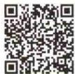
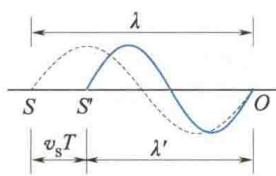
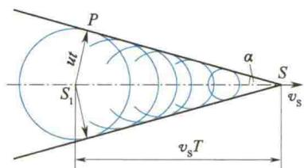
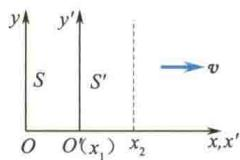

import Guide from '@/components/Guide.astro';
import Knowledge from '@/components/Knowledge.astro';
import Example from '@/components/Example.astro';
import Analysis from '@/components/Analysis.astro';
import Solution from '@/components/Solution.astro';
import Variant from '@/components/Variant.astro';
import Note from '@/components/Note.astro';
import Block from '@/components/Block.astro';
import Method from '@/components/Method.astro';
import Exercise from '@/components/Exercise.astro';

## 6.6.1 多普勒效应

  

多普勒

在前面几节的讨论中,我们实际上是假定了波源和观察者相对于介质都是静止的,这时观察者接收到的波的频率与波源的振动频率相等.但是,在日常生活和科学技术中,经常会遇到波源或观察者(或者这两者同时)相对于介质运动的情况,那么,这时观察者接收到的波的频率与波源的振动频率是否依然相等呢?例如,站在站台上,当一列火车迎面飞驰而来时,我们听到它的汽笛声高昂,而当火车从我们身边疾驰而去时,却听到它的汽笛声变得低沉.实际上,火车鸣笛的音调并未改变(波源的振动频率未变),而火车接近和驶离我们时,人耳接收到的频率却不同.这些现象表明:当波源或观察者(或者这两者同时)相对于介质有相对运动时,观察者接收到的波的频率与波源的振动频率不同,这类现象是由多普勒(Doppler)于1842年发现并提出的,故称为多普勒效应或者多普勒频移.

为简单起见,我们将介质选为参考系,并假定波源和观察者的运动发生在两者的连线上.用 $v_{S}$ 表示波源相对于介质的运动速度, $v_{B}$ 表示观察者相对于介质的运动速度,u 表示波在介质中的传播速度.并规定:波源和观察者相互接近时 $v_{S}$ 和 $v_{B}$ 取正值,相互远离时 $v_{S}$ 和 $v_{B}$ 取负值.值得注意的是,波速 u 是波相对于介质的速度,它只取决于介质的性质,而与波源或观察者的相对运动无关,它恒为正值.在具体讨论之前,读者应将前面提到的3种频率(波源振动频率 $\nu_{S}$ 、介质的波动频率 $\nu$ 、观察者的接收频率 $\nu_{B}^{\prime}$ )严格区分开.实际上, $\nu_{S}$ 、 $\nu$ 的定义在前面章节已有说明,接收频率是指接收器(观察者)在单位时间内接收到的完整波的数目.虽然对波动频率和接收频率均有 $\nu=\frac{u}{\lambda}$ 成立,但它们却是在不同的参考系中.即波动频率以介质为参考系,接收频率以接收器（观察者）为参考系，在 $\nu_{\mathrm{B}}^{\prime} = \frac{u^{\prime}}{\lambda^{\prime}}$ 中， $u^{\prime},\lambda^{\prime}$ 是观察者测得的波速和波长.

显然,在波源和观察者均相对于介质静止时,没有多普勒效应,即 $\nu_{B} = \nu = \nu_{S}$ . 因此,多普勒效应主要针对下面 3 种情况.

(1) 波源不动, 观察者以 $v_{B}$ 相对于介质运动 ( $v_{S} = 0, v_{B} \neq 0$ ).

设观察者向着波源运动，即 $v_{B} > 0$ ，则波相对于观察者的速度为 $u' = u + v_{B}$ ，在不涉及相对论效应时，有 $\lambda' = \lambda$ ，所以单位时间内，观察者接收到的完整波形的数目，即观察者实际接收到的波的频率为

$$

\nu_ {\mathrm{B}} ^ {\prime} = \frac {u ^ {\prime}}{\lambda} = \frac {u + v _ {\mathrm{B}}}{u T} = \frac {u + v _ {\mathrm{B}}}{u} \nu_ {\mathrm{S}} = \left(1 + \frac {v _ {\mathrm{B}}}{u}\right) \nu_ {\mathrm{S}} > \nu_ {\mathrm{S}}\tag{6.71}

$$

式(6.71)表明, 观察者向着波源运动时, 接收到的频率为波源振动频率的 $\left(1+\frac{v_{B}}{u}\right)$ 倍; 当观察者远离波源运动时, 式(6.71)仍可适用, 只要将式中的 $v_{B}$ 取为负值即可, 显然, 这时观察者接收到的频率会小于波源的振动频率; 特别地, 当 $v_{B} = -u$ 时, $\nu_{B}^{\prime} = 0$ . 这就是观察者随着波的传播以波速远离波源运动的情况, 当然观察者就接收不到波动了.

(2) 观察者不动, 波源以速度 $v_{S}$ 相对于介质运动 ( $v_{S} \neq 0, v_{B} = 0$ ).

如图 6.32 所示, 假设波源由 S 点以速度 $v_{S}$ 向着观察者运动. 因为波在介质中的传播速度 u 只取决于介质的性质, 与波源的运动与否无关, 所以这时波源的振动在一个周期内向前传播的距离就等于一个波长, 即 $\lambda = uT$ , 但由于波源向着观察者运动, $v_{S}$ 为正, 所以在一个周期内波源也在波的传播方向上移动了 $v_{S}T$ 的距离而到达 $S'$ 点, 结果使一个完整的波被挤压在 $S'O$ 之间, 这就相当于波长减小为 $\lambda' = \lambda - v_{S}T$ . 因此, 观察者

  

图6.32 观察者不动，波源运动

在单位时间内接收到的完整波的数目,即观察者接收到的频率为

$$

\nu_ {\mathrm{B}} ^ {\prime} = \frac {u}{\lambda^ {\prime}} = \frac {u}{\lambda - v _ {\mathrm{S}} T} = \frac {u}{u T - v _ {\mathrm{S}} T} = \frac {u}{u - v _ {\mathrm{S}}} \nu_ {\mathrm{S}} > \nu_ {\mathrm{S}}\tag{6.72}

$$

式(6.72)表明,波源向着观察者运动时,观察者接收到的频率为波源振动频率的 $\frac{u}{u-v_{S}}$ 倍,比波源频率要高;若波源远离观察者运动,则式(6.72)依然适用,只是 $v_{S}$ 应取负值,所以此时观察者接收到的频率 $\nu_{B}^{\prime}$ 将小于波源的振动频率.

由式(6.72)可知, 当 $v_{S} \rightarrow u$ 时, 接收频率 $\nu_{B}^{\prime}$ 应趋于无穷大, 但这是不可能的. 当接收频率越来越高时, 其波长 $\lambda^{\prime}$ 也越来越短, 当 $\lambda^{\prime}$ 小于组成介质的分子间距时, 介质对于此波列不再是连续的了, 波列也就不能传播了.

(3) 波源和观察者同时相对于介质运动 $(v_{\mathrm{S}} \neq 0, v_{\mathrm{B}} \neq 0)$ .

根据上面(1)和(2)的讨论知,观察者以 $v_{B}$ 相对于介质运动时,相对于观察者来说,波的速率变为 $u' = u + v_{B}$ ; 而波源以 $v_{S}$ 相对于介质运动时,相当于使波长变为 $\lambda' = \lambda - v_{S} T$ . 综合这两个结果,则波源和观察者同时运动时,观察者接收到的波的频率为

$$

\nu_ {\mathrm{B}} ^ {\prime} = \frac {u ^ {\prime}}{\lambda^ {\prime}} = \frac {u + v _ {\mathrm{B}}}{u T - v _ {\mathrm{S}} T} = \frac {u + v _ {\mathrm{B}}}{u - v _ {\mathrm{S}}} \nu_ {\mathrm{S}}\tag{6.73}

$$

式中，当观察者与波源接近时， $v_{B}$ 、 $v_{S}$ 取正值，远离时 $v_{B}$ 、 $v_{S}$ 取负值.

从以上讨论可以得出结论:在多普勒效应中,不论是波源运动还是观察者运动,或两者都运动,当波源和观察者接近时,观察者接收到的频率 $\nu'$ 总是大于波源振动频率 $\nu$ ;当波源和观察者远离时, $\nu'$ 总是小于 $\nu$ .

## \*6.6.2 光波多普勒效应

多普勒效应是一切波动过程的共同特征,不仅机械波有多普勒效应,电磁波也有多普勒效应.与机械波不同的是,因为电磁波的传播不需要介质,所以在电磁波的多普勒效应中,是由光源和观察者的相对速度v来决定观察者的接收频率的.用相对论可以证明,当光源和观察者在同一直线上运动时,观察者接收到的频率为

$$

\nu_ {\mathrm{接近}} = \sqrt {\frac {1 + v / c}{1 - v / c}} \nu

$$

和

$$

\nu_ {\mathrm{远离}} = \sqrt {\frac {1 - v / c}{1 + v / c}} \nu\tag{6.74}

$$

此外，对于电磁波还有横向多普勒效应，其横向多普勒频移为

$$

\nu_ {\text {横}} = \sqrt {1 - \left(\frac {v}{c}\right) ^ {2}} \nu\tag{6.75}

$$

式中，c 为真空中的光速， $\nu$ 为波源的频率。由式(6.74)可知，当光源远离观察者运动时，接收到的频率变小、波长变长，这种现象称为红移，即移向光谱中的红色一侧。天文学家就是将来自星球的光谱与地球上相同元素的光谱进行比较，发现星球光谱几乎都发生了红移，这说明星球都在远离地球而运动，这一结果已成为所谓“大爆炸”的宇宙学理论的重要证据之一。

多普勒效应在科学技术中还有其他很多重要应用.例如，利用声波的多普勒效应可以测定声源的频率、波速等；利用超声波的多普勒效应可以诊断心脏的跳动情况；利用电磁波的多普勒效应可以测定运动物体的速度.此外，多普勒效应还可以用于报警、检测车速等.

## \*6.6.3 冲击波

由式(6.72)可知,若波源的运动速度大于波在介质中的传播速度,这时接收频率为负值,仅就这一点而言,它在物理上是无意义的.但波源的运动速度大于波在介质中传播速度的问题在现代科学技术中却越来越重要.

如图 6.33 所示, 当位于 $S_{1}$ 点的波源以超波速的速度 $v_{S}$ 向前运动时, 波源(物体)本身的运动会激起介质的扰动, 从而激起另一种波. 这时的运动物体充当了另一种波的波源, 这种波是一种以运动物体的运动轨迹为中心的一系列球面波. 由于球面波的波速 u 比运动物体的速度 $v_{S}$ 小, 所以就会形成以波源为顶点的 V 形波, 这种波就叫作冲击波. 冲击波的包络面呈圆锥状, 称作马赫锥, 其半顶角 $\alpha$ (马赫角) 满足关系式:

  

图6.33 冲击波的产生

$$

\sin \alpha = \frac {u}{v _ {\mathrm{S}}}

$$

(6.76)

$M=\frac{v_{S}}{u}$ 称为马赫数.由此可见,在u一定时,随着 $v_{S}$ 的增大,V形波的尖锐程度变大.如果这个冲击波是声波,那么必然是在运动物体通过之后我们才能听到其响声.这就是超音速飞机飞过我们头顶之后才听到强烈响声的原因.

当冲击波产生时,除伴有尖锐的噪声之外还有剧烈的打击感.例如,原子弹爆炸时,产生的高温气体的速度高达1 000 km/s,它比声速要大很多,其产生的冲击波就具有极大的破坏力.

超音速飞机在空中飞行时，在机头前方产生的冲击波会造成压强的突变，给飞机附加很大的阻力，消耗发动机的能量。因此力图减弱冲击波的强度是超音速飞机（包括导弹等）设计中的重大课题。而宇宙飞船重返大气层时会像流星一样带着熊熊烈火，形成热障。如何利用宇宙飞船船头形成的冲击波来化解热障，是另一个方向的重大课题。当带电粒子以比光在介质中的传播速度更大的速度通过介质时，同样会产生冲击波并引发电磁辐射，这种辐射称为切伦科夫辐射。利用切伦科夫辐射原理制成的闪烁计数器已广泛应用于高能物理、农学、医学及生物学中。

<Example title="例 6.9">
一固定的超声源发出频率为 $100 \, kHz$ 的超声波。一汽车向超声源迎面驶来，在超声源外接收到从汽车反射回来的超声波，从测频装置中测出其频率为 $110 \, kHz$ ，设空气中的声速为 $330 \, m/s$ ，试计算汽车的行驶速度。

<Solution title="解">
汽车相对于空气以速度 $v_{S}$ 趋近于超声源. 从超声源发出的超声波到达汽车时, 汽车是运动的接收器. 超声波从汽车上反射时, 汽车又是以 $v_{S}$ 运动的声源, 因此由式(6.73) 可知, 在固定装置中接收到的反射波的频率

解得
</Solution>
</Example>

<Example title="例 6.10">
试根据相对论时空效应导出光波多普勒效应的频变公式.

解（1）纵向多普勒效应.如图6.34所示，设观察者位于 $S$ 系的坐标原点 $O$ ，光源固定于 $S^{\prime}$ 系的坐标原点 $O^{\prime}$ （从 $S$ 系观测 $t_1$ 时刻位于 $x_{1}$ 处）， $S^{\prime}$ 系以速度 $v$ 沿 $x$ 轴运动，即光源以 $v$ 沿 $x$ 轴远离观察者.又设光波的固有周期为 $\tau$ ，光源在一个周期内由 $x_{1}$ 运动到 $x_{2}$ （从 $S$ 系测量，光源到达 $x_{2}$ 的时刻为 $t_2)$ .观察者测知 $x_{1}$ 处传来的光信号的时间是 $t_1 + \frac{x_1}{c},x_2$ 处传来的光信号的时间是 $t_2 + \frac{x_2}{c}$ ，则观察者接收到的光波周期为

$$

\nu^ {\prime} = \frac {u + v _ {\mathrm{S}}}{u - v _ {\mathrm{S}}} \nu

$$

$$

v _ {\mathrm{s}} = \frac {\nu^ {\prime} - \nu}{\nu^ {\prime} + \nu} u = \frac {1 1 0 - 1 0 0}{1 1 0 + 1 0 0} \times 3 3 0 \mathrm{m/s} = 1 5. 7 \mathrm{m/s}

$$

$$

\begin{array}{r l} T & = \left(t _ {2} + \frac {x _ {2}}{c}\right) - \left(t _ {1} + \frac {x _ {1}}{c}\right) \\ & = (t _ {2} - t _ {1}) + \frac {x _ {2} - x _ {1}}{c} = (t _ {2} - t _ {1}) + \frac {t _ {2} - t _ {1}}{c} v \\ & = (t _ {2} - t _ {1}) \left(1 + \frac {v}{c}\right) \end{array}

$$

$t_{2}-t_{1}$ 为 S 系中 $x_{2}$ 和 $x_{1}$ 两处的时间差，根据相对论时间延缓效应 $t_{2}-t_{1}=\frac{\tau}{\sqrt{1-v^{2}/c^{2}}}$ ，代入上式得

$$

T = \frac {\tau}{\sqrt {1 - v ^ {2} / c ^ {2}}} \left(1 + \frac {v}{c}\right) = \sqrt {\frac {c + v}{c - v}} \tau

$$

由此可得观察者接收到的频率为

$$

\nu = \frac {1}{T} = \frac {1}{\tau} \sqrt {\frac {c - v}{c + v}} = \nu_ {0} \sqrt {\frac {c - v}{c + v}}

$$

  

图 6.34 纵向多普勒效应

式中， $\nu_{0}$ 为光波的固有频率；光源离开观察者时 v 为正，趋近时 v 为负。如果光源不动，观察者以速度 v 运动，同样得到这一公式。因此，v 应理解为二者的相对速度。

(2) 横向多普勒效应. 设光源垂直于 x 轴沿图 6.34 中 $y'$ 方向运动, 由于光源运动过程中在 S 系中 x 轴的位置不变, 即 $\Delta x = 0$ , 所以观察者接收到的周期和频率分别为

$$

\begin{array}{r l} T & = t _ {2} - t _ {1} = \frac {\tau}{\sqrt {1 - v ^ {2} / c ^ {2}}} \\ & \nu = \nu_ {0} \sqrt {1 - v ^ {2} / c ^ {2}} \end{array}

$$

按照纵向多普勒效应，当光源远离观察者而去 $(v>0)$ 时， $\nu<\nu_{0}$ ，称为光谱红移；当光源向着观察者运动 $(v<0)$ 时， $\nu>\nu_{0}$ ，称为光谱蓝移.
</Example>
