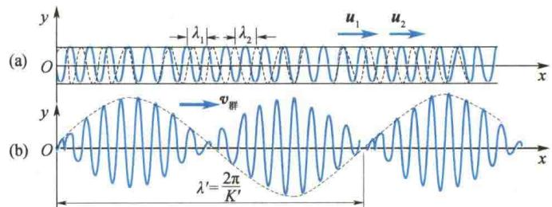
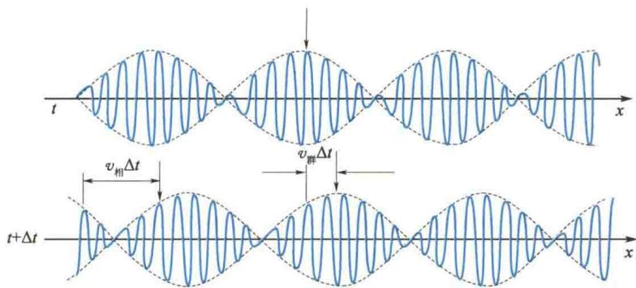

import Guide from '@/components/Guide.astro';
import Knowledge from '@/components/Knowledge.astro';
import Example from '@/components/Example.astro';
import Analysis from '@/components/Analysis.astro';
import Solution from '@/components/Solution.astro';
import Variant from '@/components/Variant.astro';
import Note from '@/components/Note.astro';
import Block from '@/components/Block.astro';
import Method from '@/components/Method.astro';
import Exercise from '@/components/Exercise.astro';

## 6.7.1 色散

前面的讨论指出，在一般情况下，简谐波在弹性介质中传播时，波速只由介质的力学性质决定。即不同频率的波在同一介质中传播时具有相同的速度。这种介质叫作无色散介质。但在有些介质中，波的传播速度与频率有关，即不同频率的波在同一介质中传播时波速不同，这种介质叫作色散介质。例如，深水区域里的水面波，其波速 $u = \sqrt{\frac{g\lambda}{2\pi}}$ ，即波速与波长或频率有关，这时的水介质即为色散介质，相应的水面波称为色散波。

## 6.7.2 波包

与振动的叠加类似，在无色散介质中，几个频率相同、振动方向相同的简谐波叠加后，合成波仍然是简谐波（请注意与干涉相区别）。但是，即使在无色散介质中，不同频率的简谐波叠加，合成波就不再是简谐波，而是比较复杂的复合波。在复合波中波列的振幅随质元位置 $x$ 时大时小地变化，显现为一团一团地振动，故称为波群或波包，如图6.35所示。
  
图6.35 波包
与几列简谐波可以合成波包相反，一列任意的波，可以是周期性的或者非周期性的，如一个孤立的波包（脉冲波），可以分解为许多个简谐波.

## 6.7.3 群速度

如果有两列频率相近的简谐波在介质中叠加, 就会形成如图 6.36 所示的波包. 在图中可以看出, 合成波显现为一个波包一个波包地向前传播. 图 6.36 中的包络线(虚线)是波包的形状. 这时在介质中有两种传播速度, 一种是简谐波的传播速度, 即相速度; 另一种是波包(包络线)的传播速度, 即群速度. 下面的讨论将表明, 在无色散介质中, 群速度与相速度相等, 而在色散介质中, 这两种速度不相等.
设有两列频率相近的简谐波均沿 x 轴正方向传播, 它们的波函数分别为(简单起见, 设两列波的振幅相等)
$$
y _ {1} = A \cos (\omega_ {1} t - K _ {1} x)
$$
$$
y _ {2} = A \cos (\omega_ {2} t - K _ {2} x)
$$
  
图6.36 波包的传播
式中， $\omega_{1}$ 、 $\omega_{2}$ 分别为两列波的角频率； $K_{1}$ 、 $K_{2}$ 分别为两列波的波矢，其中 $K_{1}=\frac{\omega_{1}}{u_{1}}=\frac{2\pi}{\lambda_{1}}$ ， $K_{2}=\frac{\omega_{2}}{u_{2}}=\frac{2\pi}{\lambda_{2}}$ ， $u_{1}$ 、 $u_{2}$ 分别为两列波的相速度， $\lambda_{1}$ 、 $\lambda_{2}$ 分别为两列波的波长。它们的合成波的波函数为
$$
y = y _ {1} + y _ {2} = 2 A \cos \left(\frac {\omega_ {1} - \omega_ {2}}{2} t - \frac {K _ {1} - K _ {2}}{2} x\right) \cos \left(\frac {\omega_ {1} + \omega_ {2}}{2} t - \frac {K _ {1} + K _ {2}}{2} x\right)
$$
令 $\omega'=\frac{\omega_{1}-\omega_{2}}{2},K'\=\frac{K_{1}-K_{2}}{2},\bar{\omega}=\frac{\omega_{1}+\omega_{2}}{2},\bar{K}=\frac{K_{1}+K_{2}}{2}$ ，则
$$
y = 2 A \cos (\omega^ {\prime} t - K ^ {\prime} x) \cos (\bar {\omega} t - \overline {{{K}}} x)
$$
再令
$$
A ^ {\prime} = 2 A \cos (\omega^ {\prime} t - K ^ {\prime} x)\tag{6.77}
$$
则有
$$
y = A ^ {\prime} \cos (\bar {\omega} t - \bar {K} x)\tag{6.78}
$$
由于 $\omega_{1}$ 和 $\omega_{2}$ 很接近，即 $\left|\omega_{1}-\omega_{2}\right|\ll\omega_{1}+\omega_{2}$ ，故 $A^{\prime}$ 变化缓慢，因此式(6.78)可看成一列振幅 $A^{\prime}$ 发生缓慢变化的余弦波。若坐标 x 取定值，就是第 5 章讨论的拍振动。若时间 t 取定值，就是图 6.36 所示的空间拍，而式(6.77)就是波包的包络线方程，如图 6.36 中虚线所示。
如果我们追踪观察包络线上的某一确定值点,如最大值点,则由图6.36可以看出,它在沿x轴正方向传播.有
$$
\omega^ {\prime} t - K ^ {\prime} x = \text {常数}
$$
将上式微分得
$$
\omega^ {\prime} \mathrm{d} t - K ^ {\prime} \mathrm{d} x = 0
$$
于是得包络线移动的速度,即群速度为
$$
v _ {\mathrm{群}} = \frac {\mathrm{d} x}{\mathrm{d} t} = \frac {\omega^ {\prime}}{K ^ {\prime}} = \frac {\omega_ {1} - \omega_ {2}}{K _ {1} - K _ {2}} = \frac {\Delta \omega}{\Delta K}
$$
因频差 $\omega_{1}-\omega_{2}$ 很小，故可用 $\frac{d\omega}{dK}$ 代替 $\frac{\Delta\omega}{\Delta K}$ ，即
$$
v _ {\mathrm{群}} = \frac {\mathrm{d} \omega}{\mathrm{d} K} = \frac {\mathrm{d} (u K)}{\mathrm{d} K} = u + K \frac {\mathrm{d} u}{\mathrm{d} K}\tag{6.79}
$$
由式(6.79)可知,对于无色散波,相速度u与频率无关,即 $\frac{du}{dK}=0$ ,于是群速度等于相速度.这是因为在无色散介质中,每个分波的相速度都相同,其复合波速度当然也与该介质中的相速度相同;对于色散波,相速度与频率有关,则 $\frac{du}{dK}\neq0$ ,因而群速度不等于相速度.
我们知道,波是传播信息的重要手段.但只有复合波才能传递信息.理想的简谐波在无限长的时间内始终以同一振幅和不变的频率传播,所以不能携带任何信息.而在复合波中信息传递的速度就是波包移动的速度,即信息是以群速度传播的.
最后还应该指出，式(6.79)只在无色散或色散不大的介质中成立。在这种情况下，波包包络线的形状在较长距离中大体保持不变。若介质色散较厉害 $(\mathrm{du} / \mathrm{d}K$ 较大），则由于各列分波相速度差异显著，波包在传播过程中会逐渐摊平，终至弥散消失，在这种情况下再讨论群速度也就没有意义了。

