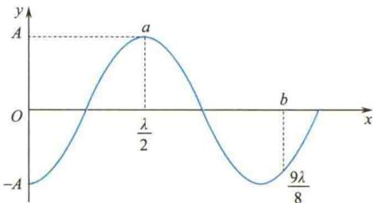

import Guide from '@/components/Guide.astro';
import Knowledge from '@/components/Knowledge.astro';
import Example from '@/components/Example.astro';
import Analysis from '@/components/Analysis.astro';
import Solution from '@/components/Solution.astro';
import Variant from '@/components/Variant.astro';
import Note from '@/components/Note.astro';
import Block from '@/components/Block.astro';
import Method from '@/components/Method.astro';
import Exercise from '@/components/Exercise.astro';

## 选择题

<Exercise title="习题 6.1.1">
一平面简谐波在弹性介质中传播,在介质质元从平衡位置运动到最大位移处的过程中( )

A. 它的动能转化为势能.

B. 它的势能转化为动能.

C. 它从相邻的一段质元获得能量,其能量逐渐增大.

D. 它把自己的能量传给相邻的一段质元,其能量逐渐减小.
</Exercise>

<Exercise title="习题 6.1.2">
某时刻驻波波形曲线如题 6.1.2 图所示，则 a、b 两点的相位差是

A. $\pi$ . B. $\pi/2$ .

C. $5\pi/4$ . D. 0.
</Exercise>

<Exercise title="习题 6.1.3">
设声波在介质中的传播速率为 u，声源的频率为 $\nu_{S}$ . 若声源 S 不动，而接收器 R 相对于介质以速率 $v_{B}$ 沿着 S、R 连线向着声源 S 运动，则位于 S、R 连线中点的质点 P 的振动频率为（）

A. $\nu_{S}$ . B. $\frac{u + v_{B}}{u}\nu_{S}$ . C. $\frac{-u}{u}$

  

题6.1.2图

$$

\frac {u}{u + v _ {\mathrm{B}}} \nu_ {\mathrm{S}}.

$$

$$

\frac {u}{u - v _ {\mathrm{B}}} \nu_ {\mathrm{S}}.

$$

</Exercise>
