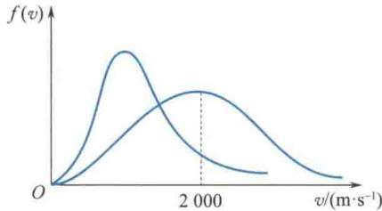

import Guide from '@/components/Guide.astro';
import Knowledge from '@/components/Knowledge.astro';
import Example from '@/components/Example.astro';
import Analysis from '@/components/Analysis.astro';
import Solution from '@/components/Solution.astro';
import Variant from '@/components/Variant.astro';
import Note from '@/components/Note.astro';
import Block from '@/components/Block.astro';
import Method from '@/components/Method.astro';
import Exercise from '@/components/Exercise.astro';

## 填空题

<Exercise title="习题 7.2.1">
某容器内分子数密度为 $10^{26} \, m^{-3}$ ，每个分子的质量为 $3 \times 10^{-27} \, kg$ ，设其中 1/6 分子数以速率 v = 200 m/s 垂直地向容器的一壁运动，而其余 5/6 分子或者离开此壁，或者沿平行于此壁的方向运动，且分子与容器壁的碰撞为完全弹性的，则每个分子作用于器壁的冲量 $\Delta p =$ \_\_\_\_ ；每秒碰在器壁单位面积上的分子数 $n_{0} =$ \_\_\_\_ ；作用在器壁上的压强 p = \_\_\_\_.
</Exercise>

<Exercise title="习题 7.2.2">
有一瓶质量为 M 的氢气, 温度为 T, 可视为刚性分子理想气体, 则氢分子的平均平动动能为 \_\_\_\_ , 氢分子的平均动能为 \_\_\_\_ , 该瓶氢气的内能为 \_\_\_\_.
</Exercise>

<Exercise title="习题 7.2.3">
容积为 $3.0 \times 10^{-2} \, m^{3}$ 的容器内储有 20 g 某种理想气体，设气体的压强为 0.5 atm. 则气体分子的最概然速率为 \_\_\_\_ ，平均速率为 \_\_\_\_ ，方均根速率为 \_\_\_\_ .
</Exercise>

<Exercise title="习题 7.2.4">
题 7.2.4 图所示的两条 $f(v)-v$ 曲线分别表示氢气和氧气在同一温度下的麦克斯韦速率分布曲线。由此可得氢气分子的最概然速率为 \_\_\_\_；氧气分子的最概然速率为 \_\_\_\_。

  

题7.2.4图
</Exercise>

<Exercise title="习题 7.2.5">
一定量的某种理想气体,当体积不变,温度升高时,其平均自由程 $\bar{\lambda}$ \_\_\_\_ ,平均碰撞频率 $\bar{Z}$ \_\_\_\_. (选填“减少”“增大”或“不变”)

</Exercise>
