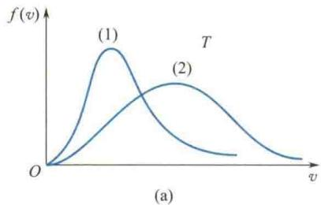
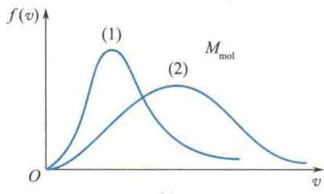
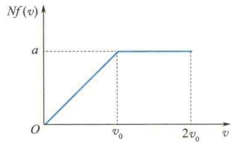

import Guide from '@/components/Guide.astro';
import Knowledge from '@/components/Knowledge.astro';
import Example from '@/components/Example.astro';
import Analysis from '@/components/Analysis.astro';
import Solution from '@/components/Solution.astro';
import Variant from '@/components/Variant.astro';
import Note from '@/components/Note.astro';
import Block from '@/components/Block.astro';
import Method from '@/components/Method.astro';
import Exercise from '@/components/Exercise.astro';

## 解答题

<Exercise title="习题 7.3.1">
气体在平衡态时有何特征？气体的平衡态与力学中的平衡态有何不同？
</Exercise>

<Exercise title="习题 7.3.2">
气体动理论的研究对象是什么？理想气体的宏观模型和微观模型各如何？
</Exercise>

<Exercise title="习题 7.3.3">
何谓微观量？何谓宏观量？它们之间有什么联系？
</Exercise>

<Exercise title="习题 7.3.4">
一组粒子的速率如题 7.3.4 表所示, 计算其平均速率和方均根速率.
题7.3.4表
<table><tr><td> $N_i$ </td><td>21</td><td>4</td><td>6</td><td>8</td><td>2</td></tr><tr><td> $v_i/(m·s^{-1})$ </td><td>10.0</td><td>20.0</td><td>30.0</td><td>40.0</td><td>50.0</td></tr></table>
</Exercise>

<Exercise title="习题 7.3.5">
速率分布函数 $f(v)$ 的物理意义是什么？试说明下列各量的物理意义（ $n$ 为分子数密度， $N$ 为系统总分子数）.
(1) $f(v)\mathrm{d}v$ ; (2) $nf(v)\mathrm{d}v$ ; (3) $Nf(v)\mathrm{d}v$ ;
(4) $\int_{0}^{v} f(v)\mathrm{d}v$ ; (5) $\int_{0}^{\infty} f(v)\mathrm{d}v$ ; (6) $\int_{v_1}^{v_2} Nf(v)\mathrm{d}v$ .
</Exercise>

<Exercise title="习题 7.3.6">
最概然速率的物理意义是什么？方均根速率、最概然速率和平均速率，它们各有何用处？
</Exercise>

<Exercise title="习题 7.3.7">
容器中盛有温度为 T 的理想气体,该气体分子的平均速度是多少?为什么?
</Exercise>

<Exercise title="习题 7.3.8">
在同一温度下,不同气体分子的平均平动动能相等,就氢分子和氧分子比较,氧分子的质量比氢分子大,所以氢分子的速率一定比氧分子大,对吗?
</Exercise>

<Exercise title="习题 7.3.9">
如果盛有气体的容器相对某坐标系运动,容器内的分子速度相对这坐标系也增大了,温度也因此而升高吗?
</Exercise>

<Exercise title="习题 7.3.10">
题 7.3.10 图(a) 所示是氢气和氧气在同一温度下的两条麦克斯韦速率分布曲线, 哪一条代表氢气? 题 7.3.10 图(b) 所示是某种气体在不同温度下的两条麦克斯韦速率分布曲线, 哪一条的温度较高?

  
题7.3.10图
</Exercise>

<Exercise title="习题 7.3.11">

</Exercise>

<Exercise title="习题 7.3.12">
温度概念的适用条件是什么？温度的微观本质是什么？下列系统各有多少个自由度？（1）在一平面上滑动的粒子；（2）可以在一平面上滑动并可围绕垂直于平面的轴转动的硬币；（3）一弯成三角形的金属棒在空间自由运动。试说明下列各量的物理意义。（1） $\frac{1}{2} kT$ ；（2） $\frac{3}{2} kT$ ；（3） $\frac{i}{2} kT$ ；（4） $\frac{M}{M_{\mathrm{mol}}}$ $\frac{i}{2} RT$ ；（5） $\frac{i}{2} RT$ ；（6） $\frac{3}{2} RT.$
</Exercise>

<Exercise title="习题 7.3.14">
有两种不同的理想气体, 同压、同温而体积不等, 则下述各量是否相同?
(1) 分子数密度; (2) 气体质量密度; (3) 单位体积内气体分子总平动动能; (4) 单位体积内气体分子的总动能.
</Exercise>

<Exercise title="习题 7.3.15">
何谓理想气体的内能? 为什么理想气体的内能是温度的单值函数?
</Exercise>

<Exercise title="习题 7.3.16">
如果氢和氦的物质的量和温度相同, 则下列各量是否相等? 为什么?
(1) 分子的平均平动动能; (2) 分子的平均动能; (3) 内能.
</Exercise>

<Exercise title="习题 7.3.17">
有一水银气压计, 当水银柱高为 0.76 m 时, 管顶离水银柱液面 0.12 m, 管的横截面积为 $2.0 \times 10^{-4} \, m^{2}$ , 当有少量氦(He)混入水银管内顶部时, 水银柱高度下降为 0.6 m, 此时温度为 $27^{\circ}C$ , 试计算在管顶的氦气的质量(He 的摩尔质量为 0.004 kg/mol).
</Exercise>

<Exercise title="习题 7.3.18">
设有 N 个粒子的系统, 其速率分布如题 7.3.18 图所示. 求:
(1) 分布函数 $f(v)$ 的表达式;
(2)a 与 $v_{0}$ 之间的关系;
(3) 速度在 $1.5v_{0} \sim 2.0v_{0}$ 之间的粒子数;
(4) 粒子的平均速率;
(5) $0.5v_{0}\sim v_{0}$ 范围内粒子的平均速率.
</Exercise>

<Exercise title="习题 7.3.19">
试计算理想气体分子热运动速率的大小介于 $v_{P}-v_{P}/100$ 与 $v_{P}+v_{P}/100$ 之间的分子数占总分子数的百分比.
  
题7.3.18图
</Exercise>

<Exercise title="习题 7.3.20">
容器中储有氧气,其压强为 $p = 0.1 \mathrm{MPa}$ , 温度为 $27^{\circ} \mathrm{C}$ . 求: (1) 单位体积中的分子数 $n$ ; (2) 氧分子的质量 $m$ ; (3) 气体密度 $\rho$ ; (4) 分子间的平均距离 $\bar{e}$ ; (5) 平均速率 $\bar{v}$ ; (6) 方均根速率 $\sqrt{v^{2}}$ ; (7) 分子的平均动能 $\bar{\varepsilon}$ .
</Exercise>

<Exercise title="习题 7.3.21">
· 1 mol 氢气，在温度为 $27^{\circ}$ C 时，它的平动动能、转动动能和内能各是多少？
</Exercise>

<Exercise title="习题 7.3.22">
有一瓶氧气、一瓶氢气，它们等压、等温，氧气体积是氢气的2倍，求：(1) 氧气和氢气分子数密度之比；(2) 氧分子和氢分子的平均速率之比.
</Exercise>

<Exercise title="习题 7.3.23">
一真空管的真空度约为 $1.38 \times 10^{-3} \mathrm{~Pa}$ (1.0×10 $^{-5}$ mmHg)，试求在 27 ℃ 时单位体积中的分子数及分子的平均自由程（设分子的有效直径 $d = 3 \times 10^{-10} \mathrm{~m}$ ）。
</Exercise>

<Exercise title="习题 7.3.24">
(1) 求氮气在标准状态下的平均碰撞频率；(2) 若温度不变，气压降到 $1.33 \times 10^{-4} \mathrm{~Pa}$ ，平均碰撞频率又为多少（设分子的有效直径为 $10^{-10} \mathrm{~m}$ ）？
</Exercise>

<Exercise title="习题 7.3.25">
1 mol 氧气从初态出发,经过等容升压过程,压强增大为原来的 2 倍,然后又经过等温膨胀过程,体积增大为原来的 2 倍,求末态与初态之间:(1)气体分子方均根速率之比;(2)分子平均自由程之比.
</Exercise>

<Exercise title="习题 7.3.26">
飞机起飞前机舱中的压力计指示为1.0 atm( $1.013 \times 10^{5}$ Pa)，温度为27℃；起飞后压力计指示为0.8 atm( $0.8104 \times 10^{5}$ Pa)，温度仍为27℃，试计算飞机距地面的高度。
</Exercise>

<Exercise title="习题 7.3.27">
什么高度处的大气压强为地面的 $75\%$ (设空气的温度为 $0^{\circ}\mathrm{C}$ )?
</Exercise>

<Exercise title="习题 7.3.28">
在标准状态下，氦气的黏度 $\eta = 1.89 \times 10^{-5} \, Pa \cdot s$ ，摩尔质量 $M_{mol} = 0.004 \, kg/mol$ ，分子平均速率 $\bar{v} = 1.20 \times 10^{3} \, m/s$ 。试求在标准状态下氦分子的平均自由程。
</Exercise>

<Exercise title="习题 7.3.29">
在标准状态下,氦气的热导率 $\kappa = 5.79 \times 10^{-2} \mathrm{~W/(m \cdot K)}$ , 分子平均自由程 $\bar{\lambda} = 2.60 \times 10^{-7} \mathrm{~m}$ , 试求氦分子的平均速率.
</Exercise>

<Exercise title="习题 7.3.30">
实验测得在标准状态下,氧气的扩散系数 $D = 1.9 \times 10^{-5} \, m^{2}/s$ , 试根据此数据计算分子的平均自由程和分子的有效直径.
  
</Exercise>
