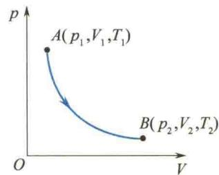

import Guide from '@/components/Guide.astro';
import Knowledge from '@/components/Knowledge.astro';
import Example from '@/components/Example.astro';
import Analysis from '@/components/Analysis.astro';
import Solution from '@/components/Solution.astro';
import Variant from '@/components/Variant.astro';
import Note from '@/components/Note.astro';
import Block from '@/components/Block.astro';
import Method from '@/components/Method.astro';
import Exercise from '@/components/Exercise.astro';

## 第7章 气体动理论基础

热学是一门研究物质的各种热现象的性质和变化规律的学科。与温度有关的现象称为热现象，从微观上看，热现象就是宏观物体内部大量分子或原子等微观粒子的永不停息的、无规则热运动的平均效果。

18世纪到19世纪，蒸汽机的广泛应用，有力地推动了热现象及其规律的研究。迈耶、焦耳、亥姆霍兹等人建立了与热现象有关的能量守恒定律，即热力学第一定律，接着开尔文、克劳修斯等人建立了描述能量传递方向的热力学第二定律。这种以观察和实验为基础，运用归纳和分析方法总结出热现象的宏观理论称为热力学。另一种研究热现象规律的方法是从物质的微观结构和分子运动论出发，以每个微观粒子遵循的力学规律为基础，运用统计方法，导出热运动的宏观规律，再由实验确认。用这种方法所建立的理论系统称为统计物理学（或称为气体动理论）。19世纪，克劳修斯、麦克斯韦、玻尔兹曼、吉布斯等人在经典力学基础上建立起经典统计物理。20世纪初，由于量子力学的建立，狄拉克、爱因斯坦、费米、玻色等人又创立了量子统计物理。热学包括气体动理论和热力学两部分。热力学的结论来自实验，可靠性好，但对问题的本质缺乏深入了解。气体动理论的分析对热现象的本质给出了解释，但是只有当它与热力学结论一致时，气体动理论才能得到确认，因此，两者相辅相成，缺一不可。

经验告诉我们,自然界中宏观物体的各种性质,大多随着它的冷热状态的变化而变化,物体的冷热状态通常用“温度”这个量来表述.例如,物体的体积会因温度的变化而变化.很硬的钢件烧红后会变软,若经过突然冷却(淬火)又会变得更坚硬.一般金属导体,随着温度的升高其电阻会增大,而另一些金属或化合物在低温下其电阻会突然消失,变成超导体.室温下的半导体,在高温下会变成导体,而当它冷却到很低温度时,又会变成绝缘体.有很强剩磁的铁磁质,当加热到其居里温度以上时,又会变成没有剩磁的顺磁质.宏观物体在各种温度下都存在热辐射,温度越高,对应于辐射强度极大值的光波波长越短,因而辐射光的颜色随温度的升高由红向黄、蓝、紫端变化.化学反应的速度、生物的繁殖生长等都与温度有关.总之,与物体冷热状态相关联的热现象在自然界中是一种普遍存在的现象.所以学习和掌握热学规律对于从事生产和发展现代科技都是非常重要和不可缺少的内容.

  

本章提要

气体动理论是统计物理学中最简单、最基本的内容。本章介绍热学中的系统、平衡态、温度等概念，从物质的微观结构出发，阐明平衡状态下的宏观参量压强和温度的微观本质，并导出理想气体的内能公式，最后讨论理想气体分子在平衡态下的几个统计规律。

## 7.1.1 平衡态

热学的研究对象是大量微观粒子(分子、原子等)组成的宏观物体,通常称研究对象为热力学系统,简称系统.在研究一个系统的热现象规律时,不仅要注意系统内部的各种因素,同时也要注意外部环境对系统的影响.研究对象以外的物体称为系统的外界(或环境).一般情况下,系统与外界之间既有能量交换(如做功、传递热量),又有物质交换(如蒸发、凝结、扩散、泄漏).根据系统与外界交换能量的特点,通常把系统分为三种.

第一种是不受外界影响的系统,称为孤立系统.孤立系统是与外界既无能量交换,又无物质交换的理想系统.第二种是封闭系统,是与外界只有能量交换,而无物质交换的系统.第三种是开放系统,是与外界既有能量交换,又有物质交换的系统.

按所处的状态不同,系统可以分为平衡态系统和非平衡态系统.一个不受外界影响的系统,不论其初始状态如何,经过足够长的时间后,必将达到一个宏观性质不再随时间变化的稳定状态,这样的一个状态称为热力学平衡态,简称平衡态.

在此必须注意,平衡态的条件是“一个不受外界影响的系统”.若系统受到外界的影响,如把一根金属棒的一端置入沸水中,另一端放入冰水中,在这样的两个恒定热源之间,经过较长时间后,金属棒会达到一个稳定的状态,称为定态,但不是平衡态,因为在外界影响下,不断地有热量从金属棒高温热源端传递到低温热源端.因此,系统处于平衡态时,必须同时满足两个条件:一是系统与外界在宏观上无能量和物质的交换;二是系统的宏观性质不随时间变化.换言之,系统处于平衡态时,系统内部任一体元均处于力学平衡、热平衡(温度处处相同)、相平衡(无物态变化)和化学平衡(无单方向化学反应)之中.孤立系统的定态就是平衡态.

需要指出:①平衡态仅指系统的宏观性质不随时间变化,从微观的角度来看,在平衡态下,组成系统的大量粒子仍在不停地、无规则地运动着,只是大量粒子运动的平均效果不变,这在宏观上表现为系统达到平衡,因此,这种平衡态又称为热动平衡态.②平衡态是一种理想状态.实际中并不存在孤立系统,但当系统所受外界的影响可以略去,宏观性质只有微小变化时,系统的状态就可以近似地看作平衡态.

反之，系统不满足两个平衡条件的任一条件的状态，都叫作非平衡态。若存在未被平衡的力，则会出现物质流动；若存在冷热不一致（温差），则会出现热量流动；如果存在未被平衡的相（物态），则会出现相变（物态变化）；若存在单方向化学反应，则会出现成分的变化（新物质增加，旧物质减少），即系统中存在任何一种流或变化时（宏观过程），系统的状态都不是平衡态。

如何描述一个系统的平衡态呢？系统在平衡态下，拥有各种不同的宏观属性，如几何的体积，力学的压强，热学的温度，电磁的磁感应强度、电场强度，化学的摩尔质量、物质的量等。热力学用一些可以直接测量的量来描述系统的宏观属性，这样用来表征系统宏观属性的物理量称为宏观量. 实验表明, 这些宏观量在平衡态下, 各有确定的值, 且不随时间变化. 从诸多宏观量中选出一组相互独立的量来描述系统的平衡态, 这些宏观量称为系统的状态参量. 对于给定的气体、液体和固体, 常用体积 (V)、压强 (p) 和温度 (T) 等作为状态参量.

统计物理学是从物质的微观结构和微观运动的角度来研究物质的宏观属性的，而每一个运动着的微观粒子（原子、分子等）都有大小、质量、速度、能量等属性。这些用来描述单个微观粒子运动状态的物理量称为微观量。微观量一般只能间接测量。微观量与宏观量有一定的内在联系，气体动理论的任务之一就是要揭示气体宏观量的微观本质，即建立宏观量与微观量统计平均值之间的关系。

在国际单位制中,压强的单位名称是帕斯卡,简称帕,符号是 Pa,它与 atm(标准大气压)及 mmHg(毫米汞柱)的关系为

$$

1 \mathrm{atm} = 7 6 0 \mathrm{mmHg} = 1. 0 1 3 \times 1 0 ^ {5} \mathrm{Pa}

$$

体积的单位名称为立方米,符号是 $m^{3}$ , 它与 L(升) 的关系为

$$

1 \mathrm{m} ^ {3} = 1 0 ^ {3} \mathrm{L}

$$

## 7.1.2 热力学第零定律 温度

温度表征物体的冷热程度. 冷热是人们对自然界的一种体验, 是对物质世界的直接感觉. 但是单凭人的感觉, 认为热的系统温度高, 冷的系统温度低, 不但不能定量表示出系统的温度, 有时甚至会得出错误的结论. 因此, 要定量表示出系统的温度, 必须给温度一个严格而科学的定义.

温度概念的建立是以热力学第零定律为基础的. 设有不受外界影响的 A、B 两个系统, 各自处在一定的平衡态. 使 A、B 两系统相互接触, 让两系统之间发生热传递, 一般地, 两系统的状态都会发生变化. 经过一段时间后, 两个相互接触系统的冷热程度变得一致, 状态也不再随时间发生变化, 这时两系统就处在一个新的共同的平衡态, 则称两系统彼此处于热平衡. 再考虑由 A、B、C 表示的三个系统, A、B 两系统分别与 C 系统接触, A 与 C 处于热平衡, B 与 C 也处于热平衡, 然后将 A、B 两系统与 C 系统隔开, 让 A 和 B 热接触, 实验表明, A、B 两系统的平衡态不会发生变化, 彼此也处于热平衡.

实验结果表明:如果两个系统分别与第三个系统的同一平衡态达到热平衡,那么这两个系统彼此也处于热平衡.这个结论称为热力学第零定律.

热力学第零定律说明,处于热平衡的系统必定拥有某一个共同的宏观物理性质.若两个系统的这一共同性质相同,当两系统热接触时,系统之间不会有热传导,彼此处于热平衡;若两系统的这一共同性质不相同,两系统热接触时就会有热传递,彼此的热平衡将会发生变化.决定系统热平衡的这一共同的宏观性质称为系统的温度.也就是说,温度是决定一系统是否与其他系统处于热平衡的宏观性质.A、B两系统热接触时,若彼此处于热平衡,则说两系统温度相同;若发生A到B的热传导,则说A的温度比B的温度高.一切互为热平衡的系统具有相同的温度.

实验表明,当几个系统作为一个整体处于热平衡时,若将它们分开,在没有其他影响的情况下,各个系统的热平衡不会发生变化.这说明各个系统在热平衡状态时的温度仅取决于系统本身内部热运动状态.以后将看到,温度反映的是系统大量分

子无规则运动的剧烈程度.

  

奇妙的低温

世界

热力学第零定律不仅给出了温度的概念,也指出了比较和测量温度的方法.由于一切处于热平衡的系统具有相同的温度,因此,可以选定一种合适的物质(测温物质)来作为系统,通过这个系统的与温度有关的特性来测量其他系统的温度.这个合适的系统就成了一个温度计.实验表明,物质的许多性质都随温度的改变而发生变化,一般选定测温物质的某种随温度变化,且单调、显著变化的性质作为测温特性来表示温度.如定压下气体的体积、金属丝的电阻等随温度变化的特性.温度计要能定量表示和测量温度,还需要选定温度的标准点,并把一定间隔的冷热程度分为若干度,这样就可读取温度的数值标度,即温标.

  

低温技术的发展

常用的摄氏温标是摄尔修斯(A. Celsius)建立的,用液体(酒精或水银)作测温物质,用液柱高度随温度变化作测温特性.规定纯水的冰点为0℃,汽点为100℃,并认定液柱高度(体积)随温度发生线性变化.在0\~100℃之间等分温度,每份表示1℃.另一种温标是开尔文在热力学第二定律的基础上建立的,这种温标称为热力学温标.用T表示热力学温度,单位为开(K),是国际单位制中7个基本单位之一.并规定水的三相点(水、冰和水蒸气平衡共存的状态)为273.16 K.热力学温度与摄氏温度在数值上(不考虑单位)的关系为

$$

T = t + 2 7 3. 1 5

$$

即规定热力学温标的 273.15 K 对应摄氏温标的 0 ℃.

## 7.1.3 理想气体状态方程

  

肥皂泡为什么总是先上升后下降？

实验表明,当系统处于平衡态时,描述该状态的各个状态参量之间存在一定的函数关系.平衡态下,各个状态参量之间的关系式叫作系统的状态方程.状态方程的具体形式是由实验来确定的,在压强不太大(与大气压相比)、温度不太低(与室温相比)的条件下,各种气体都遵循三大实验定律:玻意耳(Boyle)定律、查理(Charles)定律、盖-吕萨克(Gay-Lussac)定律.在任何情况下都能严格遵循上述三个实验定律的气体称为理想气体.

由气体的三个实验定律得到一定质量的理想气体的状态方程为

$$

p V = \frac {M}{M _ {\mathrm{mol}}} R T\tag{7.1}

$$

式中，p、V、T 为理想气体在某一平衡态下的三个状态参量； $M_{mol}$ 为气体的摩尔质量；M 为气体的质量；R 为普适气体常量，国际单位制中 $R = 8.31 \, \text{J/(mol} \cdot \text{K)}$ ；p 为气体压强；T 为气体温度的热力学温标；V 为气体分子的活动空间。在常温常压下，实际气

度越高,这种近似的准确度就越高.

平衡态除了由一组状态参量来描述,还常用状态图中的一个点来表示.例如,对给定的理想气体,其一个平衡态可由 p-V 图中对应的一个点来代表(或 p-T 图、V-T 图中的一个点),不同的平衡态对应于不同的点.一条连续曲线代表一个由平衡态组成的变化过程,曲线上的箭头表示过程进行的方向,不同曲线代表不同过程,如图 7.1 所示.

  

图7.1 平衡态示意图
