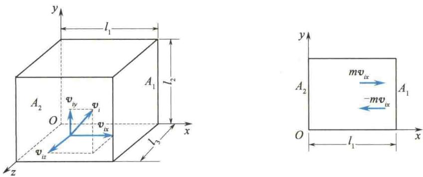

import Guide from '@/components/Guide.astro';
import Knowledge from '@/components/Knowledge.astro';
import Example from '@/components/Example.astro';
import Analysis from '@/components/Analysis.astro';
import Solution from '@/components/Solution.astro';
import Variant from '@/components/Variant.astro';
import Note from '@/components/Note.astro';
import Block from '@/components/Block.astro';
import Method from '@/components/Method.astro';
import Exercise from '@/components/Exercise.astro';

热力学系统是由大量分子、原子等做无规则运动的微观粒子组成的,若要从微观上来讨论理想气体,了解其宏观状态参量(如温度、压强等)与微观粒子的运动之间的关系,首先应明确平衡态下理想气体分子的微观模型和性质.

## 7.2.1 理想气体分子模型和统计假设

从分子运动和分子相互作用来看,理想气体的分子模型可从下面几点来理解.
(1) 分子可以看作质点.
在标准状态下,气体分子间的平均距离约为分子有效直径的50倍.气体越稀薄,分子间距比其有效直径越大.所以,一般情况下,气体分子可视为质点.
(2) 除碰撞外, 分子力可以略去不计.
由于气体分子间距很大,除碰撞瞬间有力的作用外,分子间的相互作用力可以忽略.因此,在两次碰撞之间,分子做匀速直线运动,即自由运动.
(3) 分子间的碰撞是完全弹性的.
由于处于平衡态下,气体的宏观性质不变,这表明系统的能量不因碰撞而损失.因此,分子间及分子与器壁之间的碰撞是完全弹性碰撞.
综上所述,理想气体的分子模型是弹性的、自由运动的质点.
在含有大量分子的理想气体中,由于频繁的碰撞,一个分子的运动状态是极为复杂和难以预测的,而大量分子的整体却呈现确定的规律性,这是统计平均的效果.平衡态时,理想气体分子的统计假设如下.
(1) 在无外场作用时, 气体分子在各处出现的概率相同.
平均而言, 分子的数密度 n 处处相同, 沿各个方向运动的分子数相同.
(2) 分子可以有各种不同的速度, 速度取向在各方向上是等概率的.
在平衡态下,气体的性质与方向无关,每个分子速度按方向的分布是完全相同的,各个方向上速率的各种平均值相等,如
$$
\overline {{{v _ {x}}}} = \overline {{{v _ {y}}}} = \overline {{{v _ {z}}}}, \quad \overline {{{v _ {x} ^ {2}}}} = \overline {{{v _ {y} ^ {2}}}} = \overline {{{v _ {z} ^ {2}}}} = \frac {1}{3} \overline {{{v ^ {2}}}}
$$

## 7.2.2 理想气体的压强公式

从微观上看,单个分子对器壁的碰撞是间断的、随机的;而大量分子对器壁的碰撞是连续的、恒定的,也就是说,气体对器壁的压强应该是大量分子对容器不断碰撞的统计平均结果.因此,推导压强公式的基本思路是:先按力学规律计算任一个分子i碰撞一次施于器壁的冲量 $\left(\Delta p_{i}\right)$ ,再计算在单位时间内该分子对器壁的作用 $\left(\overline{F_{i}}=\frac{\Delta p_{i}}{\Delta t_{i}}\right)$ ,然后将所有分子在单位时间内对器壁的作用进行统计平均 $\left(\overline{F}=\sum_{i}^{N}\overline{F_{i}}\right)$ ,得出理想
气体压强公式 $\left(p=\frac{\bar{F}}{S}\right)$ 的统计表述.
假设有一边长分别为 $l_{1}, l_{2}$ 和 $l_{3}$ 的长方形容器，储有 $N$ 个质量为 $m$ 的同类气体分子。如图7.2所示，在平衡态下器壁各处压强相同，任选器壁的一个面，如选择与 $x$ 轴垂直的 $A_{1}$ 面，计算其所受压强。
<figure class="vp-figure">
  
  <figcaption>图 7.2 气体压强公式的推导图</figcaption>
</figure>
在大量分子中,任选一个分子 i,设其速度为
$$
\boldsymbol {v} _ {i} = v _ {i x} \boldsymbol {i} + v _ {i y} \boldsymbol {j} + v _ {i z} \boldsymbol {k}
$$
当分子 i 与 $A_{1}$ 面碰撞时，由于碰撞是完全弹性的，故该分子在 x 方向上的速度分量由 $v_{ix}$ 变为 $-v_{ix}$ ，所以在碰撞过程中该分子的 x 方向的动量增量为
$$
\Delta p _ {i x} = (- m v _ {i x}) - (m v _ {i x}) = - 2 m v _ {i x}
$$
由动量定理知,它等于器壁施于该分子的冲量,又由牛顿第三定律知,分子 i 在每次碰撞时对器壁的冲量为 $2mv_{ix}$ .
分子 $i$ 与 $A_{1}$ 面碰撞后弹回做匀速直线运动，并与其他分子相碰。由于两个质量相等的弹性质点完全弹性碰撞时交换速度，故可等价于分子 $i$ 直接飞向 $A_{2}$ 面，与 $A_{2}$ 面碰撞后又回到 $A_{1}$ 面再做碰撞。分子 $i$ 在相继两次与 $A_{1}$ 面碰撞的过程中，在 $x$ 轴上移动的距离为 $2l_{1}$ ，因此，分子 $i$ 相继两次与 $A_{1}$ 面碰撞的时间间隔为 $\Delta t = 2l_{1} / v_{ix}$ 。那么，单位时间内分子 $i$ 对 $A_{1}$ 面的碰撞次数 $Z = 1 / \Delta t = v_{ix} / 2l_{1}$ 。所以，在单位时间内分子 $i$ 对 $A_{1}$ 面的冲量等于 $2mv_{ix} \frac{v_{ix}}{2l_{1}}$ 。根据冲量的定义，该冲量就是分子 $i$ 对 $A_{1}$ 面的平均冲力 $(\overline{F}_{ix})$ ，即
$$
\overline {{{F}}} _ {i x} = 2 m v _ {i x} \frac {v _ {i x}}{2 l _ {1}}
$$
所有分子对 $A_{1}$ 面的平均作用力为上式对所有分子求和，即
$$
\overline {{{F}}} _ {x} = \sum_ {i = 1} ^ {N} \overline {{{F}}} _ {i x} = \frac {m}{l _ {1}} \sum_ {i = 1} ^ {N} v _ {i x} ^ {2}
$$
由压强定义有
$$
p = \frac {\overline {{F}} _ {x}}{l _ {2} l _ {3}} = \frac {m}{l _ {1} l _ {2} l _ {3}} \sum_ {i = 1} ^ {N} v _ {i x} ^ {2} = \frac {m N}{l _ {1} l _ {2} l _ {3} N} \sum_ {i = 1} ^ {N} v _ {i x} ^ {2}
$$
分子数密度(单位体积的分子数) $n=\frac{N}{l_{1}l_{2}l_{3}}$ ,x轴方向上速度平方的平均值 $\overline{v_{x}^{2}}=\frac{1}{N}\sum_{i=1}^{N}v_{ix}^{2}$ ，故
$$
p = n m \overline {{v _ {x} ^ {2}}}
$$
又平衡态下有
$$
\overline {{{v _ {x} ^ {2}}}} = \overline {{{v _ {y} ^ {2}}}} = \overline {{{v _ {z} ^ {2}}}}
$$
及
$$
\overline {{v ^ {2}}} = \overline {{v _ {x} ^ {2}}} + \overline {{v _ {y} ^ {2}}} + \overline {{v _ {z} ^ {2}}}
$$
所以有
$$
\overline {{{{v _ {x} ^ {2}}}}} = \frac {1}{3} \overline {{{{v ^ {2}}}}}
$$
$$
p = \frac {1}{3} n m \overline {{v ^ {2}}} = \frac {2}{3} n \left(\frac {1}{2} m \overline {{v ^ {2}}}\right)
$$
令 $\overline{w} = \frac{1}{2} m\overline{v^2}$ ， $\overline{w}$ 表示分子的平动动能的平均值，简称分子的平均平动动能，则
$$
p = \frac {2}{3} n \overline {{{w}}}\tag{7.2}
$$
式(7.2)称为理想气体的压强公式,它表明气体作用于器壁的压强正比于分子数密度 n 和分子的平均平动动能 $\overline{w}$ . 分子数密度越大,压强越大; 分子的平均平动动能越大,压强也越大.
压强公式建立了宏观量 $p$ 与微观量的统计平均值 $\overline{w}$ 和 $n$ 之间的相互关系，表明了压强是个统计量。由于单个分子对器壁的碰撞是不连续的，产生的压力起伏不定，故只有在气体分子数足够大时，器壁所受到的压力才有确定的统计平均值。因此，论及个别或少量分子的压强是无意义的。

