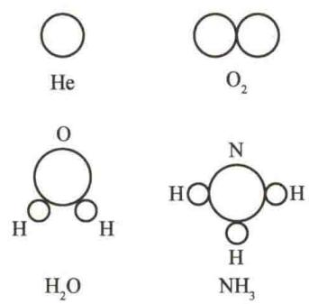
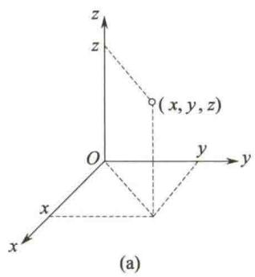
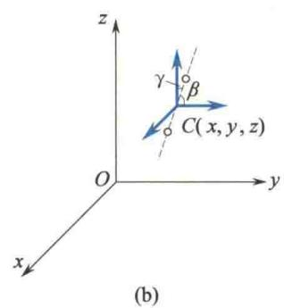
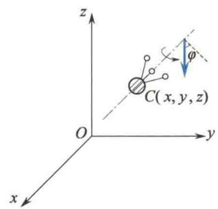

import QRCodeVideo from '@/components/QRCodeVideo.astro';

import Guide from '@/components/Guide.astro';
import Knowledge from '@/components/Knowledge.astro';
import Example from '@/components/Example.astro';
import Analysis from '@/components/Analysis.astro';
import Solution from '@/components/Solution.astro';
import Variant from '@/components/Variant.astro';
import Note from '@/components/Note.astro';
import Block from '@/components/Block.astro';
import Method from '@/components/Method.astro';
import Exercise from '@/components/Exercise.astro';

前面讨论分子热运动时,把分子视为质点,只考虑了分子的平动.然而,气体的能量是与分子结构有关的,除了单原子分子可看作质点(只有平动)外,一般由两个及两个以上的原子组成的分子,不仅有平动,而且还有转动和分子内原子间的振动.为了确定分子的各种运动形式的能量的统计规律,需要引用力学中有关自由度的概念.

## 7.4.1 自由度

决定一个物体的空间位置所需要的独立坐标数,称为物体的自由度.
气体分子按其结构可分为单原子分子(如 He、Ne 等)、双原子分子(如 $H_{2}$ 、 $O_{2}$ 等)和多原子分子(如 $H_{2}O$ 、 $NH_{3}$ 等)，其结构如图 7.3 所示。当分子内原子间的距离保持不变(不振动)时，这种分子称为刚性分子，否则称为非刚性分子，以下只讨论刚性分
子的自由度.
如图 7.4(a) 所示, 单原子分子可视为质点, 因此, 在空间中一个自由的单原子分子, 只有 3 个平动自由度. 若这类分子被限制在平面或曲面上运动, 则自由度降为 2; 若这类分子被限制在直线或曲线上运动, 则自由度降为 1.
刚性双原子分子可用两个质点通过一个刚性键联结的模型(哑铃型)来表示,其质心在空间的位置要由3个坐标 $(x,y,z)$ 来表示,故有3个平动自由度.另外,还要两个方位角 $\beta,\gamma$ 来决定其键联
  
图 7.3 气体分子模型
（联结两原子的轴）的方位（3个方位角 $\alpha, \beta, \gamma$ ，因有 $\cos^2\alpha + \cos^2\beta + \cos^2\gamma = 1$ ，故只有两个是独立的）。由于两个原子均视为质点，故绕轴的转动不存在，如图7.4(b)所示。因此，刚性双原子分子有3个平动自由度和2个转动自由度，共有5个自由度。
多原子分子除了具有像双原子分子的3个平动自由度和2个转动自由度外，还有一个绕轴自转的自由度，常用转角 $\varphi$ （相对于所选参考方位）表示，如图7.4(c)所示.因此，刚性多原子分子有3个平动自由度和3个转动自由度，共有6个自由度.设用 $i$ 表示刚性分子的自由度， $t$ 表示平动自由度， $r$ 表示转动自由度，则

$$
i = t + r
$$

  
图7.4 刚性分子的自由度
在常温下,大多数气体分子属于刚性分子.在高温下,气体分子原子间会发生振动,则应视为非刚性分子,此时还需增加振动自由度,这里从略.

## 7.4.2 能量均分定理

理想气体无规则平动动能,按自由度分配的统计平均值有什么规律?
前面提到,在平衡态下,理想气体分子的平均平动动能为
$$
\frac {1}{2} m \overline {{{{v ^ {2}}}}} = \frac {3}{2} k T
$$
因为
$$
\overline {{{{v ^ {2}}}}} = \overline {{{{v _ {x} ^ {2}}}}} + \overline {{{{v _ {y} ^ {2}}}}} + \overline {{{{v _ {z} ^ {2}}}}}
$$
及
$$
\overline {{{v _ {x} ^ {2}}}} = \overline {{{v _ {y} ^ {2}}}} = \overline {{{v _ {z} ^ {2}}}} = \frac {1}{3} \overline {{{v ^ {2}}}}
$$
代入后可得
$$
\frac {1}{2} m \overline {{v _ {x} ^ {2}}} = \frac {1}{2} m \overline {{v _ {y} ^ {2}}} = \frac {1}{2} m \overline {{v _ {z} ^ {2}}} = \frac {1}{3} \left(\frac {1}{2} m \overline {{v ^ {2}}}\right) = \frac {1}{3} \left(\frac {3}{2} k T\right) = \frac {1}{2} k T
$$
对于 3 个平动自由度而言, 在平衡态下, 分子的每一个平动自由度具有相同的平均动能, 且大小均等于 $\frac{1}{2}kT$ .
在平衡态下,气体分子做无规则热运动,任何一种运动形式都应是机会均等的,即没有哪一种运动形式比其他运动形式占优势.因此,可以把平动动能的统计规律推广到其他运动形式,即一般来说,不论平动、转动或振动运动形式,在平衡态下,相应于每一个平动自由度、转动自由度或振动自由度,其平均动能都应等于 $\frac{1}{2}kT$ .简言之,当气体处于平衡态时,分子的任何一个自由度的平均动能都相等,均为 $\frac{1}{2}kT$ ,这就是能量按自由度均分定理,简称能量均分定理.按照这个定理,如果气体分子有i个自由度,则分子的平均动能为
<QRCodeVideo title="能量均分定理" url="https://api.guangyiedu.com/v3/resource/resource/r/NewQrCode-9cCDCTH1iQRAyHt0tnh5" />  
$$
\overline {{{{\varepsilon_ {\mathrm{k}}}}}} = \frac {i}{2} k T\tag{7.6}
$$
式(7.6)为对大量分子的统计平均结果. 对个别分子而言, 它的动能随时间而变, 并不等于 $\frac{i}{2}kT$ , 而且它的各种形式的动能也不按自由度均分. 但对大量分子整体而言, 由于分子的无规则热运动及频繁的碰撞, 能量可以从一个分子转到另一个分子, 从一种自由度的能量转化成另一种自由度的能量. 这样, 在平衡态时, 就形成能量按自由度均匀分配的统计规律.

## 7.4.3 理想气体的内能

组成物体的分子或原子除了具有热运动动能外,还应有分子与分子间及分子内原子与原子间相互作用产生的势能,两部分的和称为分子势能.通常把物体中所有分子的热运动动能与分子势能的总和,称为物体的内能.
对于理想气体, 分子势能可忽略不计, 因此, 理想气体的内能仅是其所有分子热运动动能的总和.
由式(7.6)知,每一个分子的平均动能为 $\frac{i}{2}kT$ ,则1 mol理想气体的内能为
$$
E _ {0} = N _ {\mathrm{A}} \left(\frac {i}{2} k T\right) = \frac {i}{2} R T\tag{7.7}
$$
因此，质量为 M 的理想气体的内能为
$$
E = \frac {M}{M _ {\mathrm{mol}}} E _ {0} = \frac {M}{M _ {\mathrm{mol}}} \frac {i}{2} R T\tag{7.8}
$$
式中， $M_{mol}$ 为气体的摩尔质量。由式(7.8)可知，对给定气体而言，其内能仅与温度有关，而与体积、压强无关，且是温度的单值函数。当温度改变 $\Delta T$ 时，相应内能的改变量为
$$
\Delta E = \frac {M}{M _ {\mathrm{mol}}} \frac {i}{2} R \Delta T\tag{7.9}
$$
式(7.9)表明,一定量的某种理想气体在状态变化过程中,内能的改变只取决于初态和末态的温度,而与具体过程无关.
