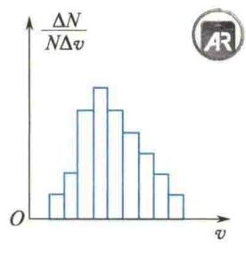
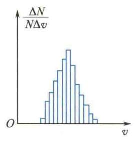
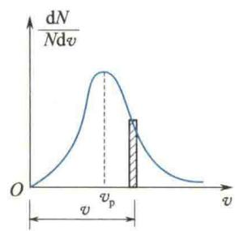
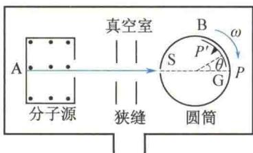
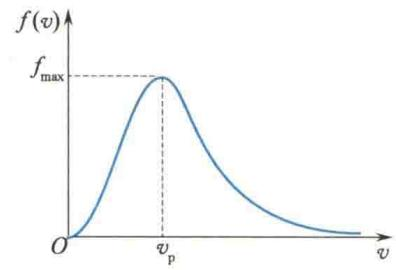
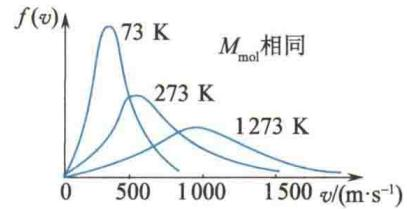
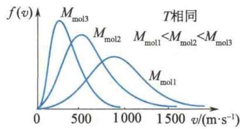
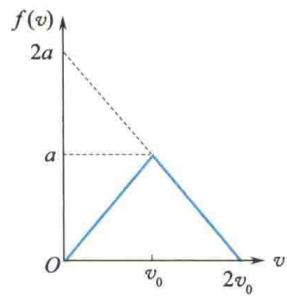

import QRCodeVideo from '@/components/QRCodeVideo.astro';

import Guide from '@/components/Guide.astro';
import Knowledge from '@/components/Knowledge.astro';
import Example from '@/components/Example.astro';
import Analysis from '@/components/Analysis.astro';
import Solution from '@/components/Solution.astro';
import Variant from '@/components/Variant.astro';
import Note from '@/components/Note.astro';
import Block from '@/components/Block.astro';
import Method from '@/components/Method.astro';
import Exercise from '@/components/Exercise.astro';

对某一分子,其任一时刻的速度具有偶然性,但大量分子从整体上会表现出一些统计规律.1859年,麦克斯韦用概率论证明了在平衡态下,理想气体分子速度分布是有规律的,这个规律称为麦克斯韦速度分布律.若不考虑分子速度的方向,则称为麦克斯韦速率分布律.
<QRCodeVideo title="麦克斯韦速率分布律" url="https://api.guangyiedu.com/v3/resource/resource/r/NewQrCode-KLaOeMo5JdvvYb30YW0o" />  

## 7.5.1 气体分子的速率分布 分布函数

当气体处于平衡态时,容器中的大量分子各以不同的速率沿各个方向运动着,有的分子速率较大,有的较小.由于分子间不断相互碰撞,对个别分子来说,速度的大小和方向因碰撞而不断改变,这种改变完全带有偶然性和不可预言性,然而从大量分子的整体来看,在平衡态下,分子的速率却都遵循着一个完全确定的且是必然的统计分布规律.研究这个规律,对于进一步理解分子运动的性质是很重要的,其中有关的概念和方法,在科学技术中经常遇到,具有普遍意义,这里只作初步介绍.
研究气体分子速率的分布情况,与研究一般的分布问题相似,需要把速率分成若干相等的区间.例如,0\~100 m/s 为一个区间,100\~200 m/s 为次一区间,200\~300 m/s 为又一区间等.所谓研究分子速率的分布情况,就是要知道,气体在平衡态下,分布在各个速率区间 $\Delta v$ 之内的分子数 $\Delta N$ ,各占气体分子总数 N 的百分比为多少(分子速率位于该速率区间的概率为多少),以及大部分分子分布在哪一个区间之内等问题.为了便于比较,特把各速率区间取为相等,从而突出分布的意义,所取区间越小,有关分布的信息就越详细,对分布情况的描述也越精确.
  
麦克斯韦
描写速率分布的方法有 3 种: ① 根据实验数据列表 —— 分布表; ② 作出曲线 —— 分布曲线; ③ 找出函数关系 —— 分布函数.
例如，表7.1所列数据为实验测定值，它表示在 $0^{\circ}\mathrm{C}$ 时氧气分子速率的分布情况，从表中可以看出低速或高速运动的分子数较少（如速率在 $100\mathrm{m / s}$ 以下的分子数只占总数的 $1.4\%$ ，速率在 $800~\mathrm{m / s}$ 以上的分子数只占总数的 $2.9\%$ )，分子速率在 $300\sim 400\mathrm{m / s}$ 范围内的分子数最多，占总数的 $21.4\%$ ，分布在其两侧速率区间的分子数都依次递减.在大量分子的热运动中，像上述这样低速或高速运动的分子较少，而多数分子以中等速率运动的现象，对于任何温度下的任意一种气体来说，大体上都是如此.这就是气体分子速率分布的规律.
表 7.1 在 ${0}^{ \circ  }\mathrm{C}$ 时氧气分子速率的分布情况
<table><tr><td>速率区间/(m/s)</td><td>分子数的百分率/%</td></tr><tr><td>100以下</td><td>1.4</td></tr><tr><td>[100,200)</td><td>8.1</td></tr><tr><td>[200,300)</td><td>16.5</td></tr><tr><td>[300,400)</td><td>21.4</td></tr><tr><td>[400,500)</td><td>20.6</td></tr><tr><td>[500,600)</td><td>15.1</td></tr><tr><td>[600,700)</td><td>9.2</td></tr><tr><td>[700,800)</td><td>4.8</td></tr><tr><td>[800,900)</td><td>2.0</td></tr><tr><td>900 及以上</td><td>0.9</td></tr></table>
又如，若以速率 $v$ 为横坐标，以 $\frac{\Delta N}{N\Delta v}$ （单位速率区间分子的比率）为纵坐标，则表7.1给出的速率分布，可以表示成图7.5(a)所示的图形.为了把速率分布的真实情况更细致地反映出来，应把速率区间取得更小，如图7.5(b)所示.
若要将气体分子按速率分布准确描述,则需把速率区间尽可能取小,当 $\Delta v\rightarrow0$ 时,即取dv为分子速率区间,其相应分子数为dN,这时纵坐标为 $\frac{dN}{Ndv}$ ,v为横坐标,所得 $\frac{dN}{Ndv}-v$ 曲线为一条平滑的曲线,如图7.5(c)所示.速率分布曲线下面有斜线的小长条的面积为 $\frac{dN}{Ndv}dv=\frac{dN}{N}$ ,它的物理意义是:该面积代表速率在v附近dv区间(速率在v到 $v+dv$ 之间)内的分子数占总分子数的比率(百分比).因此,速率分布曲线下的总面积就表示分布在从零到无穷大整个速率区间内的全部百分比之和,此和等于100%,即等于1.这是分布曲线所必须满足的条件,此条件称为分布曲线的归一化条件.
  
(a)
  
(b)
  
(c)  
图 7.5 气体分子速率分布曲线
速率 v 附近 $\Delta v$ 区间内分子数占总分子数的比率的极限
$$
f (v) = \lim _ {\Delta v \rightarrow 0} \frac {\Delta N}{N \Delta v} = \frac {\mathrm{d} N}{N \mathrm{d} v}\tag{7.10}
$$
称为分子的速率分布函数. 它表示速率 v 附近的单位速率区间内的分子数占总分子数的百分比, $f(v) - v$ 曲线叫作气体分子速率分布曲线, 如图 7.5(c) 所示. 由上可知, $f(v) \mathrm{d}v = \frac{\mathrm{d}N}{N}$ 表示速率在 v 附近 dv 区间内的分子数占总分子数的百分比. 速率介于$v_{1}$ 与 $v_{2}$ 之间的分子数占总分子数的比率为 $\frac{\Delta N}{N} = \int_{v_{1}}^{v_{2}} f(v) \, dv$ . 如上所述，分布曲线下的总面积表示速率介于零到无穷大的整个区间内的分子数占总分子数的百分比，应为 100%，或者说整个区间内百分比之和应为 1，即
$$
\int_ {0} ^ {\infty} f (v) \mathrm{d} v = 1\tag{7.11}
$$
式 $(7.11)$ 就是气体的速率分布函数必须满足的归一化条件.
分布函数还可用概率表述. 设想“追踪测量”某一个分子的速率, 共测量了 $N$ 次, 其中 $\mathrm{d} N$ 次测得的速率量值在 $v \sim v + \mathrm{d} v$ 区间内, 则 $f(v)$ 的物理意义为某一分子在速率 $v$ 附近的单位速率区间内出现的概率, $f(v)$ 也称为概率密度. 而 $f(v) \mathrm{d} v = \frac{\mathrm{d} N}{N}$ 则为分子速率出现在 $v \sim v + \mathrm{d} v$ 区间内的概率.

## 7.5.2 麦克斯韦速率分布律

理想气体处于平衡态且无外力场作用时,气体分子按速率分布的分布函数 $f(v)$ 是由麦克斯韦于 1859 年从理论上导出的:
$$
f (v) = 4 \pi \left(\frac {m}{2 \pi k T}\right) ^ {\frac {3}{2}} \mathrm{e} ^ {- \frac {m v ^ {2}}{2 k T}} v ^ {2}\tag{7.12}
$$
式中，T 为气体的热力学温度；m 为气体分子的质量；k 为玻尔兹曼常量。由式(7.12)可得到一个分子在 $v \sim v + dv$ 区间内的概率为
$$
\frac {\mathrm{d} N}{N} = 4 \pi \left(\frac {m}{2 \pi k T}\right) ^ {\frac {3}{2}} \mathrm{e} ^ {- \frac {m v ^ {2}}{2 k T}} v ^ {2} \mathrm{d} v\tag{7.13}
$$
分布函数 $f(v)$ 或比率 $f(v)\mathrm{d}v$ 的表达式遵循式(7.12)或式(7.13)的分布称为麦克斯韦速率分布,式(7.13)称为麦克斯韦速率分布律.式(7.13)的分布与实验曲线相符.
测定分子速率分布的实验装置如图7.6所示。A为分子源，用来产生一定温度的分子流。经两道狭缝以形成一束很细的分子束，射向带有小缝S的可旋转圆筒B。圆筒的转动角速度设为 $\omega$ ，圆筒中的G是贴在圆筒内壁上的弯曲玻璃板，此板可沉积射到它上面的各种速率的分子。从分子源中射出来的分子束经转动圆筒上的小缝S进入圆筒。圆筒不转动时，分子束中

中国物理学家
<QRCodeVideo title="葛正权" url="https://api.guangyiedu.com/v3/resource/resource/r/NewQrCode-b29k5PCToA8miRD2yW6y" />  
图7.6 测定分子速率分布的实验装置  
葛正权
的分子都射在弯曲玻璃板的 P 点处. 而圆筒以角速度 $\omega$ 转动时, 速率为 v 的分子通过从 S 到弯曲玻璃板的距离 D 需要的时间为 $\frac{D}{v}$ , 在此时间内, 圆筒转过一个角度 $\theta = \omega \frac{D}{v}$ . 故速率为 v 的分子落在弯曲玻璃板的 $P'$ 点处, 这里 D 为圆筒的直径. 若 $\widehat{PP'}$ 弧长为 l, 显然有关系
$$
\frac {D}{v} = \frac {\theta}{\omega} = \frac {2 l}{D \omega} \text {或} l = \frac {D ^ {2} \omega}{2 v}
$$
此关系表明,弯曲玻璃板上不同弧长 l 处沉积的分子具有不同的速率.测量不同弧长l 处沉积的分子层厚度, 即可求得分子束中各种速率 v 附近的分子数占总分子数的比率, 从而得出分子速率的分布律, 并可与理论上的麦克斯韦分子速率分布律进行比较.

## 7.5.3 分子速率的3个统计值

在分子动理论中,常用到以下3种速率.

### 1. 最概然速率 $v_{p}$

气体分子速率分布曲线有一个极大值点，与这个极大值点对应的速率叫作气体分子的最概然速率，常用 $v_{p}$ 表示，如图 7.7 所示.
它的物理意义是:对所有宽度相同的速率区间而言,分布在含有 $v_{p}$ 的那个速率区间内的分子数占总分子数的百分比最大.按概率表述为:对所有相同速率区间而言,某一分子的速率取含有 $v_{p}$ 的那个速率区间内的值的概率最大.由极值条件
  
图7.7 最概然速率
$$
\frac {\mathrm{d} f (v)}{\mathrm{d} v} = 0
$$
可求得满足麦克斯韦速率分布律的平衡态下气体分子的最概然速率为
$$
v _ {\mathrm{p}} = \sqrt {\frac {2 k T}{m}} = \sqrt {\frac {2 R T}{M _ {\mathrm{mol}}}} \approx 1. 4 1 \sqrt {\frac {R T}{M _ {\mathrm{mol}}}}\tag{7.14}
$$

### 2. 平均速率 $\overline{v}$

$\overline{v}$ 为大量分子的速率的统计平均值,根据平均值的定义有
$$
\overline {{{v}}} = \frac {\sum v _ {i} \Delta N _ {i}}{N}
$$
对于连续分布,上式变为
$$
\overline {{{v}}} = \frac {\int_ {0} ^ {\infty} v \mathrm{d} N}{N} = \int_ {0} ^ {\infty} v f (v) \mathrm{d} v
$$
将麦克斯韦速率分布函数 $f(v)$ 代入上式，可得理想气体速率从0到 $\infty$ 的算术平均速率为
$$
\overline {{{v}}} = \sqrt {\frac {8 k T}{\pi m}} = \sqrt {\frac {8 R T}{\pi M _ {\mathrm{mol}}}} \approx 1. 6 0 \sqrt {\frac {R T}{M _ {\mathrm{mol}}}}\tag{7.15}
$$
3. 方均根速率 $\sqrt{v^2}$
$\sqrt{v^2}$ 为大量分子速率平方的平均值的平方根.根据平均值的定义有
$$
\overline {{{{v ^ {2}}}}} = \frac {\sum v _ {i} ^ {2} \Delta N _ {i}}{N}
$$
及
$$
\overline {{{{v ^ {2}}}}} = \frac {\int_ {0} ^ {\infty} v ^ {2} \mathrm{d} N}{N} = \int_ {0} ^ {\infty} v ^ {2} f (v) \mathrm{d} v
$$
将麦克斯韦速率分布函数 $f(v)$ 代入 $\overline{v^{2}}$ 的表达式，可得理想气体分子的方均根速率为
$$
\sqrt {v ^ {2}} = \sqrt {\frac {3 k T}{m}} = \sqrt {\frac {3 R T}{M _ {\mathrm{mol}}}} \approx 1. 7 3 \sqrt {\frac {R T}{M _ {\mathrm{mol}}}}\tag{7.16}
$$
以上3种速率各有不同的含义，也各有不同的用处.最概然速率 $v_{p}$ 表征了气体分子按速率分布的特征；平均速率 $\bar{v}$ 用于解决气体分子的碰撞问题；方均根速率 $\sqrt{v^{2}}$ 用于计算分子的平均平动动能.

## 7.5.4 麦克斯韦分布曲线的性质

将最概然速率 $v_{\mathrm{p}} = \sqrt{\frac{2RT}{M_{\mathrm{mol}}}}$ 代入麦克斯韦速率分布函数 $f(v)$ ，可得极大值
$$
f _ {\max} (v _ {\mathrm{p}}) = \frac {1}{\mathrm{e}} \sqrt {\frac {8 m}{\pi k T}} = \frac {1}{\mathrm{e}} \sqrt {\frac {8 M _ {\mathrm{mol}}}{\pi R T}}
$$

### 1. 温度与分子速率

当温度升高时,气体分子的速率普遍增大,气体分子速率分布曲线中对应的最概然速率 $v_{p}$ 向量值增大的方向迁移,而速率分布函数的极大值 $f_{\max}(v_{p})$ 减小,曲线高度降低,但归一化条件要求曲线下总面积不变,因此气体分子速率分布曲线宽度增大,整个曲线变得平坦,如图7.8所示.
  
图7.8 不同温度下的分子速率分布

### 2. 质量与分子速率

在相同温度下，对不同种类的气体，分子质量大的，气体分子速率分布曲线中对应的最概然速率 $v_{p}$ 向量值减小的方向迁移，而速率分布函数的极大值 $f_{\mathrm{max}}(v_{\mathrm{p}})$ 增大，曲线高度升高，因曲线下总面积不变，故气体分子速率分布曲线宽度变窄，整个曲线比质量小的显得陡些，即曲线随分子质量的增大而左移，如图7.9所示.
  
图 7.9 不同质量的分子速率分布

## 设有 N 个粒子, 其速率分布函数为

$$
f (v) = \left\{ \begin{array}{l l} \frac {a}{v _ {0}} v & (0 <   v <   v _ {0}) \\ 2 a - \frac {a}{v _ {0}} v & (v _ {0} \leqslant v <   2 v _ {0}) \\ 0 & (2 v _ {0} \leqslant v) \end{array} \right.
$$
(1) 作出速率分布曲线；(2) 由 N 和 $v_{0}$ 求 a 值；
(3) 求 $v_{p}$ ; (4) 求 N 个粒子的平均速率 $\overline{v}_{1}$ ;
（5）求速率在 $0\sim \frac{v_0}{2}$ 之间的粒子数；（6）求 $\frac{v_0}{2}\sim v_0$ 范围内粒子的平均速率 $\overline{v_2}$

<Solution title="解">
（1）速率分布曲线如图7.10所示.
(2) 速率分布函数必须满足归一化条件, 即
有
所以
$$
\begin{array}{r l} & \int_ {0} ^ {\infty} f (v) \mathrm{d} v = 1 \\ & \int_ {0} ^ {\infty} f (v) \mathrm{d} v = \frac {1}{2} a \times 2 v _ {0} = 1 \\ & a = \frac {1}{v _ {0}} \end{array}
$$
(3) 由 $v_{p}$ 的物理意义知 $v_{p} = v_{0}$ .
(4) $N$ 个粒子的平均速率为
$$
\begin{array}{r l} \overline {{v}} _ {1} & = \int_ {0} ^ {\infty} \frac {v \mathrm{d} N}{N} = \int_ {0} ^ {\infty} v f (v) \mathrm{d} v \\ & = \int_ {0} ^ {v _ {0}} v \left(\frac {a}{v _ {0}} v\right) \mathrm{d} v + \int_ {v _ {0}} ^ {2 v _ {0}} v \left(2 a - \frac {a}{v _ {0}} v\right) \mathrm{d} v \\ & = v _ {0} \end{array}
$$
(5) 速率在 $0 \sim \frac{v_{0}}{2}$ 之间的粒子数为
$$
\begin{array}{r l} \Delta N & = \int_ {0} ^ {\frac {v _ {0}}{2}} \mathrm{d} N = \int_ {0} ^ {\frac {v _ {0}}{2}} N f (v) \mathrm{d} v \\ & = \int_ {0} ^ {\frac {v _ {0}}{2}} N \left(\frac {a}{v _ {0}} v\right) \mathrm{d} v = N \int_ {0} ^ {\frac {v _ {0}}{2}} \frac {a}{v _ {0}} v \mathrm{d} v \\ & = \frac {N}{8} \end{array}
$$
  
图7.10 例7.1图
(6) $\frac{v_{0}}{2}\sim v_{0}$ 范围内粒子的平均速率为
$$
\begin{array}{r l} \overline {{v _ {2}}} & = \frac {\int_ {\frac {v _ {0}}{2}} ^ {v _ {0}} v \mathrm{d} N}{\Delta N} = \frac {\int_ {\frac {v _ {0}}{2}} ^ {v _ {0}} v N f (v) \mathrm{d} v}{\int_ {\frac {v _ {0}}{2}} ^ {v _ {0}} N f (v) \mathrm{d} v} \\ & = \frac {\int_ {\frac {v _ {0}}{2}} ^ {v _ {0}} v \left(\frac {a}{v _ {0}} v\right) \mathrm{d} v}{\int_ {\frac {v _ {0}}{2}} ^ {v _ {0}} \frac {a}{v _ {0}} v \mathrm{d} v} = 0. 7 7 8 v _ {0} \end{array}
$$

</Solution>
