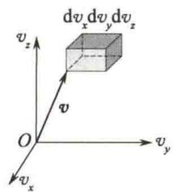

import Guide from '@/components/Guide.astro';
import Knowledge from '@/components/Knowledge.astro';
import Example from '@/components/Example.astro';
import Analysis from '@/components/Analysis.astro';
import Solution from '@/components/Solution.astro';
import Variant from '@/components/Variant.astro';
import Note from '@/components/Note.astro';
import Block from '@/components/Block.astro';
import Method from '@/components/Method.astro';
import Exercise from '@/components/Exercise.astro';

## 7.6.1 麦克斯韦速度分布律

前面讨论的分子速率分布未考虑分子速度的方向，要找出分子按速度的分布，就是要找出在速度空间中，分布于速度 $\pmb{v}$ 附近小体积元 $\mathrm{d}v_{x}\mathrm{d}v_{y}\mathrm{d}v_{z}$ 内的分子数 $\mathrm{d}N_{\mathbf{v}}$ 占总分子数的百分比.则速度分布函数定义为
$$
f (\pmb {v}) = \frac {\mathrm{d} N _ {\pmb {v}}}{N \mathrm{d} v _ {x} \mathrm{d} v _ {y} \mathrm{d} v _ {z}}
$$
表示在速度v附近单位速度空间体积内的分子数占总分子数的比例,即速度概率密度,又称气体分子的速度分布函数.
1859年，麦克斯韦首先导出了理想气体的速度分布律为
$$
\frac {\mathrm{d} N}{N} = \left(\frac {m}{2 \pi k T}\right) ^ {\frac {3}{2}} \mathrm{e} ^ {- \frac {m}{2 k T} (v _ {x} ^ {2} + v _ {y} ^ {2} + v _ {z} ^ {2})} \mathrm{d} v _ {x} \mathrm{d} v _ {y} \mathrm{d} v _ {z}\tag{7.17}
$$
则麦克斯韦速度分布函数为
$$
f (\pmb {v}) = \left(\frac {m}{2 \pi k T}\right) ^ {\frac {3}{2}} \mathrm{e} ^ {- \frac {m}{2 k T} (v _ {x} ^ {2} + v _ {y} ^ {2} + v _ {z} ^ {2})}
$$

## 7.6.2 玻尔兹曼分布律

麦克斯韦速度分布律是理想气体分子不受外力作用,或者外力场可以忽略不计时,处于热平衡态下的气体分子速度分布律.由于没有外力场作用,分子按空间位置的分布是均匀的,即在容器中分子数密度 n 处处相同.当有保守外力(如重力、电场力等)作用时,气体分子在各空间位置的分布就不再均匀了,不同位置处分子数密度不同.
  
玻尔兹曼
玻尔兹曼将麦克斯韦速度分布律推广到理想气体处在保守力场的情况. 他认为: ① 分子在外力场中应以总能量 $E = E_{\mathrm{k}} + E_{\mathrm{p}}$ 取代式 (7.17) 中表示动能的部分; ② 粒子的分布不仅按速度区间 $[v_x, v_x + \mathrm{d}v_x]$ 、 $[v_y, v_y + \mathrm{d}v_y]$ 、 $[v_z, v_z + \mathrm{d}v_z]$ 分布, 还应按位置区间 $[x, x + \mathrm{d}x]$ 、 $[y, y + \mathrm{d}y]$ 、 $[z, z + \mathrm{d}z]$ 分布. 作了这两个推广并运用概率理论导出了下述公式:
$$
\mathrm{d} N ^ {\prime} = n _ {0} \mathrm{e} ^ {- \frac {E _ {\mathrm{p}}}{k T}} \mathrm{d} x \mathrm{d} y \mathrm{d} z\tag{7.18}
$$
式中， $\mathrm{d}N'$ 为空间小体积元 $\mathrm{d}x\mathrm{d}y\mathrm{d}z$ 中的气体分子数， $n_0$ 为 $E_{\mathrm{p}} = 0$ 处的分子数密度.
令
$$
n = \frac {\mathrm{d} N ^ {\prime}}{\mathrm{d} x \mathrm{d} y \mathrm{d} z}
$$
则有
$$
n = n _ {0} \mathrm{e} ^ {- \frac {E _ {\mathrm{p}}}{k T}}\tag{7.19}
$$
式(7.19)即为分子数密度的玻尔兹曼分布,是分子数密度按势能的分布.玻尔兹曼在推导过程中假定,任一宏观小体积元 $(\mathrm{d}x\mathrm{d}y\mathrm{d}z)$ 内的分子数 $dN^{\prime}=n\mathrm{d}x\mathrm{d}y\mathrm{d}z$ 仍非常大,且体积元中的分子遵循麦克斯韦速度分布律.设在 $dN^{\prime}$ 个总分子数中,速率位于 $v_{x}\sim v_{x}+\mathrm{d}v_{x},v_{y}\sim v_{y}+\mathrm{d}v_{y},v_{z}\sim v_{z}+\mathrm{d}v_{z}$ 中的分子数为dN,则由麦克斯韦速度分布律可知
$$
\begin{array}{r l} & \frac {\mathrm{d} N}{\mathrm{d} N ^ {\prime}} = f (v) \mathrm{d} v _ {x} \mathrm{d} v _ {y} \mathrm{d} v _ {z} \\ & \mathrm{d} N = \mathrm{d} N ^ {\prime} f (v) \mathrm{d} v _ {x} \mathrm{d} v _ {y} \mathrm{d} v _ {z} \\ & \mathrm{d} N = n _ {0} \mathrm{e} ^ {- \frac {E _ {\mathrm{p}}}{k T}} \left(\frac {m}{2 \pi k T}\right) ^ {\frac {3}{2}} \cdot \mathrm{e} ^ {- \frac {m}{2 k T} (v _ {x} ^ {2} + v _ {y} ^ {2} + v _ {z} ^ {2})} \mathrm{d} v _ {x} \mathrm{d} v _ {y} \mathrm{d} v _ {z} \mathrm{d} x \mathrm{d} y \mathrm{d} z \\ & \mathrm{d} N = n _ {0} \left(\frac {m}{2 \pi k T}\right) ^ {\frac {3}{2}} \cdot \mathrm{e} ^ {- \frac {(E _ {\mathrm{k}} + E _ {\mathrm{p}})}{k T}} \mathrm{d} v _ {x} \mathrm{d} v _ {y} \mathrm{d} v _ {z} \mathrm{d} x \mathrm{d} y \mathrm{d} z \end{array}
$$
即
(7.20)
式(7.20)即为分子既按速率区间分布又按位置区间分布的玻尔兹曼分布律.玻尔兹曼分布示意图如图7.11所示.若将式(7.20)对速度积分就应得到分子按位置的分布 $dN'$ .
玻尔兹曼分布律是描述理想气体在受保守外力作用或保守外力场的作用不可忽略时，处于热平衡态下的气体分子按能量 $(E=E_{\mathrm{k}}+E_{\mathrm{p}})$ 的分布规律。在等宽的区间内，若 $E_{1}>E_{2}$ ，则能量大的粒子数 $dN_{1}$ 小于能量小的粒子数 $dN_{2}$ ，即 $dN_{1}<dN_{2}$ ，或者说粒子优先占据能量小的状态，这是玻尔兹曼分布律的一个重要结果。需要指出的是，玻尔兹曼分布律适用于分子、原子、布朗粒子，但不适用于电子、光子组成的系统。
  
图7.11 玻尔兹曼分布示意图

<Example title="例 7.2">
计算在重力场中,空气分子数密度按高度的分布情况.
<table><tr><td>解 令地面为零势能面,地面附近空气分子数密度为 $n_0$ ,气体分子质量为m,则离地面高度为h的分子,其势能 $E_p = mgh$ ,由玻尔兹曼分子数密度公式可得</td><td> $n = n_0 e^{-\frac{mgh}{kT}}$ 由此可知,分子数密度随高度的增加而呈指数减少,这与高空的空气稀薄的事实相符.</td></tr></table>

</Example>
