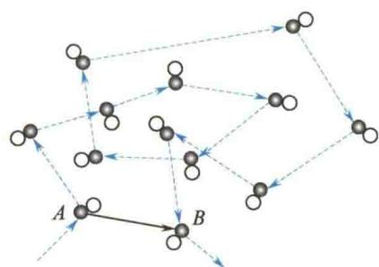
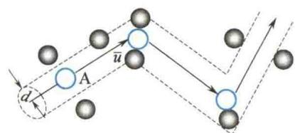

import Guide from '@/components/Guide.astro';
import Knowledge from '@/components/Knowledge.astro';
import Example from '@/components/Example.astro';
import Analysis from '@/components/Analysis.astro';
import Solution from '@/components/Solution.astro';
import Variant from '@/components/Variant.astro';
import Note from '@/components/Note.astro';
import Block from '@/components/Block.astro';
import Method from '@/components/Method.astro';
import Exercise from '@/components/Exercise.astro';

由气体分子平均速率公式 $\overline{v} = 1.60\sqrt{\frac{RT}{M_{\mathrm{mol}}}}$ 可计算出氮分子在 $27^{\circ}\mathrm{C}$ 时的值为 $\overline{v} \approx 476\mathrm{m / s}$ ，这引起19世纪末叶物理学家们的怀疑：既然气体分子的速率极高，为什么气体的扩散进行得相当缓慢？例如，打开一瓶香水后，香味要经过几秒到十几秒才能传过几米的距离。气体分子的热运动速率高，扩散速度小的矛盾如何理解？这个矛盾首先是由克劳修斯解决的。由于常温常压下分子数密度达 $10^{23} \sim 10^{25}\mathrm{m}^{-3}$ ，因此
一个分子以每秒几百米的速率在如此密集的分子中运动,必然要与其他分子做频繁的碰撞,而每碰撞一次,分子的运动方向就会发生改变.图7.12为一个香水分子(黑点)在空气分子中不断碰撞而迂回曲折前进的示意图.设该香水分子t时刻在A点处发生碰撞,经过 $\Delta t$ 时间后到达B点,显然,在相同的 $\Delta t$ 时间内,由A点到B点的位移(实线长度)大小比它的路程(虚线长度)小得多.因此,气体分子的扩散速率比分子的平均速率小得多.
  
图 7.12 分子碰撞示意图
分子在任意两次连续碰撞之间自由通过的路程叫作分子的自由程. 单位时间内一个分子与其他分子碰撞的次数称为分子的碰撞频率. 由图 7.12 可知, 分子的自由程有长有短, 任意两次碰撞所需的时间也具有偶然性. 自由程和碰撞频率大小是随机变化的, 但是大量分子无规则热运动的结果, 使分子的自由程与碰撞频率服从一定的统计规律. 我们可采用统计平均方法分别计算出平均碰撞频率和平均自由程.

## 7.7.1 平均碰撞频率 Z

分子总在做无规则运动,但从碰撞来看,重要的是分子间的相对运动,两个相碰的分子以相对速度 u 运动,其平均相对速率 $\bar{u}$ 稍微不同于个别分子的平均速率 $\bar{v}$ .为了使问题简化,假定每个分子都是有效直径为 d 的弹性小球,且只有某一个分子 A 以平均相对速率 $\bar{u}$ 运动,而其余分子都相对静止.在分子 A 的运动过程中,分子 A 的球
心轨迹是一条折线. 设想以分子 A 的中心所经过的轨迹为轴, 以分子的有效直径 d 为半径作一圆柱体, 如图 7.13 所示. 显然, 凡是球心位于该圆柱体内的分子都将和分子 A 相碰. $\sigma = \pi d^{2}$ 称为碰撞截面. 球心在该圆柱体外的分子就不会与它相碰.
设分子数密度为 n，因为在单位时间内，
  
图 7.13 碰撞区域示意图
分子 A 平均经过的路程为 $\bar{u}$ ，相应的圆柱体的体积为 $\pi d^{2}\bar{u}$ ，平均而言，圆柱体内的分子数为 $\pi d^{2}\bar{u}n$ 。显然，这就是分子 A 在 1 s 内和其他分子发生碰撞的平均频率 $\bar{Z}$ ，所以
$$
\overline {{{Z}}} = \pi d ^ {2} \overline {{{u n}}}
$$
考虑两个分子 A 和 $A_{i}$ ，分别以速度 v 和 $v_{i}$ 运动，则 A 对 $A_{i}$ 的相对速度为
$$
\boldsymbol {u} _ {i} = \boldsymbol {v} - \boldsymbol {v} _ {i}
$$
$$
u _ {i} ^ {2} = v ^ {2} + v _ {i} ^ {2} - 2 \boldsymbol {v} \cdot \boldsymbol {v} _ {i}
$$
上式两边对 A 以外的大量分子求平均值. 由于分子的无规则运动, 速度 v 和 $v_{i}$ 的夹角有各种可能, 其余弦可正可负, 因而对大量分子统计平均值时 $\overline{v \cdot v_{i}} = 0$ , 于是得
$$
\overline {{{u ^ {2}}}} = \overline {{{v ^ {2}}}} + \overline {{{v _ {i} ^ {2}}}}
$$
如果忽略方均根值与平均值间的差别，如 $\sqrt{u^2}$ 和 $\overline{u}$ 的差别，则上式变为
$$
\overline {{{u}}} ^ {2} = \overline {{{v}}} ^ {2} + \overline {{{v}}} _ {i} ^ {2}
$$
由于分子 A 与所有分子是一样的，则 $\overline{v} = \overline{v}_{i}$ ，结果为
$$
\overline {{{u}}} = \sqrt {2} \overline {{{v}}}\tag{7.21}
$$
在上面的推导中作了简化,但可以证明,对于按麦克斯韦速度分布律运动的气体分子,式(7.21)是一个严格的结果.
由此可得平均碰撞频率为
$$
\overline {{{Z}}} = \sqrt {2} \pi d ^ {2} \overline {{{v}}} n\tag{7.22}
$$

## 7.7.2 平均自由程 $\lambda$

由于1s内分子平均通过的路程为 $\overline{v}$ ，一个分子与其他分子的平均碰撞频率为 $\overline{Z}$ ，因此，平均自由程 $\bar{\lambda}$ 为
$$
\bar {\lambda} = \frac {\overline {{v}}}{\overline {{Z}}} = \frac {1}{\sqrt {2} \pi d ^ {2} n}
$$
  
分子的平均自由程
(7.23)
从式 $(7.23)$ 可知,分子的平均自由程与分子的有效直径的平方和分子数密度均成反比.
因为 p = nkT，所以上式可改写为
$$
\overline {{{{\lambda}}}} = \frac {k T}{\sqrt {2} \pi d ^ {2} p}\tag{7.24}
$$
式(7.24)表明,当温度恒定时,平均自由程与气体的压强成反比,压强越小(空气越稀薄),平均自由程越长.
在标准状态下， $\overline{v}$ 的数量级为 $10^{2} \mathrm{~m} / \mathrm{s}, \lambda$ 的数量级为 $10^{-7} \mathrm{~m}$ ，则平均碰撞频率 $\overline{Z}$ 的数量级为 $10^{9} \mathrm{~s}^{-1}$ ，即在 $1 \mathrm{~s}$ 内，1 个分子与其他分子平均而言要碰撞几十亿次。这样频繁的碰撞不是我们日常生活中所能想象的。从这一估算中可见，分子热运动具有极大的无规则性，频繁的碰撞正是大量分子整体表现出统计规律的基础。

<Example title="例 7.3">
<Solution title="解">
根据 $\overline{Z} = \sqrt{2}\pi d^2 n\overline{v}$ 及
$$
\begin{array}{r l} \overline {{v}} & = \sqrt {\frac {8 R T}{\pi M _ {\mathrm{mol}}}} \approx 1. 6 0 \sqrt {\frac {R T}{M _ {\mathrm{mol}}}} \\ & = 1. 6 0 \times \sqrt {\frac {8 . 3 1 \times 2 7 3}{3 2 \times 1 0 ^ {- 3}}} \mathrm{m/s} \\ & = 4 2 6 \mathrm{m/s} \end{array}
$$
$$
\begin{array}{r l} n & = \frac {p}{k T} = \frac {1 . 0 1 3 \times 1 0 ^ {5}}{1 . 3 8 \times 1 0 ^ {- 2 3} \times 2 7 3} \mathrm{m} ^ {- 3} \\ & = 2. 6 9 \times 1 0 ^ {2 5} \mathrm{m} ^ {- 3} \end{array}
$$
$$
\begin{array}{r l} \overline {{Z}} & = \sqrt {2} \pi d ^ {2} \overline {{v n}} \\ & = \sqrt {2} \times 3. 1 4 \times (3. 5 \times 1 0 ^ {- 1 0}) ^ {2} \times \\ & 4 2 6 \times 2. 6 9 \times 1 0 ^ {2 5} \mathrm{s} ^ {- 1} \\ & = 6. 2 3 \times 1 0 ^ {9} \mathrm{s} ^ {- 1} \end{array}
$$
故 $\overline{\lambda} = \frac{\overline{v}}{\overline{Z}} = \frac{426}{6.23\times 10^{9}}\mathrm{m} = 6.84\times 10^{-8}\mathrm{m}$
</Solution>
</Example>

由此可见，氧气分子平均每秒碰撞达60亿次之多，但平均自由程仅有亿分之几米.

<Example title="例 7.4">
试估算 $0^{\circ}C$ 时空气分子在如下压强下的平均自由程. 已知空气分子的有效直径为 0.31 nm.
(1) $p_{1}=1.013\times10^{5}\ Pa;$
(2) $p_{2}=1.33\times10^{-3}$ Pa.

<Solution title="解">
(1)
$$
\begin{array}{r l} \overline {{\lambda}} _ {1} & = \frac {k T}{\sqrt {2} \pi d ^ {2} p _ {1}} \\ & = \frac {1 . 3 8 \times 1 0 ^ {- 2 3} \times 2 7 3}{\sqrt {2} \times 3 . 1 4 \times (3 . 1 \times 1 0 ^ {- 1 0}) ^ {2} \times 1 . 0 1 3 \times 1 0 ^ {5}} \mathrm{m} \\ & = 8. 7 2 \times 1 0 ^ {- 8} \mathrm{m} \\ & (2) \\ \overline {{\lambda}} _ {2} & = \frac {k T}{\sqrt {2} \pi d ^ {2} p _ {2}} \end{array}
$$
$$
\begin{array}{r l} & = \frac {1 . 3 8 \times 1 0 ^ {- 2 3} \times 2 7 3}{\sqrt {2} \times 3 . 1 4 \times (3 . 1 \times 1 0 ^ {- 1 0}) ^ {2} \times 1 . 3 3 \times 1 0 ^ {- 3}} \mathrm{m} \\ & = 6. 6 4 \mathrm{m} \end{array}
$$
可见，在低气压状态下，平均自由程较大. $\bar{\lambda}_{2}=6.64\ m$ 这个值很大，也就是说，在此低气压下，通常容器中分子间几乎不发生碰撞.由此可见，在真空中，可以得到较大的平均自由程，这种估算在电真空器件及传热器中均有实际应用.

</Solution>
</Example>
