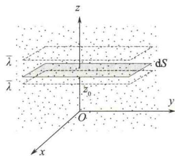
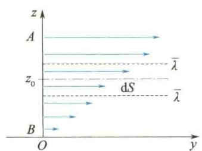

import Guide from '@/components/Guide.astro';
import Knowledge from '@/components/Knowledge.astro';
import Example from '@/components/Example.astro';
import Analysis from '@/components/Analysis.astro';
import Solution from '@/components/Solution.astro';
import Variant from '@/components/Variant.astro';
import Note from '@/components/Note.astro';
import Block from '@/components/Block.astro';
import Method from '@/components/Method.astro';
import Exercise from '@/components/Exercise.astro';

统计物理学研究的内容可分为两方面,一方面是研究平衡态,另一方面是研究非平衡态.前面研究了平衡态气体的性质和遵循的规律,对于平衡体系,不必考虑导致平衡态的相互作用的细节,只要知道这种相互作用存在就足够了.尽管平衡态是很重要的,但其毕竟还是相当特殊的情况,实际中大量的宏观体系并不都是处于平衡态的.

气体内的输运过程是一类非常重要的非平衡态过程. 处于非平衡态的气体, 其内部各部分的物理性质 (如密度、流速、温度等) 是不均匀的, 由于气体分子无规则运动, 原来不均匀的物理量将逐渐趋于均匀的平衡态, 导致质量、动量或能量从气体中的一部分向另一部分迁移. 我们把这类过程叫作气体内的输运过程. 它包括扩散、热传导和黏性 3 个过程.

## 7.8.1 扩散

在混合气体内部,如果某种气体在容器中各部分密度不均匀,该种气体分子将从密度大处向密度小处迁移,这种现象叫作扩散.就单一气体来说,在温度均匀的情况下,密度的不均匀会导致压强不均匀而形成宏观气流,这样,在气体内部发生的就不是单纯的扩散现象.为研究单纯的扩散过程,选择两种温度、压强和分子量都相等的气体(如 $N_{2}$ 和CO),分别装入一中间被隔板分成两部分的容器中,抽出隔板后,由于温度、压强处处相同,不会有流动发生,但两种气体的密度不均匀会形成单纯扩散过程.为研究扩散过程的规律,只需集中注意其中一种气体就可以了.

在图 7.14 中，设气体质量密度 $\rho$ 沿 z 轴正方向增大，密度梯度为 $\frac{d\rho}{dz}$ . 设想在 $z = z_{0}$ 处垂直于 z 轴有一界面，其面积为 dS. 实验证明，dt 时间内，从密度较大的一侧通过 dS 面向密度较小的一侧扩散的气体质量与这一界面处的密度梯度、面积及时间均成正比，即

$$

\mathrm{d} M = - D \frac {\mathrm{d} \rho}{\mathrm{d} z} \mathrm{d} S \mathrm{d} t\tag{7.25}

$$

式中，D 为扩散系数，它的数值与气体种类有关；负号表示扩散总是沿质量密度 $\rho$ 减小的方向进行.

  

图 7.14 分子扩散示意图

从分子理论的观点看,由于在 dS 面两边的分子数密度 n 不同,故在相同的时间内,从分子数密度大的一边迁

移到分子数密度小的一边的分子数(沿 z 轴负方向穿过 dS 面的分子数)大于从分子数密度小的一边迁移到分子数密度大的一边的分子数(沿 z 轴正方向穿过 dS 面的分子数),相当于分子向下迁移,在宏观上形成了质量的输运.

若分子的质量为 $m_0$ ，气体分子数密度为 $n$ ，则气体的质量密度为 $\rho = nm_0$ ，分子数密度梯度为 $\frac{\mathrm{dn}}{\mathrm{dz}}$ ，式(7.25）变为

$$

\mathrm{d} N = - D \frac {\mathrm{d} n}{\mathrm{d} z} \mathrm{d} S \mathrm{d} t

$$

由统计观点,我们可以认为,在任一体积中,沿 z 轴正、负方向运动的分子各占分子总数的 1/6. 这样,在 dt 时间内通过 dS 的净分子数为

$$

\begin{array}{r l} \mathrm{d} N & = \frac {1}{6} n _ {z} \overline {{v}} \mathrm{d} t \mathrm{d} S - \frac {1}{6} n _ {z + \mathrm{d} z} \overline {{v}} \mathrm{d} t \mathrm{d} S \\ & = - \frac {1}{6} \overline {{v}} \frac {\mathrm{d} n}{\mathrm{d} z} \mathrm{d} z \mathrm{d} S \mathrm{d} t \end{array}

$$

平均说来,越过 dS 的分子都是在到 dS 距离等于平均自由程 $\bar{\lambda}$ 处发生最后一次碰撞的,所以取 dz = 2 $\bar{\lambda}$ ,于是

$$

\mathrm{d} N = - \frac {1}{3} \bar {v} \lambda \frac {\mathrm{d} n}{\mathrm{d} z} \mathrm{d} S \mathrm{d} t

$$

与式 $(7.25)$ 比较,得气体扩散系数为

$$

D = \frac {1}{3} \overline {{{v}}} \overline {{{\lambda}}}\tag{7.26}

$$

## 7.8.2 热传导

物体内各部分温度不均匀时，热量总是通过介质由高温处传递到低温处，这种现象称为热传导。如果气体内各部分的温度不同，设想简单情形，气体温度沿 $z$ 轴正方向逐渐升高，温度梯度为 $\frac{\mathrm{d}T}{\mathrm{d}z}$ ，假设在 $z = z_0$ 处垂直于 $z$ 轴有一界面，其面积为 $\mathrm{dS}$ 。从实验知， $\mathrm{dt}$ 时间内，从高温的一侧通过 $\mathrm{dS}$ 面向低温一侧传递的热量与这一界面处的温度梯度、面积及时间均成正比，即

$$

\mathrm{d} Q = - \kappa \frac {\mathrm{d} T}{\mathrm{d} z} \mathrm{d} S \mathrm{d} t\tag{7.27}

$$

式中， $\kappa$ 与物质的种类和状态有关，叫作热导率或导热系数，单位是 $\mathrm{W / (m\cdot K)}$ ，负号表示热量沿温度减小的方向输运。这个实验规律首先由傅里叶(J.B.J.Fourier)在1808年提出，因而称为傅里叶定律。

从分子动理论来看,气体内部温度不均匀,表明内部各处分子平均热运动能量 $\bar{\varepsilon}$ 不同,沿z轴正方向穿过dS面的分子带有较小的平均能量,而沿z轴负方向穿过dS面的分子带有较大的平均热运动能量,经过分子交换,能量向下净迁移,宏观上表现为热传导.

每个分子平均热运动能量为 $\bar{\varepsilon} = \frac{1}{2} ikT, i$ 为分子自由度. dt 时间内，沿 $z$ 轴正、负方向通过 dS 的分子数近似为 $\frac{1}{6} n\overline{v}\mathrm{d}t\mathrm{d}S$ ，经过分子交换的能量，即沿 $z$ 轴负方向传递的热量为

$$

\begin{array}{r l} \mathrm{d} Q & = \frac {1}{6} n \bar {v} \mathrm{d} t \mathrm{d} S \bar {\varepsilon} _ {z} - \frac {1}{6} n \bar {v} \mathrm{d} t \mathrm{d} S \bar {\varepsilon} _ {z + \mathrm{d} z} \\ & = \frac {1}{6} n \bar {v} \mathrm{d} t \mathrm{d} S \cdot \frac {1}{2} i k (T _ {z} - T _ {z + \mathrm{d} z}) \\ & = - \frac {1}{6} n \bar {v} \mathrm{d} t \mathrm{d} S \cdot \frac {1}{2} i k \frac {\mathrm{d} T}{\mathrm{d} z} \mathrm{d} z \end{array}

$$

同上述扩散方法一样，取 $\mathrm{dz} = 2\overline{\lambda}$ ，得

$$

\mathrm{d} Q = - \frac {1}{3} n \bar {v} \bar {\lambda} \mathrm{d} t \mathrm{d} S \cdot \frac {1}{2} i k \frac {\mathrm{d} T}{\mathrm{d} z}

$$

与式(7.27)比较,得热导率为

$$

\kappa = \frac {1}{3} n \bar {v} \bar {\lambda} \cdot \frac {1}{2} i k

$$

利用气体定容摩尔热容公式[见式(8.15)] $C_{V,m}=\frac{1}{2}iR$ ，有

$$

\kappa = \frac {1}{3} n \bar {v} \bar {\lambda} \cdot \frac {1}{2} i k = \frac {1}{3} \bar {v} \bar {\lambda} \cdot \frac {1}{2} i R \frac {n}{N _ {\mathrm{A}}} = \frac {1}{3} \bar {v} \bar {\lambda} C _ {V, \mathrm{m}} \frac {M}{M _ {\mathrm{mol}} V} = \frac {1}{3} \bar {v} \bar {\lambda} C _ {V, \mathrm{m}} \frac {\rho}{M _ {\mathrm{mol}}}\tag{7.28}

$$

式中， $\rho = nm_0$ 为气体密度. 式(7.28)表明了热导率与气体分子平均速率和平均自由程的关系.

热传导是由原子或分子间的相互作用导致的,它是热量交换的3种基本方式之一,另2种是对流和辐射.

## 7.8.3 黏性

在流体内,各层之间由流速不同而引起的相互作用力,叫作内摩擦力,也叫作黏性力.例如,空气沿通风管道前进时,紧靠管壁的气体分子附着于管壁,流速为零.离管壁较远处气层的流速较大,在管道中心轴线上的流速达到最大.这就是因为黏性力的作用,形成风速沿管道半径不均匀分布.

设气体沿 y 轴正方向流动，流速 u 按 z 坐标分布： $u = u(z)$ ，设想 $z = z_{0}$ 处垂直于 z 轴有一界面，其面积为 dS，如图 7.15 所示。由于在界面处存在速度梯度 $\frac{du}{dz}$ ，因此，在上、下两层流体间产生大小相等、方向相反的黏性力。实验表明，黏性力大小与界面处的速度梯度和面积均成正比，即

$$

\mathrm{d} F = \eta \frac {\mathrm{d} u}{\mathrm{d} z} \mathrm{d} S

$$

(7.29)

图 7.15 层流速度分布示意图式(7.29)叫作牛顿黏性定律,比例系数 $\eta$ 叫作黏度系数,其与流体的性质和状态有关,单位为 $N \cdot s/m^{2}$ .

气体分子除有无规则热运动外，还有各层流体的整体的宏观定向运动，速度为 u，由于两层流体的定向运动速度皆与界面平行，因而定向运动不会影响分子穿过 dS 面的情况。因此，沿 z 轴正方向穿过 dS 面的分子带有较小的定向动量，而沿 z 轴负方向穿过 dS 面的分子带有较大的定向动量，

经过分子交换,定向动量有自上而下的净迁移.

设气体是单质的，且有均匀的分子数密度 n 和温度 T，则两层流体有相同的分子平均速率 $\bar{v}$ 及平均自由程 $\bar{\lambda}$ .

每个分子的定向动量为 $p = m_0 u$ , dt 时间内, 沿 $z$ 轴正、负方向通过 dS 的分子数仍近似为 $\frac{1}{6} n v \mathrm{d} t \mathrm{d} S$ , 经过分子交换定向动量, 使下面一层得到的动量为

$$

\begin{array}{r l} \mathrm{d} p & = \frac {1}{6} n \overline {{v}} \mathrm{d} t \mathrm{d} S p _ {z + \mathrm{d} z} - \frac {1}{6} n \overline {{v}} \mathrm{d} t \mathrm{d} S p _ {z} \\ & = \frac {1}{6} n \overline {{v}} \mathrm{d} t \mathrm{d} S (p _ {z + \mathrm{d} z} - p _ {z}) \\ & = \frac {1}{6} n \overline {{v}} \mathrm{d} t \mathrm{d} S \frac {\mathrm{d} p}{\mathrm{d} z} \mathrm{d} z = \frac {1}{6} n m _ {0} \overline {{v}} \mathrm{d} t \mathrm{d} S \frac {\mathrm{d} u}{\mathrm{d} z} \mathrm{d} z \end{array}

$$

同上述扩散方法一样，取 $\mathrm{dz} = 2\bar{\lambda}$ ，得

$$

\mathrm{d} p = \frac {1}{3} n m _ {0} \overline {{{v}}} \overline {{{\lambda}}} \mathrm{d} t \mathrm{d} S \frac {\mathrm{d} u}{\mathrm{d} z}

$$

根据动量定理,上层对下层作用在界面上的力为

$$

\mathrm{d} F = \frac {\mathrm{d} p}{\mathrm{d} t}

$$

因此

$$

\mathrm{d} F = \frac {1}{3} n m _ {0} \overline {{{v}}} \overline {{{\lambda}}} \mathrm{d} S \frac {\mathrm{d} u}{\mathrm{d} z} = \frac {1}{3} \rho \overline {{{v}}} \overline {{{\lambda}}} \mathrm{d} S \frac {\mathrm{d} u}{\mathrm{d} z}

$$

与式 $(7.29)$ 比较,得黏度系数为

$$

\eta = \frac {1}{3} \rho \overline {{{v}}} \overline {{{\lambda}}} = \rho D\tag{7.30}

$$

式(7.30)说明气体的内摩擦是分子热运动与相互作用(碰撞)产生的宏观效果.

从以上分析来看,黏性、热传导及扩散现象分别对应着动量、热量与质量的传递.3种输运现象有共同的宏观特征,必定发生在处于非平衡态的系统之中,都是与某些物理量在空间呈不均匀分布相联系着的.如果外界对该非平衡系统不产生影响,让输运过程自发地进行,那么相应物理量的输运过程也就是系统状态不断变化的过程,最后必然会过渡到一种新的平衡态.

对于实际的工程应用领域,往往2种甚至3种输运过程同时发生,因此,常常把它们有机地联系起来加以讨论.输运过程在相当广泛的自然现象和日常生活中发生,如街道中的车辆、城市中的居民等都可抽象为粒子.输运理论可以描述中子在核反应堆中的迁移及其所导致的动力学变化;可以描述光子如何从太阳发射和如何穿过地球大气传播到地面的辐射输运.所以输运理论已成为物理学及工程中的重要工具.

<Example title="例 7.5">
已知氮气分子的有效直径为 $3.10 \times 10^{-10}$ m，定容摩尔热容为 $20.9 \, \text{J/(mol} \cdot \text{K)}$ 。试求氮气在 $0^{\circ}C$ 时的热导率。

<Solution title="解">
由热导率公式

$$

\kappa = \frac {1}{3} \frac {C _ {V , \mathrm{m}}}{M _ {\mathrm{mol}}} \rho \overline {{{v}}} \overline {{{\lambda}}}

$$

分子平均自由程 $\bar{\lambda} = \frac{1}{\sqrt{2}\pi d^2n}$

而气体密度

$$

\rho = n \frac {M _ {\mathrm{mol}}}{N _ {\mathrm{A}}}

$$

所以

分子平均速率

$$

\overline {{{v}}} = \sqrt {\frac {8 R T}{\pi M _ {\mathrm{mol}}}}

$$

$$

\begin{array}{r l} \kappa & = \frac {1}{3} \frac {C _ {V , \mathrm{m}}}{M _ {\mathrm{mol}}} n \frac {M _ {\mathrm{mol}}}{N _ {\mathrm{A}}} \sqrt {\frac {8 R T}{\pi M _ {\mathrm{mol}}}} \frac {1}{\sqrt {2} \pi d ^ {2} n} \\ & = \frac {2}{3 \pi} \frac {C _ {V , \mathrm{m}}}{N _ {\mathrm{A}}} \sqrt {\frac {R T}{\pi M _ {\mathrm{mol}}}} \frac {1}{d ^ {2}} \\ & = 1. 2 3 \times 1 0 ^ {- 2} \mathrm {J / (m\bullet s\bullet K)} \end{array}

$$

</Solution>
</Example>
