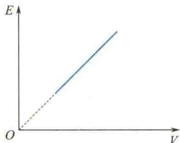

import Guide from '@/components/Guide.astro';
import Knowledge from '@/components/Knowledge.astro';
import Example from '@/components/Example.astro';
import Analysis from '@/components/Analysis.astro';
import Solution from '@/components/Solution.astro';
import Variant from '@/components/Variant.astro';
import Note from '@/components/Note.astro';
import Block from '@/components/Block.astro';
import Method from '@/components/Method.astro';
import Exercise from '@/components/Exercise.astro';

## 选择题

<Exercise title="习题 7.1.1">
容器中储有一定量的理想气体，气体分子的质量为 m，当温度为 T 时，根据理想气体的分子模型和统计假设，分子速度在 x 轴方向上的分量平方的平均值是
A. $\overline{v_{x}^{2}}=\frac{1}{3}\sqrt{\frac{3kT}{m}}$ . B. $\overline{v_{x}^{2}}=\sqrt{\frac{3kT}{m}}$ .
C. $\overline{v_{x}^{2}}=\frac{3kT}{m}$ . D. $\overline{v_{x}^{2}}=\frac{kT}{m}$ .
</Exercise>

<Exercise title="习题 7.1.2">
一瓶氦气的密度和一瓶氮气的密度相同,分子平均平动动能相同,而且都处于平衡态,则它们
( )
A. 温度、压强都相同.
B. 温度、压强都不相同.
C. 温度相同,但氦气的压强大于氮气的压强.
D. 温度相同,但氦气的压强小于氮气的压强.
</Exercise>

<Exercise title="习题 7.1.3">
在标准状态下,氧气和氦气的体积比为 $V_{1}/V_{2}=1/2$ , 都视为刚性分子理想气体, 则其内能之比 $E_{1}/E_{2}$ 为
A. 3/10.
B. 1/2.
C. 5/6.
D. 5/3. $E \uparrow$
</Exercise>

<Exercise title="习题 7.1.4">
一定质量的理想气体的内能 $E$ 随体积 $V$ 的变化关系曲线为一直线，其延长线过坐标原点，如题7.1.4图所示，则此直线表示的过程为（）A.等温过程.B.等压过程.C.等体过程.D.绝热过程.

</Exercise>

<Exercise title="习题 7.1.5">
在恒定不变的压强下,气体分子的平均碰撞频率 $\bar{Z}$ 与气体的热力学温度 T 的关系为 ( )
A. $\bar{Z}$ 与 T 无关.
B. $\bar{Z}$ 与 T 成正比.
C. $\bar{Z}$ 与 $\sqrt{T}$ 成反比.
D. $\bar{Z}$ 与 $\sqrt{T}$ 成正比.
题7.1.4图  

</Exercise>
