import Guide from '@/components/Guide.astro';
import Knowledge from '@/components/Knowledge.astro';
import Example from '@/components/Example.astro';
import Analysis from '@/components/Analysis.astro';
import Solution from '@/components/Solution.astro';
import Variant from '@/components/Variant.astro';
import Note from '@/components/Note.astro';
import Block from '@/components/Block.astro';
import Method from '@/components/Method.astro';
import Exercise from '@/components/Exercise.astro';

## 解答题

<Exercise title="习题 8.3.1">
下列表述是否正确？为什么？如不正确，请将错误更正.
(1) $\Delta Q=\Delta E+\Delta W$ ; (2) $Q=E+\int p\,dV$ ; (3) $\eta\neq1-\frac{Q_{2}}{Q_{1}}$ ; (4) $\eta_{不可逆}<1-\frac{Q_{2}}{Q_{1}}$ .
</Exercise>

<Exercise title="习题 8.3.2">
p-V 图上封闭曲线所包围的区域的面积表示什么？该面积越大，效率是否越高？
</Exercise>

<Exercise title="习题 8.3.3">
有 3 个循环过程, 如题 8.3.3 图所示, R > r, 指出每一循环过程所做的功是正的、负的, 还是零, 说明理由.
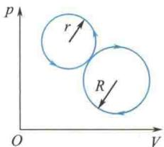  
(a)
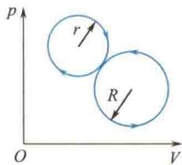  
(b)  
题8.3.3图
(c)  
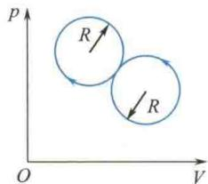
用热力学第一定律和热力学第二定律分别证明，在 $p - V$ 图上一绝热线与一等温线不能有两个交点.  
</Exercise>

<Exercise title="习题 8.3.5">
一循环过程如题8.3.5图所示.  
(1) $ab, bc, ca$ 各是什么过程？  
(2) 画出对应的 $p - V$ 图；  
(3) 该循环是不是正循环？  
(4) 该循环做的功是否等于直角三角形的面积？  
(5) 用图中的热量 $Q_{ab}, Q_{bc}, Q_{ac}$ 表示其热机效率或制冷系数.
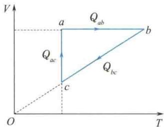  
题8.3.5图
</Exercise>

<Exercise title="习题 8.3.6">
两个卡诺循环如题8.3.6图所示，它们的循环面积相等，试问：
(1) 它们吸热和放热的差值是否相同？
(2) 对外界做的净功是否相等?
(3) 效率是否相同?
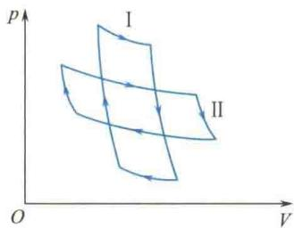  
题8.3.6图
</Exercise>

<Exercise title="习题 8.3.7">
评论下述说法正确与否.
(1) 功可以完全变成热,但热不能完全变成功;
(2) 热量只能从高温物体传到低温物体, 不能从低温物体传到高温物体;
(3) 可逆过程就是能沿反方向进行的过程, 不可逆过程就是不能沿反方向进行的过程.
</Exercise>

<Exercise title="习题 8.3.8">
已知 $S_{B} - S_{A} = \int_{A}^{B}\frac{\mathrm{d}Q_{\text{可逆}}}{T}$ 及 $S_{B} - S_{A} > \int_{A}^{B}\frac{\mathrm{d}Q_{\text{不可逆}}}{T}$ ，这是否说明可逆过程的熵变大于不可逆过程的熵变？为什么？说明理由.
</Exercise>

<Exercise title="习题 8.3.9">
如题 8.3.9 图所示, 一系统由状态 a 沿 acb 到达状态 b 的过程中, 有 350 J 的热量传入系统, 而系统做的功为 126 J.
(1) 若沿 $adb$ 时, 系统做的功为 $42 \mathrm{~J}$ , 则有多少热量传入系统?
(2) 若系统由状态 b 沿曲线 ba 返回状态 a 时, 外界对系统做的功为 84 J, 则系统是吸热还是放热? 热量传递是多少?
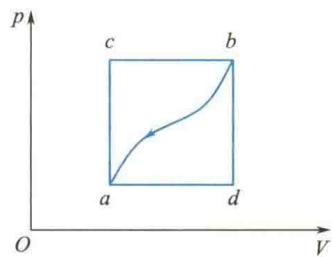  
题8.3.9图
</Exercise>

<Exercise title="习题 8.3.10">
1 mol 单原子理想气体从 300 K 加热到 350 K, 问在下列两过程中吸收了多少热量? 增加了多少内能? 对外做了多少功?
(1) 容积保持不变;
(2) 压力保持不变.
</Exercise>

<Exercise title="习题 8.3.11">
一个绝热容器中盛有摩尔质量为 $M_{\mathrm{mol}}$ 、摩尔热容比为 $\gamma$ 的理想气体，整个容器以速率 $v$ 运动，若容器突然停止运动，求气体温度的升高量（设气体分子的机械能全部转化为内能）.
</Exercise>

<Exercise title="习题 8.3.12">
0.01 m $^{3}$ 氮气在温度为 300 K 时，由 0.1 MPa (1 atm) 压缩到 10 MPa. 试分别求氮气经等温及绝热压缩后的(1)体积；(2)温度；(3)各过程对外界所做的功.
</Exercise>

<Exercise title="习题 8.3.13">
理想气体由初状态 $(p_1, V_1)$ 经绝热膨胀至末状态 $(p_2, V_2)$ . 试证此过程中气体所做的功为
$$
W = \frac {p _ {1} V _ {1} - p _ {2} V _ {2}}{\gamma - 1} (\gamma \text {为气体的摩尔热容比})
$$
</Exercise>

<Exercise title="习题 8.3.14">
1 mol 理想气体的 T-V 图如题 8.3.14 图所示, 线段 ab 的反向延长线通过坐标原点 O. 求 ab 过程中气体对外界做的功.
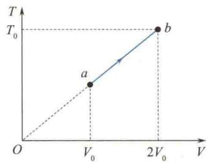  
题8.3.14图
</Exercise>

<Exercise title="习题 8.3.16">
某理想气体的过程方程为 $Vp^{1/2} = a, a$ 为常数，气体从 $V_{1}$ 膨胀到 $V_{2}$ . 求其所做的功. 设有一以理想气体为工质的热机循环，如题 8.3.16 图所示. 试证其循环效率为
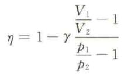
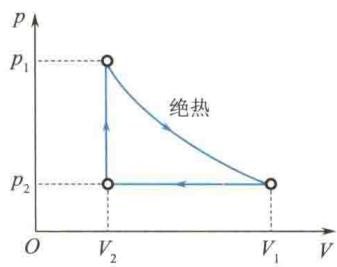  
题8.3.16图
17 一卡诺热机在温度分别为 $1000\mathrm{K}$ 和 $300\mathrm{K}$ 的两热源之间工作.
(1) 求热机效率；
(2) 若低温热源不变, 要使热机效率提高到 80%, 则高温热源的温度需提高多少?
(3) 若高温热源不变, 要使热机效率提高到 80%, 则低温热源的温度需降低多少?
</Exercise>

<Exercise title="习题 8.3.18">
题 8.3.18 图所示是一理想气体经历的循环过程, 其中 AB 和 CD 为等压过程, BC 和 DA 为绝热过程, 已知 B 点和 C 点的温度分别为 $T_{2}$ 和 $T_{3}$ . 求此循环效率. 这是卡诺循环吗?
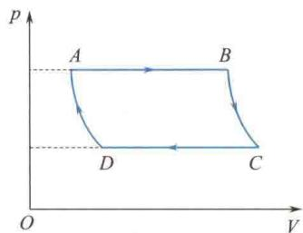  
题8.3.18图
(1) 用一卡诺循环的制冷机从温度为 $7^{\circ} \mathrm{C}$ 的热源中提取 $1000 \mathrm{~J}$ 的热量传向温度为 $27^{\circ} \mathrm{C}$ 的热源, 需要做多少功? 从温度为 $-173^{\circ} \mathrm{C}$ 的热源中提取相同的热量传向温度为 $27^{\circ} \mathrm{C}$ 的热源呢? (2) 一可逆的卡诺机, 作热机使用时, 如果工作的两热源的温度差愈大, 则对于做功就愈有利. 作制冷机使用时, 如果两热源的温度差越大, 对于制冷是否也越有利? 为什么?
</Exercise>

<Exercise title="习题 8.3.20">
如题8.3.20图所示， $1\mathrm{mol}$ 双原子分子理想气体，从初态 $V_{1} = 20\mathrm{L}, T_{1} = 300\mathrm{K}$ ，经历3种不同的过程到达末态 $V_{2} = 40\mathrm{L}, T_{2} = 300\mathrm{K}$ . 题8.3.20图中 $1 \rightarrow 2$ 为等温线， $1 \rightarrow 4$ 为绝热线， $4 \rightarrow 2$ 为等压线， $1 \rightarrow 3$ 为等压线， $3 \rightarrow 2$ 为等容线. 试分别沿这3种过程计算气体的熵变.
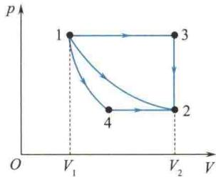  
题8.3.20图
</Exercise>

<Exercise title="习题 8.3.21">
有两个相同体积的容器,分别装有 1 mol 的水,初始温度分别为 $T_{1}$ 和 $T_{2}$ ( $T_{1} > T_{2}$ ),令其进行接触,最后达到相同的温度 T. 求熵的变化(设水的摩尔热容为 $C_{m}$ ).
</Exercise>

<Exercise title="习题 8.3.22">
把 $0^{\circ}$ C、 $0.5 \, kg$ 的冰块加热到全部熔化成 $0^{\circ}$ C 的水，问：
(1) 水的熵变如何?
(2) 若热源是温度为 $20^{\circ}$ C 的庞大物体, 那么热源的熵变化多大?
(3) 水和热源的总熵变有多大？是增加还是减少？（冰的熔化热 $\lambda = 334 J \cdot g^{-1}$ ）
</Exercise>
