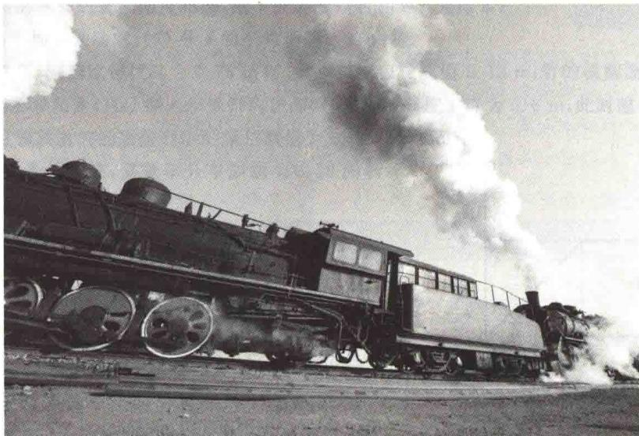
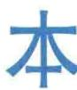
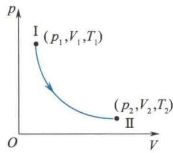
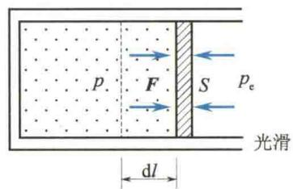
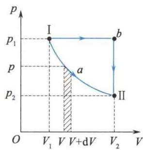

import Guide from '@/components/Guide.astro';
import Knowledge from '@/components/Knowledge.astro';
import Example from '@/components/Example.astro';
import Analysis from '@/components/Analysis.astro';
import Solution from '@/components/Solution.astro';
import Variant from '@/components/Variant.astro';
import Note from '@/components/Note.astro';
import Block from '@/components/Block.astro';
import Method from '@/components/Method.astro';
import Exercise from '@/components/Exercise.astro';

## 第8章 热力学基础

本章提要

章用热力学方法,研究系统在状态变化过程中热与功的转化关系和条件.热力学第一定律给出了转化关系,热力学第二定律给出了转化条件.

## 8.1.1 内能 功和热量

由第7章得出理想气体的内能为
$$
E = \frac {M}{M _ {\mathrm{mol}}} \frac {i}{2} R T
$$
可知，对给定的理想气体，它的内能仅是温度的单值函数，即 $E=E(T)$ 。对于确定的平衡态，其温度T唯一确定，所以，其内能也是温度的单值函数。对于实际气体同样如此，只是当压强较大时，实际气体的内能还包括分子间的势能，该势能与气体的体积有关。所以，一般地讲，实际气体的内能是温度T和气体的体积V的函数，即 $E=E(T,V)$ 。
顺便指出,状态不是内能的单值函数,一个内能可以对应多个状态.
实践表明,要改变一个热力学系统的状态,也即改变其内能,有两种方式:一是外界对系统做功(做机械功或电磁功);二是向系统传递热量.例如,一杯水,可通过加热,即传递热量的方法,从某一温度升高到另一温度;也可用搅拌做功的方法,使这杯水的温度升高到同一值.采取的方式虽然不同,但导致相同的内能增加.这表明做功和传递热量是等效的,因此,做功和传递热量均可作为内能变化的量度.
国际单位制中,内能、功和热量的单位均为焦耳.历史上热量还有一个单位为卡(cal),根据焦耳的热功当量实验,可得
$$
1 \mathrm{cal} = 4. 1 8 6 \mathrm{J}
$$
做功与传递热量对内能的改变具有等效性,但它们在本质上存在差异.“做功”改变内能,是外界分子有序运动的能量与系统内分子无序热运动的能量之间的转化;“传递热量”改变内能,是外界分子无序运动的能量与系统内分子无序热运动的能量之间的传递.
  
焦耳

## 8.1.2 准静态过程

一个热力学系统, 在外界的影响(做功或传热)下, 其状态将发生变化. 系统从一个状态变化到另一个状态的过程称为热力学过程, 简称过程. 在状态变化过程中的任一时刻, 系统的状态均为非平衡态, 但为了利用平衡态的性质, 研究热力学过程, 本小节引入准静态过程的概念.
设系统从某一平衡态开始,经过一系列变化后到达另一平衡态.若此过程中的所有中间状态都可以近似地看作平衡态,则这样的过程叫作准静态过程(或平衡过程).若中间状态为非平衡态(系统无确定的 p、V、T 值),则这样的过程称为非静态过程(或非平衡过程).
一系统从某一平衡态变到相邻平衡态时,通常是由于原来的平衡态遭到破坏,出现非平衡态,经过一定时间后达到一个新的平衡态.我们把系统从一个平衡态变到相邻平衡态所经过的时间叫作系统的弛豫时间.或者说,一个系统由最初的非平衡态过渡到平衡态所经历的时间叫作弛豫时间.在实际问题中,一个过程能否被看作准静态过程,需由具体情况来定.如果系统的外界条件(如压强、体积或温度等)发生一微小变化所经历的时间比系统的弛豫时间长得多,那么在外界条件的变化过程中,系统有充分的时间达到平衡态,因此,这样的过程可以视为准静态过程.例如,对内燃机气缸中的燃气,在实际过程中,压缩的时间约为 $10^{-2}$ s,而该燃气的弛豫时间只有 $10^{-3}$ s,所以,内燃机气缸中燃气状态的变化过程可视为准静态过程.
p-V 图上一个点代表一个平衡态,一条连续曲线代表一个准静态过程.图 8.1 中的曲线表示系统由初态 I 到末态 II 的准静态过程,其中箭头的方向为过程进行的方向.这条曲线叫作过程曲线,表示这条曲线的方程叫作过程方程.
准静态过程是理想化的过程, 是实际过程的近似, 实际中并不存在. 但是它在热力学理论研究和对实际应用的指导上均有重大意义. 在本章中, 如不特别指明, 所讨论的过程均视为准静态过程.
  
图8.1 准静态过程

## 8.1.3 准静态过程的功和热量

如何计算系统对外界做的功？我们规定：系统对外界做的功用 dW 或 W 表示，外界对系统做的功用 $dW_{外}$ 或 $W_{外}$ 表示。
在非静态过程中,由于状态参量 p、V、T 不确定,外界对系统做的功无法定量表述,一般采用实验测定.而在准静态过程中,外界对系统做的功或系统对外界做的功都可以用平衡态的状态参量表示,进行定量计算.外界通过系统体积变化而做的功称为体积功.

### 1. 体积功的计算

以气缸内气体的体积变化时的做功为例,设气缸中气体的压强为 p, 活塞的面积为 S, 活塞与气缸壁的摩擦不计, 如图 8.2 所示.
取气体为系统,气缸、活塞及大气均为外界.当气体做微小膨胀时,系统对外界做的元功为
$$
\mathrm{d} W = F \mathrm{d} l = p S \mathrm{d} l = p \mathrm{d} V\tag{8.1}
$$

若系统从初态Ⅰ经过一个准静态过程变化到末态Ⅱ,则系统对外界做的总功为
图 8.2 气体膨胀过程
$$
W = \int_ {\mathrm{I}} ^ {\mathrm{II}} \mathrm{d} W = \int_ {V _ {1}} ^ {V _ {2}} p \mathrm{d} V\tag{8.2}
$$
外界对系统做的元功为
$$
\mathrm{d} W _ {\mathrm{外}} = - p _ {\mathrm{e}} S \mathrm{d} l = - p _ {\mathrm{e}} \mathrm{d} V
$$
因为准静态过程有 $p_{e}=p$ ，将其代入上式并积分得
$$
W _ {\mathrm{外}} = - \int_ {V _ {1}} ^ {V _ {2}} p \mathrm{d} V
$$

式中， $V_{1}$ 与 $V_{2}$ 分别表示系统在初态和末态的体积；p 为系统压强的绝对值；dV 为代数值，系统膨胀时，dV > 0，系统被压缩时，dV &lt; 0。可知系统膨胀时，dV > 0，dW > 0，即系统对外界做正功；系统压缩时，dV &lt; 0，dW &lt; 0，即系统对外界做负功或外界对系统做正功。总之，在同一个准静态过程中，系统对外界做的功与外界对系统做的功，总是大小相等，符号相反。若系统体积不变，则 dV = 0，dW = 0，即外界或系统均不做功。

### 2. 体积功的图示

系统在一个准静态过程中做的体积功，可以在 $p - V$ 图上直观地表示出来.在微小过程中，元功 $\mathrm{d}W$ 的大小为图8.3中 $V\sim V + \mathrm{d}V$ 之间曲线下斜线所示的窄条的面积.整个过程中系统做功的大小，如I $\rightarrow a\rightarrow \mathrm{II}$ 过程中功的大小，可用过程曲线I $\rightarrow$ $a\to \mathrm{II}$ 下、横坐标为 $V_{1}$ 到 $V_{2}$ 之间的区域的面积表示.如果系统的初态与末态仍为I、Ⅱ，但所经历的过程不同，如图8.3中I $\rightarrow b\rightarrow \mathrm{II}$ 过程，显然，系统沿I $\rightarrow b\rightarrow \mathrm{II}$ 过程做的功大于沿I $\rightarrow a\rightarrow \mathrm{II}$ 过程做的功.这表明，系统由一个状态变化到另一个状态
  
图8.3 功的示意图
时,对外界所做的功的大小与系统经历的过程有关.即功不是状态量,而是一个与过程有关的量,也就是说,功是过程量.
准静态过程中热量的计算有两种方法. 其一, 热容量法, 即 $\mathrm{d} Q = \frac{M}{M_{\mathrm{mol}}} C_{\mathrm{m}} \mathrm{~d} T$ 和 $Q = \frac{M}{M_{\mathrm{mol}}} C_{\mathrm{m}} (T - T_{0})$ , 式中 $C_{\mathrm{m}}$ 为物质在某过程中的摩尔热容, 即 $1 \mathrm{~mol}$ 物质的热容, 其值由物质和过程确定, $\mathrm{d} T$ 及 $(T - T_{0})$ 均为系统温度的改变量; 其二, 通过热力学第一定律计算过程中的热量, 这将在8.2节中讨论.
